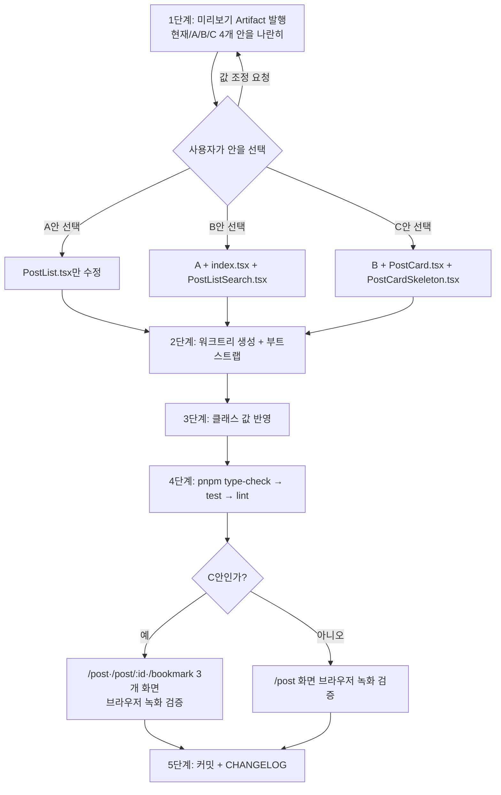

# `/post` 세로 간격 축소

## Context

사용자 피드백: "`/post`에서 요소간 간격 너무 넓은데 줄이는게 어떨지?"

코드를 추적해 넓어 보이는 원인을 세 가지로 특정했다(모바일 기준 실측 계산):

| 구간                    | 현재 값            | 출처                                                               |
| ----------------------- | ------------------ | ------------------------------------------------------------------ |
| 헤더 ↔ 필터 카드        | 24px / md 32px     | `src/pages/post/index.tsx:13` `space-y-6 md:space-y-8`             |
| 필터 카드 패딩          | 20px / md 24px     | `src/widgets/post/post-list/ui/PostListSearch.tsx:99` `p-5 md:p-6` |
| **필터 카드 ↔ 첫 카드** | **48px / md 56px** | page `space-y-6` + `PostList.tsx:55` `space-y-6`                   |
| **카드 상하 여백**      | **36px씩**         | `card.tsx:9` `py-6` + `PostCard.tsx:81/268` `p-3`                  |
| 카드 ↔ 카드             | 12px / md 16px     | `PostList.tsx:85` `gap-3 md:gap-4`                                 |

특히 굵게 표시한 두 곳이 핵심이다.

**(1) 보이지 않는 24px** — `PostList.tsx:62`의 pull-to-refresh `motion.div`는 평소 `height: 0`이라
화면에 안 보이지만, 같은 컨테이너의 `space-y-6`(`PostList.tsx:55`)가 만드는 형제 마진에는 그대로
잡힌다. `docs/DECISIONS.md:1472-1477`에 이미 기록된 패턴("`space-y-*` 컨테이너 안에 화면 표시와
문서 흐름이 어긋나는 요소를 넣지 않는다 — 이런 요소는 항상 그 컨테이너 **밖**에 형제로 둔다")과
같은 종류로, 의도된 간격이 아니다.

**(2) 덮이지 않은 카드 패딩** — `card.tsx:9`의 베이스 `py-6`(24px)를 `PostCard.tsx:69`가 넘기는
className이 덮지 않아, 내부 `p-3`(12px)와 더해져 카드 상하 36px가 된다. 같은 레포의
`MyCommentCard.tsx:19`는 `<Card className="p-4 gap-2">`로 이미 덮고 있어 선례가 있다 — PostCard만
빠져 있는 상태다.

부수적으로 `/post`는 레포에서 `space-y-8`을 쓰는 유일한 페이지다. `/post/:id`
(`PostDetailPage.tsx:67`)와 `/mycomment`(`MyCommentPage.tsx:6`)는 `space-y-6` 고정이라,
데스크톱에서 `/post`만 혼자 더 벌어져 있다.

**의도한 결과**: `/post`의 세로 리듬을 다른 페이지 수준으로 촘촘하게 맞추되, 어느 강도로 줄일지는
사용자가 실제 화면을 보고 고른다(CLAUDE.md §9).

## 진행 흐름



## 1단계 — 미리보기 Artifact (실제 반영 전 필수)

CLAUDE.md §9에 따라 코드를 고치기 전에 정적 미리보기를 먼저 만들어 승인받는다. 근사치가 아니라
**실물처럼** 보여야 하므로, `src/app/globals.css`의 색 토큰(`--card`, `--border`, `--muted-foreground`
등)과 실제 Tailwind 클래스를 그대로 재사용한다. Tailwind는 CSS CDN 로드가 CSP로 막혀 있으므로
`cdn.tailwindcss.com`(허용된 스크립트 호스트)의 play CDN을 쓰거나, 필요한 클래스만 인라인 CSS로
직접 작성한다.

한 페이지에 4개 안을 **나란히** 배치한다(parallel prototyping — `docs/DECISIONS.md` 2026-09-06):

| 안         | 필터카드↔첫카드 | 카드 상하 | 바꾸는 것                                            |
| ---------- | --------------- | --------- | ---------------------------------------------------- |
| 현재       | 48 / md 56px    | 36px      | —                                                    |
| **A (약)** | 24 / md 32px    | 36px      | 보이지 않는 24px만 제거                              |
| **B (중)** | 16 / md 24px    | 36px      | A + 페이지 `space-y-4 md:space-y-6` + 필터카드 `p-4` |
| **C (강)** | 16 / md 24px    | 12px      | B + 카드 `py-6` → `py-0`                             |

미리보기는 모바일 폭(~390px)과 데스크톱 폭 둘 다 확인할 수 있게 만든다. 카드 2~3장, 필터 칩,
헤더 row를 실제 콘텐츠 분량과 비슷하게 채운다.

## 2~3단계 — 선택된 안 반영

작업 전 `EnterWorktree`로 워크트리를 만들고 부트스트랩한다(`cp ../../../.env .` → `pnpm install`).

수정 대상 파일(선택된 안에 따라 누적):

**A안** — `src/widgets/post/post-list/ui/PostList.tsx:55-95`
루트의 `space-y-6`를 제거하고 명시적 마진으로 교체한다. `motion.div`가 형제 마진을 만들지 않게
하는 것이 목적이므로, `DECISIONS.md:1472-1477`이 권고하는 "컨테이너 밖으로 빼기"와 같은 효과를
마진 소유권 이동으로 달성한다:

```tsx
<div>
  {correctedSearch && <div className="mb-6 ...">}
  <motion.div ... />              {/* 마진 없음 — height 0이면 공간도 0 */}
  <div className="grid grid-cols-1 md:grid-cols-2 lg:grid-cols-3 gap-3 md:gap-4">
  {hasNextPage && <div className="mt-6 ...">}
</div>
```

이렇게 하면 당겨 새로고침 시에는 `motion.div`의 height 애니메이션이 그대로 카드 그리드를 밀어내므로
기존 동작이 유지된다.

**B안** — 위에 더해

- `src/pages/post/index.tsx:13` — `space-y-6 md:space-y-8` → `space-y-4 md:space-y-6`
  (레포 표준인 `space-y-6`에 맞추고, 모바일은 한 단계 더 축소)
- `src/widgets/post/post-list/ui/PostListSearch.tsx:99` — `p-5 md:p-6` → `p-4`
  (2026-09-06 조정은 카드 **내부 gap**만 손봤고 바깥 패딩은 그대로 남아 있었다)

**C안** — 위에 더해

- `src/widgets/post/post-card/ui/PostCard.tsx:69` — Card className에 `py-0` 추가
  (내부 `CardHeader`/`CardContent`/`CardFooter`가 이미 `p-3`를 가지므로 `MyCommentCard`처럼 `p-4`를
  주면 이중이 된다 — 베이스 `py-6`만 무력화하는 `py-0`가 맞다)
- `src/widgets/post/post-list/ui/PostCardSkeleton.tsx:10` — 같은 값을 반영
  (`PostCardSkeleton.tsx:57`의 주석이 PostList와의 의도적 동기화를 명시하고 있다. 스켈레톤과 실물
  카드의 높이가 어긋나면 로딩 → 로드 완료 시 레이아웃 점프가 생긴다)

## 4단계 — 검증

```bash
pnpm type-check   # tsc -b --noEmit (루트 tsconfig는 solution style이라 -b 필수)
pnpm test
pnpm lint
```

`pnpm test`는 `src/widgets/post/post-list/` 및 `post-card/` 관련 테스트가 className 문자열을 단정하고
있는지 확인한다. 단정이 있으면 값 변경에 맞춰 같이 고친다.

`.claude/skills/browser-verification/SKILL.md` 절차에 따라 Playwright MCP로 실제 화면을 녹화한다.
확인할 화면:

- `/post` — 필터 카드 ↔ 첫 카드 간격, 카드 상하 여백, 모바일·데스크톱 폭 둘 다
- **당겨 새로고침 동작** — A안 수정의 회귀 위험이 여기 몰려 있다. 인디케이터가 나타날 때 카드
  그리드가 정상적으로 밀려나는지, 놓았을 때 원위치하는지
- C안일 때만 추가: `/post/:id` 상세(`isDetail` 경로), `/bookmark` 목록 — 같은 PostCard를 공유한다

## 회귀 위험 (§5)

| 위험                                                            | 해당 안 | 소유 파일                                                |
| --------------------------------------------------------------- | ------- | -------------------------------------------------------- |
| pull-to-refresh 인디케이터가 카드를 밀어내지 못함               | A, B, C | `PostList.tsx:62-83`, `shared/hooks/usePullToRefresh.ts` |
| `correctedSearch` 안내문이 있을 때/없을 때 간격 불일치          | A, B, C | `PostList.tsx:56-60`                                     |
| 무한스크롤 sentinel이 마지막 카드에 붙음                        | A, B, C | `PostList.tsx:91-95`                                     |
| 스켈레톤 ↔ 실물 카드 높이 불일치로 로딩 후 점프                 | C       | `PostCardSkeleton.tsx:10`                                |
| `/post/:id` 상세·`/bookmark`가 같이 촘촘해짐 (의도된 동반 변경) | C       | `PostDetailPage.tsx:84`, `BookmarkPostList.tsx:60`       |

CRUD 실패 지점은 없다 — 순수 표현 계층 변경이며 API·쿼리 키·캐시 무효화 경로를 건드리지 않는다.

## 5단계 — 커밋

`.gitmessage` 형식을 따른다. 동작이 바뀌는 시각적 변경이므로 `CHANGELOG.md`의 `[Unreleased]`에도
같은 커밋에서 항목을 추가한다(`changelog-release` skill 참고). 커밋은 `git add` 없이
`git commit -- <경로...>`로 대상을 직접 지정한다.

`docs/DECISIONS.md` 추가는 하지 않는다 — 대안을 비교해 고르긴 하지만 되돌리기 쉬운 클래스 값
변경이라 메모리에 기록된 DECISIONS.md 적합성 기준(대안 비교 + 되돌리기 어려움 **둘 다** 필요)에
미달한다. 다만 A안의 "보이지 않는 24px"은 `DECISIONS.md:1472-1477`의 기존 항목이 예측한 재발
사례이므로, 커밋 메시지 본문에서 그 항목을 참조한다.
