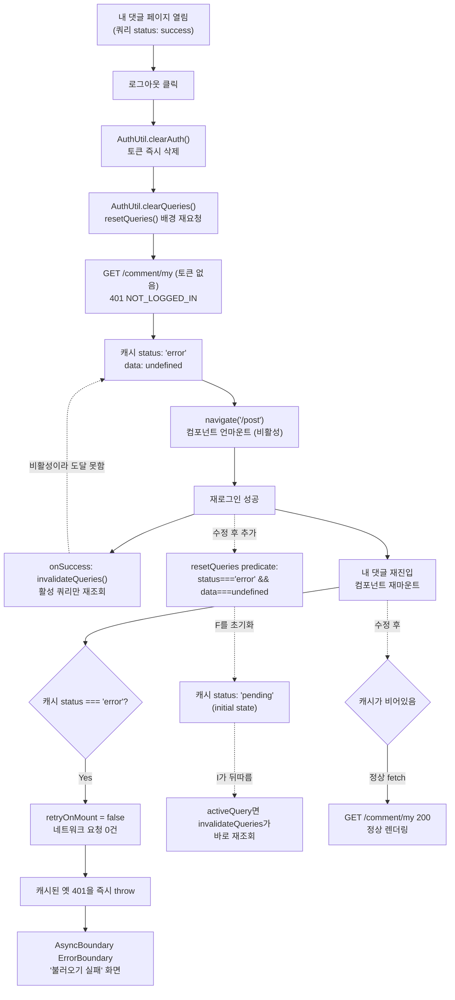

# 로그아웃 후 재로그인 시 "내 댓글" 에러 캐시 재사용 버그 수정

## Context

사용자가 "내 댓글" 페이지에서 로그아웃한 뒤 재로그인해서 다시 "내 댓글"에 들어가면
"내 댓글을 불러오는데 실패했어요."가 뜬다는 버그 리포트로 시작했다. 실제 프로덕션
CloudWatch 로그와 브라우저 콘솔 캡처로 조사한 결과, BE는 정상이고 원인은 FE의
React Query 캐시 처리에 있음을 확정했다.

**원인**: "내 댓글" 페이지가 열려 있는 채로 로그아웃하면, `AuthUtil.clearQueries()`
(`src/shared/utils/auth.util.ts:56-62`)가 `queryClient.resetQueries()`로 아직
마운트된 쿼리를 **토큰이 지워진 상태로 배경 재요청**한다. 이 요청이 401을 받아
해당 쿼리 캐시가 `status: 'error'`로 확정된다.

재로그인 시 `useLoginMutation`의 `onSuccess`(`src/entities/auth/api/auth.queries.ts:21-31`)는
`queryClient.invalidateQueries()`만 호출하는데, 이건 **활성 쿼리만** 재조회한다.
이미 언마운트된 "내 댓글" 쿼리는 비활성 상태라 재조회되지 않고 `status: 'error'`인 채로
캐시에 남는다.

재진입 시 `useSuspenseMyCommentsInfiniteQuery`가 이 쿼리를 다시 구독하는데,
TanStack Query의 Suspense 훅은 캐시가 이미 `error`면 `retryOnMount`를 강제로
`false`로 만들어(`query-core`의 `shouldLoadOnMount`) **네트워크 요청 자체를 내지
않고** 캐시된 옛 401 에러를 즉시 다시 throw한다. `AsyncBoundary`의 `ErrorBoundary`가
이를 잡아 에러 문구를 렌더링한다 — 사용자가 관찰한 "이전 응답을 그대로 재사용한다"는
설명이 정확히 이 매커니즘이었다.

이 버그는 `useSuspenseInfiniteQuery`/`useSuspenseQuery`를 쓰는 화면에만 해당한다
(일반 `useQuery`는 `throwOnError: false`가 기본값이라 재마운트 시 정상 재요청됨).
현재 Suspense 쿼리는 게시글 목록·상세, 댓글 목록, 내 댓글 4곳뿐이다.

## 전체 흐름



## 핵심 변경

### 1. `src/entities/auth/api/auth.queries.ts` — `useLoginMutation`의 `onSuccess`

기존 `void queryClient.invalidateQueries();` **앞에** 아래 블록을 추가한다
(순서 중요 — `resetQueries()`는 리셋 직후 같은 predicate로 내부 재조회를 시도하는데,
리셋 후엔 상태가 바뀌어 predicate가 더 이상 매칭되지 않는다. 뒤따르는
`invalidateQueries()`가 활성 쿼리의 실제 재조회를 맡는다):

```ts
// 로그아웃이 남긴 에러 캐시만 초기화한다. clearQueries()의 resetQueries()가 토큰을
// 지운 직후 화면에 남아있던 쿼리를 배경 재요청시켜 401로 error 상태를 만드는데,
// Suspense 쿼리는 캐시가 error면 재마운트해도 retryOnMount=false로 막혀 새 요청을
// 아예 내지 않고 옛 에러를 그대로 다시 throw한다(query-core queryObserver의
// shouldLoadOnMount). 아래 invalidate는 활성 쿼리만 다시 부르므로 이미 언마운트된
// 이런 쿼리에는 닿지 못한다. data를 들고 있는 쿼리(재요청만 실패한 경우)는 화면이
// 멀쩡하고 재마운트 시 정상 재요청되므로 건드리지 않는다 - 지우면 오히려 깜빡인다.
// invalidateQueries보다 먼저 둔다: resetQueries의 내부 재조회는 리셋 뒤 predicate가
// 더 이상 매칭되지 않아 아무것도 다시 부르지 않으므로, 활성 쿼리의 재요청은 아래가 맡는다.
void queryClient.resetQueries({
  predicate: (query) => query.state.status === 'error' && query.state.data === undefined,
});
```

기존 `// 2.`, `// 3.` 주석 번호를 `// 3.`, `// 4.`로 밀어 새 블록을 `// 2.`로 끼워넣는다.
다른 프로덕션 코드는 건드리지 않는다.

### 2. `src/entities/auth/api/auth.queries.test.ts` — `useLoginMutation` 테스트 신설

기존 `Wrapper`(`createTestQueryClient()`를 렌더마다 새로 생성, 바깥에서 캐시 상태
검사 불가)는 재사용하지 않는다. `comment.queries.test.ts` 선례를 따라 모듈 스코프
`queryClient` + `beforeEach` 생성 패턴을 새 `describe('useLoginMutation')` 블록에
쓴다. `useCreateAccountMutation` 관련 기존 코드는 그대로 둔다.

- `createTestQueryClient({ gcTime: Infinity })` 필수 — 기본 `gcTime: 0`이면 옵저버
  없는 쿼리가 다음 틱에 GC되어, 수정 전에도 테스트가 통과하는 가짜 테스트가 된다.
- 에러 캐시는 MSW로 실제 401을 태우지 않고 `queryClient.fetchQuery({ queryKey,
queryFn: () => Promise.reject(new ApiError({...})) }).catch(() => {})`로 직접
  심는다 — MSW로 태우면 `ApiClient`가 `AuthUtil.clearAll()`을 호출해 싱글턴
  `queryClient`·`NavigationService`까지 건드려 테스트 격리가 깨진다.
- 로그인 자체는 기존 MSW 핸들러(`src/mocks/handlers/auth.handlers.ts`)가 이미
  200을 반환하므로 추가 설정 불필요.

**테스트 1 (필수, 버그 재현)**: 비활성 상태로 `status: 'error', data: undefined`인
쿼리(`commentKeys.myRoot` 사용)를 심고, 로그인 성공 후 그 쿼리 상태가
`status: 'pending', error: null, data: undefined`로 초기화됐는지 확인. 사전에
`getObserversCount() === 0`(비활성 고정)과 초기 `status === 'error'`를 단언해둔다.

**테스트 2 (필수, 회귀 방지)**: `status: 'success'`인 정상 데이터 쿼리(예:
`postKeys.list()`)를 심고, 로그인 성공 후에도 그 데이터가 그대로인지 확인.

**테스트 3 (필수, predicate의 `data === undefined` 조건 근거 고정)**: 데이터를
들고 있으면서 재요청만 실패한 쿼리(`status: 'error'`이지만 `data`는 유지)를 만들고,
로그인 성공 후에도 지워지지 않는지 확인 — 이게 predicate에 `data === undefined`를
넣기로 한 결정을 테스트로 문서화하는 자리다.

**테스트 4 (선택, 화면 레벨 재현)**: `AsyncBoundary` + `useSuspenseQuery`를 쓰는
작은 Probe 컴포넌트를 만들어, 1회차 401 에러 → unmount(로그아웃 시뮬레이션) →
로그인 성공(같은 `queryClient` 공유) → 재마운트 시 실제로 `queryFn`이 2번째
호출되고 정상 데이터가 렌더링되는지 확인. `gcTime: Infinity` 필수, 같은
`queryClient` 인스턴스 공유 필수.

### 3. `docs/AUTH.md` — 새 절 추가

`### 자주 하는 수정` 표(약 259행) **앞**에 `### 8-E. 로그인·로그아웃 시 React
Query 캐시 처리` 절을 신설한다. 담을 내용:

- 로그아웃이 `clear()`가 아니라 `resetQueries()`를 쓰는 이유(옵저버 유지)와, 그
  대가로 토큰 없는 배경 재요청이 401을 받는 구조. `isLoggingOut()` 플래그는 그
  401의 토스트·리다이렉트만 막을 뿐 **캐시 오염 자체는 막지 못한다**는 점.
- 로그인 시 "에러 캐시 선별 리셋 → 전체 invalidate" 순서와 각각의 역할, 순서가
  바뀌면 안 되는 이유.
- 이 함정은 **Suspense 쿼리에만** 해당한다는 사실(`throwOnError: false`가 기본인
  일반 `useQuery`는 재마운트 시 정상 재요청됨) — 향후 새 Suspense 쿼리를 추가할
  때 알아야 할 정보.

`### 자주 하는 수정` 표에도 1행 추가:
`새 Suspense 조회 화면 추가 | useSuspenseQuery/useSuspenseInfiniteQuery는 캐시가
error면 재마운트해도 재요청하지 않는다 — §8-E의 로그인 리셋이 전제다`

문서 헤더의 `마지막 검토` 날짜를 작업일로 갱신한다.

### 4. `CHANGELOG.md` — `[Unreleased] > ### Fixed`에 항목 추가

스코프는 `auth`(원인·수정이 로그인 캐시 정책이고 모든 Suspense 화면에 걸림).
`changelog-release` skill의 포맷(요약 줄 72자, `<details><summary>배경·구현</summary>`
빈 줄 규칙, 상세 문단은 손으로 줄바꿈하지 않음)을 따른다. PR 번호는 PR 생성 후
후속 커밋으로 추가한다.

## 영향 범위 점검

- **CRUD**: Create/Update/Delete 경로는 무변경. 유일한 영향은 Read 캐시 상태
  전환(`error`+데이터없음 → `pending`)이며, 리셋 자체는 네트워크 요청을 내지 않는다
  (활성 쿼리 재조회는 뒤따르는 기존 `invalidateQueries()`가 담당).
- **회귀 없음 확인**: `useLoginMutation`을 검증하는 기존 테스트가 없어 깨질 테스트
  없음. `LoginModal.test.tsx`는 이 mutation을 타지 않음. `useLogin.ts`/`useAuth.ts`는
  `mutateAsync`만 쓰고 `onSuccess` 내부 구현에 의존하지 않아 시그니처 변화 없음.
- **화면별 영향**: 게시글 목록(제자리 로그인 주 무대)은 정상 데이터가 있으면
  predicate 불일치로 그대로 유지(깜빡임 없음). 북마크는 `useQuery`(비Suspense)라
  원래도 이 버그에 안 걸림, 이 수정으로도 무변화. 계정 정보는 개선(로그아웃
  레이스로 남은 에러가 로그인 시 정리됨).

## 검증 방법

1. `EnterWorktree` (fresh = origin/main 기준 — 로컬 main은 5커밋 뒤쳐져 "내 댓글"
   기능 자체가 없음, 미푸시 커밋 없음 확인 완료) → `cp ../../../.env .` →
   `pnpm install`
2. 테스트 1~3을 먼저 작성 → `pnpm test src/entities/auth`로 실패 확인(버그를
   실제로 잡는 테스트임을 증명)
3. `auth.queries.ts`에 `resetQueries` 블록 삽입 → 테스트 전부 통과 확인
4. (선택) 테스트 4 추가, 수정을 임시로 되돌려 FAIL → 되살려 PASS 확인
5. `docs/AUTH.md`, `CHANGELOG.md` 갱신
6. `pnpm type-check` (`tsc -b --noEmit`, 루트 tsconfig 직접 사용 금지) →
   `pnpm test` (전체) → `pnpm lint` → `pnpm format:check` → `pnpm check:docs`
7. `browser-verification` skill로 실제 브라우저 재현: 로그인 → 내 댓글 → 로그아웃 →
   재로그인 → 내 댓글 재진입 → 정상 목록 표시 + Network 탭에 `GET /comment/my 200`
   실제 발생 확인(수정 전엔 이 요청 자체가 안 나가는 것이 핵심 증거)
