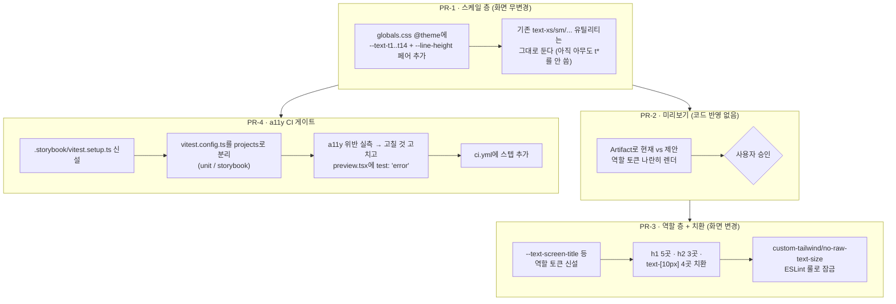

# 타이포그래피 토큰 도입 + 접근성 CI 게이트

## Context

사용자가 "디자인 시스템이 빈약하다"고 느낀 지점을 당근 seed 기준으로 실측 비교한
결과, 색상·radius·z-index·스토리 커버리지(42/42)는 이미 갖춰져 있고 **타이포그래피
축만 토큰이 0개**였다. 2026-09-13 `design-system-foundation` 라운드가 이 항목을
"화면이 바뀌어 별도 승인 필요"로 명시적으로 미뤄둔 것이다
(`docs/DESIGN-SYSTEM.md:166-177`, `docs/plans/2026-09-13-design-system-foundation.md:226-236`).

추가로, `@storybook/addon-a11y`·`@storybook/addon-vitest`가 `package.json:76-78`에
설치되고 `.storybook/main.ts:11-12`에 등록돼 있는데도 `.storybook/vitest.setup.ts`가
없고 `.github/workflows/`에 실행 스텝이 0건이라 **접근성 검사가 CI에서 전혀 돌지
않는다** — 이미 설치된 도구가 수동 패널 확인에만 쓰이고 있다.

### 실측 근거 (2026-09-16, `rg` 직접 측정)

텍스트 크기 클래스 134회 중 `text-sm` 55 + `text-xs` 54 = 81%. 나머지는
`text-xl` 9, `text-base` 8, `text-lg` 3, `text-2xl` 3, `text-3xl` 2.
`leading-*`/`tracking-*`는 17회뿐으로 크기와 짝지어 관리되지 않는다.

같은 역할에 다른 값이 쓰이는 것이 확인됨:

| 역할            | 처리 A                                                                              | 처리 B                                                      |
| --------------- | ----------------------------------------------------------------------------------- | ----------------------------------------------------------- |
| 페이지 제목(h1) | `text-xl font-semibold` — `MyCommentPage.tsx:7`, `BookmarkPage.tsx:142`·`162`·`194` | `text-xl md:text-2xl font-bold` — `pages/post/index.tsx:15` |
| 섹션 제목(h2)   | `text-sm font-semibold` — `MobileFolderList.tsx:62`·`75`                            | `text-lg font-semibold` — `CommentList.tsx:81`              |

스케일 밖 임의값 `text-[10px]` 4곳: `NavbarSearch.tsx:52`, `CommentItem.tsx:66`,
`LikePostButton.tsx:29`, `PostCard.tsx:280`.

### 채택 근거 (외부)

당근 SEED는 폰트 크기·줄 높이·두께를 **각각 토큰화한 뒤 조합**하는 2계층 구조다 —
_"Scale Tokens assign names to raw value scales"_ → _"Semantic Tokens are combinations
of Scale Tokens that express design intent"_
([SEED Design Token](https://seed-design.io/foundations/design-token)). 타이포는
`$font-size.t1`~`t14`, `$line-height.t1`~`t14`, `$font-weight.{regular,medium,bold}`를
두고 이를 _스케일_ 텍스트 스타일(`t4Regular`)과 _시맨틱_ 텍스트 스타일
(`screenTitle` = t10/t10/bold, `articleBody` = t5/t6/regular)로 조합한다
([SEED Typography](https://seed-design.io/foundations/typography)).

Tailwind v4는 이 조합을 그대로 표현할 수 있다
([Tailwind font-size](https://tailwindcss.com/docs/font-size)):

```css
@theme {
  --text-tiny: 0.625rem;
  --text-tiny--line-height: 1.5rem;
  --text-tiny--letter-spacing: 0.125rem;
  --text-tiny--font-weight: 500;
}
```

> **SEED를 의존성으로 쓰지 않는다.** SEED는 Qvism이라는 자체 CSS 엔진 기반이고
> ([daangn/seed-design](https://github.com/daangn/seed-design)), `tailwind4-theme`는
> 어댑터 패키지다. 가져오는 것은 **토큰 구조와 네이밍 원칙**뿐이다.

### 사용자가 승인한 범위 (2026-09-16 대화)

- 범위: **타이포 토큰 + a11y CI 배선** (팔레트 2계층·elevation·motion·registry는 제외)
- 네이밍: **seed 그대로** — 스케일 층(`t1`~`t14`) + 역할 층 둘 다 만든다

## 전체 흐름



PR-4는 PR-2/3의 승인을 기다리지 않는다 — 타이포와 독립적이라 병행 가능하다.

---

## PR-1 · 스케일 층 (화면 무변경)

`src/app/globals.css`의 기존 `@theme static` 블록(z-index) 아래에 새 `@theme static`
블록으로 SEED의 t1~t14를 그대로 추가한다. `static`을 쓰는 이유는 z-index 토큰과 동일
— Storybook 토큰 카탈로그가 `getComputedStyle`로 읽어야 하므로 미사용 시에도 출력에
남아야 한다 (`globals.css:62-64` 주석 참고).

| 토큰         | size             | line-height      |
| ------------ | ---------------- | ---------------- |
| `--text-t1`  | 0.6875rem (11px) | 0.9375rem (15px) |
| `--text-t2`  | 0.75rem (12px)   | 1rem (16px)      |
| `--text-t3`  | 0.8125rem (13px) | 1.125rem (18px)  |
| `--text-t4`  | 0.875rem (14px)  | 1.1875rem (19px) |
| `--text-t5`  | 1rem (16px)      | 1.375rem (22px)  |
| `--text-t6`  | 1.125rem (18px)  | 1.5rem (24px)    |
| `--text-t7`  | 1.25rem (20px)   | 1.6875rem (27px) |
| `--text-t8`  | 1.375rem (22px)  | 1.875rem (30px)  |
| `--text-t9`  | 1.5rem (24px)    | 2rem (32px)      |
| `--text-t10` | 1.625rem (26px)  | 2.1875rem (35px) |
| `--text-t11` | 1.75rem (28px)   | 2.375rem (38px)  |
| `--text-t12` | 2rem (32px)      | 2.625rem (42px)  |
| `--text-t13` | 2.5rem (40px)    | 3.25rem (52px)   |
| `--text-t14` | 3rem (48px)      | 3.75rem (60px)   |

문법은 `--text-t4: 0.875rem;` + `--text-t4--line-height: 1.1875rem;` 쌍. 값 출처는
위 [SEED Typography](https://seed-design.io/foundations/typography) 표이며, 주석에
이 URL을 남긴다(§10 규칙).

`t11`~`t14`는 SEED 문서가 _"sm breakpoint 이상에서만 사용하는 것을 권장"_ 한다고
명시하므로 같은 주석에 적는다.

폰트 두께는 Tailwind 기본 `font-medium`(500)/`font-bold`(700)이 SEED의 medium/bold와
값이 같으므로 새 토큰을 만들지 않는다 — §2(불필요한 추상화 금지).

`src/shared/ui/tokens/DesignTokens.stories.tsx`에 `Typography` 스토리를 추가해
14단계를 시각 확인할 수 있게 한다 (기존 `Colors`/`Radius`/`ZIndex` 패턴 따름).

**검증**: `pnpm build` 후 `dist/assets/index-*.css`를 grep해 `--text-t1`~`--text-t14`와
`.text-t*` 유틸리티가 생성됐는지 확인. 기존 화면은 아무도 `t*`를 쓰지 않으므로 무변경.

---

## PR-2 · 미리보기 (코드 반영 없음)

역할 층은 화면이 바뀌므로 `.claude/CLAUDE.md` §9에 따라 **먼저 보여주고 승인받는다.**

Artifact 한 페이지에 실제 `globals.css` 토큰 값과 Pretendard를 그대로 써서
"현재 렌더링 / 제안 A / 제안 B"를 나란히 배치한다. 순차 비교보다 나란히 비교가 낫다는
근거는 `docs/DECISIONS.md` 2026-09-06 항목(parallel prototyping) 참고.

특히 아래 **실제로 픽셀이 바뀌는 지점**을 미리보기에 반드시 포함한다. Tailwind 기본
line-height와 SEED line-height가 다르기 때문이다:

| 현재 클래스        | Tailwind lh | SEED 동급 lh | 차이     |
| ------------------ | ----------- | ------------ | -------- |
| `text-xs` (12px)   | 16px        | t2 → 16px    | 없음     |
| `text-sm` (14px)   | 20px        | t4 → 19px    | −1px     |
| `text-base` (16px) | 24px        | t5 → 22px    | −2px     |
| `text-lg` (18px)   | 28px        | t6 → 24px    | **−4px** |
| `text-xl` (20px)   | 28px        | t7 → 27px    | −1px     |
| `text-2xl` (24px)  | 32px        | t9 → 32px    | 없음     |

그리고 SEED 스케일에 **대응값이 없는 것들** — 이게 승인이 필요한 핵심 판단:

- `text-3xl`(30px): SEED는 t11=28px / t12=32px뿐. 어느 쪽으로 갈지 결정 필요
- `text-6xl`(60px, `ErrorLayout.tsx:20`의 404 숫자): SEED 최대가 t14=48px
- `text-[10px]` 4곳: SEED 최소가 t1=11px → +1px

또한 h1의 두께를 `font-semibold`(현재 4곳)로 통일할지 SEED `screenTitle`처럼
`bold`(현재 1곳)로 통일할지도 이 미리보기에서 결정한다.

**산출물**: Artifact URL 1개. 코드 변경 0.

---

## PR-3 · 역할 층 + 치환 (화면 변경, PR-2 승인 후)

승인된 값으로 `globals.css`에 역할 토큰을 추가한다. 이름은 SEED의 시맨틱 텍스트
스타일 관례를 따르되 kebab-case로 (Tailwind 유틸리티가 `text-screen-title`이 되도록):

| 토큰                      | 역할          | 대상                           |
| ------------------------- | ------------- | ------------------------------ |
| `--text-screen-title`     | 페이지 제목   | h1 5곳                         |
| `--text-section-title`    | 섹션 제목     | `CommentList.tsx:81` 등        |
| `--text-subsection-title` | 소제목(muted) | `MobileFolderList.tsx:62`·`75` |
| `--text-body`             | 본문          | 기존 `text-sm` 다수            |
| `--text-caption`          | 보조 설명     | 기존 `text-xs` 다수            |
| `--text-micro`            | 최소 라벨     | `text-[10px]` 4곳              |

각 토큰은 size + `--line-height` + `--font-weight` 3종 세트로 정의해 한 클래스로
타이포가 완결되게 한다.

**치환 범위는 역할이 분명한 곳으로 한정한다** — `text-sm` 55곳을 전량 치환하지 않는다.
이번 PR의 치환 대상은 위 표의 h1 5곳 · h2 3곳 · `text-[10px]` 4곳 = **12곳**이다.
나머지 `text-sm`/`text-xs` 다수는 역할이 섞여 있어 기계적 치환이 위험하고, §3(최소
범위)에 따라 별도 판단이 필요하다.

**ESLint 잠금**: `eslint.config.js`의 `customTailwindRulesPlugin`에
`no-raw-text-size` 룰을 추가한다. 기존 `no-raw-color`와 같은 패턴(`Literal`/
`TemplateLiteral` 방문 + 정규식)으로:

- `text-[<숫자>px]` 임의값 차단 (역할 토큰이나 t-스케일을 쓰게)
- `atoms/**`와 `**/*.stories.tsx`는 제외 — `no-raw-color`가 이미 쓰는 예외
  (shadcn 원본 유지용, `docs/plans/2026-09-13-design-system-foundation.md:170`)

기본 `text-xs`~`text-9xl`은 **차단하지 않는다** — 55+54곳이 아직 남아 있어 지금
막으면 전량 치환이 강제된다. 차단 확대는 잔여 치환이 끝난 뒤 별도 결정.

**검증**: `browser-verification` skill로 영향받는 화면(마이 댓글 · 북마크 · /post ·
댓글 목록 · 포스트 카드) 녹화해 승인된 미리보기와 대조.

---

## PR-4 · a11y CI 게이트 (PR-1과 병행 가능)

Storybook 공식 문서가 명시하는 배선을 따른다
([Accessibility testing](https://storybook.js.org/docs/writing-tests/accessibility-testing)):
_"접근성 테스트는 `parameters.a11y.test = 'error'`로 설정된 스토리에 대해 Vitest 테스트
실행 시 자동으로 진행됩니다."_

1. **`.storybook/vitest.setup.ts` 신설** — `setProjectAnnotations`로 `preview.tsx`의
   decorator/parameters를 테스트에 주입.

2. **`vitest.config.ts`를 `projects`로 분리.** 현재 이 파일은 `.storybook`과
   `src/**/*.stories.{ts,tsx}`를 `exclude`하고 있다(`vitest.config.ts:12`) — 이 상태로는
   스토리가 아예 수집되지 않는다. 기존 jsdom 유닛 설정을 `projects[0]`으로 그대로 옮기고,
   `storybookTest` 플러그인을 쓰는 브라우저 프로젝트를 `projects[1]`로 추가한다.
   `@vitest/browser-playwright`와 `playwright`가 이미 설치돼 있어 새 의존성은 없다.

3. **위반 실측 후 단계적 적용.** 42개 스토리에 `test: 'error'`를 한 번에 켜면 CI가
   즉시 빨개질 가능성이 높다. 먼저 로컬에서 전체를 돌려 위반 목록을 뽑고:
   - 고치기 싼 것(label 누락, alt 누락 등)은 이번 PR에서 고친다
   - 남는 것은 해당 스토리에 `parameters.a11y.test: 'todo'`와 사유 주석을 달고
     `docs/DESIGN-SYSTEM.md`에 잔여 목록으로 남긴다
   - `.storybook/preview.tsx`의 전역 `parameters.a11y.test`는 `'error'`로 둔다

4. **`ci.yml`에 스텝 추가.** 기존 e2e job이 이미 `pnpm exec playwright install
--with-deps chromium`을 하고 있으므로(`ci.yml:82-83`) 같은 job에 붙이거나 별도 job을
   만든다. 어느 쪽이든 브라우저 설치가 중복되지 않게 한다.

**검증**: 일부러 a11y 위반이 있는 스토리를 임시로 만들어 CI가 실제로 실패하는지
확인한 뒤 되돌린다 — 게이트가 "걸려 있기만 하고 안 잡는" 상태가 아님을 증명한다.

---

## Critical Files

- `src/app/globals.css` — 스케일 층(PR-1)·역할 층(PR-3) 추가 지점. 기존
  `@theme static` z-index 블록(`:69-78`)의 주석 스타일을 그대로 따른다
- `src/shared/ui/tokens/DesignTokens.stories.tsx` — `Typography` 스토리 추가
- `eslint.config.js` — `customTailwindRulesPlugin.rules`에 정의 + 파일 하단
  `custom-tailwind/*` 등록 블록에 활성화 (2곳 모두 필요)
- `vitest.config.ts` — `projects` 분리
- `.storybook/vitest.setup.ts` (신설), `.storybook/preview.tsx` — a11y 파라미터
- `.github/workflows/ci.yml` — 스텝 추가
- `docs/DESIGN-SYSTEM.md` — §11 "남은 것"에서 타이포 항목 이동, a11y 게이트 절 추가
- `.claude/skills/design-tokens/SKILL.md` — 타이포 토큰 표 추가 (색상·radius·z-index
  표의 정본이 여기이므로 타이포도 여기에)
- `CHANGELOG.md` — `[Unreleased]`에 항목 추가

## 주의: Tailwind 스캐너

`docs/DESIGN-SYSTEM.md:154-164`에 기록된 함정이 이번에도 적용된다 — Tailwind v4
JIT 스캐너는 CSS/JS 주석과 마크다운 문서까지 텍스트로 훑어 클래스 후보를 찾는다.
주석·문서에 `text-` 뒤에 스케일 이름을 붙인 형태를 그대로 적으면 미사용 유틸리티가
생성된다. 이 계획 파일과 커밋될 문서에서도 클래스 형태를 그대로 쓰지 않고 풀어서
서술한다.

## 검증 순서 (매 PR 공통)

1. `pnpm type-check`
2. `pnpm test`
3. `pnpm lint`
4. `pnpm format:check`
5. `pnpm check:docs` (문서 수정 시)
6. `pnpm build` → `dist` CSS grep으로 토큰 생성 확인
7. `browser-verification` skill 녹화 (PR-3만 — 실제 시각 대조 필요)

각 PR은 `docs/plans/2026-09-16-typography-tokens-a11y-gate.md`로 이 계획을 커밋하고,
fresh Explore subagent에게 계획 대비 diff를 대조시켜 PR 본문에 `## 계획 대비 구현`
섹션을 남긴다(`.claude/CLAUDE.md` §11). 특히 **PR-3에 PR-2에서 승인받지 않은 값이
섞여 들어가지 않았는지**를 확인 항목으로 명시한다.

## 이번에 하지 않는 것

사용자가 범위를 "타이포 + a11y CI"로 한정했으므로 아래는 제외한다:

- 팔레트 2계층화(`--palette-*` 스케일 층) — SEED의 Scale Token에 해당, 화면 무변경이라
  언제든 가능
- `-weak`/`-pressed` 같은 SEED 색상 수식어·상태 토큰
- elevation(shadow)·motion(ease/duration) 토큰
- spacing 토큰 — Tailwind v4에서 `--spacing`이 단일 배수라 잠금이 구조적으로 불가
  (`docs/DESIGN-SYSTEM.md:168-172`에 기록된 제약 그대로)
- shadcn 커스텀 레지스트리 이식
- `text-sm`/`text-xs` 나머지 97곳의 전량 치환
- 2026-09-13 라운드가 남긴 다른 항목들(아이콘 14px 버그, `FilterChip` 호버 불일치,
  Auth 화면 높이) — 타이포와 무관
