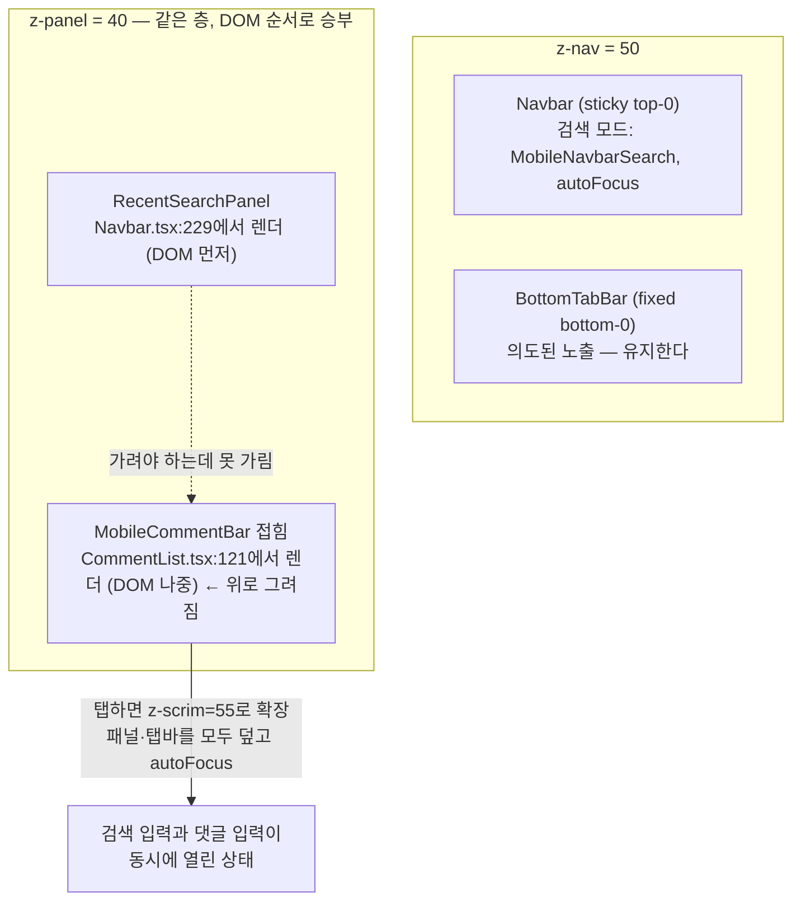
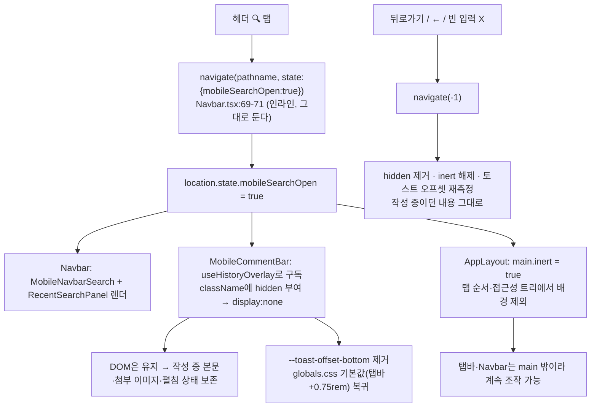
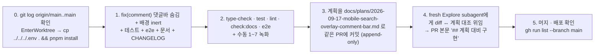

# 모바일 검색 패널이 열린 동안 댓글 작성바 숨기기 + 배경 차단

## Context

모바일 포스트 상세(`/post/:id`)에서 헤더 검색을 열면 `RecentSearchPanel`이 화면을 덮는데,
`MobileCommentBar`가 그 위에 그대로 남아 있다. 원인은 **두 요소가 같은 z층(`z-panel`=40)이고
댓글바가 DOM상 나중이라 나중 요소가 위로 그려지는 것**이다.

본질은 "참조 대상 없는 액션"이다 — 탭바는 전역 내비게이션이라 검색 중에도 탈출구로 남는 게
맞지만(`Navbar.tsx:228`이 명시한 의도), 댓글바는 지금 완전히 가려진 특정 게시글의 컨텍스트
액션이다. 대상이 안 보이는데 액션만 떠 있다.

같은 뿌리의 문제가 하나 더 있다. 검색 패널은 `docs/DECISIONS.md:2393-2399`에서 `Sidebar`
모바일 드로어와 함께 **T1(화면 덮는 상태) 오버레이**로 분류됐지만, 드로어가 `z-scrim
bg-scrim/50` 스크림으로 배경을 차단하는 것과 달리 검색 패널은 시각적으로만 덮는다. 그래서
탭 키를 누르면 뒤의 게시글 링크·댓글로 포커스가 그대로 넘어간다.

**사용자 결정**: ① 탭바는 지금처럼 유지하고 댓글바만 숨긴다 ② 배경 `inert` 차단까지 포함한다.
③ `preventScrollReset` 누락·`Navbar`의 `useHistoryOverlay` 미사용 같은 인접 버그는 범위 밖.

## 현재 겹침 구조



## 변경 후 동작



## 왜 언마운트가 아니라 CSS 숨김인가

댓글 폼은 `useUnsavedChanges`에 등록돼 있지만(`useCreateComment.ts:72-75`), 이탈 가드는
`useUnsavedChangesGuard.ts:18-20`에서 `pathname`이 같으면 그냥 통과시킨다. 검색 열기는 같은
pathname으로 push하므로 **가드를 우회한다.** 언마운트하면 작성 중이던 본문과 첨부 이미지가
경고 없이 사라진다. 그래서 DOM은 유지하고 `display:none`으로만 숨긴다.

`invisible`/`opacity-0`이 아니라 `hidden`인 이유: `display:none`만이 탭 순서와 접근성 트리에서
빠진다. `Navbar.tsx:148`이 검색 모드에서 우측 액션 그룹을 숨길 때 쓰는 것과 같은 처방이다.

## 파일별 변경

### 1. `src/features/comment/create/ui/MobileCommentBar.tsx` (핵심)

- **import 추가**: `useHistoryOverlay`(`@/shared/hooks/useHistoryOverlay`), `cn`(`@/shared/lib/tailwind/utils`).
  기존 react → features → shared 순서 유지.
- **구독 1줄** (`containerRef` 선언 뒤). 키 리터럴이 `Navbar`의 인라인 코드와 문자열로만
  묶이므로, 그 결합을 주석으로 반드시 명시한다:

  ```ts
  // 모바일 헤더 검색이 열리면 RecentSearchPanel(z-panel)이 화면을 덮는데 이 바도 같은
  // z층이라 DOM 순서만으로 패널 위에 남는다. 키는 Navbar.tsx:65-71이 인라인으로
  // push하는 것과 같아야 한다. 언마운트하지 않고 CSS로만 숨긴다 — 작성 중이던
  // 본문·첨부 이미지와 펼침 상태를 보존해야 한다(이탈 가드가 같은 pathname은 통과시킨다).
  const { isOpen: isMobileSearchOpen } = useHistoryOverlay('mobileSearchOpen');
  ```

- **두 `return` 모두에 조건부 `hidden`** — 접힘(`z-panel`, 69행)과 펼침(`z-scrim`, 54행) 각각
  `cn(...)`으로 감싸 `isMobileSearchOpen && 'hidden'`을 붙인다. **두 갈래를 하나의 트리로
  합치지 않는다** — 합치면 접힘↔펼침 시 `CommentForm` 리마운트 타이밍이 바뀌어 범위를 벗어난다.
  `twMerge`는 `md:hidden`과 `hidden`을 서로 다른 충돌 그룹으로 보아 둘 다 남긴다.
- **`useLayoutEffect`(21-48)에 가드절 추가**, deps를 `[expanded, isMobileSearchOpen]`으로 확장:

  ```ts
  if (isMobileSearchOpen) {
    document.documentElement.style.removeProperty('--toast-offset-bottom');
    return;
  }
  ```

  ResizeObserver에 맡기지 않는 이유 두 가지 — (1) `display:none`이면 `offsetHeight`가 0이라
  결과가 탭바+8px이 되어 `globals.css:413`의 기본값 탭바+12px과 4px 어긋난다, (2) 이 레포
  테스트 환경의 RO는 no-op 스텁(`src/test/setup.ts:36-44`)이라 그 경로를 검증할 수단이 없다.

### 2. `src/app/layouts/app-layout/AppLayout.tsx` (배경 차단)

`<main>`에 ref를 달고, 검색이 열린 동안 `inert`를 건다. 탭바·`Navbar`·`Sidebar`는 `main` 밖
형제라 그대로 조작 가능하다 — "탭바는 유지" 결정과 정확히 맞아떨어진다.

**React 18.2라 `inert`를 JSX prop으로 넘기면 안 된다.** `inert={false}`는 _"Received `false`
for a non-boolean attribute"_ 경고를 내고, escape hatch인 `inert=""`는 React 19에서 boolean
지원이 들어가며 빈 문자열이 false로 뒤집혀 **조용히 깨진다**([facebook/react#24730](https://github.com/facebook/react/pull/24730),
[WICG/inert#58](https://github.com/WICG/inert/issues/58)). 따라서 ref로 DOM 프로퍼티를 직접
설정한다 — 버전 독립적이고, `HTMLElement.inert: boolean`이 TS 5.7 `lib.dom.d.ts`에 있어 타입
안전하다. `Navbar`(`--navbar-height` 게시)·`MobileCommentBar`(토스트 오프셋)가 이미 쓰는
`useLayoutEffect` + ref 패턴과 같은 형태다.

```ts
const mainRef = useRef<HTMLElement>(null);
const { isOpen: isMobileSearchOpen } = useHistoryOverlay('mobileSearchOpen');

useLayoutEffect(
  function blockBackgroundDuringMobileSearch() {
    const node = mainRef.current;

    if (!node) {
      return;
    }

    // Tailwind md:(min-width:768px)와 같은 경계를 쓴다. useIsMobile()은 max-width:768px
    // + UA 매칭이라 정확히 768px과 iPad에서 어긋나는데, 검색 패널이 md:hidden으로 사라진
    // 화면을 inert로 잠그면 닫을 UI가 없어진다(검색을 연 뒤 창을 넓힌 경우).
    const desktop = window.matchMedia('(min-width: 768px)');

    function syncInert() {
      node!.inert = isMobileSearchOpen && !desktop.matches;
    }

    syncInert();
    desktop.addEventListener('change', syncInert);

    return () => {
      desktop.removeEventListener('change', syncInert);
      node.inert = false;
    };
  },
  [isMobileSearchOpen]
);
```

### 3. 문서 (같은 커밋)

| 파일                                       | 변경                                                                                                                                             |
| ------------------------------------------ | ------------------------------------------------------------------------------------------------------------------------------------------------ |
| `docs/SEARCH.md` §6 상태 모델              | 행 추가 — `모바일 검색 패널 열림 \| location.state.mobileSearchOpen \| 구독자: Navbar(패널 렌더), MobileCommentBar(숨김), AppLayout(배경 inert)` |
| `docs/SEARCH.md` §8 코드 지도              | "검색 중 하단 댓글바 숨김 동작 바꾸기" 행 추가                                                                                                   |
| `.claude/skills/responsive-ux/SKILL.md:52` | "언마운트 시 되돌린다" → "숨김/언마운트 시 되돌린다"                                                                                             |
| `CHANGELOG.md` `[Unreleased]`              | `fix` 항목. `changelog-release` skill을 먼저 읽고 포맷 준수                                                                                      |

`docs/DECISIONS.md`는 **추가하지 않는다** — 되돌리기 쉬운 겹침 버그 수정이고, CLAUDE.md의
DECISIONS 범위 규정("기능 하나를 구현하다 만난 버그·구현 함정은 그 기능 문서 안에 남긴다")에
따라 `SEARCH.md`에 남긴다.

## 범위 밖 — 발견했지만 고치지 않음 (보고만)

1. **`ScrollToTop` FAB에 같은 부류의 버그가 있다.** `fixed bottom-20 right-6 z-nav`(=50)이고
   `AppLayout.tsx:30`에서 `!isDetailPage`일 때 렌더되므로, `/post` 목록에서 300px 이상 스크롤한
   채 검색을 열면 FAB이 패널 위에 그대로 뜬다. 이번 요청 범위(포스트 상세)가 아니고, `main`
   밖이라 `inert`로도 안 가려진다. 고친다면 같은 처방.
2. **`Navbar.openMobileSearch`에 `preventScrollReset`이 없다** — `useHistoryOverlay`를 쓰는 다른
   4개 오버레이와 달리 배경 스크롤이 최상단으로 튄다. 사용자가 범위에서 제외했다.
3. **`Navbar`가 `useHistoryOverlay`를 쓰지 않고 인라인 중복 구현**이라 `'mobileSearchOpen'`
   리터럴이 여러 곳에 흩어진다. 위와 같은 이유로 제외 — 후속 작업 후보.
4. **`useIsMobile`의 768px 경계 불일치**로 iPad(UA 매칭 + ≥768px)에서 `MobileCommentBar`가
   마운트되지만 `md:hidden`으로 숨겨져 **하단 입력 수단이 사라진다**(데스크톱 인라인 폼도
   `!isMobile`이라 안 나옴). 기존 버그이고 이번 변경이 악화시키지 않는다.
5. `docs/DECISIONS.md:429`의 z-scrim 공유 충돌(Sidebar 드로어 ↔ 펼침 시트, 55 vs 55)은 별건이고
   이번 수정으로 해결되지도 나빠지지도 않는다.

## 회귀 위험

| 위험               | 소유 파일                                                               | 판정                                                                                                                 |
| ------------------ | ----------------------------------------------------------------------- | -------------------------------------------------------------------------------------------------------------------- |
| 데스크톱 영향      | `CommentList.tsx:121`, `MobileCommentBar.tsx:54,69`                     | 없음 — ≥768px에선 `md:hidden`이 이미 `display:none`이고, `inert`는 `matchMedia`로 차단                               |
| 토스트 위치        | `MobileCommentBar.tsx:21-48`, `globals.css:404-415`, `sonner.tsx:18-19` | 가드절로 명시 처리. 숨김 중 = 탭바+0.75rem                                                                           |
| 답글 폼            | `CommentItem.tsx`, `CommentForm.tsx`                                    | 영향 없음 — 목록 안 정적 요소라 패널이 정상적으로 덮는다                                                             |
| 이탈 가드          | `useUnsavedChangesGuard.ts:14-21`, `useCreateComment.ts:70-75`          | 보존 — 마운트 유지라 dirty 키가 살아 있다. 검색 **제출**은 pathname이 달라 confirm이 뜨는 기존 동작 그대로           |
| 포커스             | `useCreateComment.ts:76-81`                                             | 펼침 상태로 숨기면 textarea가 blur되지만 `MobileNavbarSearch`의 `autoFocus`가 어차피 포커스를 가져가므로 순변화 아님 |
| 접힘/펼침 리마운트 | `MobileCommentBar.tsx:50-81`                                            | 두 `return`을 합치지 않는 것이 조건                                                                                  |
| `inert` 잠김       | `AppLayout.tsx`                                                         | `matchMedia('(min-width:768px)')` + cleanup의 `inert = false`로 방어                                                 |
| 기존 테스트 계약   | `MobileNavbarSearch.test.tsx`, `useHistoryOverlay.test.tsx`             | 무영향 — 둘 다 props/훅을 직접 주입한다                                                                              |

## 검증

**새 유닛 테스트** `src/features/comment/create/ui/MobileCommentBar.test.tsx` (신규)

- 기본 렌더 시 루트에 `hidden`이 없고 `--toast-offset-bottom`이 설정된다
- 검색이 열리면 루트에 `hidden`이 붙는다 (펼침 상태에서도)
- 검색이 열리면 `--toast-offset-bottom`이 제거된다 ← 가드절이 없으면 실패
- 펼쳐서 입력한 텍스트가 검색을 열었다 닫아도 그대로 남는다 ← 언마운트 금지 회귀 방지

구현 노트: `renderWithProviders`(`src/test/utils.tsx:50`)에 `initialEntries: ['/post/p1']`.
검색 열기/닫기는 `MobileNavbarSearch.test.tsx:11-15`의 `LocationSearchProbe`를 본뜬 테스트
전용 하네스로 `navigate(..., { state })` / `navigate(-1)`을 쏜다. jsdom엔 Tailwind CSS가 없어
`toBeVisible()`은 못 쓰고 `toHaveClass('hidden')`으로 확인한다.

**새 e2e** `e2e/post-detail-search-overlay.mobile.spec.ts` (신규) — 실제 `display:none` 여부는
브라우저에서만 증명된다. `e2e/post-detail-back.mobile.spec.ts`의 모킹 순서를 그대로 본뜬다.

1. `/post/:id` 진입 → 댓글바 트리거 visible
2. 트리거 클릭 → textarea에 `작성중` 입력
3. 헤더 🔍 클릭 → 댓글바 `toBeHidden()`, 패널 `toBeVisible()`, **탭바 `toBeVisible()`**(설계 의도 회귀 방지)
4. 배경 링크가 `inert`로 접근 불가한지 확인
5. 뒤로가기 → textarea가 `toHaveValue('작성중')`

**수동 확인** (`browser-verification` skill로 녹화해 증거를 남긴다)

1. 실기기/Pixel 5 에뮬 `/post/:id` → 댓글바 탭 → 본문 입력 + **이미지 1장 첨부** → 🔍 →
   댓글바가 완전히 사라지는지(펼침 상태에서도)
2. 뒤로가기 → **텍스트·이미지·펼친 상태가 그대로인지** ← 언마운트 금지의 실제 수용 기준
3. 검색 패널이 열린 상태에서 탭 키 → 배경 게시글·댓글로 포커스가 안 넘어가는지
4. 검색 중 토스트 유발(오프라인 상태로 좋아요) → 탭바 바로 위에 뜨는지 / 닫은 뒤엔 댓글바 위인지
5. 노치 iPhone에서 4 재확인 (safe-area)
6. 데스크톱 폭 `/post/:id` → 댓글 폼·`ScrollToCommentFormButton` 무변화
7. 모바일에서 검색을 연 채 창을 768px 이상으로 넓혔다 좁히기 → 화면이 잠기지 않는지

**코드 검증 순서**: `pnpm type-check` → `pnpm test` → `pnpm lint` → `pnpm check:docs` →
`pnpm test:e2e --project=mobile-chrome`

## 실행 순서



커밋은 1개로 묶는다 — 댓글바 숨김과 배경 차단은 "검색 패널이 배경을 제대로 덮게 한다"는 하나의
논리적 단위이고, CLAUDE.md의 커밋 단위 규칙("대화 턴마다 나누지 않고 논리적으로 완결된 단위로")에
맞다. 워크트리 정리는 사용자가 명시적으로 요청할 때만 한다.
