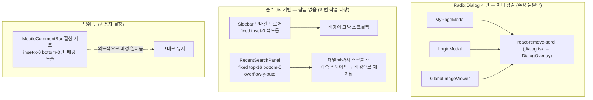
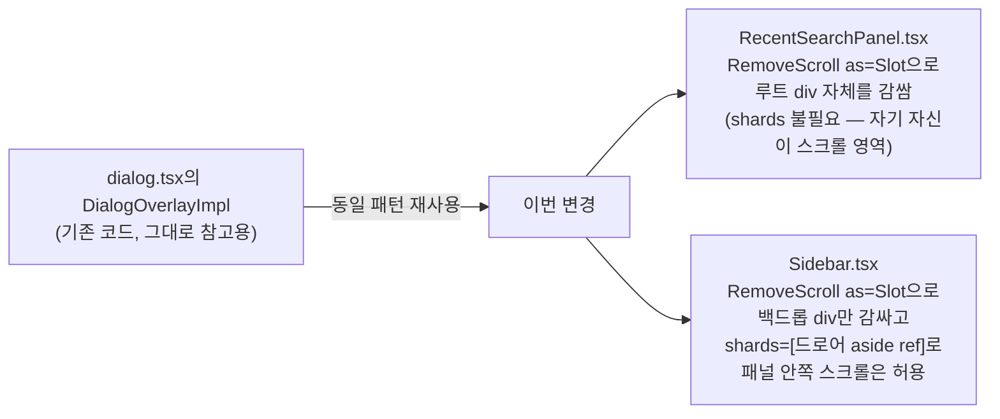
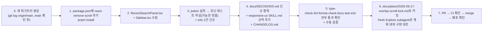

# 화면 덮는 오버레이 전체에 배경 스크롤 잠금 공통 적용

## Context

모바일 검색 오버레이(`RecentSearchPanel`) 작업 중, `inert`는 포커스·클릭만 막을 뿐 배경
스크롤을 막지 못한다는 게 드러났다. 패널 자신은 `overflow-y-auto`로 스크롤되는데,
`overscroll-behavior` 방지 장치가 없어 목록을 끝까지 스크롤한 뒤 계속 스와이프하면 그
아래 가려진 `main`(실제로는 document 자체)이 조용히 스크롤되고, 패널을 닫았을 때 게시글
목록 위치가 튀는 시나리오가 가능하다.

이번 조사로 같은 문제가 **`Sidebar` 모바일 드로어**에도 그대로 있다는 게 확인됐다. 반면
`docs/DECISIONS.md`가 "T1 화면 덮는 상태"로 함께 묶은 나머지 3개(마이페이지·이미지뷰어·
로그인모달)는 전부 Radix `Dialog`(`shared/ui/atoms/dialog.tsx`) 기반이라 **이미 배경
스크롤이 잠겨 있다** — Radix Dialog가 `modal`(기본 `true`)일 때 `react-remove-scroll`을
내부적으로 걸기 때문이다(`node_modules/@radix-ui/react-dialog/dist/index.mjs:96-118`).

**사용자 결정**: `MobileCommentBar` 펼침 시트는 범위에서 제외한다 — 배경이 실제로 보이고
탭·스크롤이 가능하게 설계돼 있어(스크림 없음, `inset-x-0 bottom-0`만) 배경을 열어두는 게
의도로 보이고, 여기까지 잠그면 그 설계 의도를 깨게 된다.

## 현재 상태 — 5개 T1 오버레이 중 2개만 안 잠김



## 해법 — 새로 만들지 않고 이미 쓰고 있는 것을 재사용

Radix Dialog가 내부적으로 쓰는 `react-remove-scroll`(이미 `pnpm-lock.yaml`에 설치돼 있고
`shamefully-hoist=true`라 바로 import 가능)을 **직접** 두 컴포넌트에 적용한다.
`document.body.style.overflow = 'hidden'` 같은 걸 손으로 구현하는 커스텀 훅은 만들지
않는다 — 이미 이 코드베이스 3곳에서 검증된 해법이 있는데 새로 짤 이유가 없고(§6 선례
재사용), 이 라이브러리는 `position:fixed` 트릭을 쓰지 않아 스크롤 위치 유실 문제가
원천적으로 없으며, iOS의 touchmove/wheel 오버스크롤도 이미 처리한다
(`node_modules/react-remove-scroll/dist/es5/SideEffect.js` 확인).

**`useHistoryOverlay`에 넣지 않는 이유**: 그 훅은 히스토리 기반 열림 상태 관리만 하는
단일 책임 훅이고, 4곳(Sidebar·MyPage·Login·ImageViewer)이 이미 쓰고 있다. 여기에 스크롤
잠금을 얹으면 Dialog 기반 3곳은 Radix 자체 잠금과 중복 적용되고(기능상 무해하지만
불필요), 정작 `RecentSearchPanel`은 `useHistoryOverlay`를 안 쓰고 `Navbar.tsx`가 인라인
구현이라(기존에 범위 밖으로 남겨둔 사안) 혜택을 못 받는다. 대신 Radix가 실제로 쓰는
패턴 그대로 — `RemoveScroll`로 오버레이 DOM을 직접 감싸는 컴포넌트 조합 — 두 파일에만
적용한다.



## 파일별 변경

### 1. `package.json`

`dependencies`에 `"react-remove-scroll": "2.7.2"` 추가 (알파벳 순, `react-hook-form`과
`react-router-dom` 사이). 버전은 정확히 고정 — `.npmrc`의 `save-exact=true` 정책과
인접한 `@radix-ui/react-dialog: "1.1.15"` 선례를 따른다. `pnpm-lock.yaml`에는 이미
`react-remove-scroll@2.7.2`가 존재하므로(Radix의 전이 의존성) `pnpm install`은 새로
다운로드 없이 importers 섹션만 갱신한다.

### 2. `src/widgets/layout/navbar/ui/RecentSearchPanel.tsx`

- import 추가: `RemoveScroll`(`react-remove-scroll`), `Slot`(`@radix-ui/react-slot`,
  이미 `shared/ui/atoms/button.tsx`가 쓰는 것과 같은 패키지).
- 루트 반환을 감싼다:

  ```tsx
  return (
    <RemoveScroll as={Slot} allowPinchZoom>
      <div className="md:hidden fixed inset-x-0 top-16 bottom-0 z-panel bg-background overflow-y-auto">
        ...
      </div>
    </RemoveScroll>
  );
  ```

  `as={Slot}`이라 별도 wrapper DOM 노드가 생기지 않는다(Radix Slot이 props를 기존 div에
  머지). `shards`는 필요 없다 — 이 div 자신이 스크롤 영역이자 잠금 경계라, 내부
  `overflow-y-auto` 스크롤은 RemoveScroll이 막는 대상(Lock 바깥)이 아니다. 컴포넌트는
  이미 `isMobileSearchOpen && <RecentSearchPanel .../>`로 조건부 마운트되므로(
  `Navbar.tsx:229`) 별도 `enabled` prop 불필요 — Dialog의 `DialogOverlay`도 같은 방식
  (mount 자체가 활성화)이다.

### 3. `src/widgets/layout/sidebar/ui/Sidebar.tsx`

- import 추가: `useRef`(react에서, 기존 `useEffect`와 함께), `RemoveScroll`, `Slot`.
- `Sidebar()` 함수 안, `useHistoryOverlay('sidebarOpen')` 다음 줄에 드로어 패널 ref 추가:
  `const drawerRef = useRef<HTMLElement>(null);`
- 백드롭(120-127행)을 감싼다:

  ```tsx
  {
    isMobileOpen && (
      <RemoveScroll as={Slot} allowPinchZoom shards={[drawerRef]}>
        <div
          className="md:hidden fixed inset-0 z-scrim bg-scrim/50"
          onClick={close}
          aria-hidden="true"
        />
      </RemoveScroll>
    );
  }
  ```

  드로어 패널(`aside`, 129-143행)은 백드롭과 DOM상 형제라 `shards={[drawerRef]}`로 Lock의
  일부로 지정한다 — `dialog.tsx`의 `DialogOverlayImpl`이 `shards: [context.contentRef]`를
  쓰는 것과 정확히 같은 이유("Content가 Overlay 안에 안 살아도 스크롤 가능해야 한다").
  지금은 네비게이션 항목이 3개뿐이라 드로어 자체가 스크롤될 일이 없지만, `shards`를
  빼먹으면 향후 항목이 늘어 드로어가 스크롤돼야 할 때 조용히 막히는 회귀가 생긴다.

- 드로어 `aside`(130행)에 `ref={drawerRef}` 추가.

## 회귀 위험

| 위험                                                                                             | 판정                                                                                                                                                                                                                                                                                                          |
| ------------------------------------------------------------------------------------------------ | ------------------------------------------------------------------------------------------------------------------------------------------------------------------------------------------------------------------------------------------------------------------------------------------------------------- |
| 데스크톱 영향                                                                                    | 없음 — 두 컴포넌트 모두 `md:hidden`, 데스크톱에서 안 렌더                                                                                                                                                                                                                                                     |
| 데스크톱 스크롤바 gap 시프트(스크롤 잠금의 흔한 부작용)                                          | 해당 없음 — 모바일 전용이라 표시되는 스크롤바 자체가 없음                                                                                                                                                                                                                                                     |
| `usePullToRefresh`(`PostList.tsx:43`, `window` 레벨 `touchmove` non-passive 리스너)와의 상호작용 | **기존에도 있던 별개 문제, 악화 없음.** `usePullToRefresh`는 `mobileSearchOpen`을 모르고 `window.scrollY<=0`일 때만 반응하므로, 검색 패널이 열려 있어도 최상단이면 지금도 당김 제스처가 함께 반응할 수 있다 — RemoveScroll 도입 전부터 있던 gap이라 이번 변경으로 새로 생기지 않는다. 범위 밖으로 보고만 한다 |
| Radix Dialog 3곳과의 중복                                                                        | 없음 — 이번엔 그 3곳을 건드리지 않는다                                                                                                                                                                                                                                                                        |
| `Slot`이 백드롭의 `onClick={close}`/`aria-hidden`과 충돌                                         | 없음 — RemoveScroll이 주입하는 건 `onScrollCapture`/`onWheelCapture`/`onTouchMoveCapture` 등 다른 이름의 핸들러라 `onClick`과 이름이 안 겹친다. Slot은 이름이 겹치는 핸들러만 합성한다                                                                                                                        |
| 기존 테스트 계약                                                                                 | `Sidebar.tsx`/`RecentSearchPanel.tsx`에 대한 기존 테스트 파일 없음(확인됨) — 깨질 기존 테스트 자체가 없다. `MobileNavbarSearch.test.tsx`/`NavbarSearch.test.tsx`는 이 두 컴포넌트를 안 거치므로 무영향                                                                                                        |

## 범위 밖 (보고만)

- `MobileCommentBar` 펼침 시트 — 사용자 결정으로 제외.
- `usePullToRefresh`가 검색 패널 열림 상태를 모르는 문제 — 이번 변경과 무관한 기존 gap.
- `Navbar`가 `mobileSearchOpen`을 `useHistoryOverlay` 대신 인라인으로 구현하는 것 —
  이전 PR(#123)에서 이미 보고된 사안, 그대로 유지.

## 문서

- `docs/DECISIONS.md`에 새 항목 추가 — "왜 커스텀 스크롤락 훅 대신 `react-remove-scroll`
  재사용을 택했는가"는 대안을 실제로 비교했고(직접 구현 vs 라이브러리 재사용, `useHistoryOverlay`
  통합 vs 컴포넌트 레벨 wrapping), 앞으로 T1 오버레이가 추가될 때마다 재논쟁될 수 있는
  결정이라 DECISIONS.md 기준(대안 비교 + 되돌리기 어려움)에 맞는다.
- `.claude/skills/responsive-ux/SKILL.md`의 오버레이/z-index 절에 한 줄 추가 — "화면을
  완전히 덮는 새 T1 오버레이를 만들 때: Dialog 기반이면 자동으로 스크롤이 잠기고,
  순수 div로 만든다면 `RemoveScroll`(react-remove-scroll)로 직접 감싸야 한다"는 규약을
  남겨 다음 오버레이 추가 시 같은 gap이 반복되지 않게 한다.

## 검증

**유닛 테스트 — 실행 가능성은 구현 중 먼저 확인한다.** `react-remove-scroll`이 mount 시
`document.body`에 `data-scroll-locked` 속성을 붙이는 것으로 확인되는데
(`node_modules/react-remove-scroll-bar/dist/es2015/component.js`), jsdom이 이 라이브러리가
기대하는 DOM API를 문제없이 지원하는지는 실행해봐야 안다. 구현 직후 가장 먼저:

1. `RecentSearchPanel`을 렌더한 테스트에서 `document.body.hasAttribute('data-scroll-locked')`가
   true가 되는지, 언마운트 후 false로 돌아오는지 최소 1개 테스트로 실측한다.
2. 동작하면 `Sidebar` 열림/닫힘에도 같은 형태로 1~2개 추가한다.
3. jsdom에서 재현이 안 되거나 불안정하면(예: 필요한 브라우저 API 미지원으로 조용히
   no-op) 유닛 테스트는 스킵하고 아래 e2e로만 검증한다 — 억지로 구현 디테일을 mocking해
   가짜로 통과시키지 않는다.

**e2e — 새 스펙, 기존 `mobile-chrome` 프로젝트 패턴 재사용** (선례:
`e2e/post-detail-search-overlay.mobile.spec.ts`가 쓰는 `installCatchAll` →
`mockCategoryOptions` → `mockPostList` 순서):

- `e2e/mobile-search-scroll-lock.mobile.spec.ts` (신규): `/post` 진입 → 헤더 검색 열기 →
  `document.body`의 `data-scroll-locked` 속성 확인(또는 `getComputedStyle(document.body).overflow === 'hidden'`)
  → `window.scrollY`를 기록해두고 패널 안에서 휠/터치로 스크롤 끝까지 시도 → 검색 닫기 →
  `window.scrollY`가 열기 전과 동일한지 확인.
- `e2e/sidebar-drawer-scroll-lock.mobile.spec.ts` (신규, 또는 위 파일에 같이): 모바일
  드로어 열기 → 같은 방식으로 body 잠금 확인 → 드로어 닫기 후 배경 스크롤 위치 보존 확인.

**수동 확인**: 실기기/Pixel 5 에뮬에서 검색 패널·사이드바 드로어 각각 열고 배경을
스와이프해도 안 움직이는지, 닫았을 때 원래 스크롤 위치가 그대로인지.

**코드 검증 순서**: `pnpm install` → `pnpm type-check` → `pnpm test` → `pnpm lint` →
`pnpm format:check` → `pnpm check:docs` → `pnpm test:e2e --project=mobile-chrome`

## 실행 순서



하나의 논리적 단위(오버레이 배경 스크롤 잠금)이므로 커밋은 1개로 묶는다.
