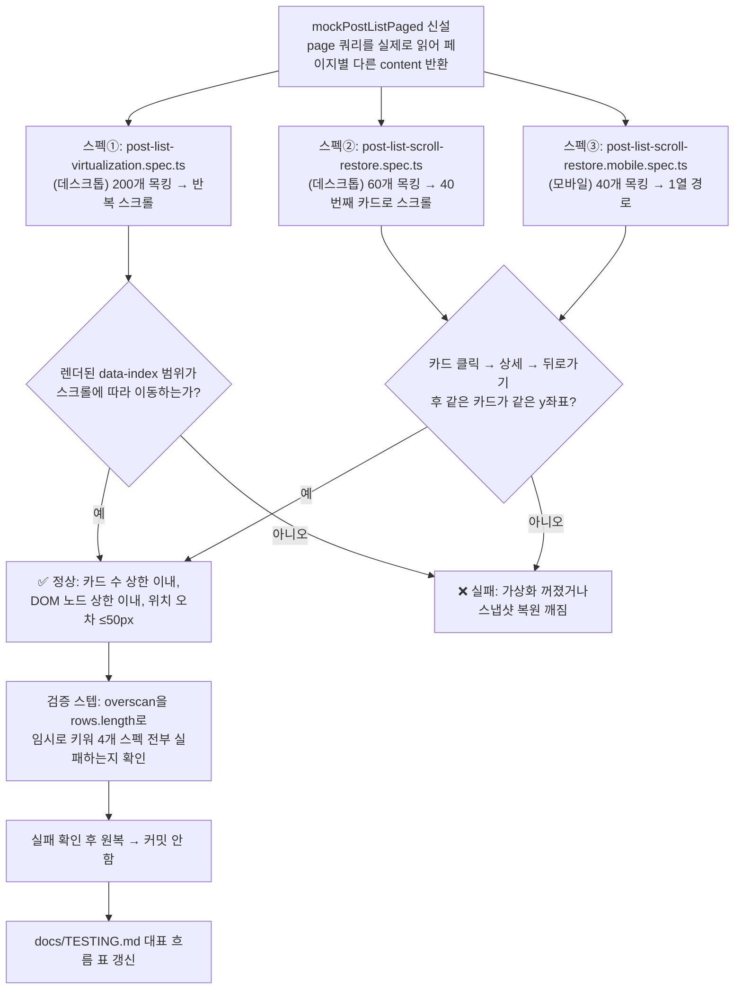

# 가상 스크롤 실동작 e2e 증거 확보

## Context

PR #127(피드·북마크 목록 가상 스크롤 도입)은 유닛테스트 403개와 e2e 45개로 검증했다고
보고했지만, 기존 e2e 목 데이터가 글 1개짜리라 "안 깨진다"만 증명했을 뿐 "가상화가 실제로
DOM을 줄이고, 스크롤 위치를 정확히 복원한다"는 핵심 주장은 증명하지 못했다. 사용자가
"이것도 확인돼야 사람들이 정상 동작으로 인지할 수 있다"고 정확히 지적했다. 로컬에 BE가
없어 실제 데이터로 브라우저 검증을 할 수 없으므로, 이 레포의 기존 e2e 관례(`page.route()`
목킹)를 그대로 따라 **결정적으로 재현 가능한 다량의 목 데이터**로 가상화 자체를 증명하는
e2e 테스트를 새로 만든다.

**핵심 설계 결정 하나**: 임계값을 잡기 전에 실제 카드 높이를 조사한 결과, e2e 목
데이터(`mockPost`)는 `ogImage: null`이라 `LinkThumbnail`이 통째로 렌더 안 되고
(`link-thumbnail.tsx:31-33` `if (!src) { return null; }`), 그래서 실제 카드 높이가
프로덕션 실측치(654px)보다 훨씬 작다(추정 330~360px). 이 차이를 반영해 임계값을 다시
계산했다.

## 전체 흐름



## 새로 만들 것

### 1. `e2e/mocks/post.mock.ts`에 추가 — `mockPostListPaged`

기존 `mockPostList`(항상 같은 1개짜리 응답)와 predicate가 완전히 같으므로(`isApiPath(url,
ENDPOINTS.post.base)`), **같은 스펙에서 둘을 함께 등록하지 않는다**(LIFO로 나중 것만
살아남음 — `e2e/mocks/catch-all.ts` 주석 근거). 신규 함수는 `page` 쿼리를 실제로 읽어
`{page, size, content, totalElements, totalPages, last}`를 정확히 계산해 반환한다.
`last` 계산이 틀리면 `getNextPageParam`(`post.queries.ts:118`)이 무한 요청 또는 조기
종료를 일으키므로 `start + size >= total`로 정확히 계산한다.

```ts
export function pagedPostTitle(index: number): string {
  return `E2E Post ${String(index).padStart(3, '0')}`;
}

export function pagedPostId(index: number): string {
  return `e2e-post-${String(index).padStart(3, '0')}`;
}

function pagedPost(index: number): Post {
  return { ...mockPost, id: pagedPostId(index), title: pagedPostTitle(index) };
}

export async function mockPostListPaged(
  page: Page,
  { total, size = POST_PAGE_SIZE }: { total: number; size?: number }
): Promise<void> {
  await page.route(
    (url) => isApiPath(url, ENDPOINTS.post.base),
    (route) => {
      const params = new URL(route.request().url()).searchParams;
      const pageParam = Number(params.get('page') ?? 0);
      const start = pageParam * size;
      const length = Math.max(0, Math.min(size, total - start));

      const body: PostListResponse = {
        page: pageParam,
        size,
        content: Array.from({ length }, (_, offset) => pagedPost(start + offset)),
        totalElements: total,
        totalPages: Math.ceil(total / size),
        last: start + size >= total,
      };

      return route.fulfill({ json: wrapResponse(body) });
    }
  );
}
```

`id`·`title`만 바꾸고 나머지는 `mockPost`를 그대로 스프레드해 카드 높이를 결정하는
필드(description·tags·categories·ogImage)를 고정한다 — id가 겹치면
`select`(`post.queries.ts`)가 Set으로 중복 제거해 조용히 사라지고, 그 id가 그대로
`useWindowGridVirtualizer`의 `getItemKey`가 되므로 유일해야 한다.

### 2. 측정 방법 — 카드 개수는 `[data-index] h3`로 센다

- `a[href^="/post/"]`는 카드당 **2개**다(제목 링크 `PostCard.tsx:103-113`, 댓글 수 링크
  `PostCard.tsx:277`) — 직접 확인함.
- `Card`(`shared/ui/atoms/card.tsx`) 루트에는 `data-slot`이 없다(하위 `CardHeader`
  등에만 있음) — 직접 확인함.
- `<h3>`는 카드당 정확히 1개, `data-index`는 가상화된 "행" 컨테이너에만 있다
  (`PostList.tsx`) → `[data-index] h3` 개수 = 렌더된 카드 수.
- 로드된 글 수는 DOM으로 알 수 없으니 **요청 쿼리의 최대 `page` 값**으로 잰다
  (`post-list-filters.spec.ts`의 `waitForRequest` 선례 재사용).

### 3. 스펙① `e2e/post-list-virtualization.spec.ts` (데스크톱 전용)

총 200개 목킹 → `expect.poll`로 "맨 아래까지 스크롤 → 렌더된 최대 `data-index`가
39(=118개 이상 로드) 이상"까지 반복 스크롤 → 다시 맨 위로 → 아래에서 봤던 인덱스가
사라지고 위쪽 인덱스가 다시 나타나는지 확인.

| 단언                                   | 임계값                                 | 근거                                                                                                                                         |
| -------------------------------------- | -------------------------------------- | -------------------------------------------------------------------------------------------------------------------------------------------- |
| 렌더된 카드 수                         | ≤ 36장                                 | 화면(720px)에 2~3행 + overscan 2행 ≈ 12~18장. 행높이 추정이 2배 틀려도(7행) 33장이라 36이면 안전                                             |
| 렌더된 카드 수 × 3 < 로드된 글 수      | 45 < 120                               | 가상화가 꺼지면(120장 전부 렌더) 360 < 120 거짓 → 반드시 실패                                                                                |
| DOM 노드 수                            | < 2,800                                | Lighthouse "오류" 기준(1,400개, [Chrome for Developers](https://developer.chrome.com/docs/lighthouse/performance/dom-size))의 2배를 상한으로 |
| DOM 노드 수 상대 증가                  | 초기의 1.5배 미만                      | 카드당 노드 수 추정이 틀려도 회귀는 잡히도록 절대값과 상대값 이중 체크                                                                       |
| 위/아래 렌더 인덱스 범위가 겹치지 않음 | `bottomIndices[0] > topIndices.at(-1)` | "DOM이 쌓이기만 하는 게 아니라 교체된다"의 직접 증거                                                                                         |

`expect.poll`은 이 레포 e2e에 선례가 없는 첫 도입이므로 주석으로 명시한다(고정 시간
대기가 아니라 조건 수렴 대기라 flaky를 줄임).

### 4. 스펙② `e2e/post-list-scroll-restore.spec.ts` (데스크톱)

총 60개 목킹(3열=20행). 40번째 카드(13번째 행)로 스크롤 → 그 카드의 화면 좌표(`y`)와
`window.scrollY` 기록 → 클릭해 상세 진입 → 두 가지 방법으로 복귀:

1. 데스크톱 "목록으로" 버튼(`useGoBack`의 `navigate(-1)`)
2. `page.goBack()`

복귀 후 같은 카드의 `boundingBox().y`와 `window.scrollY`가 **50px 이내**로 같은지 단언.
40번째를 고른 이유: `lastVirtualRowIndex(15) >= rows.length(20) - 5`가 그 지점에서
false가 되어 클릭 시점에 60개 전부가 결정적으로 로드된 상태로 수렴한다
(`usePostList.ts`의 프리페치 조건에서 역산).

**이 단언이 잡는 실패 모드**:

- `ScrollRestoration`이 0으로 리셋 → 대상 카드가 DOM에 없어 `boundingBox()` null → 오차 무한대
- 스냅샷이 버려져 추정 행높이(654)로 복원 → 실제(~350)와 배율이 달라 다른 글이 그 위치에 옴
- `initialMeasurementsCache` 미주입 → 문서가 짧아 `scrollTo`가 클램프됨 → `scrollY`가 크게 작아짐

### 5. 스펙③ `e2e/post-list-scroll-restore.mobile.spec.ts`

`playwright.config.ts`의 `testMatch`/`testIgnore`가 파일 단위 glob이라 모바일은 별도
파일이 필수. 총 40개(1열=40행), 15번째 카드로 스크롤. "목록으로" 버튼이 모바일엔 없으므로
`page.goBack()` 1케이스만. `page.touchscreen` 스와이프는 쓰지 않는다(`hasTouch: true`가
`usePullToRefresh`를 깨워 `scrollMargin` 측정을 오염시킴) — `window.scrollTo`만 사용.
1열 경로(`columnCount=1`)는 데스크톱 파일이 전혀 검증 못 하는 유일한 코드 경로다.

### 6. 검증 스텝(코드에 남기지 않음) — 가상화를 일부러 꺼서 4개 스펙이 실패하는지 확인

`overscan`을 임시로 `rows.length`만큼 크게 바꿔 사실상 전체 렌더가 되게 만든 뒤 위 3개
스펙을 돌려 **전부 실패**하는지 확인한다. 통과 임계값을 아무리 잘 잡아도, 실제로
실패시켜보지 않으면 "통과 = 가상화가 동작한다"를 증명한 게 아니다. 확인 후 반드시
원복하고, 이 실험은 커밋하지 않는다.

### 7. 북마크는 이번 범위에서 제외 (근거 있음)

`useBookmarkPostList.ts`와 `usePostList.ts`는 **동일한 `useWindowGridVirtualizer`**를
호출하고, `BookmarkPostList.tsx`와 `PostList.tsx`의 렌더 코드도 `data-index`/
`translateY`/`measureElement`까지 구조가 같다 — 피드 스펙 하나로 그 공용 모듈 자체는
이미 검증된다. 북마크 고유 위험(`listId`가 폴더별로 갈리는 지점)은 브라우저보다
`virtual-snapshot.ts` 유닛 테스트가 더 싸고 정확하게 덮는다. PR 본문에 이 판단 근거를
명시해 "왜 북마크는 안 했나"에 답할 수 있게 한다.

## staleTime 캐시 관련 주의사항 (구현 시 반드시 지킬 것)

`post-list-filters.spec.ts`가 겪은 "A→B→A 전이 시 재요청 안 나감" 문제와 같은 종류다.
뒤로가기 후 캐시가 살아있어 **재요청이 0회인 것 자체가 정상 동작**(복원의 전제조건)이므로:

- 뒤로가기 후에는 `waitForRequest`/`waitForResponse`로 절대 기다리지 않는다(요청이 안
  나가 타임아웃남). DOM 신호(`toHaveURL` → `expect.poll(boundingBox)`)로만 기다린다.
- `page.reload()`를 두 단계 사이에 끼우지 않는다(QueryClient가 날아가고 `location.key`도
  `'default'`로 바뀜).
- `page.clock`으로 staleTime을 넘기지 않는다 — `docs/TESTING.md`에 이미 이 방법이
  _"반복 실행 15~25% flaky"_ 로 실패 기록이 남아있다(직접 확인).

## 기존 45개 회귀 없음

`mockPostList`/`mockPostDetail`/`mockDeletePost`는 무변경(추가만). `mockPostListPaged`의
predicate가 `mockPostDetail`(`/^\/api\/post\/[^/]+$/`)·`mockComments`와 겹치지 않아
등록 순서 자유. `page.route`는 페이지 인스턴스 스코프라 다른 스펙으로 새지 않는다.

## 구현 순서

1. `e2e/mocks/post.mock.ts`에 `mockPostListPaged` 추가 → verify: `pnpm type-check`
2. `e2e/post-list-virtualization.spec.ts` 작성 → verify: `pnpm exec playwright test post-list-virtualization --headed`로 실제 카드 수·DOM 노드 수를 먼저 실측해 위 "추정" 값들을 교체
3. `e2e/post-list-scroll-restore.spec.ts` 작성(데스크톱 2케이스) → verify: 같은 방식
4. `e2e/post-list-scroll-restore.mobile.spec.ts` 작성 → verify: `--project=mobile-chrome`
5. **가상화를 일부러 끄고 4개 스펙 전부 실패하는지 확인** → 원복(커밋 안 함)
6. `docs/TESTING.md` 대표 흐름 표에 3줄 추가
7. `pnpm test:e2e` 전체 49개(기존 45 + 신규 4) green 확인
8. PR #127에 커밋 추가 + push, CI 재확인, PR 본문에 "북마크 제외 근거" 명시

## 검증

- `pnpm type-check` / `pnpm lint` / `pnpm format` 통과
- `pnpm test:e2e` — 기존 45개 + 신규 4개 = 49개 전부 green
- 5번 단계(가상화 강제 OFF)에서 4개 스펙 전부 fail 확인 — 이게 "증거"의 핵심
- CI(`gh run watch`)까지 green 확인 후 보고
