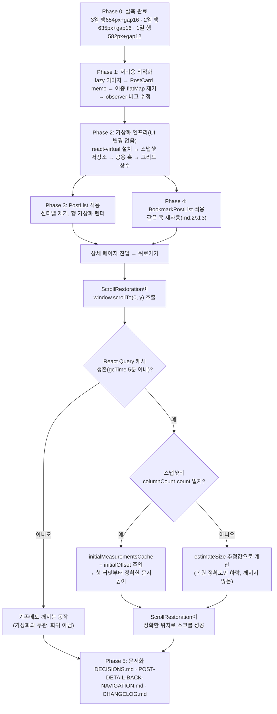

# 무한스크롤 리스트 가상화 + 렌더링 최적화

## Context

공유받은 Threads 글(@2weekhun)의 주장 — "무한스크롤은 네트워크 요청만 나눌 뿐, DOM에
쌓이는 노드 수를 줄이는 건 별개 문제이고, 그걸 푸는 게 가상화(virtualization)다" — 이
우리 앱에도 해당하는지 실측으로 확인했다.

**확인한 사실 (프로덕션 `dbw3brui6htwk.cloudfront.net`에 Playwright로 직접 측정, 195개
게시글 전부 로드 후):**

| 뷰포트   | 열 수 | DOM 노드 | `` | 문서 높이                                 |
| -------- | ----- | -------- | ------- | ----------------------------------------- |
| 1440×900 | 3열   | 14,330   | 294     | 42,946px (65행)                           |
| 768×1024 | 2열   | 14,330   | 294     | 62,628px (98행)                           |
| 390×844  | 1열   | 14,330   | 294     | 104,418px (195행, 실제 보이는 카드는 2장) |

Lighthouse 기준 _"body 요소가 약 1,400개 이상의 노드를 포함하면 오류"_
([Chrome for Developers](https://developer.chrome.com/docs/lighthouse/performance/dom-size),
번역) — 지금 10배다. 강제 레이아웃 재계산 30.2ms(60fps 예산 16.7ms의 1.8배)도 실측.
게시글은 하루 평균 3.7개씩 늘고 있어(최근 100건 `createdAt` 집계) 현재 195개가 약
7개월 뒤 1000개(Threads 글이 인용한 개선 사례의 기준선)에 도달한다.

**사용자 결정**: 데이터가 계속 늘 것이므로 지금 미리 가상화를 준비한다. 조사 중 발견한
부수 문제(이미지 전부 eager 로드, `PostCard` 리렌더 낭비, 중복 제거 누락, observer
재생성 버그)도 같은 작업에서 함께 정리한다. 가상화로 화면 밖 글을 Ctrl+F로 못 찾게
되는 트레이드오프는 수용 확정("검색을 쓰지 직접 찾는 사람은 적을 것").

**그리드 배치 방식**: TanStack Virtual의 `lanes` 옵션은 공식 문서로 확인한 대로
_"Items are assigned to the lane with the shortest total size"_ — 메이슨리(들쭉날쭉)
배치를 만든다. 지금 화면은 같은 행의 카드가 항상 같은 높이인 정렬 그리드라 시각적으로
달라진다. 대신 **게시글을 열 수만큼 행으로 묶고, 행 단위로 가상화하되 행 안쪽은 지금과
동일한 CSS Grid를 그대로 쓰는 방식**을 택한다 — 화면이 픽셀 단위로 동일하게 유지되고,
내부 계산도 `lanes===1` 경로라 더 싸다(라이브러리 소스 확인).

---

## 전체 흐름



---

## Phase 0 — 실측 결과 (완료, 재작업 불필요)

Playwright로 직접 측정(195개 전부 로드, 3개 뷰포트). 행 높이(중앙값) + Tailwind gap을
더하면 실제 관측된 행 간격과 거의 일치해 교차검증됨:

| 브레이크포인트                                      | 열 수 | 행높이 추정치(`estimateSize`) | `gap`          | 검증                         |
| --------------------------------------------------- | ----- | ----------------------------- | -------------- | ---------------------------- |
| `< 768px` (base)                                    | 1     | 582px                         | 12px (`gap-3`) | 582+12=594 ≈ 실측 593        |
| `≥ 768px` (md)                                      | 2     | 635px                         | 16px (`gap-4`) | 635+16=651 = 실측 651 (정확) |
| `≥ 1024px` (lg, PostList) / `≥1280px`(xl, Bookmark) | 3     | 654px                         | 16px           | 654+16=670 ≈ 실측 660~682    |

이 값은 `PostCard`가 `og:image` 없는 글(설명 없음 등)에서 훨씬 짧아지는 분포(모바일
p10=335px)를 포함한 중앙값이다 — 초기 추정일 뿐이고 `measureElement`가 실제 높이로
즉시 보정하므로 정밀할 필요는 없다.

---

## 설계 확정 사항

### 1. 라이브러리: `@tanstack/react-virtual`

- 미설치 확인(`package.json` grep). 이미 `@tanstack/react-query`, `@tanstack/react-table`을
  쓰고 있어 같은 생태계.
- `useWindowVirtualizer` — 이 앱은 `AppLayout.tsx`의 `<main>`에 overflow 지정이 없어
  document(window) 스크롤 구조([app-layout/AppLayout.tsx:59-63](src/app/layouts/app-layout/AppLayout.tsx#L59)) → 정확히 이 훅이 대상으로 하는 케이스.
- `vite.config.ts:73`의 `manualChunks` 정규식은 `@tanstack/react-query`만 매칭하므로
  `@tanstack/react-virtual`은 별도 설정 없이 기본 vendor 청크로 들어간다 — 손댈 필요 없음.

### 2. 행 단위 가상화 (메이슨리 아님) — 공식 문서로 재확인

TanStack Virtual API 문서 원문: _"lanes: The number of lanes... Items are assigned to
the lane with the shortest total size"_ — 이 옵션을 그대로 쓰면 메이슨리가 된다.
대신 `lanes`는 항상 1로 두고, **`posts`를 열 수만큼 청크한 "행" 배열**을 가상화 대상으로
삼는다. 각 행 안에는 지금과 동일한
`grid grid-cols-1 md:grid-cols-2 lg:grid-cols-3 gap-3 md:gap-4`를 그대로 렌더한다 →
화면은 지금과 픽셀 단위로 동일.

### 3. 스크롤 복원 — TanStack 공식 API로 해결 (추측 아님, 문서로 확인)

API 문서 원문: _"`initialMeasurementsCache`: Useful for restoring scroll position after
navigation: persist the result of `takeSnapshot()` (plus the current `scrollOffset`) in
your route state, then pass them back as `initialMeasurementsCache` and `initialOffset`."_
([TanStack Virtual API Reference](https://tanstack.com/virtual/latest/docs/api/virtualizer))
— 이게 정확히 우리가 겪을 문제(가상화 후 문서 높이가 추정값이라 `<ScrollRestoration/>`의
`window.scrollTo(0, y)`가 클램프됨)를 위해 라이브러리가 공식 제공하는 기능이다.

**동작 원리**: `takeSnapshot()`은 각 행의 "실측 높이"만 갖고 있고, 위치(`start`/`end`)는
복원 시점의 현재 `lanes`/`gap`/`scrollMargin`으로 다시 계산된다. 즉 스냅샷은 "이 글이
몇 px이었는지"만 되살리고, 화면 배치가 그 사이 바뀌었어도(브레이크포인트 변경 등) 안전.

**저장·복원 설계**:

- 신규 파일 `src/shared/lib/virtual/virtual-snapshot.ts` (순수 함수, jsdom에서 100%
  테스트 가능): `sessionStorage` 키 = `linksphere:vlist:${listId}:${location.key}`
  — `location.key`를 쓰는 이유는 `<ScrollRestoration/>` 자체가 스크롤 위치를 저장하는
  키와 동일한 단위([react-router-dom 소스](node_modules/react-router-dom/dist/index.js) 확인)라, 스크롤 복원과 측정값 복원이 항상 같은 히스토리
  엔트리에 매칭됨.
- 저장 값: `{ offset, columnCount, count, items }`. `columnCount`/`count` 불일치 시
  스냅샷을 버리고 추정값으로 진행(복원 정확도만 하락, 깨지지 않음).
- 저장 시점: 언마운트 cleanup + `pagehide`.
- `useGoBack.ts`, `<ScrollRestoration/>`은 **한 글자도 변경하지 않는다** — 라우터가
  스크롤 소유권을 그대로 갖고, 가상화기는 그 스크롤을 정확히 해석하도록 보조만 한다.

### 4. 적용 범위

| 리스트                                                                                                                             | 적용 여부        | 근거                                                                                                                          |
| ---------------------------------------------------------------------------------------------------------------------------------- | ---------------- | ----------------------------------------------------------------------------------------------------------------------------- |
| `PostList` ([post-list/ui/PostList.tsx](src/widgets/post/post-list/ui/PostList.tsx))                                               | **가상화**       | 195장×74노드, `` 2개/카드                                                                                                |
| `BookmarkPostList` ([bookmark-post-list/ui/BookmarkPostList.tsx](src/widgets/bookmark/bookmark-post-list/ui/BookmarkPostList.tsx)) | **가상화**       | 동일 `PostCard` 재사용, 브레이크포인트만 `md:2/xl:3`로 다름                                                                   |
| `MyCommentList` ([my-comment-list/ui/MyCommentList.tsx](src/widgets/comment/my-comment-list/ui/MyCommentList.tsx))                 | **가상화 안 함** | `MyCommentCard`는 ~10노드, 이미지 0개, 195개 전부 렌더해도 ~1,950노드로 무해. 가상화 인프라(스냅샷·재측정) 비용만 지불하게 됨 |

---

## Phase 1 — 저비용 최적화 (가상화 없이 독립 배포 가능)

### 1-1. 이미지 lazy loading

[shared/ui/atoms/link-thumbnail.tsx:47-55](src/shared/ui/atoms/link-thumbnail.tsx#L47)
``에 `loading="lazy" decoding="async"` 추가. `aspect-video`(`:41`)가 이미 자리를
예약해 CLS 없음. LCP 영향은 검증 전 확정 짓지 않고 Phase 5에서 Lighthouse로 재확인.
`UserAvatar`(Radix `AvatarImage`, 48px)는 영향 미미해 손대지 않음.

### 1-2. `usePostList.ts` 이중 flatMap 제거

[widgets/post/post-list/hooks/usePostList.ts:105](src/widgets/post/post-list/hooks/usePostList.ts#L105):

```diff
- const posts = data?.pages.flatMap((page) => page.content) || [];
+ const posts = data.posts;
```

[entities/post/api/post.queries.ts:163-165](src/entities/post/api/post.queries.ts#L163)의
`select`가 이미 `Set` 기반 중복 제거를 끝낸 `posts`를 만들어 둔다
([useBookmarkPostList.ts:29](src/widgets/bookmark/bookmark-post-list/hooks/useBookmarkPostList.ts#L29)가 이미 이 패턴). `useSuspenseInfiniteQuery`라 `data`는 non-null.

**이건 단순 중복 제거가 아니라 실제 버그 수정**: 지금 코드는 중복 제거를 건너뛰고
있어서, 오프셋 페이지네이션 중 새 글이 등록되면 페이지 경계가 밀려 같은 글이 두 번
올 수 있다(React key 중복). Phase 3에서 이 값이 그대로 `getItemKey`로 들어가므로
**이 수정이 가상화의 전제조건**이다.

### 1-3. `PostCard` memo

[widgets/post/post-card/ui/PostCard.tsx:45](src/widgets/post/post-card/ui/PostCard.tsx#L45)를
`memo`로 감싼다. 효과 근거: 좋아요·북마크 낙관적 업데이트
([entities/interaction/api/interaction.queries.ts](src/entities/interaction/api/interaction.queries.ts))가
`content.map(post => post.id === id ? {...post, ...} : post)` 형태라 **건드리지 않은
글은 객체 아이덴티티가 보존됨** → 기본 얕은 비교로 충분, 커스텀 비교 함수 불필요.
적용 후 `pnpm lint`로 `react-refresh`/네이밍 규칙 통과 확인.

### 1-4. `useIntersectionObserver` 버그 수정

[shared/hooks/useIntersectionObserver.ts](src/shared/hooks/useIntersectionObserver.ts)는
`MyCommentList`가 계속 쓰므로 고친다(시그니처 불변):

- `:50` deps의 `onIntersect`를 ref로 보관해 제거 → 호출부(전부 인라인 화살표)가 매
  렌더 observer를 재생성하던 문제 해결
- `:45-49` cleanup에 `observer.disconnect()` 추가

⚠️ **주의**: 지금은 "매 렌더 재생성"이 우연히 "센티넬이 계속 보이면 다음 페이지를
계속 당겨오는" 동작을 만들고 있다. `MyCommentList`는 `enabled`가 deps에 남아있어
(`useMyCommentList.ts:18`) 페치마다 `true→false→true`로 토글되며 effect가 다시 돌아
이 동작이 유지된다 — 그래도 Phase 검증(R15)에서 "짧은 목록 연속 자동 로드"를 반드시
재확인한다.

**verify**: `pnpm type-check && pnpm test && pnpm lint`. React Profiler로 좋아요 토글 시
재렌더 카드 1장 확인. `usePostList.test.tsx` 4개 시나리오 전부 통과(수정 대상 아님 —
`PostListProbe`는 `posts.length`만 읽음).

---

## Phase 2 — 가상화 인프라 (UI 변경 없음)

### 2-1. 설치

워크트리 안에서 `pnpm add @tanstack/react-virtual` (React 18.2와 호환되는
`^3.14` 계열).

### 2-2. 스냅샷 저장소

신규: `src/shared/lib/virtual/virtual-snapshot.ts` — §설계 확정 3 참고. 순수 함수,
`save`/`load`, 실패 시 조용히 무시(JSON 실패·쿼터 초과).

### 2-3. 공용 훅 — `src/shared/hooks/useWindowGridVirtualizer.ts`

**레이어 판단**: 도메인 지식이 없고(개수·열수·행높이·gap만 받음) 소비처가
`widgets/post/`·`widgets/bookmark/` 2곳이라 어느 한쪽에 두면 다른 도메인 위젯이 그
위젯을 import하게 된다. 선례(`useIntersectionObserver`, `usePullToRefresh`,
`useGoBack` 모두 `shared/hooks/`이고 router/window API를 직접 씀)를 따라
`shared/hooks/`에 둔다.

핵심 옵션(공식 문서로 근거 확인):
| 옵션 | 값 | 이유 |
|---|---|---|
| `initialRect` | `{ width: innerWidth, height: innerHeight }` | 기본값 `{0,0}`이라 첫 렌더에서 깜빡임 방지 |
| `getItemKey` | `useCallback`으로 고정 | 인라인이면 매 렌더 전체 재계산(React 공식 문서의 key 안정성 원칙과 동일한 이유) |
| `scrollMargin` | 컨테이너 `offsetTop` | 목록이 문서 최상단이 아님(검색 안내문 등) |
| `gap` | 브레이크포인트별 12/16px | Tailwind `gap-3`/`gap-4`와 값 일치 |
| `overscan` | 2행 | 기본 1은 빠른 스크롤에서 흰 여백 노출(web.dev 경고: _"blank space can briefly flash"_) |
| `initialOffset`/`initialMeasurementsCache` | 스냅샷에서 복원 | §설계 확정 3 |

### 2-4. 그리드 상수 — 위젯별 `config/`

`widgets/post/post-list/config/post-grid.const.ts`,
`widgets/bookmark/bookmark-post-list/config/bookmark-grid.const.ts` (허용 세그먼트,
`.claude/CLAUDE.md` 폴더 규칙). 클래스 문자열과 열수 상수가 따로 관리되면 나중에
어긋날 위험이 있으므로, 클래스 문자열을 단일 출처로 두고 **유닛 테스트로 파싱해 일치
강제**(`*.const.test.ts`, jsdom에서 레이아웃 없이 100% 실행 가능).

**verify**: `pnpm type-check`, `pnpm lint`(레이어 위반 없음), 신규 유닛 테스트 통과.

---

## Phase 3 — `PostList` 적용

[widgets/post/post-list/ui/PostList.tsx:86-96](src/widgets/post/post-list/ui/PostList.tsx#L86)의
그리드를 아래 구조로 교체(개념도):

```tsx
<div style={{ height: totalSize, position: 'relative' }}>
  {virtualRows.map((row) => (
    <div
      key={row.key}
      data-index={row.index}
      ref={virtualizer.measureElement}
      style={{
        position: 'absolute',
        top: 0,
        left: 0,
        width: '100%',
        transform: `translateY(${row.start - scrollMargin}px)`,
      }}
    >
      <div className="grid grid-cols-1 md:grid-cols-2 lg:grid-cols-3 gap-3 md:gap-4">
        {rowPosts.map((post) => (
          <PostCard key={post.id} post={post} backSource="feed" />
        ))}
      </div>
    </div>
  ))}
</div>
```

[usePostList.ts:95-103,116](src/widgets/post/post-list/hooks/usePostList.ts#L95)의
IntersectionObserver 센티넬을 제거하고, 가상화기의 마지막 렌더 행 인덱스로 다음 페이지
트리거를 대체(TanStack 공식 infinite-scroll 패턴):

```ts
const lastRow = virtualRows.at(-1);
if (
  lastRow &&
  lastRow.index >= rows.length - PREFETCH_ROW_LOOKAHEAD &&
  hasNextPage &&
  !isFetchingNextPage
) {
  fetchNextPage();
}
```

`PREFETCH_ROW_LOOKAHEAD`(신규 상수, 약 5행)는 `overscan`과 분리 — `overscan`을 늘리면
DOM에 그려야 할 카드가 늘어 가상화 이득이 깎이므로, "선행 페칭 거리"와 "DOM에 유지할
여유 행 수"는 별도 값으로 둔다. 지금의 `rootMargin: 3000px` 선행 체감과 맞춘다.

`usePullToRefresh`(`:43`)·빈 상태 early return(`:45-51`)보다 **반드시 위에서** 가상화
훅을 호출한다(Rules of Hooks — early return 아래 두면 훅 개수가 조건부로 바뀜).

**verify**: 아래 "검증" 섹션의 지표 + 회귀 시나리오 R1~R13.

---

## Phase 4 — `BookmarkPostList` 적용

동일한 `useWindowGridVirtualizer`를 브레이크포인트 상수만 바꿔(`md:2 / xl:3`) 재사용.
[bookmark-post-list/ui/BookmarkPostList.tsx:54-64](src/widgets/bookmark/bookmark-post-list/ui/BookmarkPostList.tsx#L54),
[useBookmarkPostList.ts:19-27,37](src/widgets/bookmark/bookmark-post-list/hooks/useBookmarkPostList.ts#L19)
동일 패턴 적용.

**verify**: R14(데스크톱/모바일 두 렌더 분기 — `BookmarkPage.tsx:180`/`:212`) + R1을
북마크 경로로 반복.

---

## Phase 5 — 문서화

- `docs/DECISIONS.md`: 라이브러리 선택(`@tanstack/react-virtual` vs 미도입 대안),
  메이슨리 대신 행 청크를 택한 근거(위 인용 링크 포함), Ctrl+F 트레이드오프 수용 결정.
- `docs/POST-DETAIL-BACK-NAVIGATION.md`: §5 또는 "남은 것"에 스냅샷 계층이 추가됐다는
  사실 한 항목(핵심 흐름 자체는 안 바뀜 — `useGoBack`/`ScrollRestoration` 무변경).
- `CHANGELOG.md`: `[Unreleased]`에 perf 항목 추가.

---

## 회귀 위험 (CLAUDE.md §5) — 확인해야 할 기존 동작

| #   | 동작                                          | 파일                                           | 위험                                                                                                                                                      |
| --- | --------------------------------------------- | ---------------------------------------------- | --------------------------------------------------------------------------------------------------------------------------------------------------------- |
| 1   | 상세→뒤로 스크롤 복원                         | `RootLayout.tsx:31`, `useGoBack.ts:23`         | §설계 확정 3의 스냅샷이 핵심 방어. R1/R2                                                                                                                  |
| 2   | 5분 이상 머문 뒤 뒤로가기                     | `queryClient.ts:157`(gcTime)                   | 캐시 증발 시 복원 실패 — **가상화 이전에도 동일하게 깨지는 기존 동작**임을 R3로 먼저 증명                                                                 |
| 3   | pull-to-refresh                               | `usePullToRefresh.ts`, `PostList.tsx:43,63-84` | 인디케이터 높이 변화가 `scrollMargin`을 바꿈 — 당김 중엔 재측정하지 않음(마운트/리사이즈 시에만)                                                          |
| 4   | 빈 상태 early return                          | `PostList.tsx:45-51`                           | 가상화 훅을 그 위에서 호출해야 함(Hooks 규칙)                                                                                                             |
| 5   | 검색/필터 변경 시 리스트 리셋                 | `usePostListParams`                            | `ScrollRestoration`이 `window.scrollTo(0,0)`으로 리셋 — 정상 유지 확인                                                                                    |
| 6   | 좋아요·북마크 낙관적 업데이트                 | `interaction.queries.ts`                       | `PostCard` memo가 이 불변 패턴에 의존 — 향후 이 부분을 건드릴 때 전부 새 객체로 만들면 memo 무력화됨(코드 주석 필요)                                      |
| 7   | 글 등록 후 page 0만 유지                      | `post.queries.ts:79-89`                        | count 급감(195→10) — 스냅샷 `count` 불일치로 복원 무효화(의도된 동작)                                                                                     |
| 8   | 글 삭제 낙관적 제거                           | `post.queries.ts:238-253`                      | 중간 글 삭제 시 그 아래 모든 행의 구성이 바뀌어 행 키 전면 변경 → 순간적 높이 변화. React 공식 문서의 key 안정성 원칙상 불가피한 대가, 드문 케이스라 수용 |
| 9   | `usePostList`/`useBookmarkPostList` 반환 계약 | 각 훅 파일                                     | `observerRef` 제거 — 소비처(`PostList.tsx`/`BookmarkPostList.tsx`)와 테스트(`usePostList.test.tsx`, `posts`만 읽음)에 영향 없음을 확인                    |
| 10  | Ctrl+F/전체선택/인쇄                          | —                                              | 사용자 확인 완료, 수용                                                                                                                                    |
| 11  | e2e 42개                                      | `e2e/post-list.spec.ts` 등                     | 픽스처가 글 1개뿐이라 첫 화면 안 → 통과 예상. 화면 밖 글을 찾는 새 스펙 추가 전까지는 영향 없음                                                           |

---

## 검증

### 자동

```
pnpm type-check   # tsc -b --noEmit (반드시 -b, 루트 tsconfig 아님)
pnpm test         # usePostList.test.tsx 4개 시나리오 + 신규 유닛 테스트(virtual-snapshot, grid-const 일치)
pnpm lint         # FSD 레이어, memo 네이밍
pnpm test:e2e     # 기존 42개 회귀 없음 확인
```

### 성능 지표 (Phase별 before/after, 동일 스크립트로 dev 서버에서 재측정)

| 지표                     | 현재             | 목표                              |
| ------------------------ | ---------------- | --------------------------------- |
| DOM 노드 (195개 로드 후) | 14,330           | < 1,600                           |
| `` 개수             | 294              | < 40                              |
| 문서 높이                | 위 Phase 0 표 값 | ±2% 유지(벗어나면 복원 깨짐 신호) |
| 강제 레이아웃 재계산     | 30.2ms           | < 8ms                             |
| 스크롤 프레임 p95        | 16.8ms           | 유지(회귀 없음)                   |

### 수동 회귀 시나리오 (데스크톱 1440 + 모바일 390, dev 서버)

R1 끝까지 스크롤→상세 진입→브라우저 뒤로가기(같은 카드 같은 위치) · R2 "목록으로"
버튼(useGoBack) 경로로 동일 확인 · R3 5분 경과 후 뒤로가기(가상화 전에도 실패함을
먼저 확인) · R4 pull-to-refresh · R5 검색/필터 변경 시 리셋 · R6 빈 상태 · R7 좋아요
토글(카드 위치 유지, 재렌더 1장) · R8 북마크 토글+폴더 모달 · R9 카드 메뉴(⋮) 열고
스크롤 · R10 AI 요약 펼치기(아래 행 밀림, `measureElement` 재측정) · R11 창 리사이즈로
열 수 전환 · R12 글 삭제/등록 후 복귀 · R13 새로고침(F5) 후 스크롤(스냅샷이
`location.key` default라 안 쓰임) · R14 북마크 페이지 모바일/데스크톱 분기 · R15 내
댓글 목록 연속 자동 로드(observer 재발화 유지 확인).

R1(스크롤 복원)과 R4(pull-to-refresh)는 `browser-verification` skill 절차로 Playwright
녹화해 커밋 전 공유한다.

---

## 명시적 추측 (미검증, 실행 중 확인 필요)

1. `<ScrollRestoration/>`의 layout effect가 가상화기의 내부 스크롤 리스너 부착보다 먼저
   실행된다는 것 — React effect flush 순서로 추론, 실행 확인 안 함. `initialOffset`
   직접 주입이 이 추측이 틀려도 동작하게 하는 보험 역할을 겸함(R1에서 실측 확인).
2. `loading="lazy"`가 LCP에 부정적 영향이 없다는 것 — 일반론에 기댄 판단, Phase 5
   Lighthouse before/after로 판정.
