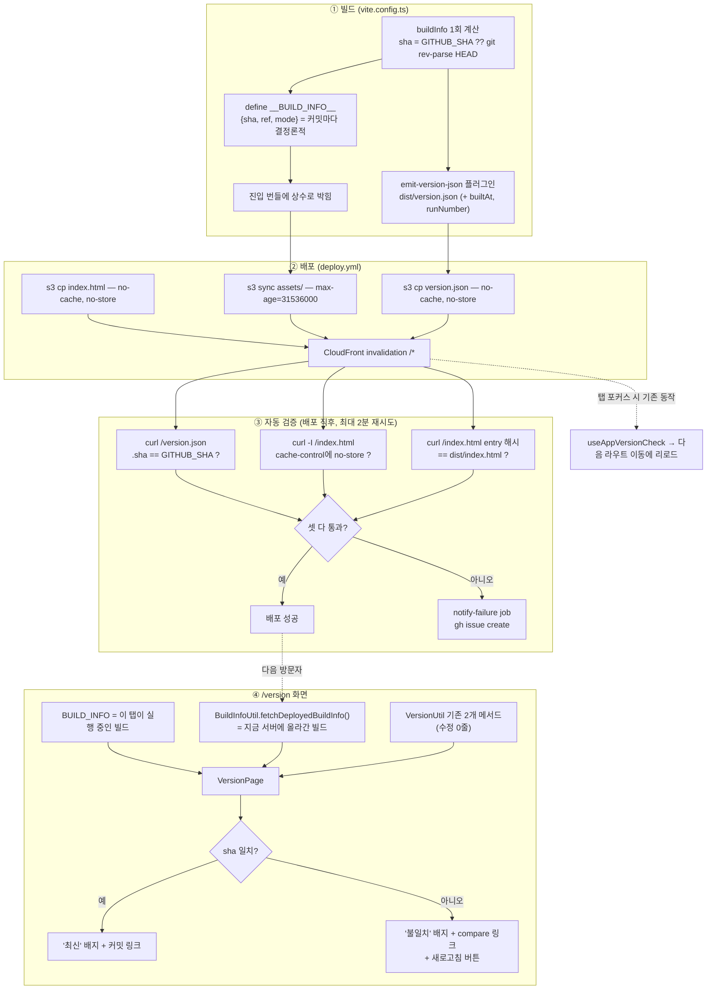

# 배포 반영 확인 수단 (Build Provenance)

## Context

배포가 실제로 반영됐는지 확인할 방법이 파이프라인 성공 여부밖에 없다. "워크플로우는 success인데
내 화면은 옛날 것"인 상황에서 원인이 **배포 자체가 안 된 것**인지 **내 탭이 캐시를 잡은 것**인지
구분할 수단이 앱에도 CI에도 없다.

확인된 현재 상태:

- 커밋 SHA·빌드 시각을 번들에 주입하는 코드 0건. `package.json:4`의 `version`은 `"0.0.0"` 고정,
  import 0건. `vite.config.ts:141-143`의 `__DEPLOY_ENV__`는 참조처 0건 + `vite-env.d.ts` declare
  없음(죽은 코드).
- `public/version.json` 없음. 설정·about 페이지 없음. 푸터 컴포넌트 없음. 마이페이지는
  `MyPageModal.tsx`(28줄) 모달 하나.
- 판정 로직은 이미 있다 — `src/shared/utils/version.util.ts`의 `VersionUtil`이 entry 스크립트
  해시를 비교하지만 `useAppVersionCheck.ts:12-13`이 *"화면에는 아무것도 띄우지 않는다"*고 명시.
  **재료는 있는데 사람에게 안 보여준다.**
- `deploy.yml:90-95`는 `create-invalidation`을 쏘고 결과를 확인하지 않고 끝난다. 실제 CloudFront를
  때려보는 검증 없음. `concurrency` 블록 없음. 배포 실패 알림 없음
  (`docs/CI-CHECK-GATE.md:307`이 스스로 "근본 해법은 아직 없음"으로 기록).

목표: ① 로드된 빌드와 서버 빌드를 나란히 보여주는 `/version` 화면, ② 배포 직후 실제 CloudFront를
검증하고 실패 시 이슈를 만드는 CI 스텝.

사용자 승인 사항(2026-09-20): 노출 범위는 **`/version` 페이지 + 콘솔 배너**(마이페이지 모달 제외),
CI는 **검증 + 실패 이슈 알림**(concurrency 포함).

## 전체 흐름



## 0단계 — 워크트리 준비

코드를 수정하므로 CLAUDE.md Critical Rule에 따라 워크트리에서 작업한다.

1. `git log origin/main..main` — 미푸시 커밋이 있으면 `EnterWorktree` 기본값(`origin/main` 기준)을
   쓰지 말고 로컬 `main` 기준으로 만든다.
2. `git worktree list`로 오래된 워크트리 확인.
3. `EnterWorktree` 후 부트스트랩: `cp ../../../.env .` && `pnpm install`.

## 1단계 — 빌드 식별자 (UI 없음)

**`vite.config.ts`** — 한 곳에서 계산해 두 출구로 내보낸다(따로 계산하면 두 값이 어긋난다).

- 상단에 `readLocalGitSha()` — `execSync('git rev-parse HEAD')`, 실패 시 `'unknown'`.
- `defineConfig(({ mode }) => ...)` 안, return 위에서 계산:
  - `bundledBuildInfo = { sha, ref, mode }` — `sha = process.env.GITHUB_SHA ?? readLocalGitSha()`,
    `ref = process.env.GITHUB_REF_NAME ?? 'local'`
  - `deployedBuildInfo = { ...bundledBuildInfo, runNumber, runId, builtAt: dayjs().toISOString() }`
- plugins 배열(`:17-32`)에 `emit-version-json` 추가 — `apply: 'build'`, `generateBundle()`에서
  `this.emitFile({ type: 'asset', fileName: 'version.json', source: ... })`. `fileName`(≠`name`)이라야
  해시 없이 나간다.
- `define`(`:141-143`)에 `__BUILD_INFO__: JSON.stringify(bundledBuildInfo)` 추가.

> **⚠️ `builtAt`·`runNumber`를 define에 넣지 말 것.** 지금은 같은 소스를 다시 빌드하면 entry 청크
> 해시가 동일해서 무변경 재배포에도 열린 탭이 리로드되지 않는다. 매 빌드 달라지는 값을 번들에
> 박으면 해시가 바뀌어 `useAppVersionCheck.ts:47-51`이 새 배포로 오판하고 **전 탭이 강제
> 새로고침**된다. define은 커밋 단위로 결정론적인 값만.

**`src/vite-env.d.ts`** — 파일 끝에 `declare const __BUILD_INFO__: { sha: string; ref: string; mode: string };`.
`import`를 추가하면 이 파일이 모듈이 되어 기존 global 선언이 깨지므로 타입은 인라인으로.

**`src/shared/config/build-info.ts`** (신규) — `BUILD_INFO` export. `typeof __BUILD_INFO__ === 'undefined'`
가드 + 폴백 필수: `vitest.config.ts`에는 `define`이 없어 테스트에서 ReferenceError가 난다. esbuild가
빌드 시 접으므로 프로덕션 오버헤드 없음.

**기존 `__DEPLOY_ENV__`**: 그대로 두고 옆에 추가한다(CLAUDE.md §3 — 변경 줄이 전부 요청으로 설명돼야
한다). `mode`가 `__BUILD_INFO__`에 들어가므로 정리 가능하지만 별도 건으로 남긴다.

**검증**

```bash
pnpm build
cat dist/version.json                          # sha/ref/mode/builtAt 확인
grep -c '"sha"' dist/assets/js/index-*.js      # define이 번들에 박혔나
pnpm build && cp dist/index.html /tmp/a && pnpm build
diff <(grep -o 'index-[A-Za-z0-9_-]*\.js' /tmp/a) \
     <(grep -o 'index-[A-Za-z0-9_-]*\.js' dist/index.html)   # ← 해시가 같아야 한다
pnpm type-check
```

마지막 diff가 **핵심 게이트**다. 여기서 해시가 달라지면 위 경고 상황이다.

## 2단계 — 조회 유틸·훅

**`src/shared/utils/build-info.util.ts`** (신규) — `BuildInfoUtil.fetchDeployedBuildInfo()`.
`fetch('/version.json', { cache: 'no-store' })` 후 `typeof json.sha === 'string'` 수준의 좁은 체크,
실패·비정상·형식 불일치는 전부 `null`(`version.util.ts:25-40`의 "조용히 판단 보류" 계약과 동일).

`VersionUtil`은 **수정하지 않는다.** 그쪽은 "entry 해시 기반 최신성 판정"이라는 단일 책임이 있고
`useAppVersionCheck`가 그 계약에 의존한다. 여기는 별개 관심사라 새 파일(CLAUDE.md "새 기능은 새 코드로").

**`src/shared/hooks/useDeployedBuildInfo.ts`** (신규) — `useState` + `useEffect` 1회 조회.
react-query는 쓰지 않는다(1회성 정적 파일에 캐시 계층은 과잉). `import.meta.env.DEV`면 fetch 자체를
하지 않고 `null` 유지 — `useAppVersionCheck.ts:26-28` 규약과 동일.

**테스트** — `version.util.test.ts`·`useAppVersionCheck.test.ts`의 MSW 패턴을 그대로 따른다.

- `build-info.util.test.ts`: 정상 JSON / 404 / `sha` 없는 JSON / 비-JSON 본문 / 네트워크 오류
- `useDeployedBuildInfo.test.ts`: 마운트 시 1회 조회, `vi.stubEnv('DEV', true)`면 핸들러 미호출
  (`useAppVersionCheck.test.ts`의 `handlerCalled` 스파이 기법)

**검증**: `pnpm test`. 이 단계까지 UI 변경 0.

## 3단계 — `/version` 화면

**`src/pages/version/VersionPage.tsx`** (신규) — `src/pages/403/ForbiddenPage.tsx`와 같은 형태.

표시 내용(전부 기존 `badge`/`card`/`button` atoms 조합 → 새 atom 0개 → `.stories.tsx` 의무 없음):

| 행                     | 출처                                                           |
| ---------------------- | -------------------------------------------------------------- |
| 이 탭이 실행 중인 빌드 | `BUILD_INFO.sha`                                               |
| ↳ 진입 스크립트        | `VersionUtil.readEntryScriptSrc(document)` (기존 코드 그대로)  |
| 서버에 배포된 빌드     | `BuildInfoUtil.fetchDeployedBuildInfo()`                       |
| ↳ 배포 시각 / run 번호 | `builtAt`(`DateUtil` 포맷) / `runNumber`                       |
| ↳ 진입 스크립트        | `VersionUtil.fetchDeployedEntryScriptSrc()` (기존 코드 그대로) |
| 판정                   | `Badge` 일치/불일치                                            |

진입 스크립트 두 값을 그대로 노출하는 게 핵심 가치다 — "왜 자동 새로고침이 안 떴지?"를 코드를 읽지
않고 진단할 수 있다.

불일치 시: `https://github.com/BAECHAN/link-sphere_FE_NEW/compare/<loaded>...<deployed>` 링크(커밋
목록을 GitHub이 렌더) + `Button`으로 새로고침. 일치 시에도 sha는 `.../commit/<sha>`로 링크.
`.../blob/<sha>/CHANGELOG.md` 링크 한 줄 추가.

DEV 모드에서는 서버 빌드 섹션 대신 안내 문구(`/version.json`이 dev 서버엔 없다).

**라우트**: `src/app/routes/index.tsx:154-168`의 403/500과 나란히 **`RootLayout` 직속**. `AppShellLayout`
아래에 두지 않는다 — `AppShellLayout.tsx:19-21`이 인증 복원까지 스피너를 띄우므로, 앱이 망가진 상태를
진단하러 오는 화면이 인증에 발목 잡히면 안 된다(403/500이 직속인 것과 같은 이유).

**부수 수정**: `src/shared/config/route-paths.ts:6-23`에 `VERSION: '/version'` 추가(`isProtectedPath`는
손대지 않는다 — 공개 경로). `src/shared/config/texts.ts`에 최상위 `version` 네임스페이스 신설
(`mypage`(`:111`) 옆). 제목은 마침표 없이, 설명은 해요체 — `texts.test.ts`가 `/니다[.:]?$/`를 잡는다.

CloudFront Function(`infra/cloudfront-functions/spa-fallback.js:16-21`)이 마지막 세그먼트의 `.` 유무로
갈리므로 `/version`은 SPA 라우트로, `/version.json`은 S3 정적 파일로 정확히 나뉜다 — 수정 불필요.

**테스트** `VersionPage.test.tsx` — `renderWithProviders`(`src/test/utils.tsx:50`). 테스트에서
`BUILD_INFO`는 폴백 `'unknown'`이므로, 일치/불일치는 **MSW 응답 sha를 `'unknown'`으로 주느냐 아니냐**로
만든다(모듈 모킹 불필요). compare 링크 `href` 문자열 전체를 검증. 서버 조회 실패 시 화면이 깨지지 않는지.

**검증**: `pnpm dev` → `/version`(DEV 안내 확인) → `pnpm build && pnpm preview` → `/version`에서 일치
표시 확인 → `pnpm type-check && pnpm test && pnpm lint`. 새 화면이므로 커밋 전 `browser-verification`
skill로 녹화해 사용자에게 보여준다(CLAUDE.md §9).

## 4단계 — 콘솔 배너

`src/main.tsx`에 기존 `[FCM]` 접두사 패턴(`src/shared/lib/firebase/fcm.ts:25,83`)을 따라 한 줄:

```ts
console.info(`[BUILD] ${BUILD_INFO.sha.slice(0, 7)} (${BUILD_INFO.ref}) — /version`);
```

`eslint.config.js`에 `no-console` 룰이 없고 앱 코드에 `console.info` 선례가 있어 컨벤션 이탈이 아니다.

**검증**: `pnpm preview` 후 DevTools 콘솔 출력 확인.

## 5단계 — 배포 파이프라인 (`.github/workflows/deploy.yml`)

**(a) concurrency** — `:20`(permissions 아래):

```yaml
concurrency:
  group: deploy-main
  cancel-in-progress: false
```

`cancel-in-progress: false`가 중요하다. `ci.yml:21`이 `true`인 것과 의도적으로 다르다 — ci는 읽기
전용이라 취소해도 무해하지만, deploy는 `aws s3 sync --delete`(`:84`) 도중 취소되면 버킷이 반쯤 지워진
상태로 남는다. 또한 concurrency 없이 검증 스텝을 붙이면 연속 푸시 시 오래된 run이 자기 sha를
라이브와 비교해 **성공한 배포가 거짓 실패**한다.

**(b) version.json 업로드** — `:72`(index.html cp) 바로 아래에 `aws s3 cp dist/version.json ... \
--cache-control "no-cache, no-store, must-revalidate" --content-type "application/json"`.

**(c) exclude** — `:84-88` 마지막 sync에 `--exclude "version.json"` `--exclude "version.json.gz"` 추가
(gzip 플러그인이 `.json`도 압축하므로 `.gz`도 생긴다). exclude가 없으면 sync가 재업로드할 때
`--cache-control` 없이 올라가 캐시 헤더가 날아간다 — index.html이 같은 이유로 이미 제외돼 있다.

> no-store가 필요한 이유 두 가지: ① 엣지에 몇 분만 캐시돼도 화면이 "배포 안 됨"이라고 거짓말한다.
> ② 아래 CI assert가 캐시된 옛 sha를 읽어 **성공한 배포를 실패로 띄운다** — 알림이 늑대소년이 되면
> 알림 자체가 죽는다.

**(d) 검증 스텝** — `:95`(invalidation) 이후. URL은 `vars.SITE_URL`(Secret 아닌 레포 Variable —
`README.md:11`에 이미 공개된 값이고 Secret이면 로그가 `***`로 마스킹돼 디버깅이 어렵다) +
하드코딩 폴백. `set -euo pipefail`.

1. **`/version.json`의 `.sha` == `$GITHUB_SHA`** — 10초 간격 최대 12회 재시도(2분). S3 업로드가 실제로
   됐는지를 직접 확인.
2. **`curl -I /index.html`의 `cache-control`에 `no-store`** — 가장 값진 검사다. 누가 `:71`의
   `--cache-control`을 지우거나 오타를 내도 배포는 "성공"하고, 그 순간 `useAppVersionCheck`가 캐시된
   구 index.html을 받아 **NEW-VERSION-RELOAD 기능 전체가 조용히 죽는다.** CloudFront 캐시 정책이
   콘솔에서 바뀌어도 응답 헤더를 보므로 잡힌다.
3. **라이브 entry 해시 == `dist/index.html`의 entry 해시** — assets는 새 것인데 index.html만 실패한
   부분 배포(사용자가 404 청크를 만나는 최악의 상태)를 잡는다.

`aws cloudfront wait invalidation-completed`는 쓰지 않는다: `:93-95`를 ID 캡처하도록 고쳐야 하고,
드문 타임아웃이 성공한 배포의 거짓 실패를 만들며, 무엇보다 version.json·index.html은 `no-store`라 엣지가
저장하지 않아 기다릴 이유가 약하다. 위 재시도 루프가 우리가 신경 쓰는 것을 직접 측정한다. 2분이
부족하다고 실측되면 그때 추가한다.

**(e) 실패 알림** — `doc-drift-check.yml:11-14,29-30` 패턴(`permissions: issues: write` +
`GH_TOKEN: secrets.GITHUB_TOKEN` + `gh issue create`, 레포에는 쓰지 않음). **별도 job**으로 둔다:

```yaml
notify-failure:
  needs: deploy
  if: failure()
  permissions: { contents: read, issues: write }
```

`deploy` job은 AWS 자격증명을 다루는데 거기에 `issues: write`를 더하면 빌드·배포 전 구간에서
`GITHUB_TOKEN` 쓰기 권한이 유효해진다. 권한은 필요한 스텝에만. 이슈 본문에 커밋 sha, run URL,
`docs/DEPLOY.md` 참조. 실패 run마다 새 이슈(배포 실패는 매번 원인이 다른 개별 사건).

**검증** — 이 단계는 머지 전 완전 검증이 불가능하다(실제 CloudFront 필요):

1. 머지 → `gh run watch <id>`로 검증 스텝 로그 확인 (push 성공 ≠ 배포 완료)
2. `curl -s https://dbw3brui6htwk.cloudfront.net/version.json | jq`
3. `curl -sI https://dbw3brui6htwk.cloudfront.net/index.html | grep -i cache-control`
4. 브라우저로 `/version` → 일치 배지 확인
5. **알림 경로 실측**: 임시 브랜치에서 기대 sha를 틀리게 해 `workflow_dispatch`로 한 번 돌려 이슈가
   실제로 생성되는지 확인. 이걸 건너뛰면 "알림이 있다고 믿는데 실은 안 온다" 상태가 된다.

## 6단계 — 문서

**신규 `docs/BUILD-VERSION.md`** — 독립 기능 문서(서사형). `NEW-VERSION-RELOAD.md`와 합치지 않는다:
그쪽 목적은 "**자동으로** 새로고침되는 동작", 이쪽은 "**사람이 수동으로** 확인하는 수단 + CI 검증"으로
목적이 다르다(CLAUDE.md가 인용한 _SWE at Google_ 10장 "singular purpose"). 제목 아래 `>` 블록 4종
(문서 성격 / 대상 독자 / 읽고 나면 / 마지막 검토: `2026-09-20`) + §1 쉬운 설명(**장 끝 Mermaid 필수**)
~ §13 관련 문서 순서를 따른다.

함께 갱신:

| 문서                                     | 내용                                                                                           |
| ---------------------------------------- | ---------------------------------------------------------------------------------------------- |
| `README.md:160-171`                      | 독립 기능 문서 목록에 `docs/BUILD-VERSION.md` 등록(분류 규약상 필수)                           |
| `docs/DEPLOY.md:17-44`                   | 워크플로우 단계에 version.json·검증·알림 job 반영 + "배포 반영 검증하는 법"(curl 명령) 절 신설 |
| `docs/DEPLOY.md:64-75`                   | `vars.SITE_URL` 등록                                                                           |
| `docs/CI-CHECK-GATE.md:303-307`          | "배포 실패 알림 없음"을 해결됨으로 갱신                                                        |
| `docs/SYSTEM-ARCHITECTURE.md:82-115`     | 배포 파이프라인에 검증 단계 반영                                                               |
| `docs/NEW-VERSION-RELOAD.md` §13         | 관련 문서 상호 링크                                                                            |
| `CHANGELOG.md` `[Unreleased] > Added`    | `<details>` 배경·구현 블록 포함                                                                |
| `docs/plans/2026-09-20-build-version.md` | 이 계획 스냅샷(append-only, 구현과 같은 PR)                                                    |

`pnpm check:docs`가 문서 속 경로와 줄 번호 존재를 검사하므로(`scripts/check-docs.js:118,128`) 구현
확정 후 최종 줄 번호로 맞춘다.

**검증**: `pnpm check:docs`, `pnpm test`(texts 톤 가드).

## 7단계 — PR과 계획 대비 구현 대조

CLAUDE.md §11에 따라 PR 열기 전 fresh Explore subagent에게 `docs/plans/2026-09-20-build-version.md`와
실제 diff를 대조시키고, 결과를 PR 본문 `## 계획 대비 구현` 섹션에 항목별로 남긴다.

**커밋 분할** (CLAUDE.md "커밋 단위"):

| 커밋 | 범위                                                                    |
| ---- | ----------------------------------------------------------------------- |
| 1    | 1~4단계 + 테스트 + `docs/BUILD-VERSION.md` + README + CHANGELOG + plans |
| 2    | 5단계 + `docs/DEPLOY.md`·`CI-CHECK-GATE.md`·`SYSTEM-ARCHITECTURE.md`    |

> **⚠️ 2번 커밋은 `.github/**`·`docs/**`만 건드려 `deploy.yml`의 경로 필터에 안 걸린다.**
> `gh workflow run "Frontend Deploy (S3 + CloudFront)" --ref main`으로 수동 트리거해야 새 검증 스텝이
> 실제로 돈다. 그 후 `gh run list --branch main --workflow "Frontend Deploy (S3 + CloudFront)"`로
> 해당 SHA가 success인지 확인하기 전까지 "배포됨"이라 보고하지 않는다.

## 범위 밖 (검토했으나 하지 않음)

- **마이페이지 모달 버전 라인** — 사용자가 `/version` + 콘솔 배너만 선택. 발견성이 부족하다고
  느껴지면 `MyPageModal.tsx:24` 아래 한 줄로 나중에 추가 가능(시각 변경이라 브라우저 검증 +
  `docs/MYPAGE.md` 갱신 필요).
- **CloudWatch 알람 / Route53 헬스체크 / 합성 모니터링 / 배포 대시보드** — 요청받지 않았고 이
  규모에 과하다.
- **빌드에 포함된 커밋 목록 임베드** — `git log`를 번들에 넣으면 크기가 늘고 얕은 클론
  (`actions/checkout@v4` 기본 depth 1)에선 로그가 없다. GitHub compare 링크가 같은 답을 더 정확히 준다.
- **`__DEPLOY_ENV__` 삭제** — `mode`가 `__BUILD_INFO__`에 흡수되어 정리 가능하지만 별도 건.
- **발견된 기존 문제들** (건드리지 않음): `dist/stats.html`이 공개 URL로 배포되는 것,
  `docs/DEPLOY.md:30-35`의 `npm`/`VITE_API_BASE_URL` 오기, `PUBLIC_PATHS` 죽은 export.

## 함정 정리

| #   | 함정                                                                   | 대응                                                        |
| --- | ---------------------------------------------------------------------- | ----------------------------------------------------------- |
| 1   | `builtAt`/`runNumber`를 define에 넣으면 무변경 재배포에도 전 탭 리로드 | define은 `{sha,ref,mode}`만. 1단계 두 번 빌드 diff가 게이트 |
| 2   | vitest에 define이 없어 `__BUILD_INFO__` ReferenceError                 | `typeof` 가드 + 폴백                                        |
| 3   | version.json이 캐시되면 화면·CI 둘 다 거짓말                           | no-store cp + 마지막 sync에서 exclude                       |
| 4   | concurrency 없이 검증 추가 → 연속 푸시 시 거짓 실패                    | `group: deploy-main`, `cancel-in-progress: false`           |
| 5   | `--delete` sync 도중 취소 시 버킷 파손                                 | 위와 동일 — 취소가 아니라 큐잉                              |
| 6   | `vite-env.d.ts`에 `import`를 넣으면 기존 global 선언이 전부 깨짐       | 인라인 타입으로 `declare const`만                           |
| 7   | 2번 커밋이 경로 필터에 안 걸림                                         | `workflow_dispatch` 수동 트리거                             |
| 8   | `docs/plans/*.md`는 커밋 후 수정 금지(`ci.yml:32-44`가 차단)           | 스냅샷은 한 번에 완성해 커밋                                |
| 9   | 알림 경로 자체가 고장나도 아무도 모름                                  | 일부러 실패시켜 이슈 생성 1회 실측                          |

## 핵심 파일

- `vite.config.ts` — `define`(`:141-143`) + plugins(`:17-32`). 빌드 식별자의 단일 발원지
- `.github/workflows/deploy.yml` — concurrency, `:72` 뒤 version.json cp, `:84-88` exclude,
  `:95` 뒤 검증 스텝, `notify-failure` job
- `src/shared/utils/version.util.ts` — **수정 0줄, 재사용만.** 기존 2개 메서드를 `/version`이 호출해
  `useAppVersionCheck`의 판정 입력을 화면에 노출
- `src/app/routes/index.tsx:154-168` — 403/500 옆, `RootLayout` 직속에 `/version`
- `src/vite-env.d.ts` — `__BUILD_INFO__` global declare (import 추가 금지)
