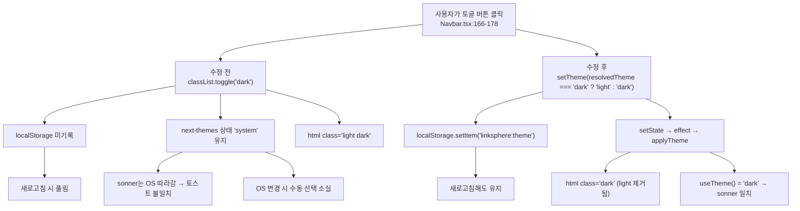
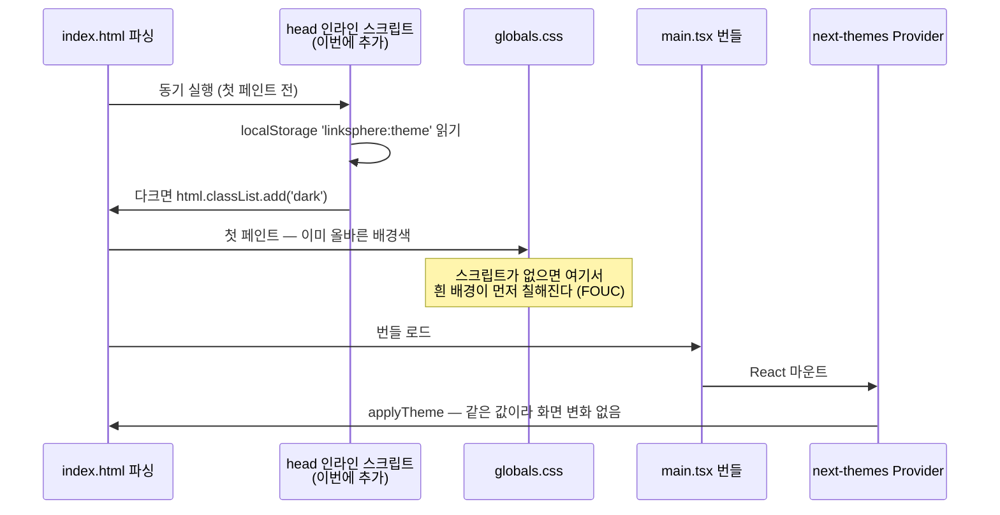

# 다크모드 토글이 next-themes를 우회하는 버그 수정

## Context

[Navbar.tsx:170-173](src/widgets/layout/navbar/ui/Navbar.tsx#L170-L173)의 테마 토글 버튼이
`next-themes`의 `setTheme()`을 쓰지 않고 `document.documentElement.classList.toggle('dark')`로
DOM을 직접 조작한다. 그 결과 next-themes의 내부 상태·localStorage와 실제 DOM이 갈라진다.

`next-themes` 0.4.6 번들(`node_modules/next-themes/dist/index.mjs`)을 직접 디코드해 확인한
동작이다:

- `resolvedTheme: c==="system" ? T : c` — `theme`이 `'system'`이면 `systemTheme`을 반환
- `setTheme` = `n(r); try{localStorage.setItem(m,r)}catch(v){}` — 상태 갱신 + **평문** 저장(JSON 아님)
- 테마 적용은 `classList.remove('light','dark')` → `add(value)`

따라서 지금 실제로 벌어지는 일:

```
마운트: next-themes가 applyTheme('system') → <html class="light">
클릭  : classList.toggle('dark')          → <html class="light dark">   ← light가 안 벗겨짐
        localStorage 미기록, next-themes 내부 상태는 여전히 'system'
```

`globals.css`에 `.light` 선택자가 0건(grep 확인)이라 화면상으론 다크가 이기지만 상태는 갈라져 있다.

### 증상 (보고된 2건 + 조사로 발견한 1건)

1. `localStorage['linksphere:theme']`에 저장되지 않아 새로고침하면 시스템 기본값으로 풀린다.
2. [sonner.tsx:9](src/shared/ui/atoms/sonner.tsx#L9)가 `useTheme()`로 읽는 값이 `'system'`으로
   남아, sonner가 자체 matchMedia로 OS를 따라가 토스트만 반대 테마로 렌더된다.
3. **(신규 발견)** 내부 상태가 `'system'`이라 **OS 테마가 바뀌면 수동으로 켠 다크가 아무 조작
   없이 풀린다** — next-themes의 미디어 리스너가 `theme==='system'`을 보고 재적용한다.

### 의도한 결과

토글이 next-themes를 통과해 ① 선택이 localStorage에 남고 ② `useTheme()` 값과 `<html>` 클래스가
일치하며 ③ OS 변경과 무관하게 선택이 유지된다. 기존 Sun/Moon `dark:` variant 애니메이션은 그대로.

---

## 흐름



새로고침 시 부팅 순서 — FOUC를 막는 인라인 스크립트가 들어가는 자리:



---

## 변경 사항

### 1. `src/widgets/layout/navbar/ui/Navbar.tsx` — 토글을 next-themes로 배선

`useTheme` import를 추가하고, 컴포넌트 상단(기존 훅 호출부 근처)에서 구조분해한 뒤 onClick을 교체한다.

```tsx
const { resolvedTheme, setTheme } = useTheme();
```

```tsx
onClick={() => setTheme(resolvedTheme === 'dark' ? 'light' : 'dark')}
```

**`theme`이 아니라 `resolvedTheme`으로 판정하는 이유** — `defaultTheme="system"`이라 신규
사용자의 `theme`은 항상 `'system'`이다:

```
[OS = 다크인 신규 사용자]  theme='system'  resolvedTheme='dark'  화면=다크
  theme 기준     : 'system' !== 'dark' → setTheme('dark') → 다크→다크, 화면 그대로
                   첫 클릭이 먹통처럼 보이고 두 번 눌러야 라이트로 감
  resolvedTheme  : 'dark'   === 'dark' → setTheme('light') → 정상
```

next-themes 공식 README의 아이콘 토글 레시피는 `theme` 기준이지만 그 예제는 아이콘을 JS
조건부 렌더로 그린다. 같은 README의 FAQ는 _"The `resolvedTheme` is necessary to accurately
reflect the System theme preference in the UI"_([next-themes README](https://github.com/pacocoursey/next-themes))
라고 적고 있어, `defaultTheme="system"`인 이 설정에는 `resolvedTheme`이 맞다.

**hydration `mounted` 가드는 넣지 않는다.** 공식 README가 그 근거를 SSR로 명시한다 —
_"we cannot know the `theme` on the server, so it will always be `undefined` until mounted on
the client"_. 이 레포는 [main.tsx:19](src/main.tsx#L19)가 `createRoot`인 Vite SPA라 그 분기를
탈 수 없고, 아이콘도 [Navbar.tsx:175-176](src/widgets/layout/navbar/ui/Navbar.tsx#L175-L176)의
Tailwind `dark:` variant(순수 CSS)라 JSX가 테마 값에 의존하지 않는다. 오히려 `if (!mounted)
return null`을 넣으면 `h-9 w-9` 버튼이 한 프레임 사라져 옆의 검색·로그인 버튼이 밀렸다 돌아온다.
레포에 `mounted` 선례도 0건이다(grep 확인).

**훅으로 분리하지 않는다.** `docs/FE-ARCHITECTURE.md` §8의 widget hook 정의는 "여러 entity
query 조합 + 파생 상태"이고 `useTheme()`은 entity query가 아니다. 라이브러리 훅 호출 1줄 +
삼항 1줄을 새 파일로 빼는 것은 CLAUDE.md §2("한 번만 쓰이는 코드에 추상화를 두지 않는다")
위반이다. 같은 디렉터리의 기존 훅 2개(`useRecentSearches`, `useNavbarSearch`)는 둘 다 실질
로직을 갖고 있어 선례로 맞지 않는다.

### 2. `index.html` — FOUC 방지 인라인 스크립트 (`<head>` 끝, `</head>` 직전)

이 수정이 **새로 만드는** 부작용을 막는다. 지금은 다크가 저장되지 않아 새로고침 후 항상
라이트였지만, 고친 뒤에는 `linksphere:theme='dark'`가 남는다. [globals.css:174](src/app/globals.css#L174)의
`:root { --background: oklch(1 0 0) }`(흰색) + [:368](src/app/globals.css#L368)의
`body { @apply bg-background }` 조합이라, JS 번들이 로드되기 전 흰 배경이 먼저 칠해진다.

next-themes의 `ThemeScript`는 Provider가 React 렌더 중에 내보내므로 SPA에서는 첫 페인트 전에
실행될 수 없다 — 그래서 `index.html`에 직접 넣는다.

```html
<!-- 테마 FOUC 방지: next-themes의 ThemeScript는 React 렌더 중 삽입돼 SPA에선 첫 페인트
     전에 못 돈다. 아래 키는 STORAGE_KEYS.THEME(src/shared/config/storage-keys.ts:31)과
     같은 값을 유지해야 한다 — storage-keys.test.ts가 이 일치를 검사한다. -->
<script>
  try {
    var stored = localStorage.getItem('linksphere:theme') || 'system';
    var isDark =
      stored === 'dark' ||
      (stored === 'system' && window.matchMedia('(prefers-color-scheme: dark)').matches);

    if (isDark) {
      document.documentElement.classList.add('dark');
    }
  } catch (e) {
    /* localStorage 차단 환경(사파리 프라이빗 등)에서는 기본 테마로 둔다 */
  }
</script>
```

- next-themes가 마운트 후 `remove('light','dark')` → `add(value)`를 다시 돌리므로 값이 같으면
  화면 변화가 없고, 다르면 next-themes가 이긴다(안전한 중복).
- CSP: 레포 전체(`docs/DEPLOY.md`, `.github/workflows/`, `vite.config.ts`, `index.html`)에
  CSP 설정 흔적이 0건이라 인라인 스크립트가 차단될 근거는 없다. 다만 CloudFront 콘솔에서
  수동 관리되는 응답 헤더까지는 레포에서 확인할 수 없으므로, **배포 후 콘솔 에러를 확인한다.**
- **SSOT 균열(승인받은 트레이드오프)**: `'linksphere:theme'`가 `index.html`에 하드코딩된다.
  주석으로 정본을 가리키고 아래 가드 테스트로 방어한다.

### 3. `src/shared/config/storage-keys.test.ts` (신규) — SSOT 가드 1케이스

같은 디렉터리의 [texts.test.ts](src/shared/config/texts.test.ts)가 이미 쓰는 "설정 값을 테스트로
고정한다"는 선례를 따른다. `index.html`을 읽어 `STORAGE_KEYS.THEME` 문자열이 그대로 들어있는지
확인한다 — 누가 키를 바꾸면 `index.html`이 조용히 낡는 것을 CI가 잡는다.

### 4. `src/widgets/layout/navbar/ui/Navbar.test.tsx` (신규) — 회귀 방지

`<Navbar/>`를 렌더하는 테스트가 레포에 0건이고, `renderWithProviders`는 ThemeProvider를
감싸지 않으므로([utils.tsx:57-65](src/test/utils.tsx#L57-L65)) 이 파일 안에서 [main.tsx:22-27](src/main.tsx#L22-L27)과
동일한 설정으로 감싼다. **공용 유틸(`src/test/utils.tsx`)은 고치지 않는다** — 테스트 파일
69개 전부의 렌더 트리가 바뀌고, ThemeProvider가 `documentElement`를 전역 변조하는데
`cleanup()`은 그걸 되돌리지 않아 테스트 간 오염 경로가 새로 생긴다. 국소 우회 선례:
[PostCardBookmarkFolderModal.test.tsx:20-24](src/features/bookmark/toggle/ui/PostCardBookmarkFolderModal.test.tsx#L20-L24).

렌더 가능성은 의존성을 전수 추적해 확인했다 — 비인증 상태에서 **네트워크 요청 0건, MSW 핸들러
추가 0건**이다(`useAccount`는 `enabled: isAuthenticated`, `MyPageModal`은 `open={false}`라 Radix
Portal이 자식을 렌더하지 않음, `useAuth`의 mutation은 호출 전 미발화). 위젯 통째 렌더 선례:
[Sidebar.test.tsx](src/widgets/layout/sidebar/ui/Sidebar.test.tsx). 보이지 않는 상태를 프로브
컴포넌트로 단언하는 관용구 선례: [NavbarSearch.test.tsx:10-13](src/widgets/layout/navbar/ui/NavbarSearch.test.tsx#L10-L13).

| 케이스 | 단언                                                         | 수정 전 결과                   | 잡는 증상                 |
| ------ | ------------------------------------------------------------ | ------------------------------ | ------------------------- |
| 1      | 클릭 후 `localStorage`가 `'dark'`(평문) + `<html>`에 `.dark` | `null` → 실패                  | 증상 1                    |
| 2      | 클릭 후 프로브의 `useTheme()` 값이 `'dark/dark'`             | `'system/light'` → 실패        | 증상 2                    |
| 3      | 두 번 누르면 `'light'`로 복귀 + `.dark` 없음                 | `localStorage`가 `null` → 실패 | 회귀 방지                 |
| 4      | `matchMedia`를 `matches:true`로 스텁 → 첫 클릭이 `'light'`   | `null` → 실패                  | `resolvedTheme` 판정 고정 |

케이스 4는 **`theme` 기준으로 구현하면 `'dark'`가 나와 실패하는** 유일한 테스트다 — 위 설계
결정을 코드로 고정한다. [setup.ts:47-56](src/test/setup.ts#L47-L56)의 `matchMedia` 스텁이
`matches:false` 고정이므로 이 케이스에서만 `vi.stubGlobal`로 덮어쓴다(`vi.unstubAllGlobals()`는
`IntersectionObserver`/`ResizeObserver` 스텁까지 걷어내므로 쓰지 않는다).

`setup.ts`는 localStorage를 비우지 않고 `cleanup()`은 `documentElement`를 되돌리지 않으므로,
`afterEach`에서 `localStorage.clear()` + `classList.remove('light','dark')`를 직접 한다
([storage.util.test.ts:4-8](src/shared/utils/storage.util.test.ts#L4-L8)과 같은 이유).

e2e는 만들지 않는다 — `docs/TESTING.md:706`이 다크모드를 _"전역 상태·CSS 클래스 토글"_ 이라는
이유로 이미 **e2e 제외** 대상으로 판정해뒀다.

### 5. `CHANGELOG.md` — `[Unreleased]` → `### Fixed`

동작이 바뀌는 `fix`이므로 같은 커밋에 포함한다. 스코프는 `shared`(테마는 특정 엔티티 소유가
아닌 cross-cutting). 요약 줄 72자 이내, `<details>` 안 문단은 **한 줄로** 쓴다(손으로 줄바꿈하면
Prettier가 non-idempotent 상태가 돼 CI `pnpm check`에서 걸린다 — `changelog-release` skill).

### 6. `docs/plans/2026-09-20-navbar-theme-toggle-next-themes.md` — 이 계획의 스냅샷

CLAUDE.md §11에 따라 구현 코드와 같은 PR에 커밋한다(append-only).

---

## 변경하지 않는 것

- **`.storybook/preview.tsx:9-17`** — next-themes를 import하지 않고 `context.globals.theme`만
  보고 classList를 토글하는 **의도적** 구현이다. navbar에 `.stories.tsx`가 0건이라 영향도 없다.
- **`src/shared/ui/atoms/sonner.tsx`** — 여기 값이 화면과 일치하게 되는 것이 이번 수정의
  목적이다. 파일 자체는 손대지 않는다.
- **`src/test/utils.tsx`** — 위 4번 참고.
- **`src/app/providers/ThemeProvider.tsx`, `src/main.tsx`** — 설정은 이미 올바르다.

## 영향 범위 / 회귀 점검

서버 데이터를 건드리지 않아 CRUD 실패 지점은 없다. 기존 동작 회귀만:

| 대상                                    | 판정                                                                                                                                                                                               |
| --------------------------------------- | -------------------------------------------------------------------------------------------------------------------------------------------------------------------------------------------------- |
| 기존 유닛 테스트 69개                   | 영향 없음 — `documentElement`를 단언하는 테스트는 `MobileCommentBar.test.tsx:49,63` 2곳뿐이고 둘 다 `--toast-offset-bottom` CSS 변수라 class와 무관. `vi.mock('next-themes')`는 레포에 0건         |
| `e2e/` 32개 스펙                        | 영향 없음 — `theme`/`dark` 문자열 0건(grep)                                                                                                                                                        |
| `Navbar.tsx:86-103`의 `--navbar-height` | 영향 없음 — next-themes가 건드리는 건 `style.colorScheme`이고 이쪽은 커스텀 프로퍼티                                                                                                               |
| `globals.css`                           | 영향 없음 — `.light` 선택자가 0건이라 next-themes가 붙이는 `light` 클래스는 무해하고, 지금도 이미 붙어 있다                                                                                        |
| ESLint 레이어 규칙                      | 영향 없음 — `eslint.config.js`에 `next-themes` 제한 0건. `sonner.tsx`가 이미 import 중                                                                                                             |
| 문서                                    | `design-tokens` skill의 _"ThemeProvider가 `<html>`에 `.dark` 클래스를 토글"_ 서술은 수정 **후에야** 사실이 된다(갱신 불필요). 앱 토글의 저장 방식을 서술하는 문서는 FE/BE 어디에도 없음(grep 확인) |

### 사용자가 체감하는 변화 1건 (이미 알림)

`'system'`으로 되돌릴 UI가 없어, 한 번 누르면 OS 설정을 다시 따라가지 않는다. 요청하신
"Sun/Moon 2-state 유지"가 이를 전제하므로 그대로 간다(3-state 순환은 아이콘·상태 표시가
추가로 필요해 범위 밖).

---

## 작업 순서

```
0. git log origin/main..main 으로 미푸시 커밋 확인 → EnterWorktree
   → 진입 직후 `cp ../../../.env .` + `pnpm install` (필수 부트스트랩)
   → node -v 가 v24 인지 확인
1. Navbar.test.tsx + storage-keys.test.ts 작성 (수정 전 상태로)
   → verify: pnpm test 로 케이스 1~4 실패 확인.
     실패 메시지가 null / 'system/light' 인지 눈으로 본다 — "렌더가 안 돼서" 실패한 게
     아님을 가르는 단계다
2. Navbar.tsx 수정 (useTheme import + onClick 교체)
   → verify: 위 4개 전부 통과
3. index.html 인라인 스크립트 추가
   → verify: storage-keys.test.ts 통과
4. pnpm type-check                → verify: 에러 0
5. pnpm test                      → verify: 전체 회귀 0
6. pnpm lint                      → verify: import 추가분 통과
7. pnpm format:check              → verify: CHANGELOG 들여쓰기 (lint 통과가 이걸 보장하지 않음)
8. 브라우저 검증 녹화 (아래)
9. 사용자 승인 후 커밋
```

## 검증 (브라우저)

`.claude/skills/browser-verification/SKILL.md` 절차를 따른다. `pnpm dev`(`https://localhost:31119`)
기동 → `browser_video_show_actions` → `browser_start_video`로
`.claude/browser-artifacts/verify-2026-09-20-theme-toggle.webm` 녹화. 챕터는 요구사항 순서 그대로:

1. **토글 → 새로고침 유지** — 라이트에서 토글 → 다크 확인 → 새로고침 → 다크 유지.
   FOUC 스크립트가 붙었으므로 새로고침 구간에 흰 번쩍임이 없어야 한다
2. **토스트 테마 일치** — 다크 상태에서 토스트를 띄워 토스트가 다크로 뜨는지
   (로그인 실패 토스트 등 비인증 상태에서 띄울 수 있는 경로 사용)
3. **`<html>` 클래스 상태** — devtools로 `class`가 `light dark` 동시 부착이 아니라
   `dark` 하나만인지 확인

녹화 후 절대경로를 채팅에 코드 블록으로 병기하고, **사용자 승인 뒤에만 커밋**한다.

## 커밋

`.gitmessage` 형식(한글 subject/body, type+scope 영문 소문자):

```
fix(widget): 다크모드 토글이 next-themes를 우회하던 문제 수정
```

`git add` 없이 대상 파일을 직접 지정한다:

```bash
git commit -- src/widgets/layout/navbar/ui/Navbar.tsx \
               src/widgets/layout/navbar/ui/Navbar.test.tsx \
               src/shared/config/storage-keys.test.ts \
               index.html CHANGELOG.md \
               docs/plans/2026-09-20-navbar-theme-toggle-next-themes.md
```

PR 생성 후 §11에 따라 fresh Explore subagent로 계획 대비 구현을 대조해 PR 본문에
`## 계획 대비 구현` 섹션을 남기고, `changelog-release` skill에 따라 CHANGELOG 항목에
PR 링크를 덧붙이는 후속 커밋을 push한다.
