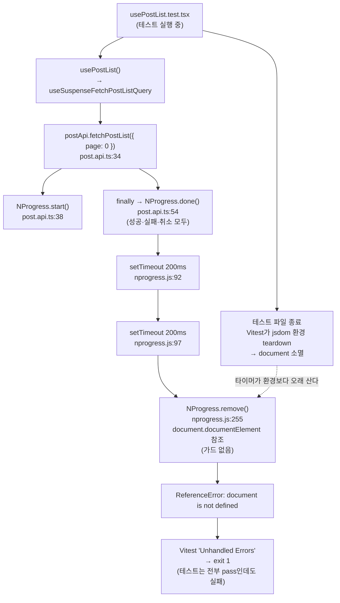
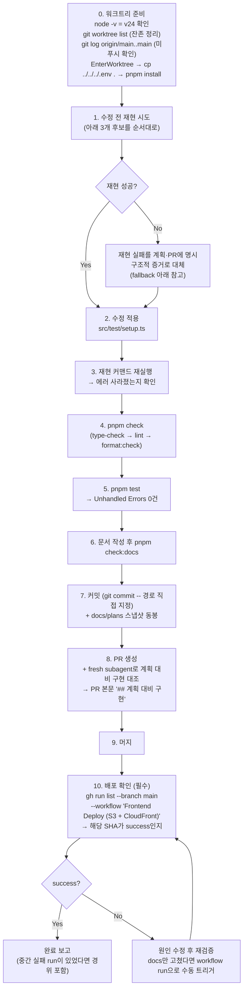

# 유닛 테스트 NProgress 타이머 누수로 인한 배포 CI 간헐 실패 제거

## Context

2026-09-20 `main` 배포 워크플로우(run `35515311104`, 커밋 `b467774f`)가 실패했다. **테스트 430개는 전부 통과**했는데도 Vitest가 처리되지 않은 예외 1건을 잡아 프로세스가 exit 1로 끝났다:

```
ReferenceError: document is not defined
 ❯ Object.NProgress.remove nprogress.js:256:17
 ❯ Timeout._onTimeout  nprogress.js:98:23
This error originated in "src/widgets/post/post-list/hooks/usePostList.test.tsx"
```

PR #135(OpenAPI 타입 생성 파이프라인)의 변경 내용과는 무관하다. 같은 트리가 PR CI(`95ff398c`)에서는 통과했고 16분 뒤 머지 커밋에서만 실패했다 — 비결정적이다. 다만 **오래된 flake는 아니다**: 원인 테스트 파일 `usePostList.test.tsx`가 2026-09-14 `d66e3bb`에서 생겼고, 그 이전 CI/배포 실패 로그를 전수 grep한 결과 이 에러는 이번이 유일한 발생이다.

이 상태를 방치하면 앞으로 모든 배포가 ~1/N 확률로 이유 없이 실패한다. 현재 프로덕션은 PR #134 배포본에 멈춰 있고, #135 내용은 아직 배포되지 않았다.

### 근본 원인



- `NProgress.done()`은 `finally`에 있어 성공·실패·취소 경로 전부에서 실행된다 ([post.api.ts:52-56](../../src/entities/post/api/post.api.ts))
- `speed` 기본값 200ms이고 이 레포는 `showSpinner: false`만 설정하므로([post.api.ts:5](../../src/entities/post/api/post.api.ts)), `done()` 이후 **400~600ms짜리 실제 타이머**가 남는다
- `nprogress.js:255-259`의 `remove()`는 `document`를 가드 없이 참조한다
- 레포 전체에서 nprogress를 import하는 곳은 `post.api.ts:2` 한 곳뿐이고, 테스트 중 여기 도달하는 파일도 `usePostList.test.tsx` 하나뿐이다
- `src/test/setup.ts`에 nprogress 모킹도 타이머 정리도 없고, `vitest.config.ts`는 `teardownTimeout`·`dangerouslyIgnoreUnhandledErrors` 전부 기본값이다

## 변경 내용

### 1. `src/test/setup.ts` — nprogress 중앙 모킹 (핵심 수정)

파일 맨 끝, 기존 `vi.mock('sonner', ...)` 블록(66-76줄) 아래 한 줄 띄우고 추가한다. 같은 파일의 sonner 모킹이 **정확히 같은 부류의 선례**다(전역/DOM을 건드리는 서드파티 모듈을 테스트 환경에서 중앙 무력화).

```ts
// nprogress 모킹 — done()이 거는 setTimeout 체인(speed 200ms × 2)이 테스트 파일의
// jsdom 환경 정리보다 오래 살아남아, remove()가 사라진 document를 참조하며 터진다
vi.mock('nprogress', () => ({
  default: { configure: vi.fn(), start: vi.fn(), done: vi.fn() },
}));
```

- `post.api.ts:2`는 **default import**이고 실제로 쓰는 멤버는 `configure`(:5), `start`(:38), `done`(:54) 셋뿐이다. 쓰이지 않는 `remove`/`inc`는 넣지 않는다.
- 위치는 형식상의 문제다(`vi.mock`은 호이스팅된다). 모듈 모킹끼리 모아두기 위해 sonner 아래에 둔다.
- 주석을 다는 이유: 제약(고아 타이머 vs jsdom teardown)이 코드만 봐서는 보이지 않는다. 이 파일의 기존 주석(22-23줄 IntersectionObserver, 66-67줄 sonner)과 같은 밀도·한국어 스타일을 따른다.

### 2. `docs/TESTING.md` — 두 항목 추가/정정

`## 자주 발생하는 문제`(780줄~, 현재 항목 10개가 958줄까지) 섹션에:

- **`### 11.` 신규** — 이번 flake를 기록한다: 증상(테스트 전부 pass인데 exit 1), 원인 체인, 왜 중앙 모킹으로 막았는지, 재현 방법. 향후 같은 부류(타이머를 거는 서드파티 모듈)를 만났을 때의 대응 지침까지.
- **`### 4. MSW 핸들러가 실행되지 않음`(838줄) 보강** — 아래 "범위 밖" 항목의 발견 사실을 적는다.

또한 `기본 핸들러 추가` 절(386-389줄 부근)이 `post`/`comment`/`folder` 핸들러를 참고 예시로 가리키고 있는데, 그 셋이 바로 죽어 있는 핸들러다. 참고 대상을 `auth`/`account`/`upload`로 바꾼다. _(줄 번호는 Plan 조사 기준 추정 — 구현 시 실제 확인)_

### 3. `docs/plans/2026-09-20-nprogress-test-timer-flake.md`

이 계획 파일을 스냅샷으로 커밋한다(`.claude/CLAUDE.md` §11). 커밋 후 수정하지 않는다(append-only, CI가 강제).

## 범위 밖 — 기록만 (사용자 결정)

조사 중 **별개 버그**를 발견했다. `src/mocks/handlers/`의 `post.handlers.ts`·`comment.handlers.ts`·`bookmark-folder.handlers.ts`가 `API_BASE_URL`(`/api`) 접두사 없이 경로를 등록한다([post.handlers.ts:20](../../src/mocks/handlers/post.handlers.ts)은 `/post/:id`인데 실제 요청은 `/api/post/:id`) — **세 파일의 모든 핸들러가 매칭되지 않는 죽은 코드**다. `auth`/`account`/`upload` 핸들러는 로컬 `url()` 헬퍼로 감싸고 있어 정상이다. CI 로그의 `ECONNREFUSED`와 `[MSW] Warning: ... GET /api/post/post-uuid-1`이 이것 때문이다.

이번 실패의 원인은 아니며, **고치면 죽어 있던 핸들러가 살아나 기존 테스트가 깨질 수 있어** 검증 비용이 다르다. 이번 PR에서는 `docs/TESTING.md`에 기록만 하고 수정하지 않는다.

## 작업 순서



### 재현 커맨드 후보 (결정성 순)

타이머가 살아남으려면 그 파일이 **워커에서 마지막으로 실행되고**(다음 파일이 jsdom을 새로 만들면 `document`가 되살아난다), 프로세스가 teardown 후 ~400ms 이상 살아 있어야 한다.

1. **watch 모드 단일 파일** — 가장 결정적. 워커가 teardown 후에도 계속 상주한다.
   ```bash
   pnpm exec vitest --project=unit src/widgets/post/post-list/hooks/usePostList.test.tsx
   # ~2초 대기 후 q
   ```
2. **두 파일 동시 실행** — 대상 파일이 먼저 끝나고, 느린 동반 파일이 런을 400ms 이상 붙잡는다.
   ```bash
   pnpm exec vitest run --project=unit \
     src/widgets/post/post-list/hooks/usePostList.test.tsx \
     src/features/bookmark/toggle/ui/PostCardBookmarkFolderModal.test.tsx --reporter=verbose
   ```
3. **전체 스위트 반복** — CI와 같은 형태지만 가장 약하다.
   ```bash
   for i in 1 2 3 4 5; do pnpm test || break; done
   ```

`--no-file-parallelism`이나 단일 워커 강제는 **역효과**다(다음 파일이 `document`를 다시 만든다).

**검증 게이트**: 반드시 **수정 전 트리에서 먼저** 돌려 실패를 확인한다. 수정 전에 실패하고 수정 후에 통과해야만 검증으로 인정한다.

**재현 실패 시 fallback** — "고쳤다"고 단정하지 않고 아래를 증거로 제시하며 한계를 명시한다:

- `git grep -n "from 'nprogress'" src` → `post.api.ts:2` 단 1건. 유일한 import 지점을 모킹이 가로채므로 **타이머가 애초에 생성되지 않는다**(구조적 보장)
- 수정 후 스위트에서 Unhandled Errors 0건 — 다만 이는 *증상의 부재*일 뿐 재현된 실패의 해소가 아니라는 점을 PR 본문에 적는다

## 검증

| 순서 | 커맨드                                                                     | 통과 기준                             |
| ---- | -------------------------------------------------------------------------- | ------------------------------------- |
| 1    | 위 재현 커맨드 (수정 전)                                                   | `document is not defined` 재현        |
| 2    | 위 재현 커맨드 (수정 후)                                                   | 에러 없음                             |
| 3    | `pnpm type-check`                                                          | 에러 0                                |
| 4    | `pnpm test`                                                                | 430개 pass + **Unhandled Errors 0건** |
| 5    | `pnpm lint`                                                                | 에러 0                                |
| 6    | `pnpm check:docs`                                                          | 문서 경로·줄번호 일치                 |
| 7    | `gh run list --branch main --workflow "Frontend Deploy (S3 + CloudFront)"` | 해당 커밋 SHA가 `success`             |

`.husky/pre-push`가 push 시 `pnpm test`를 다시 돌린다. `src/test/setup.ts`는 `deploy.yml`의 `src/**` 경로 필터에 걸리므로 배포 워크플로우는 자동 트리거된다.

## 리스크 / 회귀 점검

- **storybook 프로젝트 무영향** — `vitest.config.ts:49`에서 storybook 프로젝트는 `./.storybook/vitest.setup.ts`를 쓴다. `extends: true`는 루트 config를 확장할 뿐 unit 프로젝트의 `setupFiles`를 상속하지 않는다. 실제 브라우저(chromium)에서는 `document`가 있으므로 진짜 NProgress가 그대로 돈다.
- **프로덕션 번들 무영향** — `vi.mock`은 테스트 런타임 한정이다.
- **기존 단언 깨짐 없음** — `grep -rn "nprogress\|NProgress" src` 결과는 `globals.css:3,417-426`(CSS)과 `post.api.ts:2,5,38,54`뿐. NProgress DOM을 단언하는 테스트는 없다.
- **`globals.css:3`의 `@import 'nprogress/nprogress.css'`는 무관** — CSS 지정자는 Vite/PostCSS가 처리하고, `vi.mock('nprogress')`는 JS 모듈만 대체한다.
- **감수하는 손실** — 앞으로 진짜 프로그레스바 동작을 단언하는 유닛 테스트를 쓰면 스텁을 상대로 조용히 통과한다. NProgress 오용은 e2e/Storybook에서만 잡힌다. 중앙 파일 한 곳의 `vi.fn()` 3개와 맞바꿀 만하다고 판단.

## 커밋 / CHANGELOG

- **CHANGELOG 항목 없음.** `.claude/CLAUDE.md`는 `feat`/`fix`/`perf`/동작이 바뀌는 `refactor`에만 요구한다. 최근 테스트 전용 커밋 `d00bb86`도 CHANGELOG를 건드리지 않았다(반면 `src/` 동작까지 고친 커밋들은 갱신했다). 사용자에게 보이는 동작 변화가 없다.
- 커밋 제안: `test(shared): 유닛 테스트에서 nprogress를 모킹해 배포 CI 간헐 실패 제거`
  - 본문에 WHY(run `35515311104` / `b467774f`, 430개 pass인데 exit 1), WHAT(`src/test/setup.ts` 모킹, `docs/TESTING.md` 기록), 영향 범위(storybook·프로덕션 무영향)를 한국어로. 형식은 `.gitmessage` 확인 후 준수.
- 계획 스냅샷(`docs/plans/2026-09-20-nprogress-test-timer-flake.md`)을 같은 PR에 동봉한다.
