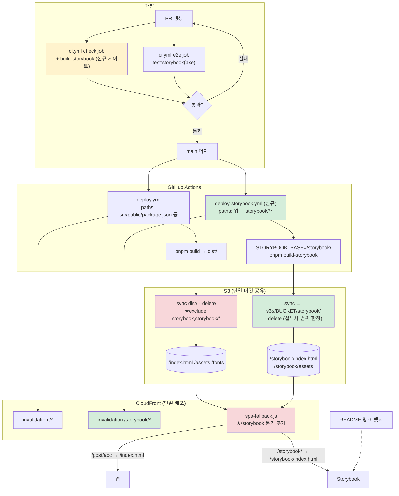

# Storybook 공개 배포 (S3 + CloudFront 재사용)

## Context

"FE를 기반으로 Figma/Zeplin을 구성하자"는 원 요청에서 출발해 조사한 결과, 전제가
바뀌었다. 이 레포는 1인 개발(BAECHAN 단독)에 핸드오프할 디자이너가 없고, Zeplin은
Figma 프레임을 입력으로만 받는 도구라 "코드에서 출발"이 애초에 성립하지 않는다.
Figma 쪽도 무료 Starter 플랜이 변수 모드(variable modes)를 지원하지 않아
([Figma Learn](https://help.figma.com/hc/en-us/articles/15343816063383-Modes-for-variables):
_"Anyone on Education, Professional, Organization, and Enterprise plans can create and
use modes for variables"_) 이 레포의 라이트/다크 2모드 토큰 42개를 무료로는 이식할
수 없고, Professional 유료 시트($12~15/월)를 지금 열 이유도 없다고 판단해 Figma는
이번 범위에서 전면 보류하기로 사용자가 확정했다.

대신 조사 중 더 시급한 구멍이 드러났다: `shared/ui` 43개 컴포넌트가 이미 Storybook
스토리 100%(153개 케이스)를 갖추고 CI에서 axe a11y 게이트까지 통과하고 있는데, 이
자산을 **볼 수 있는 공개 URL이 없다**. `build-storybook` 스크립트와
`@chromatic-com/storybook` addon은 이미 설치돼 있지만 이를 실행하는 배포 워크플로가
0건이라, 로컬에서 `pnpm storybook`을 돌려야만 확인 가능한 상태다. 포트폴리오
목적에서 "디자인-코드 파이프라인을 이해하는 FE"임을 증명하려면, 이미 완성된 이
자산을 공개하는 쪽이 Figma를 새로 구축하는 것보다 비용 대비 효과가 훨씬 크다.

목표: 기존 S3+CloudFront 배포 인프라를 재사용해 Storybook을 `/storybook/` 경로에
공개 호스팅한다. Chromatic·GitHub Pages는 검토 후 기각(§비교 참고). 다크모드 토글
버그(`Navbar.tsx:172`)와 Figma 토큰 이식은 이번 범위에서 제외 — 별도로 처리한다.

## 조사에서 확인한 사실 (재검증 완료)

- `deploy.yml`의 인증은 주석("AWS OIDC 인증을 위해 필수")과 달리 **정적 액세스 키**
  (`AWS_ACCESS_KEY_ID`/`AWS_SECRET_ACCESS_KEY`)다. 이번 계획은 같은 키를 재사용하므로
  IAM 변경 불필요 — 단, DEPLOY.md에는 사실대로 기술한다.
- `deploy.yml:84-88`의 마지막 sync가 `--delete` + 4개 exclude만 가진다. Storybook을
  같은 버킷의 `storybook/` 접두사에 올리면 **다음 FE 배포 때 통째로 삭제된다**
  (exclude 목록에 없으므로).
- `infra/cloudfront-functions/spa-fallback.js`(직접 확인 완료)는 확장자 없는 모든
  요청을 `/index.html`로 리라이트한다 — `/storybook`, `/storybook/` 둘 다 이 조건에
  걸려 **앱 화면으로 리다이렉트된다**. 이 함수는 파이프라인이 배포하지 않는 수동
  관리 자산(AWS CLI로만 갱신, `docs/DEPLOY.md` "CloudFront Function" 절 참고).
- `vite.config.ts:33`에 `base: '/'`가 확인됨. `.storybook/main.ts`(직접 확인 완료)는
  현재 `viteFinal`에서 base를 재정의하지 않아 이 값을 그대로 상속한다 — `/storybook/`
  하위에서 서빙하면 자산 경로가 전부 깨진다.
- `.github/workflows/ci.yml`의 `e2e` job은 `pnpm test:storybook`(dev 서버 기반 axe
  테스트)만 돌리고, 프로덕션 빌드(`build-storybook`)를 PR 단계에서 검증하는 게이트가
  없다.
- 레포는 **공개(public)** — Actions 분(minutes) 무제한 무료, 공개 URL 노출 제약 없음.
- `.gitignore`에 `storybook-static`이 이미 등록됨.

## 대안 비교 (결론: S3 재사용)

| 방식                               | 비용                | 기존 결정과 충돌                                                                                                                                                                            |
| ---------------------------------- | ------------------- | ------------------------------------------------------------------------------------------------------------------------------------------------------------------------------------------- |
| **S3 `/storybook/` 접두사 재사용** | 월 $0.01 미만       | 없음                                                                                                                                                                                        |
| GitHub Pages                       | $0                  | 배포 경로가 2원화, `docs/DEPLOY.md`의 AWS 단일 서사와 어긋남                                                                                                                                |
| Chromatic                          | $0(월 5,000 스냅샷) | `docs/DECISIONS.md` 2026-09-06 "화면 먼저, 그다음 반영" 및 `docs/plans/2026-09-10-e2e-playwright-foundation.md`의 "사후 시각 회귀 미채택" 결정과 충돌 소지 — publish 시 베이스라인이 생성됨 |

S3 재사용이 유일하게 기존 결정과 충돌이 없고 추가 인프라·계정이 필요 없다.

## 실행 계획 (PR 단위)

### PR-1 — FE 배포 가드 (선행 필수)

`deploy.yml` L84-88의 마지막 sync에 exclude 2개 추가:

```
--exclude "storybook" --exclude "storybook/*"
```

**왜 먼저인가**: PR-2가 먼저 머지되면 그 사이 임의의 `src/**` push 한 번이 방금 올린
Storybook을 전부 지운다. 원인 추적이 어려운 유형(배포는 성공, 파일만 사라짐)이라
반드시 가드부터 넣는다.

**검증** — 센티널 + 대조군 dry-run으로 "고쳤다"가 아니라 "원래 깨져 있었고 지금은
아니다"를 둘 다 실측한다:

```bash
# 1. 센티널 투입
printf 'sentinel' | aws s3 cp - s3://$BUCKET/storybook/.sentinel

# 2. 가드 적용 후 dry-run — storybook/ 삭제가 없어야 함
aws s3 sync dist/ s3://$BUCKET --delete \
  --exclude "index.html" --exclude "firebase-messaging-sw.js" \
  --exclude "assets/*" --exclude "fonts/*" \
  --exclude "storybook" --exclude "storybook/*" --dryrun | grep -c 'delete.*storybook/'
# 기대: 0

# 3. 대조군 — 가드 없이 같은 dry-run (문제가 실재했음을 증명)
aws s3 sync dist/ s3://$BUCKET --delete \
  --exclude "index.html" --exclude "firebase-messaging-sw.js" \
  --exclude "assets/*" --exclude "fonts/*" --dryrun | grep 'delete.*storybook/'
# 기대: delete: s3://.../storybook/.sentinel 출력됨

# 4. 머지 후 실제 배포 재실행 + 생존 확인
aws s3 ls s3://$BUCKET/storybook/   # .sentinel 남아있어야 함
```

**롤백**: `git revert` 1커밋. 이 PR은 파일 추가가 없어 부작용 없음.

### PR-2 — 배포 파이프라인 본체 (핵심)

**만드는 파일**:

- `.github/workflows/deploy-storybook.yml` (신규) — 별도 파일로 분리. `deploy.yml`에
  job을 추가하면 `paths` 필터가 워크플로 단위라 `.storybook/**`를 넣는 순간 스토리
  수정만으로 프로덕션 배포 + `/*` 전역 무효화가 함께 돈다. 트리거:
  ```yaml
  on:
    push:
      branches: ['main']
      paths:
        - 'src/**'
        - 'public/**'
        - '.storybook/**'
        - 'package.json'
        - 'pnpm-lock.yaml'
        - 'vite.config.ts'
        - 'postcss.config.js'
        - 'tsconfig*.json'
        - '.github/workflows/deploy-storybook.yml'
    workflow_dispatch:
  ```
  빌드: `STORYBOOK_BASE=/storybook/ pnpm build-storybook` (Firebase 시크릿은 주입하지
  않음 — 공개 산출물이고 `shared/ui` 스토리가 그 모듈을 import하지 않음). 업로드는
  기존 `deploy.yml`과 같은 캐시 철학(해시 없는 `index.html`/`iframe.html`은
  no-cache, 해시 붙은 `assets/`·`fonts/`는 immutable, 나머지는 `max-age=300`) —
  모든 `--delete`를 `storybook/` 접두사 안으로 한정한다. 무효화는 `/storybook/*`만
  (앱 캐시를 건드리지 않기 위해).
- `.storybook/main.ts` — `viteFinal`에 `config.base = process.env.STORYBOOK_BASE ?? '/'`
  추가. `vite.config.ts:33`의 `base: '/'` 상속을 끊는 유일한 지점.
- `infra/cloudfront-functions/spa-fallback.js` — SPA 폴백보다 먼저 `/storybook` 분기:
  ```js
  if (uri === '/storybook' || uri === '/storybook/') {
    request.uri = '/storybook/index.html';
    return request;
  }
  if (uri.indexOf('/storybook/') === 0) {
    return request;
  }
  ```
  (CloudFront Functions는 ES5 — `startsWith` 대신 `indexOf(...) === 0`). AWS CLI로
  수동 배포(기존 관행 유지, `docs/DEPLOY.md` "CloudFront Function" 절 절차 그대로).
- `.github/workflows/ci.yml` — `check` job의 `Build` 스텝 뒤에 `pnpm build-storybook`
  게이트 추가 (dev 서버 기반 `test:storybook`은 `base` 설정 등 프로덕션 빌드 전용
  실패를 못 잡음).
- `docs/DEPLOY.md` — "Storybook 공개 배포" 절 신설(트리거·캐시 정책·수동 재실행·
  롤백), "CloudFront Function" 절에 `/storybook` 분기 서술, `--delete` 가드 문단
  추가. 인증 방식은 있는 그대로("OIDC 아님, 정적 키") 기술.
- `docs/CI-CHECK-GATE.md` — `build-storybook` PR 게이트 1줄 추가.
- `docs/DECISIONS.md` — "2026-09-20 — Storybook 공개 호스팅: S3+CloudFront 재사용
  (Chromatic·GitHub Pages 기각)" 1건 추가. 대안 비교표(§위) 포함.
- `docs/plans/2026-09-20-storybook-public-deploy.md` — 이 계획 파일의 스냅샷,
  PR-2와 같은 커밋 (append-only).

**순서**:

1. 로컬 `pnpm build-storybook` → `ls storybook-static/`로 실제 산출물 구조 확인
   (특히 `fonts/`가 복사되는지 — 안 되면 `staticDirs: ['../public']`을 `.storybook/main.ts`에
   추가). `grep -o 'src="[^"]*"' storybook-static/index.html storybook-static/iframe.html`로
   자산 경로가 `/storybook/...` 형태인지 확인.
2. 위 파일들 커밋 → PR 머지.
3. 워크플로 자동 실행 확인(또는 `workflow_dispatch`로 수동 트리거).
4. **CloudFront Function 배포 전에** `/storybook/index.html`(확장자 있음, 함수 무관하게
   통과)로 파일이 실제로 올라갔는지 먼저 확인.
5. 함수 백업(`aws cloudfront get-function --name link-sphere-spa-fallback --stage LIVE`)
   → 수정본 update → `aws cloudfront test-function`으로 6케이스 검증 → publish.
6. `/storybook/` (트레일링 슬래시, 함수 경유)로 최종 확인.

**test-function 6케이스**:

| 입력 URI                        | 기대 결과               | 의미                   |
| ------------------------------- | ----------------------- | ---------------------- |
| `/post/abc123`                  | `/index.html`           | 기존 SPA 라우팅 무회귀 |
| `/auth/login`                   | `/index.html`           | 기존 무회귀            |
| `/favicon.ico`                  | 그대로                  | 기존 무회귀            |
| `/storybook/`                   | `/storybook/index.html` | 신규                   |
| `/storybook`                    | `/storybook/index.html` | 신규                   |
| `/storybook/assets/iframe-*.js` | 그대로                  | 신규                   |

**검증(종합)**: 브라우저에서 스토리 3개(Button/DesignTokens Colors/ImageViewer) 렌더

- 다크모드 툴바 토글 + DevTools에서 Pretendard 폰트 적용 확인 + 앱 라우트
  (`/post/abc123`) 무회귀 확인.

**롤백**: 3층 분리 — ① 함수는 백업본 재업로드 후 publish(앱 무영향) ② 워크플로는
PR revert + `aws s3 rm s3://$BUCKET/storybook --recursive` + `/storybook/*` 무효화
③ `ci.yml` 게이트만 문제면 그 스텝만 제거.

### PR-3 — 공개 스위치 (작음, 필수)

- `README.md`에 Storybook URL + 워크플로 상태 뱃지 추가, 기존 스크립트 표의
  `pnpm storybook` 행에 공개 URL 병기.
- `CHANGELOG.md` `[Unreleased] > Added`에 `infra` 스코프 1항목(`<details>` 블록 포함,
  `changelog-release` skill 형식 준수).
- (수동, 1회) `gh repo edit --homepage <CloudFront URL>/storybook/`.

**검증**: `pnpm check:docs`(새 md 파일 없음 → `## 문서` 섹션 영향 없음 확인),
`pnpm format:check`, 뱃지 이미지 실제 렌더 확인.

**롤백**: revert 1커밋 (URL 자체는 S3에서 지우면 404).

### PR-4 — 선택 (ROI 낮음, 이번 범위 아님)

다음은 근거만 남기고 이번 계획에서 실행하지 않는다:

- Storybook 랜딩 MDX(프로젝트 소개) — 첫인상 개선, 별도 판단.
- `@chromatic-com/storybook` addon 제거 — 안 쓰는 "Visual Tests" 패널이 방문자에게
  "시각 회귀 미채택" 결정과 모순되게 보일 수 있음.
- `widgets`/`features` 스토리 커버리지 확대(현재 0%) — 비용 큼(MSW·Router·Query
  데코레이터 선행 필요), 별도 라운드.

## 이번 범위에서 제외 (근거)

- **Figma 토큰 레이어**: 무료 플랜이 variable modes 미지원 → 사용자 결정으로 보류.
- **`Navbar.tsx:172` 다크모드 토글 버그**: `next-themes.setTheme()`을 우회해
  새로고침 시 테마 유실 + `sonner.tsx`의 `useTheme()`와 DOM 상태 불일치. Figma와
  무관한 별도 버그 수정 세션으로 분리(사용자 확정). 공개 Storybook의 테마 토글은
  `.storybook/preview.tsx`의 독립 구현이라 이 버그의 영향을 받지 않음.
- **`deploy.yml`의 OIDC 전환**: 정적 키→OIDC는 IAM 역할 신설이 필요한 별개 작업.

## 전체 흐름



빨간색 = 기존 프로덕션 자산 수정(회귀 위험, 검증 필수) / 초록색 = 신규 / 노란색 =
기존 CI 보강.

## 비용

| 항목                                   | 월 비용           |
| -------------------------------------- | ----------------- |
| S3 스토리지(25~40MB)                   | $0.001 미만       |
| S3 PUT(배포당 300~500 객체)            | 배포당 $0.0025    |
| CloudFront 전송(무료 티어 1TB/월 이내) | $0                |
| CloudFront 무효화(월 1,000개 무료)     | $0                |
| GitHub Actions(퍼블릭 레포 무제한)     | $0                |
| **합계**                               | **월 $0.01 미만** |
