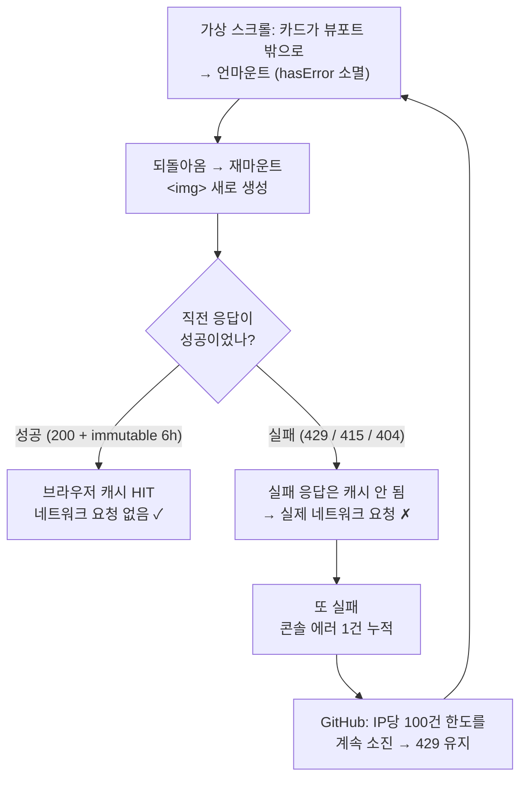

# 썸네일 실패 URL 세션 캐시 — 콘솔 에러 누적 / 외부 rate limit 소진 차단

## Context

배포 사이트 콘솔에 `GET https://opengraph.githubassets.com/.../claude-skills-collection 429 (Too Many Requests)`가
찍혀 원인을 조사했다. 조사 결과 **에러 자체는 우리 코드 버그가 아니라 GitHub OG 이미지
서버의 rate limit**이었지만, 그 한도를 계속 소진시키는 증폭 루프가 우리 쪽에 있었다.

### 확인한 사실 (직접 측정, 2026-09-20)

1. **구조**: og:image는 BE(Jsoup)가 URL 문자열만 DB에 저장하고, 실제 이미지 바이트는
   브라우저가 제3자 CDN에 직접 요청한다. 프록시·재호스팅이 없다. 렌더러는
   `src/shared/ui/atoms/link-thumbnail.tsx` 하나뿐이다.

2. **GitHub OG 서버 응답 헤더** (`curl`로 직접 측정):

   ```
   x-ratelimit-limit: 100                             ← IP당 100건 한도
   cache-control: public, max-age=21600, immutable    ← 성공 응답은 6시간 캐시
   ```

3. **전수 측정**: 게시물 전체의 고유 `ogImage` 124개를 Referer 없이 호출한 결과
   200이 115건, 리다이렉트 6건(브라우저 자동 추종 → 실제 성공), 실제 실패 3건
   (daumcdn 415 2건 — 서명 `expires` 만료 / i9.ytimg.com 404 1건).
   `opengraph.githubassets.com`은 전체에서 **5건뿐이고 측정 시점엔 전부 200**이었다
   → 429는 상시가 아니라 간헐적이다.

4. **증폭 루프 (이번에 고칠 대상)**: `link-thumbnail.tsx:21`의 `hasError`는 컴포넌트
   로컬 `useState`라 언마운트되면 사라진다. 피드는 가상 스크롤(`usePostList.ts:114`,
   `useWindowGridVirtualizer`)이라 뷰포트를 벗어난 카드가 DOM에서 제거되고, 되돌아오면
   ``가 새로 생성된다.
   - 성공 응답은 `immutable` 캐시 히트 → 네트워크 요청 없음
   - **실패 응답(429/415/404)은 캐시되지 않아 재마운트마다 실제 요청이 나간다**

   실측(프로덕션 Playwright): 피드를 위아래 6회 왕복시키자 415 URL **2개**가 **9번**
   에러를 냈고 콘솔 에러가 2→9건 누적됐다. 성공 URL들은 같은 왕복에도 콘솔 에러 0건.



### 목표

같은 세션에서 **2회 실패한 URL은 재마운트 시 ``를 아예 만들지 않고 바로
폴백(`ImageOff`)을 보여준다.** 네트워크 재요청이 사라져 콘솔 에러 누적과 rate limit
소진이 함께 멈춘다.

### 이번에 하지 않는 것 (범위 밖)

- **상시 실패 3건**(daumcdn 415 2건, ytimg 404 1건)은 BE DB에 저장된 만료 URL이라
  FE만으로 못 고친다 — 재크롤링이 필요하고 BE 레포 변경 대상이다.
- **BE 이미지 프록시**: 근본 해결에 가깝지만 외부 한도가 사용자 IP → 서버 IP로 옮겨가
  전체 사용자 공유 한도가 되는 새 문제가 생긴다. 별도 검토 주제.

---

## 설계 결정

### 1. 저장 위치 — 모듈 레벨 `Map<string, number>`

`src/shared/lib/image/failedImageCache.ts` (신규). 선례는
`src/shared/lib/virtual/virtual-snapshot.ts` — 모듈 상수 `MAX_SNAPSHOTS = 8`(:4) +
bare function export + 오래된 것부터 축출(:65-79)이 이미 같은 형태다.

Zustand(`shared/store/`)를 쓰지 않는 이유: 이건 사용자/앱 상태가 아니라 렌더링
세부사항이고, 훅이라 `link-thumbnail.tsx:31`의 `if (!src) { return null; }` 가드절
위로 `httpsSrc` 계산을 올려야 해서 §3(최소 범위)에 불리하다. 반응성이 실제로 필요한
시나리오도 없다 — 같은 URL의 다른 인스턴스는 자기 `onError`로 같은 결과에 도달한다.

`shared/utils/`가 아닌 `shared/lib/`인 이유: FE-ARCHITECTURE §23의 `XUtil` 클래스
규약은 순수 함수용인데 이건 상태를 가진 모듈이다. 같은 성격의 `virtual-snapshot.ts`가
이미 `shared/lib/`에 있다.

### 2. 차단 임계값 — 2회 (사용자 승인 완료)

``의 `onError`는 **상태 코드를 주지 않아** 429(일시)와 415/404(영구)를 구분할 수
없다. 그래서 "몇 번 만에 포기할지"를 정해야 한다. 실측(왕복 6회, 실패 URL 2개) 기준:

|                        | 네트워크 요청 | 콘솔 에러 | 일시적 실패 회복                 |
| ---------------------- | ------------- | --------- | -------------------------------- |
| 현재                   | 9회           | 9건       | 스크롤할 때마다 (= 문제의 원인)  |
| 1회 즉시 차단          | 2회           | 2건       | 불가 — 새로고침 전까지 폴백 고정 |
| **2회 후 차단 (채택)** | **4회**       | **4건**   | **1회 가능**                     |

모바일에서 순간적으로 신호가 끊겼을 때 그 화면의 썸네일이 세션 내내 죽는 것을 막기
위해 회복 기회 1회를 남긴다. 요청 감소 효과는 100건 한도 대비 양쪽 다 안전권이다.

### 3. 영구성 — 세션 한정, TTL 없음

localStorage/sessionStorage에 남기지 않는다. 일시적 실패(429)가 영구 사망으로 굳고,
"새로고침하면 회복"이라는 유일한 탈출구가 사라진다. TTL도 두지 않는다 — 상태 코드를
못 보는 이상 T값은 전부 추측이고, 만료 재시도가 rate limit 회복과 경쟁한다. 새로고침·
새 탭이면 모듈이 다시 평가돼 비워진다.

### 4. 메모리 상한 — 500개 FIFO

무한 스크롤은 상한이 없는 구조다. `Map`은 삽입 순서를 보존하므로 가장 오래된 항목부터
버린다(`virtual-snapshot.ts`의 `MAX_SNAPSHOTS` 선례). 실패 URL 1개 ≈ 100~200바이트라
500개라도 ~100KB다.

### 5. 캐시 키 — http→https 치환 **후** 값

`link-thumbnail.tsx:38`의 `httpsSrc`를 키로 쓴다. 브라우저가 실제로 요청한 URL과
키가 일치하고, `http://x/a.png`와 `https://x/a.png`가 같은 항목으로 합쳐지는 덤이 있다.

---

## 변경할 파일

| 파일                                                              | 변경 요지                                                                                                                                                                                                             |
| ----------------------------------------------------------------- | --------------------------------------------------------------------------------------------------------------------------------------------------------------------------------------------------------------------- |
| `src/shared/lib/image/failedImageCache.ts` (신규)                 | `Map<string, number>` + `hasImageFailed` / `recordImageFailure` / `resetFailedImages`, 임계값 2, 상한 500 FIFO. 왜 세션 한정·왜 2회인지를 파일 상단 JSDoc에 측정 수치와 함께 기록                                     |
| `src/shared/ui/atoms/link-thumbnail.tsx`                          | import 1줄 / `httpsSrc`(38줄) 아래에 `showFallback` 파생값 / 42줄 분기 조건 교체 / 56줄 `onError`에서 카운트 기록 후 `setHasError(true)`. **12-18줄 주석·24-29줄 effect·41줄 컨테이너·47-55줄 `` 속성은 무변경** |
| `src/test/setup.ts`                                               | `resetFailedImages` import + `afterEach`에 호출 1줄 (기존 `resetPendingSearchParams()` 바로 아래, :15)                                                                                                                |
| `src/shared/ui/atoms/link-thumbnail.test.tsx`                     | 아래 4케이스 추가                                                                                                                                                                                                     |
| `src/shared/lib/image/failedImageCache.test.ts` (신규)            | 아래 4케이스                                                                                                                                                                                                          |
| `src/shared/ui/atoms/link-thumbnail.stories.tsx`                  | `LoadFailed`(40-41줄) 주석에 세션 캐시 동작 한 줄 추가 (코드 무변경)                                                                                                                                                  |
| `CHANGELOG.md`                                                    | `[Unreleased]`에 `fix` 항목 1건 (`changelog-release` skill 포맷)                                                                                                                                                      |
| `docs/plans/2026-09-20-thumbnail-failure-session-cache.md` (신규) | 이 계획 스냅샷 — 구현 코드와 같은 PR에 커밋, 이후 수정 금지                                                                                                                                                           |

`docs/FE-ARCHITECTURE.md`·`README.md` 갱신 불필요 (§3 트리가 `image/`를 폴더 단위로만
적고 있음). BE 문서 무관 (FE 렌더링 한정, API 계약 무변경).

### 기존 동작 보존 (전부 유지)

`src` 변경 시 에러 리셋(24-29줄) / http→https 치환(38줄) / `referrerPolicy="no-referrer"`(55줄)
/ `aspect-video` 자리 보존(41줄) / `loading="lazy"`·`decoding="async"`(51-52줄).

> **`setHasError(true)`를 지우지 말 것** — 모듈 `Map`은 반응형이 아니므로, 실패 즉시
> 이 인스턴스를 폴백으로 바꾸는 리렌더 트리거는 여전히 이 state다. 캐시 기록만 하면
> 화면이 안 바뀐다. 해당 줄에 이유 주석을 남긴다.

---

## 핵심 로직 스케치

```typescript
const MAX_TRACKED_FAILED_IMAGES = 500;
const FAILURES_BEFORE_BLOCK = 2;

const imageFailureCounts = new Map<string, number>();

export function hasImageFailed(src: string): boolean {
  return (imageFailureCounts.get(src) ?? 0) >= FAILURES_BEFORE_BLOCK;
}

export function recordImageFailure(src: string): void {
  imageFailureCounts.set(src, (imageFailureCounts.get(src) ?? 0) + 1);

  if (imageFailureCounts.size <= MAX_TRACKED_FAILED_IMAGES) {
    return;
  }

  // Map은 삽입 순서를 보존한다 - 첫 항목이 가장 오래 전에 실패한 URL이다
  const oldest = imageFailureCounts.keys().next().value;

  if (oldest === undefined) {
    return;
  }

  imageFailureCounts.delete(oldest);
}

/** 테스트 격리용 - src/test/setup.ts의 afterEach에서 호출한다 */
export function resetFailedImages(): void {
  imageFailureCounts.clear();
}
```

> TS 주의: `tsconfig.app.json`이 `noUncheckedIndexedAccess: true`라
> `keys().next().value`가 `string | undefined`로 잡힌다 — `undefined` 가드가
> `pnpm type-check` 통과에 필요하다.

`link-thumbnail.tsx` 변경부:

```tsx
const httpsSrc = src.replace(/^http:\/\//, 'https://');

// 이번 세션에 이미 2회 실패한 URL은 를 아예 만들지 않는다 - 만들면 실패 응답은
// 캐시되지 않아 재마운트마다 진짜 요청이 나간다(failedImageCache.ts 상단 주석 참고)
const showFallback = hasError || hasImageFailed(httpsSrc);
```

```tsx
          onError={() => {
            recordImageFailure(httpsSrc);
            // 캐시는 반응형이 아니다 - 지금 떠 있는 이 인스턴스를 폴백으로 바꾸려면
            // state 갱신이 함께 필요하다(이 줄을 지우면 실패해도 화면이 안 바뀐다)
            setHasError(true);
          }}
```

---

## 테스트

### `src/test/setup.ts` 초기화 — 격리 목적 (즉시 깨짐 방지가 아님)

임계값이 2라서 기존 테스트는 **깨지지 않는다** — 테스트 3번(:31)이 `broken.png`를
1회만 실패시키므로 테스트 4번(:40)이 같은 URL로 렌더할 때 count=1 < 2라 ``가
정상 생성되고 :42의 `getByRole('img')`가 통과한다. 그래도 초기화를 넣는 이유는
아래 신규 테스트들이 2회 실패를 만들어 누수시키기 때문이고, 선례
(`setup.ts:6,15`의 `resetPendingSearchParams`)대로 전역 `afterEach`에 두면 나중에
다른 파일에서 썸네일을 렌더해도 자동으로 보호된다.

Storybook 프로젝트(`.storybook/vitest.setup.ts`)에는 추가하지 않는다 — 스토리
테스트는 img 존재를 단언하지 않고 a11y만 검사한다.

### `link-thumbnail.test.tsx` 추가 4케이스

기존 스타일 유지 (`renderWithProviders` + `fireEvent.error` + 한글 `it` 문구 + 이유 주석).

1. `같은 src가 두 번 실패하면 재마운트 시 img를 아예 만들지 않는다`
   — render → error → unmount → 같은 src로 render → error → unmount → 다시 render →
   `container.querySelector('img')`는 `null`, `svg` 존재. **핵심 회귀 가드** (가상 스크롤
   재마운트의 단위 테스트 대역)
2. `한 번만 실패한 src는 재마운트 시 다시 시도한다`
   — render → error → unmount → 같은 src로 render → img 존재. **임계값 2의 가드**
3. `실패하지 않은 다른 src는 이전 실패의 영향 없이 img를 렌더한다`
   — `broken.png` 2회 실패 후 `other.png` 렌더 → img 존재. (CommentEditForm에서 URL을
   고쳤을 때 막히면 안 된다는 요구의 가드)
4. `http src의 실패는 https로 치환된 키로 기록된다`
   — `http://example.com/a.png`로 2회 실패 → `https://example.com/a.png`로 렌더 →
   img 없음. (키 정규화 단언)

### `failedImageCache.test.ts` 신규 4케이스

(`virtual-snapshot.test.ts` 스타일)

- `1회 실패한 URL은 아직 차단 대상이 아니다`
- `2회 실패한 URL은 차단 대상이다`
- `reset 후에는 모든 기록이 사라진다`
- `상한 500개를 넘으면 가장 먼저 기록된 URL부터 지워진다` — 501개 루프 후 0번은 false,
  500번은 true (`virtual-snapshot.test.ts:66`이 상수를 export하지 않고 루프 횟수를
  하드코딩한 선례를 따름)

---

## 호출부 영향 점검 (CLAUDE.md §5)

캐시 키는 **게시글/댓글 URL이 아니라 og:image URL**이라는 점이 판단의 축이다.

| 호출부                                      | 영향                                                                                                                                                                                                                                                                      |
| ------------------------------------------- | ------------------------------------------------------------------------------------------------------------------------------------------------------------------------------------------------------------------------------------------------------------------------- |
| `PostCard.tsx:215` (`post.ogImage`)         | **의도한 변화**: 2회 실패 후 재마운트 시 폴백 즉시. 카드 높이 동일(`aspect-video`)이라 가상 스크롤 행 높이 추정(`POST_GRID_ROW_HEIGHT_ESTIMATE`)에 영향 없음                                                                                                              |
| `CommentItem.tsx:97`                        | 동일. 삭제된 댓글은 `!isDeleted` 가드로 썸네일 자체가 안 뜸                                                                                                                                                                                                               |
| `CommentEditForm.tsx:109` (실시간 미리보기) | **막히지 않는다** — 사용자가 본문 URL을 고치면 BE 메타데이터가 다시 내려와 `ogImage`(= `src`)가 달라지고 캐시 키도 달라진다. 위 테스트 3번이 가드. 막히는 유일한 경우는 og:image URL이 글자 그대로 동일할 때인데, 그건 원본 사이트가 정하는 값이라 재시도해도 결과가 같다 |

전역 캐시라 세션 내 여러 화면이 실패 정보를 공유한다(피드에서 실패한 URL이 상세·댓글
미리보기에서도 즉시 폴백) — 같은 URL에 대한 중복 요청도 함께 없애므로 의도한 이득이다.

---

## 구현 순서

1. `node -v`가 v24인지, `git log origin/main..main`에 미푸시 커밋이 없는지 확인 →
   `EnterWorktree` → `cp ../../../.env .` + `pnpm install`
2. `failedImageCache.ts` + 테스트 작성 → `pnpm test`로 단독 통과 확인
3. `link-thumbnail.tsx` 수정 → `src/test/setup.ts` 초기화 추가
4. `link-thumbnail.test.tsx` 4케이스 추가
5. stories 주석 갱신 → `pnpm test:storybook`으로 a11y 회귀 없음 확인
6. `pnpm check` (type-check + lint + format:check) → `pnpm test`
7. `browser-verification` skill 절차로 브라우저 확인 녹화
8. CHANGELOG `[Unreleased]` + `docs/plans/` 스냅샷 → `.gitmessage` 형식으로
   `git commit -- <경로들>` (`git add` 금지)
9. PR 본문에 `## 계획 대비 구현` 섹션 (CLAUDE.md §11 — fresh Explore subagent로 대조)

---

## 검증

### 명령

```bash
pnpm type-check      # 필수
pnpm test            # 기존 4케이스 + 신규 8케이스
pnpm lint            # import 추가했으므로 레이어 경계 확인
pnpm format:check
pnpm test:storybook  # LoadFailed가 여전히 폴백을 렌더하는지
```

### 로컬 재현 (프로덕션 조건을 인위적으로 만듦)

`pnpm dev` + Playwright MCP로 데스크톱 폭에서 피드를 열고, 앱 도메인이 아닌 이미지
요청만 `abort()`로 실패시킨다. 그 상태로 피드를 위아래 6회 왕복시킨 뒤:

- `browser_network_requests`의 해당 og 호스트 요청 수 = **고유 실패 URL 수 × 2**
  (왕복 횟수와 무관하게 URL당 최대 2회)
- `browser_console_messages` 에러 건수가 3회째 왕복부터 **증가하지 않아야** 함
- 카드 높이/스크롤 위치가 왕복 전후 동일 (레이아웃 시프트 회귀 없음)

### 프로덕션 확인 (배포 후)

같은 계측을 프로덕션에서 반복해 **"왕복 6회 → 415 URL 2개가 9회 에러"가 "4회"로
줄었는지** 대조한다. 배포 전/후 같은 절차로 직접 측정한 값을 기록한다(§10).

---

## 회귀 위험

| #   | 위험                                                          | 영향                                                                    | 완화                                                                                         |
| --- | ------------------------------------------------------------- | ----------------------------------------------------------------------- | -------------------------------------------------------------------------------------------- |
| 1   | 일시적 네트워크 포화 중 2회 연속 실패 → 세션 내내 폴백 고정   | UX 후퇴 (사용자 승인됨 — 회복 기회 1회로 완화한 결과)                   | 새로고침으로 회복                                                                            |
| 2   | `setHasError(true)`를 "캐시가 있으니 불필요"라며 나중에 제거  | 실패해도 화면이 안 바뀜                                                 | 해당 줄 이유 주석 + 기존 테스트 3번이 잡음                                                   |
| 3   | 모듈 스코프 상태를 렌더 중에 읽음 (React 18 순수성)           | 실사용 영향 낮음 — 값이 단방향 증가이고 쓰기는 이벤트 핸들러에서만 발생 | 렌더 본문에서 `recordImageFailure`를 절대 호출하지 말 것. 반응성이 필요해지면 Zustand로 승격 |
| 4   | `src/test/setup.ts` 초기화 누락                               | 신규 테스트끼리 상태 누수                                               | `pnpm test`가 잡음                                                                           |
| 5   | Storybook `LoadFailed` 왕복 시 3회째부터 네트워크 시도 사라짐 | 개발자 혼동만                                                           | 스토리 주석에 명시                                                                           |
| 6   | 축출(500개 초과)로 오래된 URL이 재요청                        | 무시 가능                                                               | 상한 상향은 상수 한 줄                                                                       |
