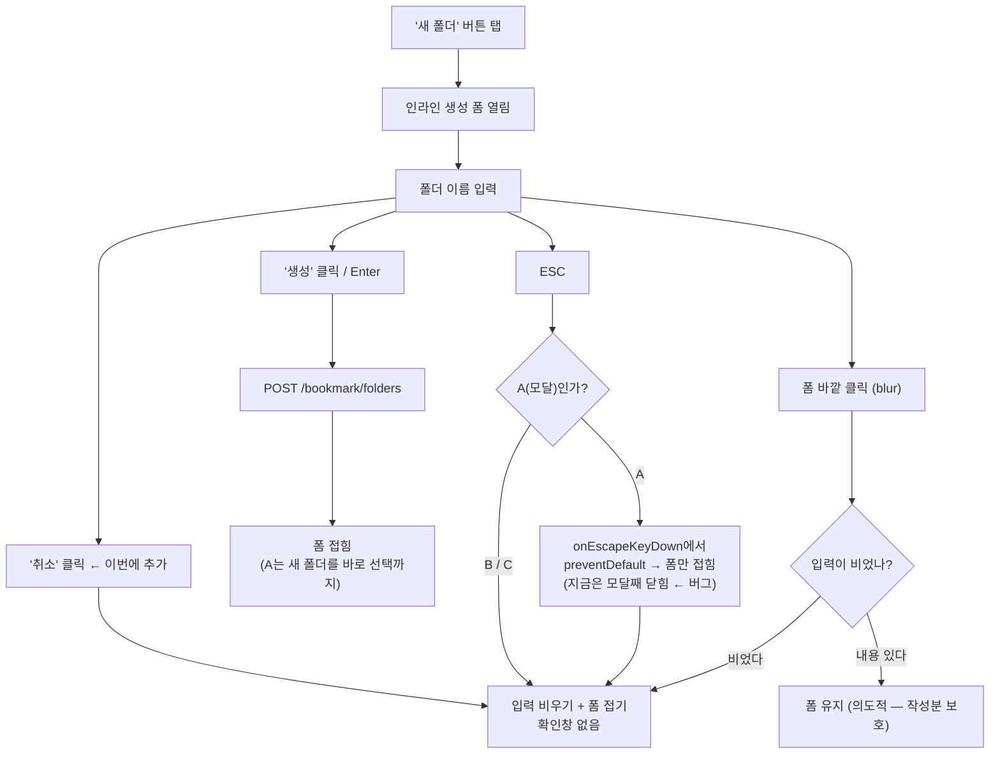

# 북마크 "새 폴더 만들기"에 취소 버튼 추가 + ESC가 모달을 닫는 버그 수정

## Context

북마크에서 새 폴더를 만들 때, 이름을 한 글자라도 입력하고 나면 그만둘 방법이 사실상
없다. 세 곳의 인라인 생성 폼이 공유하는 `handleBlur`가 `if (!name) { onClose(); }`
이라 입력이 있으면 blur로도 안 닫히고, 화면에는 취소 버튼이 없다.

| #     | 위치                                                                                          | 뷰포트                                        | 지금 빠져나가는 방법                   |
| ----- | --------------------------------------------------------------------------------------------- | --------------------------------------------- | -------------------------------------- |
| **A** | `src/features/bookmark/select/ui/BookmarkFolderSelectModal.tsx:106-158` (북마크 저장 모달 안) | 모바일 바텀시트 + 데스크톱 중앙 모달 **공용** | ESC뿐 — 그런데 모달 전체가 같이 닫힌다 |
| **B** | `src/widgets/bookmark/folder-tree/ui/FolderTree.tsx:293-318` (`InlineCreateFolderInput`)      | 데스크톱 사이드바(`w-60` = 240px)             | ESC뿐 (마우스만 쓰면 0개)              |
| **C** | `src/widgets/bookmark/folder-tree/ui/MobileFolderList.tsx:188-229` (`CreateFolderCard`)       | 모바일 폴더 카드 그리드                       | **없음** — 모바일엔 ESC 키가 없다      |

사용자가 확정한 범위: **3곳 전부**, 취소는 **확인창 없이** 즉시 입력을 버리고 폼을
접는다, **ESC 버그도 같이 고친다**.

### 전체 흐름



## 왜 이 모양인가 (근거)

NN/g는 이 문제에 서로 반대 방향의 말을 한다. 그래서 "취소를 넣는다"만으로는 부족하고
**위계**가 설계의 핵심이다.

- [Aurora Harley, "Cancel vs Close" (NN/g, 2019-09-01)](https://www.nngroup.com/articles/cancel-vs-close/)
  — _"This is why it's critical to also include a separate Cancel button, to give users
  an out rather than forcing them to only save and close the view."_
- [Jakob Nielsen, "Reset and Cancel Buttons" (NN/g, 2000-04-15)](https://www.nngroup.com/articles/reset-and-cancel-buttons/)
  — _"The worst problem about Reset is that users click the button by mistake when they
  wanted to click Submit."_ 버튼이 둘이면 _"makes it harder for users to clearly see
  their next step."_

→ **취소를 넣되 시각적 위계를 확실히 낮춘다.** 취소 `variant="ghost"`(무채색), 생성
`variant="default"`(primary 채움). 레포 선례가 이미 그 형태다 —
`src/features/comment/create/ui/CommentForm.tsx:162-173`,
`src/features/comment/update/ui/CommentEditForm.tsx:132-163`.

순서는 **취소 왼쪽 / 생성 오른쪽**.
[Jakob Nielsen, "OK-Cancel or Cancel-OK?" (NN/g, 2008-05-26)](https://www.nngroup.com/articles/ok-cancel-or-cancel-ok/)
의 결론이 "플랫폼 관례를 따르라"인데 여기서 관례는 이 레포다 — `Alert.tsx:95-108`,
`CommentForm.tsx`, `CommentEditForm.tsx` 셋 다 취소가 왼쪽.

**모바일만 X 아이콘으로 줄이지 않는다.** Harley 2019가 직접 반대하고(_"The main issue
lies with the common lack of a text label for the X icon."_), A의 모바일 바텀시트는
헤더에 이미 X가 있다(`BookmarkFolderSelectModal.tsx:85-93`).
[Budiu·Behnam·Moran, "Accidental Dismissal of Overlays" (NN/g, 2022-09-18)](https://www.nngroup.com/articles/accidental-overlay-dismissal/)
는 X가 효과적인 조건에 단서를 단다 — _"provided that no other Close buttons were also
shown on the screen"_.

**확인창은 안 띄운다.** 폴더 이름 한 줄은 손실이 미미한 반면 확인창은 Nielsen 2000의
_"The extra choice requires extra thinking"_ 비용을 그대로 물린다. `CommentForm.tsx`도
확인 없이 비운다.

## 구현

### 0단계 — 시각 미리보기 먼저 (CLAUDE.md §9)

**코드를 고치기 전에** 실제 Tailwind 클래스와 `globals.css` 토큰을 그대로 쓴 Artifact
페이지를 만들어 A/B/C 세 곳의 before/after를 나란히 배치하고 승인을 받는다. 라이트·다크,
375px·데스크톱 폭을 함께 보여준다. 승인 전에는 1단계를 시작하지 않는다.

B는 폭 실측 때문에 2줄이 강제되는데(아래), 그래도 실물 확인 대상이다 — 사이드바가
세로로 커지는 모습은 숫자로 판단할 수 없다.

### 1단계 — 훅에 취소 핸들러 추가

CLAUDE.md의 "로직은 `hooks/`, `ui/`는 JSX만" 규약을 따른다. A는 지금
`BookmarkFolderSelectModal.tsx:126-127`이 UI에서 `setCreatingMode(false); setNewFolderName('')`
를 직접 조립 중이라 이미 규약에서 벗어나 있고, 취소 버튼이 붙으면 같은 2줄이 한 곳 더
생긴다.

| 파일                                                                                               | 추가                                                                                                                 |
| -------------------------------------------------------------------------------------------------- | -------------------------------------------------------------------------------------------------------------------- |
| `src/features/bookmark/select/hooks/useBookmarkFolderSelect.ts` (return은 `:116-132`)              | `handleCancelCreate` = `setCreatingMode(false)` + `setNewFolderName('')`                                             |
| `src/widgets/bookmark/folder-tree/hooks/useFolderTree.ts` (`useInlineCreateFolderInput`, `:58-88`) | `handleCancel` = `setName('')` + `onClose()`. `:69-71` ESC 분기를 이 함수 호출로 교체                                |
| `src/widgets/bookmark/folder-tree/hooks/useMobileFolderList.ts` (`useCreateFolderCard`, `:9-45`)   | `handleCancel` = `setCreating(false)` + `setName('')`. `:23-26` ESC 분기 본문과 **완전히 동일**하므로 진짜 중복 제거 |

`useCreateFolderForm.ts`는 건드리지 않는다 — 생성 mutation 코어만 담당하고 폼 열림/닫힘
상태는 호출부 훅이 갖는다.

### 2단계 — blur/click 경합 방어 (B/C만)

B/C에서 **입력이 빈 상태로** 취소를 누르면 `mousedown → blur → 폼 언마운트 → click 유실`
순서라 `onClick`이 실행되지 않는다(`useFolderTree.ts:74-78`, `useMobileFolderList.ts:29-33`).
A는 Input에 `onBlur`가 없어 해당 없다.

지금은 blur가 하는 일과 취소가 하려던 일이 같아 **사용자 눈에는 차이가 없다.** 그래도
고치는 이유: ① 나중에 취소에 로직이 붙으면 조용히 안 돌고 ② 테스트가 잘못된 이유로
통과해 회귀를 못 잡는다.

→ 취소 버튼에 `onMouseDown={(e) => e.preventDefault()}`. 이유를 주석으로 남긴다.

검토한 대안과 탈락 이유:

| 안                                      | 탈락 이유                                                                                                                                                                                                            |
| --------------------------------------- | -------------------------------------------------------------------------------------------------------------------------------------------------------------------------------------------------------------------- |
| `handleBlur`에서 `e.relatedTarget` 확인 | 훅 시그니처가 바뀌어 기존 테스트 4개(`useFolderTree.test.ts:93,103`, `useMobileFolderList.test.ts:99,109`)가 깨지고, iOS Safari는 탭으로 `<button>`에 포커스를 주지 않아 `relatedTarget`이 `null`이 되어 가드가 무효 |
| blur 핸들러 자체 제거                   | "빈 폼이 바깥 탭으로 접힌다"는 기존 동작이 사라짐 — 승인받지 않은 체감 회귀                                                                                                                                          |

> `onMouseDown` preventDefault가 iOS Safari 실기에서 blur를 막는지는 **이 환경에서
> 확인하지 못했다**(에디터 툴바에서 널리 쓰이는 패턴이라는 건 사실이나 직접 측정값은
> 아니다 — CLAUDE.md §10). 다만 막히지 않아도 blur 경로가 같은 결과를 내므로 안전하게
> 열화된다. 4단계 브라우저 검증에서 확인한다.

**이 레포에 선례가 없다** — `onBlur`는 6곳 있지만 blur-close 입력 옆에 버튼이 붙은
사례는 0건이다(CLAUDE.md §6 기준 "본뜰 파일 없음"에 해당).

### 3단계 — JSX 반영 (0단계 승인안대로)

공통: `variant="ghost" size="sm"`, **생성 버튼 왼쪽**, 문구는 기존
`TEXTS.buttons.cancel`(`texts.ts:67`, `'취소'`) — 새 TEXTS 키를 만들지 않는다.
생성 진행 중(`isPending`/`isCreating`)에는 취소도 `disabled`.

**A — 1줄 유지.** `max-w-sm`(384px) 기준 입력 텍스트 영역 160px, 모바일 375px에서도
153px로 넉넉하다. flex 자식이 3→4개로 늘어나므로 `FolderPlus` 아이콘에 `shrink-0`을
추가한다(이 변경 때문에 생긴 필요라 §3 범위 안).

**B — 2줄로 바꾼다.** 1줄이면 `240 − 16 − 8 − 104 = 112px`, 여기서 `Input`의
`pl-3 pr-8` + border가 46px을 먹어 텍스트 영역이 **66px**만 남는다. placeholder
`'새 폴더 이름'`이 ~77px라 **잘린다.** 입력을 위, `[취소][생성]` 행을 아래로 나누면
텍스트 영역 178px. `CreateFolderInput`은 `<aside>`의 마지막 자식(`FolderTree.tsx:104`)
이라 세로로 커져도 아래를 밀지 않는다.

> ⚠️ **`className="h-7 flex-1"` → `"h-7 w-full"`로 반드시 바꾼다.** `flex-col`에서
> `flex-1`은 세로 축에 걸려 입력이 세로로 늘어난다.

**C — 버튼을 가로 행으로.** 이미 `flex flex-col gap-2`이므로 `<div className="flex gap-2">`
안에 두 버튼을 `flex-1`로 넣는다. 세로 스택은 카드가 120→156px이 되어 `grid` row 전체가
늘어나고 옆 `FolderCard`까지 커진다. 375px 기준 버튼 각 66px로 충분하다.

**터치 타깃 44px은 적용하지 않는다.** A/C의 기존 `생성` 버튼이 이미 32px·28px이라
취소만 44px로 올리면 짝이 안 맞고, 둘 다 올리는 건 요청 범위 밖 시각 변경이다. 이
레포는 `docs/DECISIONS.md:2103-2113`에서 **같은 트레이드오프를 이미 사용자 승인으로
결정**했다 — 칩 높이 44px→28px 되돌림, WCAG 2.2 AA(SC 2.5.8) 24px은 충족하고 AAA
44px과 `responsive-ux` 스킬 자체 규약은 포기. 그 선례를 따라 기존 버튼과 높이를
맞춘다. B는 데스크톱 전용이라 애초에 대상이 아니다.

### 4단계 — A의 ESC가 모달째 닫는 버그 (별도 커밋)

**확인한 사실**: `node_modules/@radix-ui/react-use-escape-keydown/dist/index.mjs`가
`ownerDocument.addEventListener("keydown", handleKeyDown, { capture: true })`로 document
capture 단계에 붙는다. React 18은 `src/main.tsx:23`에서 `#root`에 붙는다. 캡처 순서상
**Radix가 항상 먼저** 실행되므로 Input의 `onKeyDown`에서 `stopPropagation()`을 해도
소용없다(`stopImmediatePropagation()`도 마찬가지).

→ `SheetDialogContent`에 `onEscapeKeyDown`을 넘긴다. `SheetDialogContent.tsx:31`이
`...props`를 그대로 `DialogContent`로 전달하고, `dialog.tsx:60-69`가 자기 IME 가드를
먼저 돌린 뒤 `onEscapeKeyDown?.(e)`를 호출한다.

```tsx
onEscapeKeyDown={(e) => {
  if (!creatingMode) {
    return;
  }
  e.preventDefault();
  handleCancelCreate();
}}
```

IME 충돌 없음 — `dialog.tsx:64-67`의 `if (e.isComposing) { e.preventDefault(); return; }`
가 먼저 돌고 `return`하므로 조합 중 ESC에서는 이 핸들러가 호출되지 않는다.
`creatingMode`가 false면 즉시 `return`하므로 **기존 "ESC로 모달 닫기"는 그대로 보존**된다.

이 수정을 하면 `BookmarkFolderSelectModal.tsx:125-128`의 Input 내 ESC 분기가 고아가
된다 → CLAUDE.md §3에 따라 삭제하고 ESC 소유권을 Dialog 레벨 한 곳으로 모은다. 부수
효과로 포커스가 Input 밖(폴더 행 등)에 있어도 ESC가 폼을 접게 되어 지금보다 일관된다.

## 영향 범위 점검 (CLAUDE.md §5)

**기존 테스트 — 5개 파일 전부 확인, 깨지는 것 0개**

`PostCardBookmarkFolderModal.test.tsx`(`creatingMode`에 진입하는 케이스 없음),
`PostCreateBookmarkFolderField.test.tsx`(`:219`의 `getByRole('button', { name: '생성' })`
은 `'취소'`와 이름이 달라 충돌 없음), `useCreateFolderForm.test.ts`(해당 훅 미변경),
`useFolderTree.test.ts`, `useMobileFolderList.test.ts`(ESC·blur 단언이 `handleCancel`
경유로 바뀌어도 동일). e2e 3개 파일에 폴더 **생성** 플로우를 다루는 케이스가 없고,
`shared/ui`를 안 건드리므로 Storybook 의무도 없다.

**새로 추가할 테스트 3건**

1. `useFolderTree.test.ts` — 취소하면 입력을 버리고 `onClose`를 호출한다
2. `useMobileFolderList.test.ts` — 취소하면 `creating === false`, `name === ''`
3. `PostCreateBookmarkFolderField.test.tsx` — **ESC 회귀 테스트**(가장 가치 높음):
   새 폴더 입력 중 ESC → `getByRole('dialog')`는 남아 있고 입력만 사라진다.
   `src/features/auth/login/ui/LoginModal.test.tsx:67-78`이 `user.keyboard('{Escape}')`로
   Radix dialog를 jsdom에서 검증하는 선례다

> B/C는 **컴포넌트 테스트로 취소 클릭을 검증하지 않는다** — 2단계의 blur 경로 때문에
> `onClick`이 안 타도 통과해버린다. 훅 단위로만 검증한다.

**회귀 위험**

1. B의 `flex-1` → `w-full` 누락 (가장 놓치기 쉬움)
2. A의 새 폴더 행은 **스크롤 밖 고정** 블록이다(`:104-106` 주석, 2026-09-11 이력).
   높이가 커지면 `max-h-[70vh]`/`max-h-96` 목록과의 합이 화면을 넘는지 확인
3. A의 `isCreating` 중 취소 — in-flight 중 폼을 접으면 `handleCreateAndSelect`가 완료되며
   폴더 선택까지 진행된다. `disabled={isCreating}`로 막는다
4. `handleBlur`의 "입력이 있으면 안 닫는다"는 **그대로 둔다** — 작성 중인 내용을 blur만으로
   날리지 않기 위한 의도적 설계
5. C의 버튼을 세로 스택으로 하면 grid row 전체가 늘어 옆 `FolderCard`까지 커진다

**CRUD**: 생성(Create) 경로의 **중단**만 추가한다. API·쿼리 키·캐시 무효화를 건드리지
않고 읽기/수정/삭제는 영향 없다. 데이터 계약 변경이 없어 배포 순서 이슈도 없다.

## 건드리지 않는 것

- `FolderChips`(`FolderTree.tsx:110-152`) — 같은 `InlineCreateFolderInput`을 쓰지만
  **어디서도 렌더되지 않는 죽은 코드**다(`grep` 전수 확인). CLAUDE.md §3에 따라 지우지
  않고 언급만 한다. `InlineCreateFolderInput`을 고치면 자동으로 따라온다
- `TEXTS.comment.form.cancel`(`texts.ts:223`)이 `'취소'`를 리터럴로 중복 정의한 것
- `dialog.tsx:80`의 sr-only가 하드코딩 영문 `'Close'`인 것
- `Input`의 `pr-8`(32px)이 `onClear` 없이도 항상 소모되는 것

## 구현 순서

```
0. Artifact 미리보기 → 사용자 승인            ← 여기 전에는 코드 안 건드림
1. useBookmarkFolderSelect.ts   handleCancelCreate        → pnpm type-check
2. BookmarkFolderSelectModal    취소 버튼 + onEscapeKeyDown
                                + Input ESC 분기 제거      → 신규 ESC 테스트 green
3. useFolderTree.ts             handleCancel + ESC 위임    → 기존 케이스 green
4. FolderTree.tsx               2줄 + onMouseDown          → 240px 실측
5. useMobileFolderList.ts       handleCancel + ESC 위임    → 기존 케이스 green
6. MobileFolderList.tsx         가로 버튼행 + onMouseDown  → 375px 실측
7. 문서 + CHANGELOG
```

커밋은 2개로 나눈다 — `feat`(취소 버튼 3곳)와 `fix`(ESC 모달 닫힘). CLAUDE.md의
"논리적으로 완결된 단위" 기준에 맞다.

## 검증

1. `pnpm type-check`
2. `pnpm test` — 위 5개 파일 + 신규 3건 포함 전체 스위트
3. `pnpm lint`, `pnpm check:docs`
4. **브라우저 실측** (`browser-verification` skill 절차, `pnpm dev` 후 Playwright MCP 녹화):
   - **A**: 북마크 버튼 → 모달 → "새 폴더 만들기" → 입력 → 취소 → **폼만 접히고 모달은
     열려 있는지**. ESC도 같은 결과인지. 폼이 닫힌 상태의 ESC는 여전히 모달을 닫는지
   - **B**: 데스크톱 `/bookmark` 사이드바 → 입력 → 취소. **입력이 빈 상태에서도** 취소가
     동작하는지(2단계 경합), placeholder가 안 잘리는지
   - **C**: 375px `/bookmark` 폴더 목록 → 카드 → 입력 → 취소. 카드 높이가 그대로인지
   - 세 경로 모두 취소 후 다시 열었을 때 **이전 입력이 안 남아 있는지**
5. 375px 가로 스크롤 0, `md` 이상에서 기존 데스크톱 레이아웃 불변

## 문서 반영

- `docs/BOOKMARK.md` — §5에 취소 affordance와 ESC 동작 추가, §8 코드 지도의 `파일:줄`
  갱신, 상단 "마지막 검토" 날짜 갱신
- `docs/DECISIONS.md` — **ESC 수정 근거**(Radix가 document capture라 `stopPropagation`이
  안 통하고 `onEscapeKeyDown` 콜백을 써야 한다는, 다시 마주칠 함정)와 **blur 경합 해법
  3안 비교**를 기록. 둘 다 실제로 대안을 비교한 결정이라 대상이다
- `CHANGELOG.md` `[Unreleased]` — feat/fix 2항목 (`changelog-release` skill 먼저 읽기)
- 이 계획을 `docs/plans/2026-09-21-bookmark-create-folder-cancel.md`로 커밋하고 PR 본문에
  `## 계획 대비 구현` 섹션을 남긴다(CLAUDE.md §11)

## 작업 환경

`EnterWorktree`로 워크트리를 만들고 진행한다. 만들기 전 `git log origin/main..main`으로
미푸시 커밋을 확인하고, 진입 직후 `cp ../../../.env .` + `pnpm install`로 부트스트랩한다.
