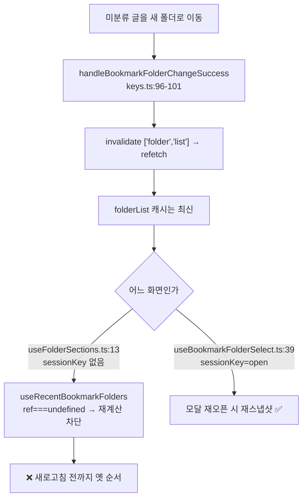
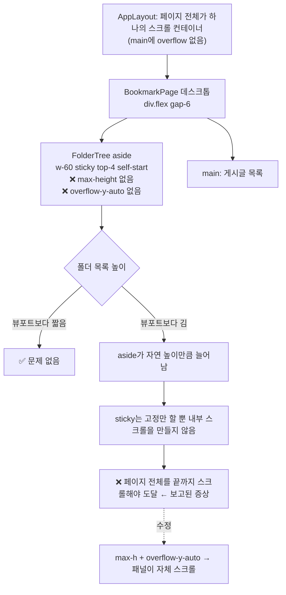

# 북마크 폴더 사이드바 — "최근 저장한 폴더" 개선 + 스크롤 도달 불가 수정

## Context

북마크 페이지 폴더 사이드바에서 서로 무관한 두 가지 문제가 보고됐고, 조사 과정에서
"최근 저장한 폴더" 노출 조건 자체도 함께 다듬기로 했다. 관련 없는 변경끼리는 커밋을
나눈다(`.claude/CLAUDE.md` "커밋 단위" 원칙).

**커밋 1 — "최근 저장한 폴더" 개선 (갱신 안 됨 + 노출 조건 재검토).**
① 폴더를 새로 만들고 미분류 글을 옮겨도 새로고침 전까지 상단 구획이 갱신되지 않는다.
② 지금 있는 노출 조건(전체 폴더 6개 이상)의 "6"이 외부 근거 없는 값이라는 게 드러나
논의 끝에 새 기준으로 바꾸기로 했다.

**커밋 2 — 사이드바 자체 스크롤.**
폴더가 많으면 페이지 전체 스크롤을 끝까지 내려야 "내 폴더" 아랫부분이 보인다.

## 커밋 1 — "최근 저장한 폴더"

### 1-A. 갱신 안 되는 문제

**원인**: React Query 무효화는 정상이다.
`handleBookmarkFolderChangeSuccess`(`src/entities/bookmark/folder/api/bookmark-folder.keys.ts:96-101`)
가 `['folder','list']`을 무효화하고 서버가 갱신한 `lastUsedAt`이 실제로 들어온다. 막는 건
`useRecentBookmarkFolders`의 **세션 스냅샷**이다 — `sessionKey`가 바뀔 때만 순서를
재계산하는데, `useFolderSections.ts:13`이 `sessionKey`를 안 넘겨 `undefined`로 고정되고
`snapshottedForSessionRef.current === undefined`가 영원히 참이 된다. 모달
(`useBookmarkFolderSelect.ts:39`)은 `open`을 넘기므로 정상이다.



**채택안**: 사이드바·모바일 그리드에서만 스냅샷을 없애고 매 렌더 최신으로 계산한다.
모달은 그대로 둔다. "세 화면 전부 해제"는 등록 폼 모달이 열린 채로 폴더를 만들 수 있어
오탭 위험이 생기고, "저장 직후에만 재배열"(mutation cache 기반)은 TanStack Query 기본
gcTime 5분(`query-core/src/removable.ts:23-29`) 때문에 아무 조작 없이 5분 뒤 트리거가
흔들린다.

**변경: `src/widgets/bookmark/folder-tree/hooks/useFolderSections.ts`**

- `useRecentBookmarkFolders` import → `BookmarkFolderUtil`
- 구조분해에서 `isFetching` 제거(안 빼면 `@typescript-eslint/no-unused-vars`)
- `const recentFolderList = BookmarkFolderUtil.pickRecentFolders(folderList ?? []);`
- `uncategorizedCount`의 `data ? (...) : undefined` 삼항은 유지(`FolderTree.tsx:180`·
  `MobileFolderList.tsx:114`의 `typeof count === 'number'` 가드와 짝)
- JSDoc에 "이 화면들은 새 스냅샷을 찍을 세션 경계가 없다" 기록

`useMemo`는 안 쓴다 — `recentFolderList`가 의존성 배열/`React.memo` prop으로 들어가는
곳이 0건이고, 현재 코드도 memo 없이 매 렌더 계산한다.

**변경: `src/entities/bookmark/folder/hooks/useRecentBookmarkFolders.ts`** — JSDoc만.
20-22행이 이번 버그 원인 서술이라 거짓이 된다. 시그니처는 안 바꾼다.

건드리지 않는 파일: `FolderTree.tsx`, `MobileFolderList.tsx`, `useFolderTree.ts`,
`useMobileFolderList.ts`, `useBookmarkFolderSelect.ts`.

### 1-B. 노출 조건 재검토 — 왜 바꾸나

기존 `MIN_BOOKMARK_FOLDER_COUNT_TO_SHOW_RECENT = 6`의 "6"은 코드 주석 한 줄
(`bookmark-folder.const.ts:5-6`)이 유일한 근거이고, `docs/DECISIONS.md`에도 이 숫자를
비교·확정한 항목이 없다 — **출처 미상**이었다.

조사 결과 이 값은 사실 `RECENT_BOOKMARK_FOLDER_COUNT = 3`(이미 Sears & Shneiderman
1994 split menu 근거로 정당화된 값)과 얽혀 있다: 최근 구획은 최대 3개까지만 보여주므로
(`slice(0, 3)`), "본 목록 = 최근 구획"이 되는 유일한 지점은 **전체 폴더가 정확히 3개**일
때뿐이다. 4개부터는 본 목록이 항상 최근 구획보다 많아 완전 일치가 구조적으로 불가능하다.

```
 전체 폴더 수    저장 이력 있는 폴더 수(최대)   최근 구획 vs 내 폴더        노출
 ──────────────────────────────────────────────────────────────────────
 0~2개          0~2개 (3 미만)                 —                        안 뜸(저장 이력 부족)
 3개            최대 3개                       완전 일치 가능             안 뜸(완전 중복 배제)
 4개+           최대 3개(캡)                   내 폴더가 항상 더 많음      뜸(저장 이력 3개 이상 시)
```

**근거**: NN/g [The Same Link Twice on the Same Page: Do Duplicates Help or Hurt?](https://www.nngroup.com/articles/duplicate-links/) —
_"사용자는 두 항목이 중복이라는 걸 모르기 때문에 결국 둘 다 훑어보게 되고, 분석량이
사실상 두 배가 된다"_ (번역, 원문: "designers know these links are duplicates, but users
do not, so they often end up scanning both sets of links — effectively doubling the
amount of analysis"). 폴더 3개 케이스는 두 구획의 정렬 기준(최근=`lastUsedAt`, 내 폴더=
`sortOrder`)이 달라 사용자가 한눈에 중복임을 알아차리기 어려워 이 연구가 그대로 적용된다.
4개 이상이면 본 목록에 최근 구획에 없는 폴더가 항상 남아 split menu 본연의 스캔 비용
절감 효과가 유효하다(Sears & Shneiderman 1994, 기존에 `docs/BOOKMARK.md` §5가 이미
인용 중).

**변경: `src/entities/bookmark/folder/utils/bookmark-folder.util.ts`**

```typescript
static pickRecentFolders(folderList: BookmarkFolder[]): BookmarkFolder[] {
  const usedFolderList = folderList.filter(
    (folder) => folder.lastUsedAt !== null && folder.lastUsedAt !== undefined
  );

  // "최근 저장한 폴더"는 최대 RECENT_BOOKMARK_FOLDER_COUNT(3)개만 보여준다. 폴더
  // 총수가 정확히 그 값과 같으면(= 저장 이력 있는 폴더가 전부 3개뿐) 최근 구획과
  // "내 폴더"가 완전히 같은 3개를 정렬 기준만 바꿔(lastUsedAt vs sortOrder) 중복
  // 노출하게 된다 — 사용자는 두 목록이 같은지 모르고 둘 다 훑어 스캔 비용만 두 배가
  // 된다(NN/g, https://www.nngroup.com/articles/duplicate-links/). 폴더가 4개
  // 이상이면 "내 폴더"가 최근 구획(3개 고정 상한)보다 항상 많아 완전 일치가
  // 구조적으로 불가능하다(2026-09-21).
  if (
    usedFolderList.length < RECENT_BOOKMARK_FOLDER_COUNT ||
    folderList.length === RECENT_BOOKMARK_FOLDER_COUNT
  ) {
    return [];
  }

  return [...usedFolderList]
    .sort((a, b) => dayjs(b.lastUsedAt).valueOf() - dayjs(a.lastUsedAt).valueOf())
    .slice(0, RECENT_BOOKMARK_FOLDER_COUNT);
}
```

**변경: `src/entities/bookmark/folder/config/bookmark-folder.const.ts`** —
`MIN_BOOKMARK_FOLDER_COUNT_TO_SHOW_RECENT` export 제거(더 이상 별도 상수가 필요 없고,
두 값을 따로 유지하면 하나만 바뀔 때 동기화가 깨질 위험이 있다). `RECENT_BOOKMARK_FOLDER_COUNT`
는 그대로 둔다.

제거 전 다른 참조가 있는지 확인: `grep -rn "MIN_BOOKMARK_FOLDER_COUNT_TO_SHOW_RECENT" src/ docs/`

### 승인된 부수 효과 (기존 계획보다 범위가 넓어짐)

이전엔 "폴더 6개째 생성 시" 시프트가 문제였는데, 이번 변경으로 **시프트가 발생하는
지점이 훨씬 앞당겨진다** — 폴더 3개에서 4개가 되는 순간(그중 3개 이상 저장 이력이
있다면) 구획이 등장한다. 폴더 개수가 적은 계정일수록 더 자주 이 전환을 보게 된다.
이미 진행한 근거 조사로 이 부수 효과 자체는 사용자가 승인했으나, 실제 화면에서는
브라우저 녹화로 한 번 더 확인한다(§9 원칙).

## 커밋 2 — 폴더 목록 자체 스크롤

### 원인



### 변경: `src/pages/bookmark/BookmarkPage.tsx:187`

`FolderTree`에 넘기는 className에 높이 상한과 자체 스크롤을 추가한다. 기존 관용구
재사용 — `LoginPage.tsx:9`·`SignUpForm.tsx:41`이 이미 `calc(100vh-var(--navbar-height))`를
쓰고, `--navbar-height: 64px`는 `src/app/globals.css:409`에 정의돼 있다.

**구현 전 반드시 브라우저로 확인**: `Navbar`는 `sticky top-0 h-16`, `FolderTree`는
`sticky top-4`(1rem)다. 스크롤 중 패널이 고정될 때 상단 48px이 Navbar 뒤로 가려지는지
실측한다. 가려지면 `top`도 `top-[calc(var(--navbar-height)+1rem)]`로 같이 조정하고,
안 가려지면 `top-4`는 그대로 둔다(요청 범위 밖이므로 확인 없이 건드리지 않는다).

### 스크롤 영역 경계 — 미리보기로 선택받을 것

`BookmarkFolderSelectModal`이 같은 문제를 이미 겪고 해결한 선례가 있다
(`docs/DECISIONS.md` 2026-09-11, 안 B 채택): 목록만 스크롤시키고 "새 폴더 만들기"는
스크롤 밖에 고정했다.

|                              | (가) 패널 전체 스크롤 | (나) 목록만 스크롤 (모달 선례)  |
| ---------------------------- | --------------------- | ------------------------------- |
| 전체·미분류·최근 저장한 폴더 | 같이 스크롤           | 상단 고정                       |
| 내 폴더                      | 스크롤                | 스크롤                          |
| 새 폴더 만들기               | 같이 스크롤           | 하단 고정                       |
| 구현                         | className 한 줄       | `FolderTree.tsx` 구조 변경 필요 |

§9에 따라 실제 Tailwind 클래스·`globals.css` 토큰을 그대로 쓴 정적 목업을 Artifact
한 페이지에 나란히 만들어 보여주고, 고른 안으로만 반영한다.

## 테스트

### 신규: `src/entities/bookmark/folder/utils/bookmark-folder.util.test.ts`

`pickRecentFolders`의 순수 선정 로직(임계값·완전 일치 배제·정렬)을 다룬다. 지금까지
이 로직은 `useRecentBookmarkFolders.test.ts`에서 훅을 통해서만 간접 테스트됐는데,
로직 자체가 바뀌므로 이번에 전용 테스트를 만든다.

| 케이스                          | 입력                         | 단정                          |
| ------------------------------- | ---------------------------- | ----------------------------- |
| 저장 이력 3개 미만이면 빈 배열  | 폴더 6개, 2개만 `lastUsedAt` | `[]`                          |
| 정확히 3개(전부 사용)면 빈 배열 | 폴더 3개, 전부 `lastUsedAt`  | `[]` (완전 일치 배제)         |
| 4개(3개 사용)면 3개 노출        | 폴더 4개, 3개 `lastUsedAt`   | 길이 3, `lastUsedAt` 내림차순 |
| 미사용 폴더는 후보에서 제외     | 폴더 5개, 3개만 `lastUsedAt` | `lastUsedAt` 있는 3개만       |

### 신규: `src/widgets/bookmark/folder-tree/hooks/useFolderSections.test.ts`

`useFolderTree.test.ts:17-38`의 Wrapper/`url()`/`beforeEach` 골격을 따른다. MSW 응답을
1·2회차로 나눠 주고 `bookmarkFolderInvalidateQueries.list(queryClient)`로 갱신을 유발한다.

| 케이스                                                    | 단정                 |
| --------------------------------------------------------- | -------------------- |
| 언마운트 없이 목록이 갱신되면 구획도 최신 순서로 바뀐다   | 3회차 응답 순서 반영 |
| 4번째 폴더가 생기면(3개 사용) 마운트 중에 구획이 등장한다 | `[]` → 길이 3        |
| 3개로 줄면(완전 일치) 구획이 사라진다                     | 길이 3 → `[]`        |

`createTestQueryClient()`는 `staleTime: 0`이라 invalidate가 즉시 refetch를 유발한다
(`src/test/utils.tsx:17-24`).

### 수정: `src/entities/bookmark/folder/hooks/useRecentBookmarkFolders.test.ts`

- "폴더가 6개 미만이면 임계값 미달로 빈 배열을 반환한다"(43행, 5개 전부 사용) — 새 로직
  에서 더 이상 참이 아니다(4개 이상이면 노출). **삭제**, 선정 로직 커버리지는 위 신규
  util 테스트로 이관.
- 나머지 6건은 `makeSixFoldersWithUsage()`(폴더 6개, 전부 사용)를 쓰는데, 6은
  `RECENT_BOOKMARK_FOLDER_COUNT(3)`과 다르므로 새 로직에서도 동일하게 top-3을
  반환한다 — **무수정 통과**.

### 무수정 통과해야 하는 것

`PostCardBookmarkFolderModal.test.tsx`(12건, 6개 임계값 시나리오 — 6개는 여전히 노출
조건을 만족하므로 영향 없음), `PostCreateBookmarkFolderField.test.tsx`(11건, 동일 이유),
`useFolderTree.test.ts`(5건), `useMobileFolderList.test.ts`(6건). e2e는 폴더 픽스처가
1개뿐이라 영향 없음.

커밋 2(레이아웃)는 단위 테스트로 덮지 않는다 — jsdom은 실제 레이아웃을 계산하지 않는다.
브라우저 녹화가 검증 수단이다.

## 문서

| 문서                                                     | 할 일                                                                                                                                                                                                                                                           |
| -------------------------------------------------------- | --------------------------------------------------------------------------------------------------------------------------------------------------------------------------------------------------------------------------------------------------------------- |
| `docs/BOOKMARK.md` §5 (169-181)                          | "모달만 열 때 고정 / 상시 화면은 항상 최신" 서술 갈라 쓰기 + 노출 조건이 "폴더 6개 이상"에서 "저장 이력 3개 이상 & 완전 일치 아님"으로 바뀐 것 반영, NN/g 인용 추가                                                                                             |
| `docs/BOOKMARK.md` §7 (249-258)                          | 운영 파라미터 표 갱신 — `MIN_BOOKMARK_FOLDER_COUNT_TO_SHOW_RECENT` 행 제거, "노출 제외 조건(완전 일치)" 행 추가 + 근거 링크                                                                                                                                     |
| `docs/BOOKMARK.md` §8 (330-332, 347-349)                 | `useRecentBookmarkFolders`를 "모달 전용"으로, `useFolderSections.ts`·`bookmark-folder.util.test.ts` 줄 추가, `bookmark-folder.const.ts` 설명 줄 갱신(상수 1개 제거됨), `sessionKey` 줄 번호 재확인                                                              |
| `docs/BOOKMARK.md` §9                                    | `**2026-09-21 갱신**` 문단                                                                                                                                                                                                                                      |
| `docs/BOOKMARK.md` §10                                   | 새 항목 3개 — ① 상시 화면 스냅샷이 영영 안 풀리던 문제 ② 노출 임계값 "6"이 출처 미상이었고 완전 일치 배제로 재정의한 경위 ③ 사이드바 아랫부분에 도달 못 하던 문제                                                                                               |
| `docs/BOOKMARK.md` §12 (516-519)                         | `sessionKey` 정의에서 "상시 마운트 화면은 넘기지 않아…" 절 교체                                                                                                                                                                                                 |
| `docs/FE-ARCHITECTURE.md` (214-215)                      | 소비처가 1개(모달)로 줄어든 것 반영                                                                                                                                                                                                                             |
| `docs/DECISIONS.md`                                      | append-only이므로 `## 2026-09-21` 새 항목. 두 결정 함께 기록: (1) 세션 스냅샷 해제 범위(A/B/C 비교), (2) 노출 임계값을 "6"에서 "완전 일치 배제"로 바꾼 근거(NN/g 인용 + 기존 3의 split menu 근거와의 관계) — 스크롤 영역 경계 (가)/(나) 선택도 같은 날짜로 기록 |
| `.claude/skills/responsive-ux/SKILL.md`                  | "데스크톱 sticky" 절의 `BookmarkPage` 폴더 패널 서술을 바뀐 클래스로 갱신                                                                                                                                                                                       |
| `CHANGELOG.md`                                           | `### Fixed`에 갱신 안 되던 문제 + 스크롤 문제, `### Changed`에 노출 조건 변경. `changelog-release` skill 포맷 준수                                                                                                                                              |
| `docs/plans/2026-09-21-bookmark-folder-sidebar-fixes.md` | 이 계획 스냅샷을 구현과 같은 PR에 커밋                                                                                                                                                                                                                          |

## 작업 순서

1. **워크트리** — `git log origin/main..main`으로 미푸시 커밋 확인 후 `EnterWorktree`.
   진입 직후 `cp ../../../.env . && pnpm install`
2. **현재 상태 실측** — 폴더 3개/4개/6개 이상 각각 만들어 두 증상 재현, Navbar 겹침
   여부 확인. "before" 녹화
3. **미리보기** — 스크롤 영역 경계 (가)/(나)를 Artifact 목업으로 나란히 제시 → 선택받기
4. **커밋 1** 구현 (1-A + 1-B) + `bookmark-folder.util.test.ts`·`useFolderSections.test.ts`
   신규 + `useRecentBookmarkFolders.test.ts` 수정
5. **커밋 2** 구현 (선택된 안으로)
6. **검증**
   ```bash
   npx vitest run src/widgets/bookmark/folder-tree src/entities/bookmark/folder \
     src/features/bookmark src/features/post/create/ui/PostCreateBookmarkFolderField.test.tsx
   pnpm type-check   # tsc -b --noEmit
   pnpm test
   pnpm lint
   pnpm check:docs
   ```
7. **브라우저 녹화** — `browser-verification` skill 절차로 "after" 녹화해 승인받는다.
   확인 항목: ① 새로고침 없이 상단 구획 갱신 ② 폴더 3→4개 전환 시 구획 등장(레이아웃
   시프트, 거부되면 되돌림) ③ 폴더 3개(완전 일치)에서 구획이 안 뜸 ④ 폴더 20개에서
   사이드바 자체 스크롤로 끝까지 도달 ⑤ Navbar와 겹치지 않음 ⑥ 폴더 이름 변경 시
   순서가 흔들리지 않음
8. **문서 + CHANGELOG** → `pnpm check:docs`
9. **커밋** — `git add` 금지, `git commit -- <경로...>`로 대상 직접 지정. 작업 전
   `.gitmessage` 확인. 커밋 1과 커밋 2는 분리
