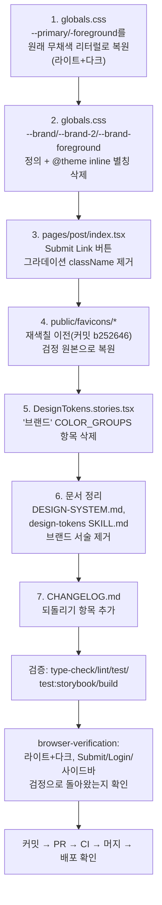

# 브랜드 컬러(틸) 되돌리기 — 원래 무채색 `--primary`로 복원

## Context

색·타이포·입체감 토큰 개편(PR #166) 이후 브랜드 hue를 블루→틸로 두 번 바꿨지만
(PR #169, 그리고 파비콘 별도 재색칠 PR #168), 사용자가 최종적으로 "브랜드 색상을
쓸 생각이 없었다"고 확인했다 — "brand에서 블루는 다 빼 난 블루를 쓰려고한적이없어",
이어서 "그냥 틸 색상되어있던거 기존에 검은색으로 했던방향으로 되돌려놔줘".

즉 **브랜드 컬러 도입 자체를 철회**하고 `--primary`를 원래 무채색(oklch L 0 0)으로
복원한다. 색·타이포 개편의 나머지 부분(카테고리 8색 팔레트, 상세 제목 확대, 그림자
기반 입체감, 좌측 정렬 `pl-0.5`)은 "틸/블루" 색상 논쟁과 무관한 별개 결정이었으므로
**건드리지 않는다** — 카테고리 팔레트는 브랜드와 독립적인 `--category-1~8` 토큰이고,
사용자가 문제 삼은 적이 없다.

**범위 확인**: 지금 main(`origin/main` `e0e5662`)에 실제로 브랜드색을 참조하는 곳은
정확히 2곳뿐이다(`git show origin/main:...`로 확인) — `globals.css`의 `--primary`/
`--primary-foreground`(라이트·다크 각 1쌍)와 `pages/post/index.tsx`의 Submit Link
버튼 그라데이션. 그 외에 브랜드 토큰을 참조하는 실사용 컴포넌트는 없다(카테고리
팔레트는 독립 토큰, `entities/category/config/category.const.ts`도 무관).

## 되돌릴 것 / 유지할 것

| 항목                                                                  | 처리                                                              |
| --------------------------------------------------------------------- | ----------------------------------------------------------------- |
| `--primary`/`--primary-foreground`                                    | **복원** — `var(--brand)` 참조를 원래 리터럴 값으로 되돌림        |
| `--brand`/`--brand-2`/`--brand-foreground` 토큰 정의                  | **삭제** — 되돌린 뒤 아무도 참조하지 않는 죽은 토큰이 되므로 제거 |
| Submit Link 버튼 그라데이션                                           | **삭제** — 원래 스타일(그라데이션 없음)로 복원                    |
| 파비콘 6종(틸 재색칠)                                                 | **복원** — 재색칠 이전 검정 원본으로 되돌림                       |
| `DesignTokens.stories.tsx`의 "브랜드" 카탈로그 그룹                   | **삭제** — 참조하는 토큰이 사라지므로                             |
| `docs/DESIGN-SYSTEM.md` / `design-tokens` SKILL.md의 브랜드 관련 서술 | **삭제**                                                          |
| 카테고리 8색 팔레트, 상세 제목 확대, 그림자 기반 입체감, 좌측 정렬    | **유지** — 이번 되돌리기 대상 아님                                |

## 전체 흐름

## 구현 단계

### 1~2단계 · `src/app/globals.css`

- `:root`(라이트): `--primary: var(--brand)` → `--primary: oklch(0.205 0 0)`,
  `--primary-foreground: var(--brand-foreground)` → `oklch(0.985 0 0)` (PR #166
  이전 원래 값 — `git show <PR166 이전 커밋>`으로 재확인해 정확히 복원)
- `.dark`: `--primary: var(--brand)` → `oklch(0.922 0 0)`,
  `--primary-foreground: var(--brand-foreground)` → `oklch(0.205 0 0)`
- `:root`/`.dark`의 `--brand`/`--brand-2`/`--brand-foreground` 정의 3쌍(6줄) 삭제,
  관련 설명 주석도 함께 삭제(고아 주석 방지)
- `@theme inline` 블록의 `--color-brand`/`--color-brand-2`/`--color-brand-foreground`
  별칭 3줄 삭제(더 이상 생성할 유틸리티가 없음)
- `--category-1~8`, `--text-detail-title` 등 이번 되돌리기와 무관한 토큰은 **손대지
  않는다**

### 3단계 · `src/pages/post/index.tsx`

Submit Link 버튼의 `className="md:h-10 bg-linear-to-br from-brand to-brand-2
text-brand-foreground hover:brightness-110 transition-[filter]"`를 원래 형태
`className="md:h-10"`로 복원(주석도 함께 제거).

### 4단계 · `public/favicons/*`

재색칠 이전 커밋(`b252646`, 파비콘을 처음 만든 커밋)에서 6개 파일을 복원:
`git show b252646:public/favicons/<파일명> > public/favicons/<파일명>` 형태로
검정 원본을 그대로 되살린다(Pillow 재작업 불필요 — 이미 있던 원본을 그대로 꺼내는 것).

### 5단계 · `src/shared/ui/tokens/DesignTokens.stories.tsx`

`COLOR_GROUPS`의 "브랜드 (2026-09-21 추가 — primary가 var(--brand)를 참조)" 그룹
전체 삭제(`brand`/`brand-2` 스와치 2개).

### 6단계 · 문서 정리

- `docs/DESIGN-SYSTEM.md` §6 상태 모델의 `--brand`/`--brand-2`/`--brand-foreground`
  행 삭제, §5 구조의 "`--brand`/`--brand-2`는 반대로 범용에 가깝다" 문장 삭제
- `.claude/skills/design-tokens/SKILL.md`의 "브랜드" 행 삭제, "기본 강조" 행의
  "(2026-09-21부터 `var(--brand)` 참조...)" 문구를 원래 문구로 복원

### 7단계 · `CHANGELOG.md`

`[Unreleased] > Changed`에 새 항목 추가: "브랜드 컬러 도입을 철회하고 원래 무채색
`--primary`로 복원". 배경·구현에 왜 되돌렸는지(재검토 끝에 무채색 유지로 결정) 기록.
기존 브랜드 관련 항목(#166/#168/#169)은 실제로 배포됐던 이력이므로 삭제하지 않고
그대로 둔다 — 새 항목이 그 뒤를 잇는 기록이 된다.

## 위험 (`.claude/CLAUDE.md` §5)

| #   | 위험                                                                                                                                                                                                         | 소유 파일                         |
| --- | ------------------------------------------------------------------------------------------------------------------------------------------------------------------------------------------------------------ | --------------------------------- |
| 1   | `--primary`/`--primary-foreground` 복원값이 부정확하면 툴팁·체크박스·필터칩 등 22개 파일·38지점이 다시 틀어진다 — PR #166 이전 실제 커밋에서 값을 다시 한번 대조 확인 필요                                   | `globals.css`                     |
| 2   | `DesignTokens.stories.tsx`에서 브랜드 그룹을 지우지 않으면 `var(--brand)`가 빈 값이 되어 `ColorSwatch`가 깨진 스타일을 렌더 — Storybook 빌드/a11y 테스트는 안 깨지지만(문법 오류 아님) 카탈로그가 부정확해짐 | `DesignTokens.stories.tsx`        |
| 3   | 파비콘을 커밋 `b252646`에서 직접 꺼내므로, 그 사이 다른 이유로 파비콘이 바뀐 적이 없는지 확인 필요(`git log --oneline -- public/favicons/`로 이미 확인 — 재색칠 커밋 외 변경 없음)                           | `public/favicons/*`               |
| 4   | `docs/check:docs`가 문서 내 파일:줄 참조를 검사하므로, 문서에서 삭제한 브랜드 서술이 다른 곳에서 참조되고 있지 않은지 확인                                                                                   | `docs/DESIGN-SYSTEM.md`, SKILL.md |

## 검증

1. `pnpm type-check` / `pnpm lint` / `pnpm test`
2. `pnpm test:storybook` — 카탈로그에서 브랜드 그룹 제거 후에도 a11y 게이트 정상 통과 확인
3. `pnpm build` → dist CSS에 `--brand`/`.bg-linear-to-br`/`.from-brand` 등이 더 이상
   생성되지 않는지, `--primary`가 리터럴 무채색 값으로 나오는지 grep 확인
4. `pnpm check:docs`
5. `browser-verification` skill로 `/post` 라이트+다크 녹화 — Log in·Submit Link·
   사이드바 활성 탭이 검정/무채색으로 돌아왔는지, 파비콘이 검정인지 확인
6. 커밋 → PR → CI green(이번엔 `docs/plans/` 새 계획 파일도 함께 커밋, §11) → 머지 →
   `gh run list --workflow "Frontend Deploy..."`로 배포 확인 → 실제 프로덕션 사이트에서
   최종 육안 확인
