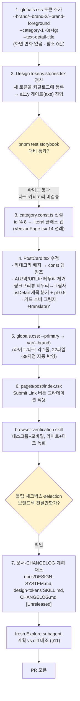

# LinkSphere 디자인 개편 — 색·타이포·입체감·정렬

## Context

사용자가 "프로젝트 디자인이 투박하다"고 느껴 진단을 요청했다. 실제 프로덕션
(`https://dbw3brui6htwk.cloudfront.net/post`)을 브라우저로 확인하고 코드베이스를
조사한 결과, 근거가 있었다:

- `--primary`/`--secondary`/`--accent`가 전부 채도 0(무채색) — 브랜드 컬러가 코드에
  0개, `globals.css:180`
- 카드 그리드가 콘텐츠 양이 다른 카드끼리도 같은 행 높이로 늘어나 빈 꼬리가 최대 53%
  (`post-grid.const.ts:7`, 실측)
- AI 요약 → 링크 프리뷰 → URL 바가 전부 같은 1px 테두리로 3겹 중첩 (`PostCard.tsx`)
- 카테고리 8종이 전부 같은 보라색이라 구분 기능을 못 함 (`--category`, `globals.css:214`)
- 상세 페이지 제목(18px/700)이 바로 아래 댓글 섹션 제목(18px/600)과 크기가 같음
- 그라데이션 0건, drop-shadow 0건, 의도적 그림자는 `hover:shadow-md` 3곳뿐

이후 Artifact 미리보기(https://claude.ai/artifact/1Gp7sG9rRhhACeicUwZQLi, v1~v7)로
실제 `globals.css` 토큰·컴포넌트 className을 그대로 재현해 방향안을 나란히 비교하며
6가지를 확정했다. 이 계획은 그 확정안을 실제 코드에 반영하는 절차다.

**미확정 항목 1개**: 브랜드 **색상**(블루/인디고/틸 중)은 명시적으로 고르지 않았다 —
시안에서 기본값으로 계속 노출된 **블루**(`oklch(0.52 0.20 255)`)로 가정하고 진행한다.
`globals.css`의 값 2줄만 바꾸면 되므로 되돌리기 비용이 낮다.

**미확정 항목 2개**: 카테고리 틴트 팔레트의 **다크모드 값**은 Artifact 목업에서
라이트모드 계산값만 실제로 검증됐고 다크모드는 별도 설계가 필요하다(아래 "위험" 참고).

## 확정된 결정 (Artifact에서 비교 후 승인)

| #   | 항목             | 결정                                                                                                            |
| --- | ---------------- | --------------------------------------------------------------------------------------------------------------- |
| 1   | 브랜드 적용 범위 | **안 A** — `--primary`/`--primary-foreground`를 직접 교체(전면 적용)                                            |
| 2   | 브랜드 색상      | 블루 `oklch(0.52 0.20 255)` (가정 — 미확정, 위 참고)                                                            |
| 3   | 카테고리 배지    | **틴트** (배경 `색/12%` + 진한 글자, 솔리드는 실측상 초록·틸이 회색이 돼 탈락)                                  |
| 4   | 상세 페이지 제목 | **개선안** — `isDetail`일 때 모바일 24px/32/700(t9), 데스크톱 28px/38/700(t11)                                  |
| 5   | 화려함의 정도    | **절제된 트렌드** — CTA 버튼 2색 그라데이션, 카드 호버 시 살짝 떠오름 + 그림자, 부드러운 진입 애니메이션        |
| 6   | 입체감           | **개선(그림자 기반)** — AI요약·URL바 테두리 제거, 링크 프리뷰는 테두리 대신 그림자, 다크모드는 표면 밝기로 대체 |
| 7   | 좌측 정렬        | 아바타 원 왼쪽 끝이 기준(원래도 맞았음, 변경 불필요) + 제목·설명에 `pl-0.5`(2px) 미세 조정                      |

## 전체 흐름

## 구현 단계

### 1단계 · 토큰 정의 (`src/app/globals.css`)

`@theme static`으로 추가(미사용이어도 Storybook이 `getComputedStyle`로 읽을 수 있어야
함 — `globals.css:62-64` 기존 주석의 확립된 이유와 동일):

- `--brand: oklch(0.52 0.20 255)` / dark `oklch(0.72 0.15 255)`
- `--brand-2: oklch(0.55 0.18 300)` / dark `oklch(0.74 0.14 300)` (그라데이션 2번째 색)
- `--brand-foreground: oklch(1 0 0)` / dark `oklch(0.205 0 0)`
- `--category-1`~`--category-8` (+ `-foreground`) — 라이트: Artifact에서 실측한 8개
  hue(H255/H30/H292/H340/H150/H200/H85/H15, 배경은 `색/12%` 틴트, 글자는 `L 0.42`
  진한 색). **다크는 미검증** — 2단계 a11y 게이트에서 직접 값을 정하고 실측한다
  (아래 "위험" 참고).
- `--text-detail-title: 1.5rem` (24px) / `--line-height: 2rem`(32px) /
  `--font-weight: 700` — `md:` 단계에서 `text-t11`(28px/38px)로 올림(기존
  `--text-card-title`의 반응형 선례와 동일한 패턴, `globals.css:159-161` 주석 참고)

`--primary`/`--primary-foreground`는 **이 단계에서 아직 안 건드린다** — 5단계에서
`var(--brand)`로 교체(파급 범위가 커서 다른 변경과 분리).

### 2단계 · Storybook 카탈로그 갱신 (`src/shared/ui/tokens/DesignTokens.stories.tsx`)

새 토큰을 `COLOR_GROUPS`/`ROLE_TOKENS` 배열에 추가 — 이 등록 자체가 axe
`color-contrast` 게이트에 새 색을 진입시키는 방법이다(기존 확립된 방식,
`DesignTokens.stories.tsx:23-85`). `pnpm test:storybook`으로 라이트 모드 대비를
확인하고, 다크 모드 카테고리 값은 이 단계에서 직접 계산해 확정한다(현재
`.storybook/preview.tsx` 기본 테마가 라이트라 다크는 수동 확인 필요 — 아래 위험
참고).

### 3단계 · 카테고리 색 맵 신설 (`src/entities/category/config/category.const.ts`, 신규)

`VersionPage.tsx:14-18`(`STATUS_BANNER_CLASSNAME: Record<SyncStatus, string>`)와
같은 형태 — `Record<number, string>` + `id % 8` 폴백, 값은 완성된 리터럴 클래스
문자열(동적 조합 금지, `no-classname-template-literal` 룰 + JIT 스캐너 제약).

### 4단계 · PostCard 수정 (`src/widgets/post/post-card/ui/PostCard.tsx`)

- `:244-255` 카테고리 배지 — `bg-category` 하드코딩 대신 3단계에서 만든 맵을
  `category.id`로 조회
- `:185-211` AI 요약 박스 — `border border-info/20` 제거, `bg-info/10` →
  `bg-info/8`만 유지
- `:214-242` 링크 프리뷰 — `border rounded-lg` → `rounded-lg` + 그림자
  유틸리티(`shadow-[...]` 또는 신규 `shadow-sm` 조합), URL 바(`:225`)의
  `bg-muted/30` 배경 제거
- `:73-74` 카드 자체 — `hover:shadow-md` → 레이어드 그림자 + `hover:-translate-y-*`
  (절제된 트렌드, Artifact 섹션4/5와 동일 강도)
- `:110` 제목 — `isDetail`일 때 `text-detail-title md:text-t11`로 분기(기존
  `!isDetail && 'line-clamp-3'` 분기와 같은 자리), `pl-0.5` 추가
- `:180` 설명 — `pl-0.5` 추가

**주의**: `CommentItem.tsx:66`(글쓴이 배지)와 `PostListSearch.tsx:156`("나만 볼 수
있는" 필터 칩)은 기존 `--category` 토큰을 계속 쓴다 — PostCard만 새 팔레트로
옮기므로 이 둘은 건드릴 필요가 없다(자연스럽게 분리됨).

### 5단계 · 브랜드 전면 적용 (`globals.css` 2줄)

`:root`의 `--primary: var(--brand)`, `.dark`의 `--primary: var(--brand)` — 22개
파일·38지점(버튼/툴팁/체크박스/스위치/필터칩/FAB/nprogress 등)이 자동 반영된다.
되돌리기는 이 2줄만 revert.

### 6단계 · CTA 그라데이션 (`src/pages/post/index.tsx`)

"Submit Link" 버튼에 `bg-gradient-to-br from-brand to-brand-2` 계열 적용(Artifact
섹션4 "절제된 트렌드"의 CTA와 동일).

### 7단계 · 문서 대조

`docs/DESIGN-SYSTEM.md`, `.claude/skills/design-tokens/SKILL.md`(색상표·역할토큰표
갱신), `CHANGELOG.md` `[Unreleased]`. `pnpm check:docs`로 경로·줄번호 정합성 확인.

## 위험 (`.claude/CLAUDE.md` §5)

| #   | 위험                                                                                                                                                             | 소유 파일                                            |
| --- | ---------------------------------------------------------------------------------------------------------------------------------------------------------------- | ---------------------------------------------------- |
| 1   | **다크모드 카테고리 틴트 미검증** — Artifact는 라이트모드 값만 실측했다. 다크는 이 계획에서 방향(밝은 색+어두운 글자)만 정하고 정확한 oklch 값은 2단계에서 확정  | `globals.css`(신규 토큰), `DesignTokens.stories.tsx` |
| 2   | **툴팁·체크박스·input 텍스트 선택이 브랜드색으로 바뀐다** — 5단계의 의도된 결과지만 실제로 보면 과할 수 있음                                                     | `tooltip.tsx:21`, `checkbox.tsx:14`, `input.tsx:20`  |
| 3   | **카테고리 배지 글자색 간접 연결 해소 확인** — PostCard 배지는 새 맵으로 옮겨 `badge.tsx`의 `text-primary-foreground` 의존을 끊지만, 실제 반영 후 시각 확인 필요 | `badge.tsx:10`, `PostCard.tsx:250`                   |
| 4   | **`.storybook/preview.tsx` 기본 테마가 라이트** — 다크모드 대비는 CI가 자동으로 못 잡는다, 수동 확인 필요                                                        | `.storybook/preview.tsx:34-36`                       |
| 5   | **`shared/ui/atoms`·`elements` 시각 변경 시 스토리 동반 필수**                                                                                                   | `button`/`badge`/`tooltip`/`checkbox` stories        |
| 6   | 브랜드 색상(hue) 자체가 사용자 미확정 — 블루 가정이 틀리면 1·5·6단계 값 재조정 필요                                                                              | `globals.css`                                        |

## 검증

1. `pnpm type-check` / `pnpm lint` / `pnpm test`
2. `pnpm test:storybook` — 새 토큰 a11y 게이트 통과 확인(라이트), 다크는 수동
3. `pnpm build` → dist CSS에서 신규 유틸리티 생성 확인
4. `browser-verification` skill로 `/post` 데스크톱+모바일, 라이트+다크 녹화 — Artifact
   시안과 실제 반영 결과 대조
5. `pnpm check:docs`
6. `.claude/CLAUDE.md` §11 — fresh Explore subagent에게 이 계획과 diff 대조 요청,
   PR 본문에 `## 계획 대비 구현` 섹션
