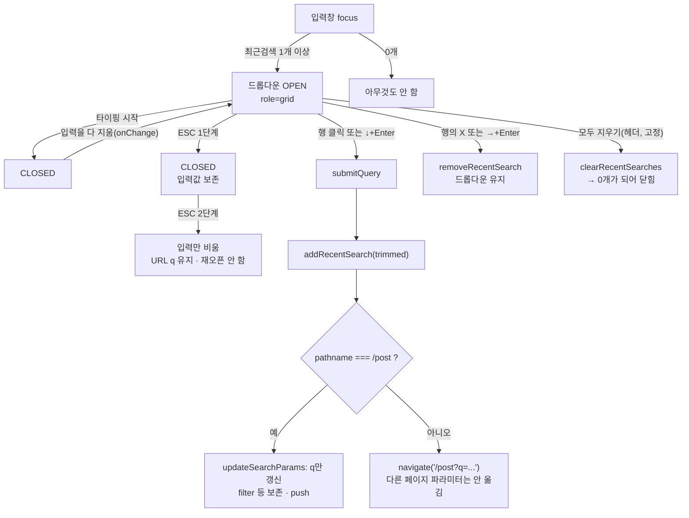

# 데스크톱 헤더 검색에 최근 검색어 드롭다운 추가

## Context

모바일 헤더 검색에는 최근 검색어가 있지만 데스크톱에는 없었다. 원인은 제출 경로가 둘로
갈려 있었기 때문이다 — 모바일은 `Navbar.handleSearchSubmit`을 타서 `addRecentSearch`를
불렀지만, 데스크톱은 `NavbarSearch.handleSubmit`이라는 별도 경로로 곧장 `navigate`만
했다. 그래서 데스크톱에서 아무리 검색해도 목록에 쌓이지 않았고, 쌓였더라도 보여줄 UI가
없었다(`RecentSearchPanel`은 `md:hidden`).

이건 새로 발견된 버그가 아니라 2026-09-07 작업에서 "범위 밖(보고만)"으로 남긴 항목이다
(`docs/DECISIONS.md` "2026-09-07" 항목, `docs/SEARCH.md` §11 "남은 것"). 같은 자리에
기록된 "데스크톱 제출이 `filter` 파라미터를 버린다"도 같은 `handleSubmit` 한 줄에서
비롯되므로 이번에 함께 닫았다.

사용자 요청 순서:

1. 데스크톱 검색 시 최근내역이 쌓여야 한다.
2. 데스크톱에서도 최근내역이 보여야 한다(모바일처럼).
3. ESC 입력 시 X버튼(입력만 비움)처럼 동작하면 어떨지.

이후 대화에서 아래로 구체화됐다.

## 최종 결정

| #   | 결정                                                                      | 근거                                                                                                                                                                                                    |
| --- | ------------------------------------------------------------------------- | ------------------------------------------------------------------------------------------------------------------------------------------------------------------------------------------------------- |
| 1   | 데스크톱도 `addRecentSearch` 호출                                         | 요청 1                                                                                                                                                                                                  |
| 2   | 데스크톱은 입력창 아래 **드롭다운**(모바일 풀스크린 패널 아님)            | 요청 2                                                                                                                                                                                                  |
| 3   | 포커스 시 열고(입력값 유무 무관), 입력 시작하면 닫고, 다 지우면 다시 열림 | Algolia `openOnFocus` 관례                                                                                                                                                                              |
| 4   | 최근검색 0개면 아예 열지 않음(빈 상태 문구 없음)                          | 데스크톱은 모드가 아니라 보조 UI                                                                                                                                                                        |
| 5   | ESC 2단계 — 열려 있으면 닫기, 닫혀 있으면 입력 비우기                     | [APG Combobox](https://www.w3.org/WAI/ARIA/apg/patterns/combobox/): _"Escape: Dismisses the popup if it is visible. Optionally, if the popup is hidden before Escape is pressed, clears the combobox."_ |
| 6   | 데스크톱 제출이 `filter` 파라미터를 보존                                  | 사용자 요청(범위 확대)                                                                                                                                                                                  |
| 7   | 항목별 삭제 + 모두 지우기 포함                                            | 사용자 요청                                                                                                                                                                                             |
| 8   | "모두 지우기"는 **모바일과 같은 자리(상단 고정)**, 스크롤 영향 없음       | 사용자 피드백 — 행 목록만 스크롤, 헤더는 별도 컨테이너                                                                                                                                                  |
| 9   | 구분선 없음 — 모바일과 동일하게 hover로만 행 구분                         | 사용자 피드백                                                                                                                                                                                           |
| 10  | 화살표 키(↓↑←→)로 "모두 지우기"까지 완전히 순환 가능                      | 사용자 피드백 — [APG "Editable Combobox with Grid Popup"](https://www.w3.org/WAI/ARIA/apg/patterns/combobox/examples/grid-combo/) 패턴 채택                                                             |
| 11  | 데스크톱 X 버튼 현행 유지(입력만 비움, URL `q` 유지)                      | 기존 결정, 이번 기능과 무관하게 그대로 공존(글자 있으면 드롭다운과 동시 노출 가능)                                                                                                                      |
| 12  | 데스크톱 제출은 계속 push(≠replace)                                       | 2026-09-07 결정 유지                                                                                                                                                                                    |

결정 8·10은 서로 얽혀 있다 — "모두 지우기"가 시각적으로 스크롤 밖(헤더)에 있으면서도
화살표 순환으로 닿으려면, DOM/CSS 배치와 키보드 순환 순서가 독립적이어야 한다. 이를
가능하게 한 것이 결정 10에서 채택한 APG Grid Popup 패턴이다 — 실제 DOM 포커스는 항상
입력창에 머물고(`aria-activedescendant`로만 가상 포커스 표시) 논리적 순환 순서는
`NavbarSearch.tsx`의 상태(`activeRow`/`activeCol`)가 독립적으로 정하므로, 헤더와 스크롤
영역이라는 CSS 레이아웃 분리가 키보드 동작에 영향을 주지 않는다. 자세한 대안 비교는
`docs/DECISIONS.md` "2026-09-21 — 데스크톱 최근검색 드롭다운: APG Grid Popup 패턴 채택"
항목 참고.

## 흐름

## 구현

- **`Navbar.tsx`**: 이미 호출 중이던 `useRecentSearches()`의 반환값을 `NavbarSearch`에도
  props로 내렸다. 훅을 `NavbarSearch`에서 새로 호출하지 않는다 —
  `useAppLocalStorage.ts`의 `storage` 이벤트 동기화는 다른 탭 전용이라 같은 탭의 두
  인스턴스는 어긋난다.
- **`NavbarSearch.tsx`**: `submitQuery`가 `/post`에서는 `useSearchParamsDraft`로 `q`만
  갱신(filter 보존), 그 외 페이지에서는 `navigate('/post?q=...')`. 열림 상태(`isOpen`)와
  활성 셀(`activeRow`/`activeCol`)은 이벤트 핸들러에서만 갱신하고 파생시키지 않는다 —
  파생시키면 ESC 2단계가 스스로를 무효화하는 함정이 생긴다(`docs/SEARCH.md` §10).
  `handleKeyDown`이 IME 가드 → Escape 2단계 → ArrowDown/Up(행 이동, row-major 순환) →
  ArrowLeft/Right(셀 이동) → Enter(검색/삭제/모두지우기) 순으로 처리한다.
- **`RecentSearchDropdown.tsx`**(신규): `role="grid"` 아래 `role="rowgroup"` 2개 — 헤더
  (모두 지우기, 비스크롤) + 행 목록(스크롤, `max-h-[190px]`). 구분선 없음, hover로만
  행 구분. 모든 셀은 `tabIndex={-1}` `Button`이고, 그리드 루트의 `onMouseDown`이 기본
  포커스 이동을 막아 클릭이 blur로 유실되지 않는다.

## 테스트

`NavbarSearch.test.tsx`에 23케이스(filter 보존 3, 최근검색 기록 2, 드롭다운 열림/닫힘/
ESC/화살표/클릭/삭제/IME 14, 기존 검색어 유지 6 유지), `Navbar.test.tsx`에 데스크톱
제출 → localStorage 기록 배선 케이스 1개 추가. `MobileNavbarSearch.test.tsx`·
`RecentSearchPanel.test.tsx`는 수정하지 않았다(모바일 UI를 한 줄도 건드리지 않음).

## 검증

- `pnpm type-check` / `pnpm test`(459개 전체) / `pnpm lint` 통과.
- Playwright로 데스크톱 뷰포트(1280×800) 실측(2026-09-21): 제출 → localStorage 기록,
  포커스 시 드롭다운 노출(입력값이 있어도 X버튼과 동시 노출), ESC 1단계(닫기·값
  보존)→2단계(입력만 비움·URL q 유지·재오픈 안 함), 최근검색 10개에서 목록만
  스크롤되고 헤더("모두 지우기")는 고정(스크린샷으로 확인), ↓로 첫 행 활성화·→로
  삭제 셀 이동·첫 행에서 ↑로 "모두 지우기" 도달, 행 클릭 시 유실 없이 즉시 검색,
  X 클릭 시 그 항목만 삭제(드롭다운 유지), `filter=isBookmarked` 켠 채 제출해도
  `filter`·`q` 둘 다 유지, 모바일 뷰포트(390×844)에서 기존 풀스크린 패널이 그대로인
  것. 녹화: `.claude/browser-artifacts/verify-2026-09-21-desktop-recent-search-dropdown.webm`
  (gitignore 대상, 레포에는 포함하지 않음).

## 핵심 파일

| 파일                                                    | 역할                                     |
| ------------------------------------------------------- | ---------------------------------------- |
| `src/widgets/layout/navbar/ui/NavbarSearch.tsx`         | 제출 로직·상태 머신·키보드               |
| `src/widgets/layout/navbar/ui/RecentSearchDropdown.tsx` | 신규 — grid 팝업                         |
| `src/widgets/layout/navbar/ui/Navbar.tsx`               | props 배선                               |
| `src/widgets/layout/navbar/ui/NavbarSearch.test.tsx`    | 헬퍼 확장 + 23케이스                     |
| `src/widgets/layout/navbar/ui/Navbar.test.tsx`          | 배선 통합 케이스 1건                     |
| `docs/SEARCH.md`                                        | 기능 문서 갱신                           |
| `docs/DECISIONS.md`                                     | 설계 결정 기록(APG Grid Popup 채택 근거) |
