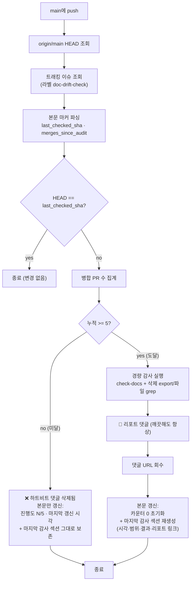

# doc-drift 트래킹 이슈(#99) 노이즈 제거 + 본문 대시보드화

## Context

`doc-drift-check.yml`이 상태를 기록하는 트래킹 이슈 [#99](https://github.com/BAECHAN/link-sphere_FE_NEW/issues/99)에서
최신 결과를 보려면 매번 끝까지 스크롤해야 한다는 문제 제기가 있었다.

댓글 44개를 분류해보니 원인은 "최신이 아래"라는 정렬 방향이 아니었다:

| 종류                  | 개수           | 비고                                                                     |
| --------------------- | -------------- | ------------------------------------------------------------------------ |
| 하트비트              | **37개 (84%)** | "확인함 — 누적 N/5. 아직 경량 감사 기준 미달, 이번엔 아무 검사도 안 함." |
| 실제 경량 감사 리포트 | 7개            | 확인 범위 + `check:docs` 결과 + dangling 목록                            |
| └ 그중 문제 발견      | 1개            | `Comment`·`Account` 등 삭제된 export 참조 잔존                           |

- 하트비트는 `scripts/check-doc-drift.js:342-350`에서 나온다. 댓글을 단 **바로 다음 줄**(`:347`)에서
  `editBody`로 본문 마커를 갱신하므로 상태 보존에 저 댓글은 필요 없고, 같은 내용이
  `console.log`(`:348`)로 Actions run 로그에도 이미 남는다 — 순수 중복이다.
- GitHub 이슈 댓글은 시간순 오름차순 고정이고 최신순 정렬 옵션이 없다. 바꿀 수 있는 건
  ① 얼마나 쌓이느냐 ② 항상 맨 위에 보이는 자리(이슈 본문)에 무엇을 두느냐 뿐이다.
  본문은 이미 매 실행 `editBody`로 덮어쓰고 있는데 내용이 마커 + 안내문 2줄뿐이다(`:52-58`)
  — 대시보드로 쓸 자리가 비어 있다.
- 선례가 같은 레포에 이미 있다: `scripts/check-openapi-drift.js:148-200`은 정상이면 아무것도
  쓰지 않고 콘솔 로그만, 문제일 때만 이슈를 열고 해소되면 자동으로 닫는다.

**의도한 결과**: 댓글 44개 → 7개 수준, 최신 상태는 스크롤 없이 이슈 본문 맨 위에서 확인.

**사용자가 고른 것** (2026-09-21):

- 경량 감사 리포트 댓글은 **깨끗해도 항상 남긴다** (통과 이력을 이슈에 영구 보존).
- 이미 쌓인 하트비트 37개는 **삭제가 아니라 minimize(OUTDATED)**로 접는다.

## 전체 흐름



## 변경 1 — 하트비트 댓글 폐지

**파일**: `scripts/check-doc-drift.js`

`main()`의 임계값 미달 분기(`:342-350`)에서 `commentOn(...)` 호출만 제거한다. `editBody`와
`console.log`는 유지 — 상태 보존과 실행 기록은 그대로 남는다.

```js
if (totalMerges < THRESHOLD) {
  editBody(issue.number, buildBody(headSha, totalMerges, extractAuditSection(issue.body)));
  console.log(`기준 미달(${totalMerges}/${THRESHOLD}) — 검사 없이 상태만 갱신.`);
  return;
}
```

## 변경 2 — 이슈 본문을 대시보드로

**파일**: `scripts/check-doc-drift.js`

**마커 형식(`STATE_RE`)은 바꾸지 않는다** — 지금 #99 본문에 들어 있는 마커를 그대로 파싱할
수 있어야 마이그레이션 없이 다음 실행부터 바로 동작한다.

본문을 두 구역으로 나누고, `<!-- last-audit -->` 구분자로 경계를 잡는다:

- **위쪽(자동 재생성)**: 상태 마커 + "현재 상태" 표(다음 감사까지 N/5, 마지막 확인 커밋,
  마지막 갱신 시각 UTC) + 사람이 편집하지 말라는 안내문
- **아래쪽(`<!-- last-audit -->` 이후)**: "마지막 경량 감사" 표 — 실행 시각, 확인 범위
  (`aaaaaaa..bbbbbbb`, 병합 PR N개), `pnpm check:docs` 통과/실패, dangling 건수, 리포트 댓글 링크

임계값 미달 경로에서는 아래쪽 섹션을 **기존 본문에서 잘라내 그대로 재사용**한다. 그래야
감사 사이 기간에도 "마지막 감사가 언제 무엇을 봤는지"가 본문에 남는다.

추가/수정할 함수(기존 `buildStateBody`·`replaceState`를 대체):

| 함수                                   | 역할                                                                            |
| -------------------------------------- | ------------------------------------------------------------------------------- |
| `buildBody(sha, merges, auditSection)` | 본문 전체 생성. `findOrCreateIssue`의 신규 생성에도 `auditSection: ''`로 재사용 |
| `extractAuditSection(body)`            | `/<!-- last-audit -->[\s\S]*$/` 매치, 없으면 `''`                               |
| `buildAuditSection({...})`             | 감사 결과로 아래쪽 섹션 생성                                                    |
| `commentOn(...)`                       | `gh issue comment`의 stdout(댓글 URL)을 **반환**하도록 수정                     |

- 날짜는 `new Date().toISOString()`을 쓴다 — `scripts/check-docs.js:255`,
  `scripts/generate-history.js:89`의 선례와 같고, `dayjs` 강제 ESLint 규칙은 `src/**`에만
  걸려 있어(`eslint.config.js:445` 등) `scripts/`는 대상이 아니다.
- 댓글 URL이 빈 문자열로 돌아오면 링크 줄을 생략한다(`gh` 출력 형식 변화에 대한 방어).

**결과 본문 스케치**:

```markdown
<!-- doc-drift-state: last_checked_sha=4f5012a..., merges_since_audit=3 -->

## 현재 상태

| 항목               | 값                   |
| ------------------ | -------------------- |
| 다음 경량 감사까지 | 3/5 병합             |
| 마지막 확인 커밋   | `4f5012a`            |
| 마지막 갱신        | 2026-09-21 04:12 UTC |

이 이슈는 자동화 워크플로(`doc-drift-check.yml`)가 상태를 기록하는 곳입니다.
마커 줄을 사람이 직접 편집하지 마세요.

<!-- last-audit -->

## 마지막 경량 감사

| 항목              | 값                               |
| ----------------- | -------------------------------- |
| 실행 시각         | 2026-09-15 13:39 UTC             |
| 확인 범위         | `7ce6385..d68ae03` (병합 PR 5개) |
| `pnpm check:docs` | 통과                             |
| dangling          | 없음                             |
| 리포트            | (댓글 permalink)                 |
```

## 변경 3 — 기존 하트비트 댓글 37개 minimize (일회성)

레포 코드 변경이 아니라 GitHub 쪽 일회성 정리다. 커밋하지 않는다.

`gh issue view`로 `확인함 —`으로 시작하는 댓글의 node id를 모아 GraphQL `minimizeComment`
mutation을 `classifier: OUTDATED`로 호출한다. 되돌리려면 같은 id로 `unminimizeComment`를
부르면 된다.

실행할 명령은 구현 시 그대로 보여주고, 사용자가 확인한 뒤 돌린다(외부에 보이는 상태를
바꾸는 작업이라 승인 후 실행).

## 변경 4 — 문서 갱신

- `scripts/check-doc-drift.js` 상단 주석: "상태는 트래킹 이슈 본문의 마커에만 저장" 서술에
  "미달 시엔 댓글을 달지 않고 본문 대시보드만 갱신한다"는 설명을 더한다. 이 스크립트의
  동작을 서술하는 곳은 이 주석과 `.github/workflows/doc-drift-check.yml:3-6` 헤더 주석뿐이고
  (`docs/*.md`·`README.md`에 doc-drift 서술 없음을 grep으로 확인), 워크플로 yml 자체는
  이번에 건드리지 않는다.
- `CHANGELOG.md` `[Unreleased]` → `### Changed`에 항목 추가. 이 레포는 CI/워크플로 변경도
  CHANGELOG에 기록해왔다(PR #131 Storybook 배포 워크플로, PR #134 배포 검증 스텝).

## 영향 범위 점검

**이슈 본문 update / 댓글 create — 실패 지점**

- **마커 파싱**: `STATE_RE`를 그대로 두므로 현재 #99 본문이 깨지지 않는다. 첫 실행에서
  `extractAuditSection`이 `''`를 반환해 "마지막 경량 감사" 섹션은 비고, 다음 감사(누적 5
  도달) 때 채워진다 — 허용 가능한 과도기.
- **동시 실행**: main에 연속 push가 나면 두 run이 같은 본문을 읽고 쓰는 race가 가능하다.
  이건 지금도 있는 성질이고 이번 변경으로 새로 생기지 않는다(하트비트가 사라져 오히려
  쓰기 횟수가 줄어든다).
- **신규 이슈 생성 경로**(`findOrCreateIssue:106`): `buildStateBody` → `buildBody(sha, 0, '')`로
  교체. 호출부가 한 곳이라 누락 위험이 낮다.

**기존 동작의 회귀**

- `THRESHOLD` 카운팅·감사 로직·grep 휴리스틱은 건드리지 않는다.
- "워크플로가 살아 있다"는 신호가 이슈 댓글에서 사라진다 → 본문 "마지막 갱신" 시각이
  이 역할을 대신한다. 값이 며칠째 멈춰 있으면 워크플로가 안 도는 것이다.
- `scripts/check-openapi-drift.js`는 별도 라벨·이슈를 쓰므로 영향 없음.
- `docs/plans/2026-09-20-build-version.md:244`가 `doc-drift-check.yml:11-14,29-30`을 줄 번호로
  참조하지만 yml은 수정하지 않으므로 `pnpm check:docs`가 깨지지 않는다.
- minimize된 댓글은 GitHub API·`gh issue view`로 여전히 조회되며 삭제가 아니다.

## 검증

1. `pnpm check:docs` — 문서 경로/줄 번호 참조 회귀 확인.
2. `pnpm lint` — `scripts/`가 ESLint 대상에 포함되는지는 `eslint.config.js:431` ignores로
   확인한 뒤, 걸리면 통과까지 수정.
3. **드라이런**: `GITHUB_REPOSITORY`를 세팅하고 `gh` 쓰기 호출(`editBody`/`commentOn`)만
   `console.log`로 바꾼 임시 사본을 scratchpad에서 실행해, 생성될 본문 마크다운과
   임계값 분기(미달/도달 양쪽)를 눈으로 확인한다. 실제 이슈에는 쓰지 않는다.
4. 머지 후 실제 확인: main push 1회 → 이슈 #99에 **댓글이 안 늘고** 본문 "현재 상태"의
   진행도·갱신 시각만 바뀌는지 확인. 누적 5 도달 시 리포트 댓글 1개 + 본문 "마지막 경량
   감사" 갱신 확인.
5. minimize 실행 후 이슈 화면에서 스크롤 길이가 실제로 줄었는지 확인.

## 커밋

`scripts/check-doc-drift.js` + `CHANGELOG.md`를 한 커밋으로. `.gitmessage` 형식을 먼저 읽고
따른다. `git add` 없이 `git commit -- <경로>`로 대상 파일을 직접 지정한다.
