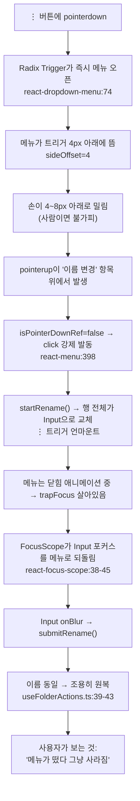

# ⋮ 메뉴가 "누르자마자 사라지는" 문제 수정 — 트리거를 click 기반으로

## Context

### 무엇이 문제인가

북마크 폴더 목록의 ⋮(더보기) 버튼을 누르면 메뉴가 떴다가 아무 일도 없이 즉시 사라진다.
사용자가 클릭할 때 손이 몇 px 움직이는 것(사람이면 불가피한 동작)이 방아쇠다.
환경은 **데스크톱 마우스**, 증상은 **"메뉴가 떴다 그냥 사라짐"**(사용자 확인).

이 레포에는 드래그 앤 드롭 기능이 아예 없다 — `draggable` 속성 0건, DnD 라이브러리 0건
(`package.json`·`pnpm-lock.yaml` 모두). 따라서 "드래그된다"는 체감은 실제 드래그가 아니라
Radix 드롭다운의 **press-drag-release** 동작이다.

### 원인 체인 (Radix 2.1.16 소스를 직접 읽어 확인, 추측 아님)

1. `node_modules/@radix-ui/react-dropdown-menu/dist/index.mjs:74`
   트리거가 `onPointerDown`에서 `context.onOpenToggle()` — **누르는 순간**(떼기 전) 열린다.
2. `src/shared/ui/atoms/dropdown-menu.tsx:62` — `sideOffset = 4` + content `p-1`.
   메뉴 첫 항목("이름 변경")이 트리거 **약 8px 아래**에 깔린다.
3. `node_modules/@radix-ui/react-menu/dist/index.mjs:398`
   `onPointerUp`에서 `if (!isPointerDownRef.current) event.currentTarget?.click()` —
   그 항목에서 누르지 않았어도 **거기서 떼면 클릭이 강제 발동**한다.
4. `startRename()` 실행 → `FolderTree.tsx:205` early return으로 **행 전체가 `<Input>`으로
   교체**되면서 ⋮ 트리거가 언마운트된다.
5. 메뉴는 닫힘 애니메이션(`data-[state=closed]:animate-out`, `dropdown-menu.tsx:69`) 중이라
   아직 열린 상태 → `MenuRootContentModal`의 `trapFocus: context.open`이 살아있다.
   `node_modules/@radix-ui/react-focus-scope/dist/index.mjs:38-45`가 container 밖 `focusin`을
   감지해 **포커스를 메뉴로 되돌린다** → 방금 `autoFocus`된 Input이 포커스를 뺏긴다.
6. Input `onBlur` → `submitRename()` → `useFolderActions.ts:39-43`에서 이름이 같으므로
   **토스트도 API 호출도 없이 조용히 `setRenaming(false)`** → 행이 원래대로.

결과: 메뉴가 깜빡 떴다 사라지고 아무 일도 없었던 것처럼 보인다.



**1번을 고치면 2~6이 전부 일어나지 않는다.** click(=pointerup 후)에서 열면
"누른 채 움직이는 구간"에 메뉴가 존재하지 않으므로 press-drag-release 자체가 성립하지 않는다.

### 근거: 왜 click인가

WCAG 2.2 성공 기준 **2.5.2 Pointer Cancellation(Level A)**의 첫 조건은
_"The down-event of the pointer is not used to execute any part of the function"_ 이다.
Understanding 문서는 그 이유를 _"cancel the action by moving their pointer or finger away
from the target before releasing"_ — 떼기 전에 포인터를 치워 취소할 기회를 주기 위해서라고
설명한다([W3C, Understanding SC 2.5.2](https://www.w3.org/WAI/WCAG22/Understanding/pointer-cancellation.html)).

지금 구조의 역설이 여기 있다. 사용자의 손 떨림은 WCAG가 "취소 제스처"로 보장하라는 바로 그
동작인데, Radix는 이미 down-event에서 열어버린 뒤라 취소가 아니라 오작동이 된다.

Radix 저장소에 같은 지적이 open 상태로 쌓여 있다 —
[#3124](https://github.com/radix-ui/primitives/issues/3124)(WCAG 2.5.2 위반),
[#3012](https://github.com/radix-ui/primitives/issues/3012)(click으로 바꿔달라),
[#2418](https://github.com/radix-ui/primitives/issues/2418)(터치 스크롤 충돌). 메인테이너 답변은 없다.

**반대편 근거도 있다(채택하지 않은 이유까지 기록).** Radix가 down-event를 택한 이유는 macOS
네이티브 메뉴의 "눌러서 끌어 한 번에 선택"을 재현하기 위해서고, Material UI Select도 같은 이유로
`mouseDown`을 쓴다 — 두 번 클릭할 걸 한 동작으로 줄인다는 효율 논거다. 이 레포에서 그 이점을
포기하는 이유는, ⋮ 메뉴 항목이 **이름 변경·삭제 같은 파괴적/상태변경 동작**이라 오발동 비용이
"한 동작 절약"보다 크기 때문이다. Headless UI MenuButton은 click 기반이다.

참고로 **W3C ARIA APG의 Menu Button 패턴은 마우스 열기 시점을 규정하지 않는다** — 키보드
동작(Enter/Space/화살표)만 규정한다. 즉 "표준이 click을 요구한다"고 말할 근거는 APG이 아니라
WCAG 2.5.2 쪽이다.

### 아직 확정되지 않은 것

위 1~4단계는 코드로 확정했으나, **5~6단계의 타이밍**(닫힘 애니메이션 중 trapFocus가 실제로
Input 포커스를 뺏는지)은 소스 추적에 근거한 추정이다. 구현 첫 단계에서 브라우저로 재현해
확정한다. 다만 **1단계를 고치면 이 체인 전체가 시작되지 않으므로, 5~6의 정확한 타이밍과
무관하게 수정 방향은 동일하다.**

---

## 범위

사용자가 선택한 범위: **⋮/드롭다운 메뉴 4곳 전부.** 공통 컴포넌트 한 곳을 고쳐 네 곳이 함께
낫는 구조로 만든다(지금은 트리거 JSX가 4곳에 복붙돼 있고 공통 래퍼가 없다).

| 사용처              | 파일                                                               | 특이사항                                           |
| ------------------- | ------------------------------------------------------------------ | -------------------------------------------------- |
| 폴더 메뉴(데스크톱) | `src/widgets/bookmark/folder-tree/ui/FolderTree.tsx:248-265`       | 비제어형. 증상 발생 지점                           |
| 폴더 메뉴(모바일)   | `src/widgets/bookmark/folder-tree/ui/MobileFolderList.tsx:166-183` | 비제어형                                           |
| 게시글 카드 메뉴    | `src/widgets/post/post-card/ui/PostCard.tsx:131-173`               | **제어형** `open`/`onOpenChange` + `modal={false}` |
| 계정 메뉴           | `src/widgets/layout/navbar/ui/Navbar.tsx:185-216`                  | 비제어형. 아바타 트리거                            |

---

## 구현

### 1. `src/shared/ui/atoms/dropdown-menu.tsx` — Root와 Trigger를 래핑

현재 두 줄은 순수 re-export다(`:9`, `:11`):

```tsx
const DropdownMenu = DropdownMenuPrimitive.Root;
const DropdownMenuTrigger = DropdownMenuPrimitive.Trigger;
```

Trigger 혼자서는 열림 상태를 바꿀 수 없다(Radix 내부 context에 접근 불가). 따라서 **Root도 함께
감싸 자체 context로 open을 관리**하고, Trigger는 그 context를 통해 click에서 연다.

핵심 지렛대는 `node_modules/@radix-ui/primitive/dist/index.mjs`의 `composeEventHandlers`가
`checkForDefaultPrevented = true`를 기본값으로 쓴다는 점이다 — 트리거에
`onPointerDown`에서 `preventDefault()`를 호출하면 **Radix의 열기 핸들러가 실행되지 않는다.**

구현 요지:

- 새 React context(`DropdownMenuOpenContext` 정도)를 만들어 `{ open, setOpen }`을 내려보낸다.
- `DropdownMenu` 래퍼는 **제어형/비제어형을 모두 지원**한다 — `open` prop이 `undefined`면 내부
  `useState`로, 주어지면 그대로 쓰고 `onOpenChange`를 호출한다. PostCard가 제어형이라 필수.
- `DropdownMenuTrigger`는 `forwardRef` 래퍼로 바꾸되 **`asChild`를 그대로 통과**시킨다
  (4곳 모두 `asChild`로 `Button`을 쓴다).
  - `onPointerDown`: 사용자 핸들러 먼저 호출 → `e.preventDefault()`로 Radix 열기 차단
  - `onClick`: 사용자 핸들러 먼저 호출 → `defaultPrevented`가 아니면 `setOpen(!open)`
- `DropdownMenuPrimitive.Root`에는 우리가 관리하는 `open`/`onOpenChange`를 넘긴다.

**키보드는 건드리지 않는다.** Radix Trigger의 `onKeyDown`(`react-dropdown-menu/dist/index.mjs:80-85`)이
Enter/Space/ArrowDown을 처리하며 **그 자리에서 `event.preventDefault()`를 호출**하므로 브라우저의
click 합성이 막힌다 → 우리 `onClick`과 중복 발동하지 않는다. Radix의 `onOpenToggle`은 제어형
Root를 통해 우리 `setOpen`으로 흘러들어오므로 키보드 경로는 그대로 동작한다.

레포 규칙 준수: 인라인 `if` 금지(중괄호 필수), 가드절 뒤 빈 줄, 기존 import 순서·따옴표 유지.

### 2. `src/shared/ui/atoms/dropdown-menu.stories.tsx` 갱신

파일이 이미 있다(`shared/ui/atoms` 변경 시 스토리 동반은 레포 필수 규칙). 트리거가 click에서
열린다는 것을 눈으로 확인할 수 있는 스토리를 추가한다 — 특히 **제어형/비제어형 두 가지**를
모두 담아 PostCard 케이스가 깨지지 않음을 보이게 한다.

### 3. 호출부 4곳

**JSX 변경 없음이 목표다.** 공통 컴포넌트가 동작을 바꾸므로 호출부는 그대로 두고, 네 곳이
실제로 정상 동작하는지만 검증한다. PostCard의 제어형 사용(`:131`)이 래퍼와 충돌하지 않는지가
유일한 확인 포인트다.

### 4. 문서

- `CHANGELOG.md` `[Unreleased]`에 `fix` 항목 추가(레포 규칙: `fix` 커밋은 같은 커밋에 갱신).
- `docs/DECISIONS.md`에 짧게 남긴다 — 단순 버그 수정이 아니라 **Radix 기본 동작에서 의도적으로
  이탈하는 결정**이고 대안(그대로 두기 / sideOffset만 키우기 / click 전환)을 비교했으며, 라이브러리
  업그레이드 때마다 재검토가 필요해 되돌리기 비용이 있다. WCAG 2.5.2 링크와 Radix 이슈 번호,
  그리고 **채택하지 않은 pointerdown 진영의 논거(macOS 네이티브·MUI의 효율 논거)** 까지 적는다.
- `docs/BOOKMARK.md`에 시행착오로 이 증상과 원인 체인을 남긴다(레포 규칙상 기능별 시행착오는
  기능 문서에).

---

## 영향 범위 점검 (레포 규칙 §5)

**깨질 수 있는 기존 동작:**

| 동작                       | 소유 파일                                             | 위험                                                                                                                                                                                                                                             |
| -------------------------- | ----------------------------------------------------- | ------------------------------------------------------------------------------------------------------------------------------------------------------------------------------------------------------------------------------------------------ |
| PostCard 제어형 메뉴       | `PostCard.tsx:131`                                    | 래퍼가 제어형을 잘못 다루면 열리지 않거나 이중 상태가 됨. **가장 높은 위험**                                                                                                                                                                     |
| PostCard "수정" 항목       | `PostCard.tsx:143-148`                                | `onClick`에서 `e.preventDefault()`를 호출해 Radix 자동 닫힘을 막고 직접 네비게이트 — 트리거 변경과 무관하나 회귀 확인 필요                                                                                                                       |
| 키보드 열기(Enter/Space/↓) | Radix 내부                                            | keydown의 `preventDefault` 덕에 중복 발동은 없을 것으로 분석했으나 **실측 필요**                                                                                                                                                                 |
| 트리거 포커스              | 전 사용처                                             | `pointerdown`에 `preventDefault`를 걸면 버튼이 포커스를 못 받는다. 단 Radix도 열 때 이미 같은 호출을 한다(`:78`, 포커스 경합 방지 주석). 닫힘 시 `onCloseAutoFocus`가 트리거로 포커스를 되돌리므로 Tab 순서는 유지될 것으로 보이나 **실측 필요** |
| 폴더 rename 인라인 편집    | `FolderTree.tsx:205-220`, `useFolderActions.ts:34-54` | 이번 수정의 수혜 지점. 정상 경로(메뉴 → 이름 변경 클릭 → Input 유지)가 살아있는지 확인                                                                                                                                                           |
| Navbar 계정 메뉴           | `Navbar.tsx:185-216`                                  | 링크 항목 네비게이션 회귀 확인                                                                                                                                                                                                                   |
| 모바일 터치                | `MobileFolderList.tsx:166-183`                        | click 전환은 터치에서도 tap 확정 후 열리게 하므로 개선 방향이나, 스크롤 중 오픈 여부 확인                                                                                                                                                        |

**CRUD 관점:** 이 변경은 데이터 계약(스키마·DTO·API)을 건드리지 않는다. 폴더 rename/delete의
요청 형태와 캐시 무효화 경로는 그대로다. 달라지는 것은 그 동작을 **언제 시작하느냐**뿐이다.

---

## 작업 준비 (레포 필수 절차)

이 레포는 여러 Claude 세션이 동시에 돈다(확인 시점에 4개 세션 활성). 코드를 수정하는 작업이므로
**워크트리 안에서 작업한다** — 워킹트리와 `.git/index`를 공유하면 서로 덮어쓰거나 무관한 커밋에
남의 변경이 딸려 들어간다.

1. `node -v`가 `v24`인지 확인(아니면 `nvm use`) — `.npmrc`의 `engine-strict=true` 때문에 다른
   버전이면 `pnpm install`이 막힌다.
2. `git log origin/main..main`으로 미푸시 커밋을 먼저 확인한 뒤 `EnterWorktree`.
3. 워크트리 진입 직후 부트스트랩: `cp ../../../.env .` && `pnpm install`.
4. 커밋은 `git add` 없이 `git commit -- <경로...>`로 대상 파일을 직접 지정한다.

## 검증

1. **재현 먼저** — 수정 전에 현재 증상을 브라우저로 재현해 원인 체인 5~6단계를 확정한다.
   `pnpm dev`로 띄우고 북마크 폴더 행의 ⋮를 누른 채 몇 px 아래로 움직였다 떼는 동작을
   Playwright MCP로 재현한다. 레포의 `browser-verification` skill 절차를 따른다.
   - 확인 지표: 행이 순간 `<Input>`으로 바뀌었다 돌아오는지(가설대로면 그렇다).
2. `pnpm type-check` — 필수.
3. `pnpm test` — 기존 테스트 회귀 확인. `useFolderActions.test.ts`, `useFolderTree.test.ts`,
   `useMobileFolderList.test.ts`가 있다.
4. `pnpm lint` — import 변경이 생기므로.
5. **수정 후 브라우저 재검증(녹화)** — 같은 동작을 반복해 메뉴가 유지되는지 확인하고,
   `browser-verification` skill에 따라 녹화해 사용자에게 보여준다. 이 변경은 타이밍 변화라
   정적 스크린샷으로는 판단할 수 없다.
   - 4곳 전부: 폴더(데스크톱·모바일), PostCard, Navbar
   - 키보드: Enter/Space/↓로 열기, Esc로 닫기, 닫은 뒤 Tab 순서
   - 정상 경로: 메뉴 → 이름 변경 → Input 유지 → 실제 이름 변경 성공
6. `pnpm check:docs` — `docs/`·`CHANGELOG.md`를 고치므로.
7. **회귀 테스트 추가** — e2e가 이 회귀를 잡기에 가장 적합하다. `e2e/bookmark-folder-delete.spec.ts:73-74`가
   이미 이 메뉴를 열고 있어(`getByRole('button', { name: TEXTS.ariaLabels.folderMenu }).click()` →
   `getByRole('menuitem', ...)`) 그대로 통과해야 한다(정상 경로 안전망).

   여기에 **증상 자체를 재현하는 케이스를 새로 추가**한다 — Playwright의 `.click()`은 같은 좌표에서
   pointerdown/up을 보내므로 지금도 통과한다. 손 떨림을 재현하려면 마우스를 나눠 움직여야 한다:

   ```
   트리거 위치로 이동 → mouse.down() → mouse.move(x, y + 8) → mouse.up()
   → 기대: 메뉴가 여전히 열려 있고, 이름 변경이 실행되지 않았다
   ```

   수정 전에는 실패하고 수정 후에는 통과해야 한다(레포 규칙 §4: "버그를 재현하는 테스트를
   작성하고, 통과시킨다"). 단위 테스트는 참고로 `src` 전체에 DropdownMenu를 렌더하는 테스트가
   현재 0건이라 선례가 없다 — jsdom은 레이아웃이 없어 "8px 아래" 재현이 불가능하므로 e2e로 올린다.

---

## PR 전 마무리 (레포 규칙 §11)

- 이 계획 파일을 `docs/plans/2026-09-21-dropdown-trigger-click.md`로 **구현 코드와 같은 PR에**
  커밋한다(커밋 후 수정 금지 — append-only, CI가 기존 파일 수정을 막는다).
- 구현한 세션이 스스로 "계획대로 됐다"고 결론 내리지 않는다. **fresh subagent(Explore)** 에게
  커밋한 계획 파일과 실제 diff를 주고 대조시킨다: 각 항목이 실제로 구현됐는가, 계획에 없던
  변경(과잉 구현 포함)이 섞였는가, 다르게 구현된 부분이 있다면 왜인가.
- 대조 결과를 PR 본문에 `## 계획 대비 구현` 섹션으로 "구현됨(파일:줄)/이탈(이유)/미구현" 형태로
  남기고 `docs/plans/`의 파일을 링크한다(원문 재붙여넣기 금지).
