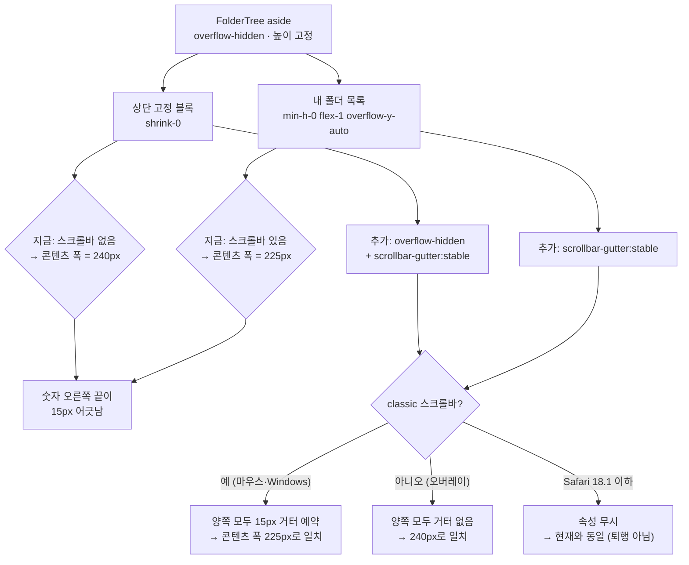

# 보관함 사이드바 — 스크롤바가 먹은 폭 때문에 어긋난 폴더 개수 정렬 맞추기

## Context

데스크톱 보관함 사이드바(`FolderTree`)는 **두 개의 서로 다른 스크롤 컨테이너**로 되어 있다 —
상단 고정 블록(전체·미분류·최근 저장한 폴더·새 폴더 만들기·"내 폴더" 라벨)과, 그 아래
"내 폴더" 목록만 자체 스크롤하는 영역이다. 이 구조는 `#145`(2026-09-21 사이드바 자체 스크롤
도입)·`#147`(2026-09-22 라벨·생성 버튼 상단 고정)에서 확정됐고 근거는 `docs/BOOKMARK.md` §10에
있다.

문제는 classic 스크롤바(마우스를 연결한 macOS, Windows) 환경에서 드러난다. 스크롤바가 붙는
쪽은 아래 목록뿐이라 **그 컨테이너의 콘텐츠 폭만 스크롤바 폭(≈15px)만큼 좁아지고**, 행
오른쪽 끝의 북마크 개수 숫자가 위쪽 "최근 저장한 폴더"의 숫자보다 그만큼 왼쪽으로 밀린다.
사용자 스크린샷으로 확인된 실제 증상이다.

```
  최근 저장한 폴더          ← 스크롤바 없음
    🔖 게임          1
  ─────────────────
  내 폴더
    🔖 AI        6   ┃     ← 스크롤바가 폭을 먹어 15px 왼쪽으로
```

세 가지 안(단일 스크롤+sticky / scrollbar-gutter / 스크롤바 숨김)을 실제 DOM 미리보기로
나란히 비교해( https://claude.ai/artifact/WPhA6X2W2UbLQDC5MTtpzb ) **안 B —
`scrollbar-gutter: stable` 양쪽 예약**을 사용자가 선택했다. 구조를 건드리지 않아 `#145`/`#147`
결정을 그대로 두는 것이 채택 이유다.

## 접근

두 구획 **모두** 스크롤바 자리를 미리 비워 두어 콘텐츠 폭을 같게 만든다.

MDN `scrollbar-gutter` 문서 기준으로 이 속성은 scrolling box에 적용되며,
_"When using classic scrollbars, the gutter will be present if `overflow` is `auto`, `scroll`,
or `hidden` even if the box is not overflowing. When using overlay scrollbars, the gutter will
not be present."_
([MDN](https://developer.mozilla.org/en-US/docs/Web/CSS/scrollbar-gutter)) — 즉 고정 블록은
`overflow: hidden`만 있어도 거터가 잡히고, 오버레이 스크롤바 환경(트랙패드만 쓰는 macOS)에서는
양쪽 다 거터가 없어 지금처럼 정렬이 맞는다. Baseline 2024(2024-12)로 Chrome·Edge·Firefox·
Safari 18.2 이상에서 동작하고, Safari 18.1 이하에서는 속성이 무시돼 **현재와 같은 상태**가
된다(퇴행 아님).



## 변경할 파일

### 1. `src/widgets/bookmark/folder-tree/ui/FolderTree.tsx` (핵심, 두 줄)

`FolderTree` 안의 두 컨테이너에만 손댄다. **`origin/main` 기준으로 읽고 고칠 것** — 로컬
`main`은 30커밋 뒤처져 있어 작업 디렉터리 파일에는 이 구조 자체가 없다.

- 상단 고정 블록 (`L43` 부근) — `overflow-hidden`과 거터 예약을 추가한다.
  `flex shrink-0 flex-col gap-1` → `flex shrink-0 flex-col gap-1 overflow-hidden [scrollbar-gutter:stable]`
- 스크롤 영역 (`L103` 부근) — 거터 예약만 추가한다.
  `min-h-0 flex-1 overflow-y-auto` → `min-h-0 flex-1 overflow-y-auto [scrollbar-gutter:stable]`

두 곳에 같은 속성이 반복되고 "왜 짝으로 있어야 하는지"가 코드만 봐선 안 드러나므로, 기존
주석 스타일(L42·L100-102의 서술형 한글 주석)에 맞춰 **왜 양쪽에 필요한지와 MDN 출처**를
주석으로 남긴다. 레포에 스크롤바 관련 CSS가 한 줄도 없으므로(`globals.css` 확인) 새 유틸리티를
만들지 않고 Tailwind v4 arbitrary property를 그대로 쓴다.

### 2. `docs/BOOKMARK.md` §10에 항목 추가

§10의 기존 두 항목("폴더가 많을 때 사이드바 아랫부분에 도달할 수 없던 문제", "'내 폴더'
라벨이 스크롤에 같이 밀리고…")과 같은 형식으로 이어 쓴다 — 증상, 원인(두 개의 스크롤
컨테이너), 왜 다른 두 안을 안 골랐는지, 영향 파일. 미리보기 아티팩트 링크와 MDN 출처를
함께 남긴다(§10 인용 규칙). 문서 상단 **"마지막 검토" 날짜도 갱신**한다.

이 변경은 대안을 비교하긴 했지만 클래스 두 개로 되돌릴 수 있어 `docs/DECISIONS.md` 대상은
아니다(메모리의 "DECISIONS.md 적합성 기준" — 되돌리기 어려움 요건 미충족). 기능 문서 안에
남긴다.

### 3. `CHANGELOG.md` `[Unreleased]` → `Fixed`

`bookmark` 스코프로 한 줄 요약 + `<details>` 배경·구현 블록. 형식은 `changelog-release`
skill을 먼저 읽고 맞춘다.

## 회귀 점검 (수정 전 확인, §5)

고정 블록에 `overflow-hidden`이 **새로** 붙는 것이 유일한 실질 변화다. 확인할 것:

| 대상                                   | 확인 내용                                                                                                                |
| -------------------------------------- | ------------------------------------------------------------------------------------------------------------------------ |
| ⋮ 드롭다운 (`FolderTree.tsx` L248-265) | Radix `DropdownMenuContent`는 Portal로 body에 붙으므로 잘리지 않음 — 실제로 열어 확인                                    |
| 폴더 이름 변경 Input (L205-219)        | 최근 저장한 폴더 행에서 rename 시 focus ring이 고정 블록 경계에 잘리지 않는지                                            |
| 짧은 뷰포트                            | 고정 블록이 `aside` 높이를 넘칠 때의 동작 — `aside`가 이미 `overflow-hidden`이라 현재와 같아야 함(새 퇴행이 아님을 확인) |
| 폴더가 적어 스크롤이 없을 때           | 양쪽 모두 거터가 생겨 오른쪽이 15px 비는 것이 사용자가 승인한 대가 — 실제 모습 확인                                      |
| 모바일                                 | `FolderChips`·`MobileFolderList`는 손대지 않음                                                                           |
| `BookmarkFolderSelectModal`            | 스크롤 밖 행에 개수 숫자가 없어 같은 증상이 없음 — 이번 범위 아님                                                        |

## 검증

1. 워크트리 생성 — `EnterWorktree`(기본 `fresh` = `origin/main` 기준. 로컬 `main`에 미푸시
   커밋이 없음을 이미 확인). 진입 직후 `cp ../../../.env .` + `pnpm install`.
2. `pnpm type-check` → `pnpm lint` → `pnpm test` → `pnpm check:docs`.
3. **브라우저 실측** — `browser-verification` skill 절차를 따른다. `pnpm dev` 후 보관함
   데스크톱 화면에서:
   - 폴더를 스크롤이 생길 만큼 만든 상태로, "최근 저장한 폴더" 첫 행과 "내 폴더" 첫 행의
     개수 `<span>`에 대해 `getBoundingClientRect().right`가 **같은 값**인지 확인
     (미리보기 아티팩트가 쓰는 것과 같은 측정 방법).
   - 스크롤바가 오버레이로 나오는 환경이면 Chrome DevTools에서 `::-webkit-scrollbar` 폭을
     강제하거나 "스크롤 막대 항상 표시"를 켜고 재측정한다.
   - ⋮ 메뉴 열기, 폴더 이름 변경, 폴더가 적어 스크롤이 없는 상태까지 함께 녹화.
4. e2e 스펙 추가 여부는 위 실측 후 판단한다 — `e2e/mocks/bookmark-folder.mock.ts`의 폴더
   수가 스크롤을 유발할 만큼인지 먼저 확인하고, 목 데이터를 늘려야만 검증되는 수준이면
   과한 변경으로 보고 넣지 않는다(§2·§3). 기존 `e2e/bookmark-folder-*.spec.ts`가 깨지지
   않는지는 반드시 확인한다.
5. 커밋 → PR. `docs/plans/` 대조 절차(§11)는 plan mode로 세운 계획이므로 적용한다 —
   이 계획 파일을 `docs/plans/2026-09-21-folder-sidebar-scrollbar-gutter.md`로 커밋하고,
   PR 본문에 `## 계획 대비 구현` 섹션을 fresh Explore subagent 대조 결과로 채운다.
