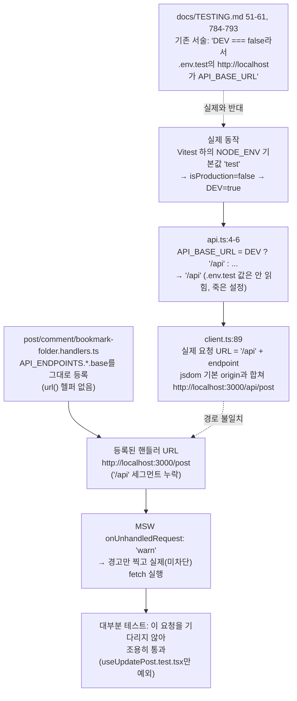

# MSW 기본 핸들러(post·comment·bookmark-folder) `/api` 접두사 누락 수정

## Context

PR #138(nprogress flake 수정) 작업 중 별개 버그를 발견해 `docs/TESTING.md`에 "기록만, 미수정"으로 남겨뒀다: `src/mocks/handlers/post.handlers.ts`·`comment.handlers.ts`·`bookmark-folder.handlers.ts`가 등록하는 모든 핸들러가 실제 요청과 매칭되지 않는 죽은 코드였다.

이번 세션에서 이어서 고치기로 하고 재조사한 결과, **PR #138에 적었던 원인 서술 자체가 부정확했다**는 게 드러났다. 더 중요하게는, **이 레포의 테스트 문서(`docs/TESTING.md`) 최상단 "API URL 처리 방식" 섹션과 "자주 발생하는 문제" 1번 항목이 실제 동작과 정반대로 서술되어 있었다** — 아마 이 버그의 실제 원인이다(과거에 이 문서를 믿고 핸들러를 작성했다면 접두사를 빠뜨릴 수밖에 없는 서술이었다).

### 근본 원인 (재검증 결과)



- 실측 증거: 전체 스위트 실행 시 `[MSW] Warning: intercepted a request without a matching request handler: • GET /api/post/post-uuid-1` — 요청이 정확히 `/api/post/...`로 나간다는 로그 자체가 `API_BASE_URL='/api'`라는 증거다.
- `auth.handlers.ts:6-7`·`account.handlers.ts:5-6`·`upload.handlers.ts:4`는 이미 `const url = (endpoint) => \`${API_BASE_URL}${endpoint}\`;` 헬퍼로 모든 경로를 감싸고 있어 정상 동작한다.
- 블라스트 레디어스 실측(세 차례 독립 조사 + 실제 반복 실행으로 교차 확인): 이 세 파일에 의존하는 테스트 약 42개 중 **41개는 자체 `server.use()` 오버라이드**를 이미 갖고 있어 기본 핸들러 수정과 무관하다. 전체 스위트에서 unhandled-request 경고는 정확히 2건, 둘 다 `GET /api/post/post-uuid-1`이며 **`useUpdatePost.test.tsx` 단독 실행 시에도 정확히 2건** — 이 파일이 유일한 소비자임이 실측으로 확정됐다.

### `useUpdatePost.test.tsx`의 숨은 리스크

이 테스트는 `createTestQueryClient()`(`staleTime: 0`)로 캐시에 `mockPost`를 직접 시드하고(`useUpdatePost.test.tsx:25-26`), 지금까지는 배경 재조회가 항상 실패(ECONNREFUSED)해 시드값이 그대로 유지됐다. 핸들러를 고치면 재조회가 **성공**하는데, `apiClient`는 응답을 zod 파싱하지 않아(`client.ts:239-246`, `.data`만 언랩) `createdAt`이 실제 응답에서는 ISO 문자열로 오는 반면 시드 캐시는 `Date` 객체([post.fixtures.ts:30](../../src/mocks/fixtures/post.fixtures.ts))라 React Query의 structural sharing이 참조 동일성을 못 지킨다. `post` 참조가 바뀌면 `useUpdatePost.ts:26-40`의 `useEffect`(`deps [post, form]`)가 재실행되어 `form.reset()`이 한 번 더 일어난다 — 정확히 이번에 고친 nprogress 버그와 같은 "테스트가 실제로 응답을 받게 되면서 생기는 타이밍 문제"를 새로 심게 되는 셈이라 반드시 함께 막는다.

## 변경 내용

### 1. 핵심 수정 — 3개 핸들러 파일에 `url()` 헬퍼 추가

`auth.handlers.ts`와 완전히 동일한 패턴. 각 파일에 `API_BASE_URL` import 추가 + 헬퍼 선언 + 모든 등록 경로 래핑.

**`src/mocks/handlers/post.handlers.ts`** — import 3줄: `import { API_BASE_URL, API_ENDPOINTS } from '@/shared/config/api';`. 헬퍼 추가 후 7곳(현재 줄 7, 20, 33, 46, 59, 64, 69)을 `url(...)`로 감싼다. 예:

```ts
/** 핸들러 URL에 API_BASE_URL prefix를 붙여 실제 요청 URL과 일치시킵니다. */
const url = (endpoint: string) => `${API_BASE_URL}${endpoint}`;

export const postHandlers = [
  http.get(url(API_ENDPOINTS.post.base), () => {
    /* 기존 그대로 */
  }),
  http.get(url(`${API_ENDPOINTS.post.base}/:id`), ({ params }) => {
    /* 기존 그대로 */
  }),
  // ... 이하 동일 패턴으로 33, 46, 59, 64, 69줄 래핑
];
```

**`src/mocks/handlers/comment.handlers.ts`** — 동일 헬퍼, 7곳(줄 7, 20, 33, 46, 59, 64, 69). 줄 7은 템플릿 리터럴이 아닌 `http.get(API_ENDPOINTS.post.myComments, ...)` → `http.get(url(API_ENDPOINTS.post.myComments), ...)`.

**`src/mocks/handlers/bookmark-folder.handlers.ts`** — 동일 헬퍼, 4곳(줄 8, 21, 34, 47).

### 2. `useUpdatePost.test.tsx` 레이스 방지 — `staleTime` 오버라이드 추가

`src/test/utils.tsx:17-24`의 기존 `overrides?.gcTime` 패턴을 그대로 확장(이미 있는 선례를 따름, 새 메커니즘 발명 아님):

```ts
/**
 * ...(기존 JSDoc 유지)...
 * @param overrides.staleTime setQueryData로 심은 캐시를 그대로 쓰고 백그라운드 재조회를
 *   일으키고 싶지 않은 테스트는 Infinity를 넘긴다 — 기본값 0이면 refetchOnMount(기본 true)가
 *   마운트 직후 재조회를 띄워 응답 객체로 참조가 바뀌고, 그 값에 의존하는 effect가 재실행된다.
 */
export function createTestQueryClient(overrides?: {
  gcTime?: number;
  staleTime?: number;
}): QueryClient {
  return new QueryClient({
    defaultOptions: {
      queries: { retry: 0, staleTime: overrides?.staleTime ?? 0, gcTime: overrides?.gcTime ?? 0 },
      mutations: { retry: 0 },
    },
  });
}
```

`src/features/post/update/hooks/useUpdatePost.test.tsx:25`: `createTestQueryClient()` → `createTestQueryClient({ staleTime: Infinity })`. 이 테스트의 의도(폼 로컬 동작 검증)와도 맞다 — 네트워크 재조회 타이밍은애초에 이 테스트가 검증하려는 게 아니다.

기각한 대안: 이 파일에 `server.use()`로 `mockPost`를 반환하는 오버라이드를 추가하는 것 — 응답이 성공하는 건 똑같아서 참조 동일성 문제가 그대로 남아 근본 해결이 안 된다. `refetchOnMount: false`를 전역으로 바꾸는 것 — 다른 41개 파일에 영향, 범위 과다.

### 3. 문서 정정 — `docs/TESTING.md`

**근본 원인 서술 자체가 틀려 있던 부분 (이번 조사로 발견, 이 버그와 직결):**

- 51-61줄 "API URL 처리 방식" — `.env.test`의 `http://localhost`가 실제로 쓰인다는 서술을 "Vitest 하의 `DEV`는 `true`이므로 `api.ts`의 `API_BASE_URL`은 `/api`로 고정되고, `.env.test`의 `VITE_API_BASE_URL`은 이 분기에 가려 읽히지 않는 죽은 설정"으로 정정.
- 784-793줄 "자주 발생하는 문제 1번" — "`DEV === false`"를 "`DEV === true`"로 정정(현재 서술이 실제와 정반대).

**핸들러 버그 관련 (이제 수정 완료로 갱신):**

- 386-391줄 — "`post`·`comment`·`bookmark-folder`는 ... 본으로 삼지 마세요(미수정)" 문구 삭제, 6개 파일 모두 동일 패턴이라고 정정.
- 399줄 예시(`const BASE = 'http://localhost'`), 449줄·473줄 예시(`http://localhost/post...`) — 실제 `url()`/`API_BASE_URL` 패턴으로 정정(이제 실제 핸들러 6개가 전부 이 패턴이므로 예시도 맞춰야 일관됨).
- 856-866줄 근처(PR #138에서 추가한 "실제 사례" 문단) — "(2026-09-20 확인, 미수정)"을 "(2026-09-20 발견 → 2026-09-21 수정)"으로 갱신, 정확한 원인("`/api` 세그먼트 누락")으로 재작성.

**신규 — "자주 발생하는 문제" 새 항목 추가**: 핸들러를 고치면 지금까지 죽어있던 요청이 실제로 응답하게 되면서 `staleTime: 0`인 쿼리의 배경 재조회가 성공해 참조 동일성이 깨지고 의존 effect가 재실행될 수 있다는 교훈(`useUpdatePost.test.tsx` 사례). 재사용 가능한 일반 원칙으로 적는다.

### 4. 범위 밖 — 기록만

`bookmark-folder.handlers.ts`의 DELETE 핸들러 2곳(현재 줄 34, 47)이 삭제 작업인데도 `isBookmarked: true`를 하드코딩한다(로직 버그, 접두사 버그와 무관). 실측 확인 결과 이 핸들러의 기본 응답값에 의존하는 테스트가 없어(전부 자체 `server.use()` 보유) 지금 당장 위험은 없다. 이번 PR 범위에 넣지 않고 `docs/TESTING.md`에 짧게 기록만 남긴다.

## 검증

| 순서 | 커맨드                                                                                                                      | 통과 기준                                                                   |
| ---- | --------------------------------------------------------------------------------------------------------------------------- | --------------------------------------------------------------------------- |
| 1    | `pnpm exec vitest run --project=unit src/features/post/update/hooks/useUpdatePost.test.tsx` (수정 전 baseline, 이미 확인됨) | 통과하지만 unhandled-request 경고 2건                                       |
| 2    | 3개 핸들러 파일만 고친 직후, `staleTime` 수정 전 상태로 `useUpdatePost.test.tsx`를 10회 이상 반복 실행                      | 레이스가 실제로 발현되는지(플레이키해지는지) 확인 — 계획의 핵심 가정을 검증 |
| 3    | `staleTime: Infinity` 적용 후 같은 반복 실행                                                                                | 10회 이상 전부 통과, unhandled-request 경고 0건                             |
| 4    | `pnpm type-check`                                                                                                           | 에러 0                                                                      |
| 5    | `pnpm test` (전체)                                                                                                          | 71 files 전부 pass, Unhandled Errors 0건, unhandled-request 경고 0건        |
| 6    | `pnpm lint` / `pnpm format:check`                                                                                           | 에러 0                                                                      |
| 7    | `pnpm check:docs`                                                                                                           | 문서 경로·줄번호 일치                                                       |
| 8    | `gh run list --branch main --workflow "Frontend Deploy (S3 + CloudFront)"`                                                  | 머지 후 해당 SHA가 `success`                                                |

## 커밋 / CHANGELOG

- CHANGELOG `[Unreleased] → ### Fixed`에 항목 추가(사용자 노출 회귀는 아니지만, 죽어있던 테스트 모킹을 되살리는 실질적 수정이라 nprogress 건과 달리 기록 대상): `` `shared` MSW 기본 핸들러(post·comment·bookmark-folder)가 `/api` 접두사 누락으로 실제 요청과 매칭되지 않던 문제 수정 ``. 스코프는 `changelog-release` skill 기준 여러 도메인에 걸친 cross-cutting 변경이라 `shared`.
- 커밋(`.gitmessage` 형식): `fix(shared): MSW 기본 핸들러 3종의 /api 접두사 누락 수정`
- `docs/plans/2026-09-21-msw-handler-prefix-fix.md` 스냅샷 커밋(append-only).
