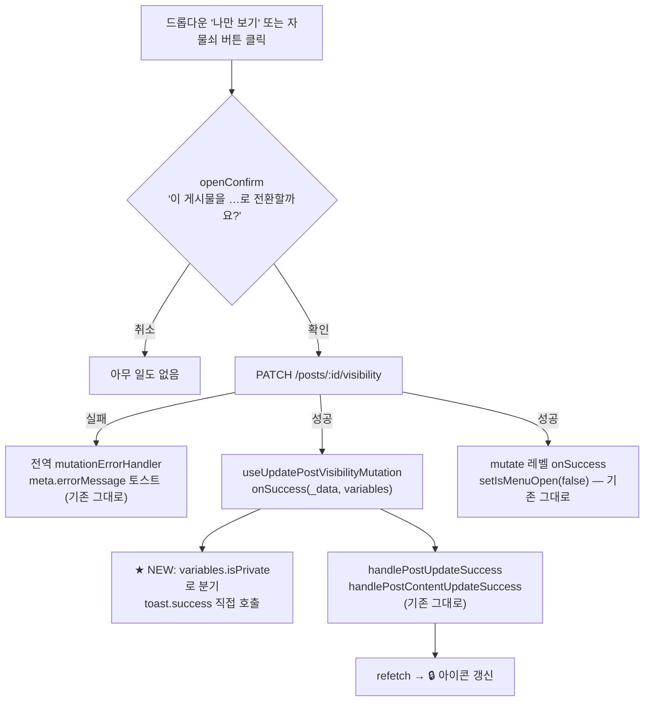

# 나만보기(공개범위) 토글에 방향별 성공 토스트 추가

## Context

게시물 나만보기 토글은 **성공하면 아무 말도 하지 않는다.** 실패 시에만 토스트가 뜬다
([post.queries.ts:364-366](src/entities/post/api/post.queries.ts#L364-L366)).

사용자 요청: 남에게 보여주고 싶지 않은 예민한 글을 감추는 순간이라 **확실히 반영됐는지**
알려달라는 것. 사용자가 고른 방식은 **방향별 분기 문구 + 양방향 모두 표시**다.

### 이 작업은 과거 결정의 부분 번복이다

`postVisibilityUpdated` 키는 원래 존재했고, **2026-08-04에 의도적으로 제거**됐다 —
`accountUpdated`·`postDeleted` 등 8개 키를 한꺼번에 정리하면서 "가시성 기준에 안 맞는다"는
이유였다([CHANGELOG.md:1684-1686](CHANGELOG.md#L1684-L1686)). 그 판단은
`texts-conventions` skill의 판정 표에 _"아이콘 상태 전환으로 이미 보임"_ 이라는 근거와 함께
지금도 남아 있다([SKILL.md:91](.claude/skills/texts-conventions/SKILL.md#L91)).

**그 근거가 코드와 맞지 않는다.** `isPrivate`를 참조하는 모든 소스를 grep한 결과
(테스트·목·스토리·생성 타입 제외), 렌더되는 UI에서 비공개 여부를 나타내는 것은
[PostCard.tsx:117](src/widgets/post/post-card/ui/PostCard.tsx#L117)의 자물쇠 버튼 하나뿐이고,
그 줄의 조건이 `isOwner && post.isPrivate`다:

| 전환 방향     | 화면에서 일어나는 일                       |
| ------------- | ------------------------------------------ |
| 비공개 → 공개 | 🔒 버튼이 **사라진다** (피드백 = "없어짐") |
| 공개 → 비공개 | 🔒 버튼이 생긴다 (7×7 아이콘, 카드 우상단) |

게다가 이 토글에는 낙관적 업데이트가 없다 — `invalidateQueries` → refetch가 끝나야 아이콘이
바뀌고, 주 진입점인 드롭다운은 그 전에 닫힌다
([usePostCard.ts:75-77](src/widgets/post/post-card/hooks/usePostCard.ts#L75-L77)).
즉 "토글은 아이콘 전환으로 즉시 보인다"는 판정 표의 전제는 **낙관적 업데이트가 있을 때만**
성립하는데, 이 토글엔 없다.

### 근거와 그 한계

NN/g의 Aurora Harley는 시스템 상태 가시성 휴리스틱 글에서
_"Whenever users interact with a system, they need to know whether the interaction was
successful."_ 라고 썼고, 피드백이 _"reduce uncertainty"_ 하며
_"The predictability of the interaction creates trust"_ 라고 덧붙인다
([Visibility of System Status (Usability Heuristic #1)](https://www.nngroup.com/articles/visibility-system-status/), 2018-06-03).

**한계 명시:** "프라이버시 토글은 특별히 더 강한 피드백이 필요하다"를 직접 입증하는 연구는
찾지 못했다. USC ISI의 Charnsethikul·Mirkovic 연구(PETS 2025,
[요약](https://www.isi.edu/news/80134/click-here-for-confusion-the-state-of-privacy-settings/))는
프라이버시 설정의 *발견 가능성*을 다루지 실행 후 확인 피드백은 다루지 않고, Instagram
선례도 _사전_ confirm 다이얼로그(이 레포에 이미 있음)까지만 확인됐다. 이 변경의 근거는
**일반 휴리스틱 + 위에서 직접 확인한 코드 상태**이지 프라이버시 전용 리서치가 아니다.

## 흐름



## 구현 위치: 왜 entities mutation `onSuccess`인가

| 후보                                           | 판정     | 이유                                                                                                                                                              |
| ---------------------------------------------- | -------- | ----------------------------------------------------------------------------------------------------------------------------------------------------------------- |
| **entities mutation `onSuccess(_data, vars)`** | **채택** | 언마운트와 무관하게 실행. `variables` 타입이 완전 추론됨. entities에서 `toast`를 import하는 선례 2건 존재                                                         |
| `meta.successMessage`                          | 불가     | 전역 핸들러가 **정적 문자열만** 받는다([queryClient.ts:86-97](src/shared/lib/react-query/config/queryClient.ts#L86-L97)) — 방향별 분기 불가                       |
| `CustomMutationMeta`를 함수형으로 확장         | 기각     | React Query 모듈 확장은 per-mutation 제네릭이 불가해 `variables`가 `unknown` → 캐스팅 강제. `Register.queryMeta`와 인터페이스를 공유해 쿼리 쪽에도 footgun이 생김 |
| widget hook의 `mutate(vars, { onSuccess })`    | **기각** | **가상 스크롤로 깨진다** (아래)                                                                                                                                   |
| `features/post/visibility/` 신설               | 기각     | 훅이 결국 `PostCard` 안에서 마운트되므로 위와 같은 문제. 문제를 옮기기만 함                                                                                       |

**가상 스크롤 기각 사유:** [PostList.tsx:89](src/widgets/post/post-list/ui/PostList.tsx#L89)와
[BookmarkPostList.tsx:57](src/widgets/bookmark/bookmark-post-list/ui/BookmarkPostList.tsx#L57)이
둘 다 `virtualizer.getVirtualItems()`로 화면 밖 행을 언마운트한다. confirm 확인 → PATCH
왕복 사이에 사용자가 스크롤만 해도 `PostCard`가 사라지고, `mutate` 레벨 `onSuccess`는
`hasListeners()` 가드에 걸려 **조용히 스킵**된다. 프라이버시 액션에서 "토스트가 랜덤하게
안 뜬다"는 최악의 실패 모드다. CLAUDE.md "React Query 라이프사이클 주의" 표가 이미
toast는 `useMutation({ onSuccess })` 레벨이라고 규정한다.

**선례:** entities에서 `toast`를 직접 import하는 파일 2개 —
[auth.queries.ts:9](src/entities/auth/api/auth.queries.ts#L9),
[account.queries.ts:14](src/entities/account/api/account.queries.ts#L14). 둘 다 `toast.error`만
쓰므로 `toast.success` 선례는 이번이 처음이다. ESLint 레이어 규칙상 `entities → shared`는
허용이라 위반은 아니다.

**토스트 중복 없음:** `meta.successMessage`를 설정하지 않으므로 전역 성공 핸들러는 발화하지
않는다. `meta.errorMessage`는 그대로 두고 **`manualErrorHandling`은 추가하지 않는다** —
추가하면 기존 실패 토스트가 사라져 회귀한다(그 플래그는 에러 경로만 억제한다).

## 변경 사항

### 1. `src/shared/config/texts.ts` — `messages.success`에 평문 2키 추가

`postUpdated`(`:346`) 바로 아래. 이름은 `postSetToPrivate` / `postSetToPublic` —
제거됐던 `postVisibilityUpdated`를 부활시키지 않는다(방향이 둘이라 단수형 키가 거짓말이 됨).

```
postSetToPrivate: '이 게시물을 나만 보기로 전환했어요.',
postSetToPublic: '이 게시물을 전체 공개로 전환했어요.',
```

> ⚠️ **사용자가 본 미리보기와 다르다.** 미리보기는 `'나만 보기로 바꿨어요.' + '이제 나만 볼
수 있어요.'` 2줄이었다. 위 안으로 바꾼 이유: 직전에 뜨는 confirm이
> [texts.ts:191](src/shared/config/texts.ts#L191) `'이 게시물을 ${action} 전환할까요?'`이고
> 실패 토스트도 `'게시물 공개 설정 변경에 실패했어요.'`라, 같은 명사("게시물")·같은
> 동사("전환")를 쓰는 쪽이 세 문장이 한 흐름으로 읽힌다. 2줄 형태를 원하면 되돌리기는
> 한 줄 수정이다.

톤: 해요체 + 능동형 + 마침표. 가드 테스트 `texts.test.ts`의 금지 패턴(`/니다[.:]?$/`,
`/니까\?$/`)에 걸리지 않아 통과한다.

### 2. `src/entities/post/api/post.queries.ts` — `useUpdatePostVisibilityMutation`

- 상단에 `import { toast } from '@/shared/lib/toast/toast';`
- [`:367`](src/entities/post/api/post.queries.ts#L367)의 `onSuccess`를 `(_data, variables) =>`로
  바꾸고 `variables.isPrivate`로 분기해 `toast.success()` 호출
- `meta`는 `errorMessage`만 유지 — `successMessage`·`manualErrorHandling` 추가 금지
- **주석 필수**: 왜 `meta.successMessage`가 아닌지(정적 문자열 한계)와 왜 `mutate` 레벨이
  아닌지(가상 스크롤 언마운트)를 `파일:줄`로 가리킨다

### 3. `src/entities/post/api/post.queries.test.ts` — 새 describe 추가

이 mutation은 현재 테스트가 전혀 없다. 이 파일은 `renderHook` + 로컬
`createTestQueryClient()` 패턴을 쓴다(`renderWithProviders` 아님). MSW 핸들러는
`/${POST_ID}/visibility` 경로로 `server.use`에 직접 등록해야 한다 — 기본 핸들러에 없고
`onUnhandledRequest: 'warn'`이라 빠뜨리면 조용히 실패한다.

toast는 `vi.spyOn(toast, 'success')` + `afterEach(vi.restoreAllMocks)`로 잡는다
(선례: [useFolderActions.test.ts:164](src/widgets/bookmark/folder-tree/hooks/useFolderActions.test.ts#L164)).
전역 `setup.ts`는 `sonner`만 모킹하고 래퍼는 실제 코드가 돈다.

케이스 4개:

1. `isPrivate: true` 성공 → `postSetToPrivate`로 **정확히 1회**
2. `isPrivate: false` 성공 → `postSetToPublic`으로 1회
3. 실패 → `expect(successSpy).not.toHaveBeenCalled()`
4. **언마운트 후에도 토스트가 뜬다** — 핸들러에 지연을 넣고 `mutate()` 직후 `unmount()`.
   구현 위치 선택의 근거를 코드로 못 박는 회귀 가드

### 4. `e2e/post-visibility.spec.ts` — assertion 1줄씩 추가

기존 두 테스트는 토스트를 기다리지 않는다. 이 작업의 사용자 가치가 토스트 자체이므로
각 방향에 `await expect(page.getByText(TEXTS.messages.success.postSetToPrivate)).toBeVisible();`
를 PATCH 대기 직후에 넣는다(sonner 기본 4초 dismiss라 뒤로 미루면 flaky).

### 5. 문서

| 파일                                          | 무엇을                                                                                                                                                                                                                                                                                     |
| --------------------------------------------- | ------------------------------------------------------------------------------------------------------------------------------------------------------------------------------------------------------------------------------------------------------------------------------------------ |
| `.claude/skills/texts-conventions/SKILL.md`   | `:91` 불필요 칸에서 `postVisibilityUpdated` 제거 → 필요 칸으로 재분류. `:78-83` 가시성 축에 **"토글도 낙관적 업데이트가 있을 때만 즉시 보인다"** 예외 추가. 2026-08-04 판정을 왜 뒤집는지 명시                                                                                             |
| `docs/FE-ARCHITECTURE.md` §14(`:800-801`)·§15 | 성공 토스트 소유권이 `meta.successMessage`로만 규정돼 있다(§13은 제목부터 "에러 핸들링 전략"이라 성공 토스트를 한 줄도 안 다룬다). **"정적 문자열만 — `variables`로 분기할 땐 그 mutation의 `onSuccess`에서 직접 호출하고 `successMessage`는 비운다"** 예외를 §14에 추가하고 §15 표에 부기 |
| `docs/TESTING.md:679`                         | `e2e/post-visibility.spec.ts` 행 끝에 `, 방향별 성공 토스트` 추가                                                                                                                                                                                                                          |
| `CHANGELOG.md`                                | `[Unreleased]` → `### Added`. `changelog-release` skill을 먼저 읽고 포맷 준수                                                                                                                                                                                                              |

**`docs/DECISIONS.md`에는 넣지 않는다.** 그 문서의 기준은 "되돌리기 어렵고, 실제로 대안을
비교해 선택한" 결정 **둘 다** 충족이다. 토스트 추가는 한 줄로 되돌릴 수 있으므로 대상이
아니다. 판정이 뒤집힌 경위는 그 판정이 실제로 사는 곳인 SKILL.md에 남긴다.

## 범위 밖 (언급만, 건드리지 않음)

- **낙관적 업데이트 추가** — 서버가 `Post`를 반환하는데 버리고 invalidate만 한다. 바로 옆
  `useUpdatePostMutation`은 `setQueryData`로 즉시 반영하는데
  ([post.queries.ts:331-348](src/entities/post/api/post.queries.ts#L331-L348)) visibility는 안 한다.
  고치면 아이콘 반영이 빨라지지만 요청 범위 밖이다.
- **[usePostCard.ts:31](src/widgets/post/post-card/hooks/usePostCard.ts#L31)의 `mutateAsync`** —
  `await`/`.catch()` 없이 호출해 실패 시 unhandled rejection이 남는다(`mutate`면 충분).
  이번 변경으로 생긴 게 아닌 기존 문제라 CLAUDE.md §3에 따라 손대지 않는다.
- **[PostCard.tsx:124](src/widgets/post/post-card/ui/PostCard.tsx#L124)의 도달 불가 분기** —
  렌더 조건이 `post.isPrivate`인데 `title`에서 다시 분기해 `makePrivate`는 절대 실행 안 된다.
- **비공개 표시가 자물쇠 아이콘 하나뿐인 문제** — 별도 논의 대상.

## 구현 절차

1. `EnterWorktree` (미푸시 커밋 없음 확인 완료 → 기본값 `fresh` 안전, Node v24.20.0 ✓)
2. 부트스트랩: `cp ../../../.env .` → `pnpm install`
3. 변경 1 → 2 → 3 → 4 → 5 순서로 적용
4. 아래 검증
5. 커밋 — `.gitmessage` 형식, `git commit -- <경로>`로 대상 지정 (`git add` 금지)

## 검증

```bash
pnpm type-check   # tsc -b --noEmit (루트 tsconfig는 솔루션 스타일이라 -b 필수)
pnpm test         # 새 유닛 테스트 4개 포함 통과
pnpm lint         # 레이어 경계 + 한글 하드코딩 차단
pnpm test:e2e e2e/post-visibility.spec.ts
pnpm check:docs   # SKILL.md·FE-ARCHITECTURE.md·TESTING.md의 경로·줄번호 정합성
```

**브라우저 확인** — `browser-verification` skill 절차로 녹화. `PostCard`가 렌더되는 3개
화면 모두: 피드(`PostList`, 가상 스크롤) · 북마크(`BookmarkPostList`, 가상 스크롤) ·
상세(`PostDetailPage`, 단일).

1. 공개 → 비공개: 토스트 1개, 🔒 생김
2. 비공개 → 공개: 토스트 1개, 🔒 사라짐
3. 토스트가 2개 겹쳐 뜨지 않는지 (전역 중복 회귀 가드)
4. 실패 시 에러 토스트만 뜨고 성공 토스트는 안 뜨는지
5. **confirm 확인 직후 빠르게 스크롤해 카드를 화면 밖으로 보내도 토스트가 뜨는지** —
   구현 위치 선택의 근거를 눈으로 증명하는 시나리오

## PR 전

CLAUDE.md §11에 따라 이 계획 파일을 `docs/plans/2026-09-21-post-visibility-toast.md`로
커밋하고, fresh Explore subagent에게 계획 ↔ diff 대조를 맡겨 PR 본문에
`## 계획 대비 구현` 섹션으로 남긴다.
