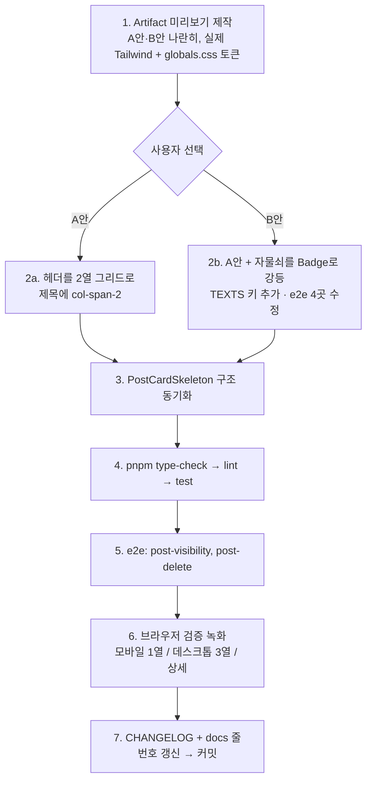

# PostCard 제목이 자물쇠·케밥 아이콘에 폭을 빼앗기는 문제 개선

## Context

포스트 카드에서 제목이 오른쪽 아이콘 그룹(자물쇠 🔒 + 케밥 ⋮) 때문에 폭이 좁아져 일찍
개행된다. 사용자가 스크린샷과 함께 지적: "자물쇠 버튼 아이콘 있는 영역이 제목 자리까지
차지해버린다".

### 현재 구조 (`src/widgets/post/post-card/ui/PostCard.tsx:84-176`)

자물쇠·케밥은 제목과 "같은 행"에 있는 게 아니라, **[작성자 행 + 제목]을 묶은 왼쪽 컬럼
전체의 형제 컬럼**이다. `items-start`라 아이콘은 세로 상단에 고정되고, 제목은 아이콘
아래 빈 공간을 쓰지 못한다.

```
CardHeader  [flex items-start justify-between]  ← 베이스의 gap-2(8px)가 twMerge에서 생존
├─ div.space-y-1.flex-1.min-w-0
│  ├─ 아바타 + 닉네임 + • + 시간   (짧음 → 오른쪽이 빔)
│  └─ h3 제목 (line-clamp-3)       ← 좁아진 폭으로 조기 개행
└─ div.shrink-0                    ← 🔒(28/32px) + ⋮(28/32px) + gap ≈ 66~76px
```

### 제목이 잃는 폭 (클래스 값 기반 계산 — 브라우저 실측 아님)

| 뷰포트           | 헤더 내부 폭 | 아이콘 그룹 + gap | 제목 실제 폭 | 손실 |
| ---------------- | ------------ | ----------------- | ------------ | ---- |
| 데스크톱 3열     | ≈328px       | 32+4+32+8 = 76px  | ≈252px       | -23% |
| 모바일 1열       | ≈334px       | 28+2+28+8 = 66px  | ≈268px       | -20% |
| 상세(`isDetail`) | ≈872px       | 76px              | ≈796px       | -9%  |

제목 폰트가 모바일 14px(`--text-card-title`) / 데스크톱 18px(`md:text-t6`)이라 한 줄당
한글 4~5자, `line-clamp-3`까지 합치면 제목 12~15자가 조기에 잘린다.

### 조사 중 추가로 확인한 것

1. **`gap-2` 8px가 숨어 있다** — `src/shared/ui/atoms/card.tsx:24`의 CardHeader 베이스에
   `gap-2`가 있는데 PostCard가 `gap-*`를 지정하지 않아 tailwind-merge에서 살아남는다.
   `gap-x-*`/`gap-y-*`로는 못 지우고 plain `gap-*`로만 덮인다.
2. **남의 글 카드도 8px를 낭비한다** — 자물쇠·케밥은 `isOwner`일 때만 렌더되지만 감싸는
   `<div>`(`PostCard.tsx:116`)는 항상 렌더되어 빈 칸 + gap이 남는다.
3. **가상 스크롤은 안전하다** — `PostList.tsx:100`, `BookmarkPostList.tsx:69`가
   `ref={virtualizer.measureElement}`로 행을 실측하므로 카드 높이 변화가 자동 보정된다.
4. **`CardAction` 슬롯은 못 쓴다** — `card.tsx:62`가 `row-span-2`라 두 행 모두에 우측
   거터를 예약한다. 지금 문제와 같은 구조.
5. **자물쇠의 `title` 삼항은 죽은 코드** — 렌더 가드가 `post.isPrivate`라
   `PostCard.tsx:124`의 `: TEXTS.post.card.makePrivate` 분기는 도달 불가.
6. **e2e가 자물쇠를 `getByTitle`로 잡는다** — `e2e/post-visibility.spec.ts:82, 93, 102, 116`.
   `:82, :93`은 "비공개로 바뀌었다"의 유일한 화면 검증 수단이다. 같은 파일 `:100`은
   제목을 `getByRole('heading', { level: 3 })`로 찾으므로 `h3` 태그는 유지해야 한다.

## 진행 흐름



## 1단계 — 미리보기 아티팩트 (먼저 할 일)

CLAUDE.md §9에 따라 코드를 고치기 전에 Artifact 한 장에 **A안·B안을 나란히** 렌더해
사용자가 고르게 한다. 근사 목업이 아니라 실물이어야 하므로:

- `src/app/globals.css`에서 `--text-card-title`, `--text-t6`, `--color-muted-foreground`,
  `--color-secondary`, `--radius` 등 실제 토큰 값을 읽어 CDN Tailwind의 `:root`에 그대로
  이식한다.
- 스크린샷의 실제 데이터("남극공 · 2개월 전", 긴 한글 제목)를 넣어 개행 지점을 확인한다.
- 모바일 1열(390px) / 데스크톱 3열(≈352px) 두 폭을 같은 페이지에 나란히 둔다.
- 비교 대상: **현재(as-is) / A안 / B안** 3열.

### A안 — 헤더를 2열 그리드로, 제목만 `col-span-2` (추천)

자물쇠는 지금처럼 아이콘 버튼으로 두고 위치만 메타 행 우측 칸으로 옮긴다.
기능·테스트 계약을 하나도 건드리지 않으면서 제목 폭을 100% 회복한다.

### B안 — A안 + 자물쇠를 "나만 보기" Badge로 강등

`src/widgets/comment/comment-list/ui/CommentItem.tsx:63-72`의 "작성자" 배지 선례를 따라
`<Badge variant="secondary" className="px-1.5 py-0 text-micro h-4 shrink-0">`. 상태가
글자로 보여 발견성은 오르지만 원클릭 토글이 사라지고(케밥 메뉴로 일원화) e2e 4곳과
`TEXTS` 키 추가가 따라온다.

## 2단계 — 구현 (A안 기준, `PostCard.tsx:84-176`)

1. `flex flex-row justify-between` → `grid grid-cols-[1fr_auto]`.
   베이스의 `auto-rows-min grid-rows-[auto_auto] items-start`가 비로소 제대로 동작한다.
2. `<div className="space-y-1 flex-1 min-w-0">` 래퍼 제거 — 메타 행과 `<Link>`가 헤더의
   직접 자식이 된다.
3. 메타 행: `mb-1` 제거 + `min-w-0` 추가. **간격은 베이스 `gap-2`(8px)가 대신한다** —
   현재 `space-y-1`(4px) + `mb-1`(4px) = 8px와 값이 같아 시각 변화가 없다.
   따라서 `gap-0`을 넣으면 안 된다.
4. `<Link>`에 `col-span-2`. `h3` 태그·클래스는 그대로 둔다(e2e `:100` 의존).
5. `isOwner` 가드를 아이콘 래퍼 `<div>`로 승격 — 남의 글의 빈 칸 + gap 낭비 제거.
6. 아이콘 래퍼에 `-my-0.5 md:-my-1` — 28/32px 버튼이 아바타 24px 행을 밀어올려 카드가
   커지는 걸 막는다. **왜 음수 마진인지 주석 필수**.
7. 메타 행의 `•`·날짜에 `shrink-0` — 가용 폭이 66~76px 줄었으므로 닉네임만 줄어들게
   고정한다(`CommentItem.tsx:70` 선례).
8. 자물쇠에 `aria-label={TEXTS.post.card.makePublic}` 추가(`title`은 유지 → e2e 무영향),
   죽은 삼항 `: TEXTS.post.card.makePrivate` 제거.

주석은 이 레포 관행대로 "왜 `CardAction`을 안 쓰는가", "왜 음수 마진인가"를 남긴다
(`MyCommentCard.tsx:11-15` 선례).

## 3단계 — 스켈레톤 동기화 (`PostCardSkeleton.tsx:11-20`)

현재 `space-y-1` + `mb-1` = 8px라 새 `gap-2`와 값이 같아 **높이는 동일하고 레이아웃
시프트가 없다**. 다만 `:5-6` 주석이 "PostCard와 동일하게 맞춘다"고 선언하므로 같은
커밋에서 구조만 맞춘다(오른쪽 아이콘 칸은 원래 없으므로 추가하지 않는다).

## 검증

```bash
pnpm type-check
pnpm lint
pnpm test
pnpm exec playwright test e2e/post-visibility.spec.ts e2e/post-delete.spec.ts
```

A안은 **e2e를 한 줄도 고치지 않고 통과해야 정상**이다. 실패하면 설계 가정이 틀린 것.

그다음 `.claude/skills/browser-verification` 절차로 브라우저 녹화:

- 모바일 1열 / 데스크톱 3열 / 상세(`isDetail`) × (내 비공개 글 / 내 공개 글 / 남의 글)
- 확인 항목: ① 헤더 1행 높이가 안 늘었는가 ② 긴 닉네임 절삭이 과하지 않은가
  ③ 제목이 실제로 카드 끝까지 가는가 ④ 라이트/다크 모두 정상인가

## 회귀 위험

| #   | 위험                                     | 파일                                             | A안 영향                                                       |
| --- | ---------------------------------------- | ------------------------------------------------ | -------------------------------------------------------------- |
| R1  | `getByTitle(makePublic)` 4곳             | `e2e/post-visibility.spec.ts:82,93,102,116`      | 없음(`title` 유지). B안 선택 시만 수정                         |
| R2  | `getByRole('heading', level:3)`          | `e2e/post-visibility.spec.ts:100`                | 없음(`h3` 유지)                                                |
| R3  | 케밥을 `postMenu` aria-label로 찾는 스펙 | `post-visibility.spec.ts`, `post-delete.spec.ts` | 없음                                                           |
| R4  | 스켈레톤↔실제 레이아웃 시프트            | `PostCardSkeleton.tsx:5-6,11-20`                 | 간격 8px 보존 → 시프트 없음                                    |
| R5  | 가상 스크롤 행 높이                      | `PostList.tsx:100`, `BookmarkPostList.tsx:69`    | `measureElement` 실측 → 자동 보정                              |
| R6  | 초기 높이 추정 중앙값                    | `post-grid.const.ts:27-31`                       | 첫 페인트 근사만 영향, 가드 테스트 무관                        |
| R7  | 상세 페이지                              | `PostDetailPage.tsx:90`                          | `line-clamp` 없어 폭만 +76px → 줄 수 감소                      |
| R8  | **긴 닉네임 조기 절삭**                  | `PostCard.tsx:99`                                | 메타 행 -66~76px. 날짜/구분점 `shrink-0`으로 완화              |
| R9  | 포커스 순서가 "아이콘 → 제목"으로        | 새 DOM 순서                                      | 시각 순서(위→아래)와 일치. 제목 링크 도달에 Tab 1~2회 추가     |
| R10 | 다크모드                                 | —                                                | A안은 색 클래스를 하나도 추가하지 않음                         |
| R11 | 문서의 줄 번호 인용                      | `docs/DECISIONS.md:463`                          | `pnpm check:docs`는 범위만 검사해 통과하나 의미상 stale → 갱신 |

**본질적 트레이드오프**: 제목이 얻는 66~76px를 메타 행이 내준다. 닉네임 예산은 데스크톱
≈176px(12px 폰트 기준 한글 ~14자), 모바일 ≈192px(~16자). 카드의 목적(무엇에 관한
링크인가)상 제목 우선이 맞다고 보지만, 미리보기에서 긴 닉네임 케이스를 함께 확인한다.

## 마무리

- `CHANGELOG.md` `[Unreleased]`에 항목 추가(동작이 바뀌는 UI 변경).
- `docs/DECISIONS.md:463`의 `PostCard.tsx:93,269` 줄 번호 갱신.
- 커밋 전 `.gitmessage` 확인. 워크트리에서 작업(`EnterWorktree` → `cp ../../../.env .`
  → `pnpm install`).

## 범위 밖 — 별도 제안 (이번 커밋에 넣지 않음)

1. **모바일 터치 타깃 44px** — 현재 28px는 WCAG 2.2 SC 2.5.8(24px, AA)은 통과하지만
   WCAG 2.1 SC 2.5.5(44px, AAA)와 레포 규약(`responsive-ux` skill)에는 미달.
   A안 이후엔 이 버튼이 헤더 1행 높이를 결정하므로 헤더가 ~20px 커진다 → 별도 설계 필요.
   - https://www.w3.org/WAI/WCAG22/Understanding/target-size-minimum.html
   - https://www.w3.org/WAI/WCAG21/Understanding/target-size.html
2. **자물쇠 ↔ 케밥 토글 기능 중복** — 같은 액션이 두 경로에 있다(= B안 논점).
3. **공개 글·남의 글엔 공개 상태 표시가 전혀 없음** — 의도된 설계인지 확인 필요.

### 핵심 파일

- `src/widgets/post/post-card/ui/PostCard.tsx` (헤더 블록 `:84-176`)
- `src/widgets/post/post-list/ui/PostCardSkeleton.tsx`
- `src/shared/ui/atoms/card.tsx` (읽기 전용 — 베이스 클래스 확인)
- `src/app/globals.css` (읽기 전용 — 미리보기 아티팩트용 토큰 값)
- `e2e/post-visibility.spec.ts` (A안은 무수정 통과 확인용)
- `src/shared/config/texts.ts` (B안 선택 시에만)
