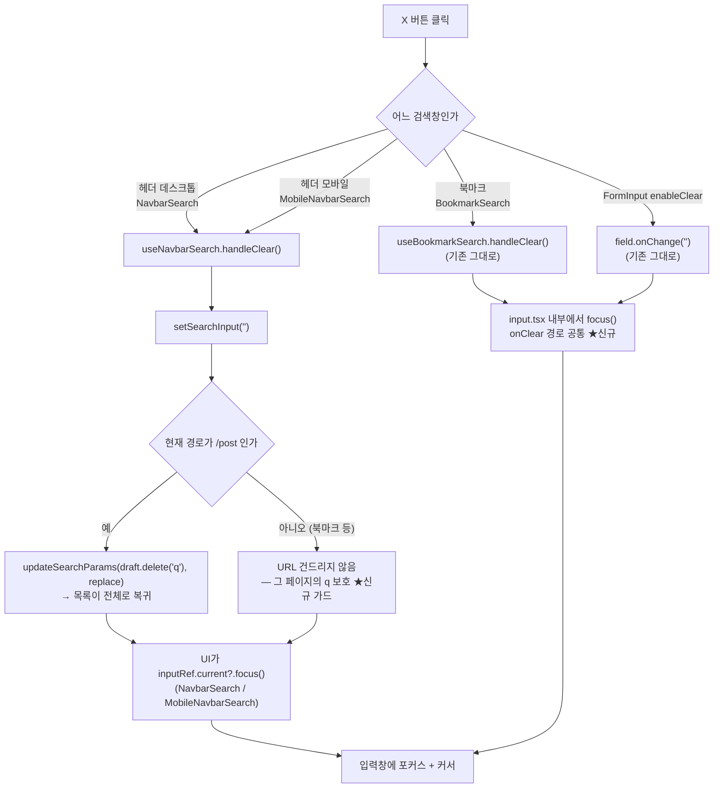

# 검색창 X 버튼: 입력창 포커스 복원 + 헤더 X의 검색 해제 통일

## Context

포스트 검색(헤더)의 X 버튼을 누르면 입력값만 비워지고 포커스가 `<body>`로 떨어진다. 사용자는
"북마크 내 검색은 포커스가 돌아오는데 포스트는 안 된다"고 봤지만, **코드를 추적한 결과 북마크에도
그 동작은 없다** — 레포 전체에서 clear 직후 `.focus()`를 호출하는 코드는 0건이다(`.focus()`는
`/` 단축키 핸들러와 댓글 폼에만 있다).

X 버튼은 `값 > 0`일 때만 렌더되므로 누르는 순간 언마운트되고, 포커스를 잃는다. 이는
GitLab Pajamas가 짧게 정리한 그대로다 — _"Focus is lost when the focused element is removed from
the document object model (DOM)."_ ([Pajamas Focus management](https://design.gitlab.com/accessibility/focus-management/))

표준 해법은 입력창으로 포커스를 되돌리는 것이다. Scott O'Hara의 Clear Text Field Button 패턴 문서는
_"Clicking or tapping the button will result in it being set to the hidden state, the text field's
value becoming the empty string, and focus being placed into the text field."_ 라고 규정한다
([scottaohara.github.io/clear-text-field-button](https://scottaohara.github.io/clear-text-field-button/)).
Shoelace 메인테이너(claviska)도 같은 지적을 받고 이 문서를 선례로 인용하며
[discussion #1905](https://github.com/shoelace-style/shoelace/discussions/1905) → PR #1911에서 고쳤다.

조사 과정에서 두 검색창의 **실제 차이**도 드러났다: 북마크 X는 URL `q`까지 지워 검색을 해제하고,
헤더 X는 입력값만 비워 검색 결과를 그대로 남긴다(기존 테스트가 이 동작을 의도로 못박고 있다 —
`NavbarSearch.test.tsx:72`, `MobileNavbarSearch.test.tsx:38`). 사용자가 **헤더도 검색 해제하도록
통일**하기로 결정했다(2026-09-21).

### 의도한 결과

1. X가 달린 검색창 3곳 모두, X 클릭 후 포커스가 입력창으로 돌아온다.
2. 헤더 X도 북마크처럼 URL `q`를 지워 검색을 해제한다 — 단 `/post`에 있을 때만.

## 변경 후 흐름



**헤더가 `Input`의 `onClear`를 쓰지 않는 이유**(통합하지 않는 근거): 데스크톱은 X가 사라진 자리에
`/` 단축키 힌트(`Kbd`)를 교대로 보여주고, 모바일은 값이 비어도 X가 "닫기"로 남아야 한다. `input.tsx`의
X는 `props.value`가 있을 때만 렌더되므로 두 요구를 모두 표현할 수 없다.

## 변경할 파일

### 1. `src/shared/ui/atoms/input.tsx` — onClear 경로에 포커스 복원 내장

`forwardRef`로 받은 ref 옆에 내부 `useRef`를 두고 기존
[`useMergedRef`](src/shared/hooks/useMergedRef.ts)로 합친다(선례: `SearchInput.tsx:22-23`이 이미 같은
방식). X `onClick`을 `onClear` 직접 연결에서 래퍼 핸들러로 바꿔 `onClear?.()` 뒤에 `inputRef.current?.focus()`를
호출한다. 근거 URL을 주석으로 남긴다(CLAUDE.md §10).

이 한 곳으로 **북마크 검색**(`BookmarkSearch` → `SearchInput` → `Input`)과 `FormInput`의
`enableClear`(`FormInput.tsx:45`)가 함께 해결된다.

- `Input`은 `React.ComponentProps<'input'>` 확장이라 시그니처 변경 없음 — 순수 내부 변경.
- 기존 `input.stories.tsx:69-84`의 `WithClear` 스토리가 그대로 새 동작을 실행하므로 스토리 신설 불필요.

### 2. `src/widgets/layout/navbar/hooks/useNavbarSearch.ts` — `handleClear` 추가

반환값에 `handleClear`를 **추가**한다(기존 `searchInput`/`setSearchInput`은 그대로 유지).
선례는 [`useBookmarkSearch.ts:18-40`](src/widgets/bookmark/bookmark-search/hooks/useBookmarkSearch.ts#L18-L40)
— `useSearchParamsDraft().updateSearchParams(draft => draft.delete('q'), { replace: true })` 형태를
그대로 따른다.

핵심은 **경로 가드**다. 헤더 검색창은 전역(`AppLayout.tsx:58`)이라 북마크 페이지에서도 보이고,
북마크도 같은 이름의 `q`를 쓴다(이 훅의 기존 JSDoc이 이미 경고하는 내용). 가드 없이 `q`를 지우면
북마크 페이지에서 헤더 검색창에 타이핑하다 X를 누르는 순간 **북마크 검색이 풀린다.** 훅이 이미 계산하는
`isPostListPage`로 막는다.

```
handleClear()
  setSearchInput('')
  if (!isPostListPage) { return }        ← 가드절 뒤 빈 줄 (CLAUDE.md 컨벤션)
  updateSearchParams(draft => draft.delete('q'), { replace: true })
```

`replace: true`를 쓰는 이유: 북마크 선례와 동일하고, `PostListSearch.tsx:90-97`의 주석이 경고하는
"같은 URL로 history entry만 쌓임" 문제를 피한다. `filter` 등 다른 파라미터는 draft 방식이라 보존된다.

### 3. `src/widgets/layout/navbar/ui/NavbarSearch.tsx` — X 핸들러 교체

인라인 `onClick={() => setSearchInput('')}`(`:48`)을 훅의 `handleClear()` + `inputRef.current?.focus()`를
부르는 핸들러로 바꾼다. `inputRef`는 이미 `/` 단축키용으로 존재(`:14`)하므로 재사용한다.

### 4. `src/widgets/layout/navbar/ui/MobileNavbarSearch.tsx` — ref 추가 + clear 분기 수정

`useRef<HTMLInputElement>(null)`을 새로 만들어 `Input`에 연결하고, `handleTrailingIconClick`의
clear 분기(`:21-22`)를 `handleClear()` + `focus()`로 바꾼다. 닫기 분기(`onClose`)는 건드리지 않는다.

### 5. 테스트

**수정**(기존 계약이 뒤집히므로):

- `src/widgets/layout/navbar/ui/NavbarSearch.test.tsx:72-81` — `'X를 누르면 input만 비워지고 URL의
q는 그대로 남는다'` → `q`가 삭제되는지 검증하도록 변경.
- `src/widgets/layout/navbar/ui/MobileNavbarSearch.test.tsx:38-48` — 같은 변경. `onClose`가 호출되지
  않는다는 단언은 유지.

**추가**:

- 헤더 X 클릭 후 `document.activeElement`가 입력창인지 (데스크톱·모바일 각 1건).
- **회귀 방지 핵심**: `/bookmark?q=...`에서 헤더 검색창에 타이핑한 뒤 X를 눌러도 URL의 `q`가
  그대로인지. 두 테스트 파일의 `LocationSearchProbe` 패턴을 재사용한다.
- 북마크 검색 X 클릭 후 포커스 복원 — `src/widgets/bookmark/bookmark-search/`에 테스트가 없으므로
  `BookmarkSearch.test.tsx`를 신설한다(`renderWithProviders` + `wrapperOptions.initialEntries` 패턴 동일).

### 6. `CHANGELOG.md`

`[Unreleased]`에 `Fixed` 항목 추가(fix 커밋이므로 같은 커밋에 포함). 작성 전
`changelog-release` skill을 읽는다.

## 영향 범위와 회귀 위험 (CLAUDE.md §5)

| 위험                              | 내용                                                                                                                               | 대응                                                                                                                                                    |
| --------------------------------- | ---------------------------------------------------------------------------------------------------------------------------------- | ------------------------------------------------------------------------------------------------------------------------------------------------------- |
| **북마크 검색이 헤더 X로 풀림**   | 헤더는 전역이고 북마크도 `q`를 씀                                                                                                  | `isPostListPage` 가드 + 전용 테스트                                                                                                                     |
| **중간 리페치 1회 발생**          | 검색어를 바꾸려고 X를 누르면 전체 목록을 한 번 재요청한 뒤 새 검색어로 또 요청                                                     | 사용자가 선택한 트레이드오프 — 아래 별도 항목                                                                                                           |
| `q` 전체가 날아감                 | `q`에는 `category:`·`@nickname` 토큰이 함께 인코딩된다(`usePostListParams:37`, `search-parser.ts`) → X는 카테고리 조건도 함께 해제 | 헤더 input이 보여주는 값이 곧 `q` 전체이므로 "보이는 걸 지운다"와 일치 — 의도대로 둔다                                                                  |
| Suspense로 인한 포커스 소실       | `q` 변경 시 `useSuspenseFetchPostListQuery`가 suspend할 수 있음                                                                    | **위험 없음** — `withSuspense(Post)`(`routes/index.tsx:109`)는 `AppLayout`의 `<main>` 안이고 `Navbar`는 그 형제(`AppLayout.tsx:58`)라 언마운트되지 않음 |
| `FormInput enableClear` 동작 변화 | atom 변경이 `FormInput.tsx:45`에도 전파                                                                                            | `src` 내 실사용처 없음(스토리만) — 영향 미미, 변화 방향도 동일하게 바람직                                                                               |

CRUD 영향 없음 — URL 쿼리 파라미터와 포커스만 다루고 서버 데이터를 쓰지 않는다.

### 사용자가 체감하는 트레이드오프 (§7 — 이미 승인받음)

헤더 X가 검색을 해제하게 되면서, **"결과를 보면서 검색어만 바꿔 다시 검색"하는 흐름이 사라진다.**
X를 누르는 순간 목록이 전체로 리셋되고(네트워크 요청 1회), 새 검색어를 입력해 Enter하면 또 한 번
요청한다. 사용자가 2026-09-21에 이 통일을 명시적으로 선택했으므로 그대로 진행한다.

## 하지 않는 것 (범위 밖 — 발견만 기록)

- X 버튼을 탭 순서에서 빼기. Scott O'Hara 문서는 _"The clear button is purposefully not in the
  tabbing order of the web page."_ 라고 권고하지만, 우리 X 3곳은 모두 `<Button>`이라 탭 순서에
  들어가 있다. 별개 접근성 작업이라 이번에 건드리지 않는다.
- `input.tsx`의 X는 `aria-label` 없이 `sr-only "Clear"`(영문)를 쓰고, 헤더 X는
  `TEXTS.ariaLabels.inputClear`(`'입력값 지우기'`)를 쓴다 — 라벨 불일치가 있으나 범위 밖.
- `NavbarSearch`를 `SearchInput`(`shortcut` + `onClear`)으로 리팩터링해 중복 제거하기.

## 검증

```bash
node -v                 # v24 확인 (.nvmrc)
pnpm type-check
pnpm test               # 수정·신설 테스트 포함 전체
pnpm lint
```

브라우저 수동 확인(`browser-verification` skill 절차, 커밋 전):

1. `/post?q=리액트` → 헤더 X 클릭 → 입력창에 커서가 남고, URL에서 `q`가 사라지며 목록이 전체로 복귀
2. 그 상태에서 바로 타이핑이 되는지 (포커스 복원 확인)
3. `/bookmark?q=폴더검색어` → 헤더 검색창에 아무거나 입력 → X 클릭 → **북마크 검색이 유지되는지**
4. 북마크 페이지 자체 검색창 → X 클릭 → 포커스가 그 입력창에 남는지
5. 모바일 폭(≤768px) → 검색 아이콘 → 검색어 입력 후 X → 값이 지워지고 포커스 유지, 패널은 안 닫힘
   → X 한 번 더 → 패널이 닫힘

> 참고: 이번 세션에서는 다른 세션이 Playwright MCP 브라우저를 점유 중(`Browser is already in use`)이라
> 사전 실측을 하지 못했다. 위 결론은 전부 코드 추적 결과다.
