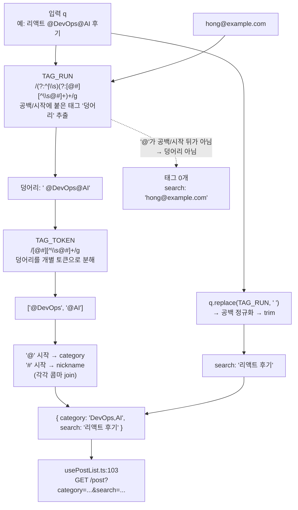

# 검색 태그 파서 경계 수정 — `@a@b` 붙여쓰기 지원

## Context

게시글 검색은 `@카테고리`·`#닉네임`을 자유 입력 문법으로 받는다. 공백으로 띄우면
(`@라이프스타일 @데이터`) 정상 동작하지만, **붙여 쓰면(`@라이프스타일@데이터`) 조용히 0건**이
된다. 사용자가 실사용 중 발견해 보고했다.

원인은 [`search-parser.ts:17`](../../project/link-sphere/link-sphere_FE_NEW/src/widgets/post/post-list/utils/search-parser.ts)·`:20`의 정규식 `/@(\S+)/g`·`/#(\S+)/g`다.
`\S`에 `@`·`#`가 포함되므로 토큰이 다음 sigil에서 멈추지 않는다.

| 입력                    | 현재 결과                                                                          |
| ----------------------- | ---------------------------------------------------------------------------------- |
| `@라이프스타일 @데이터` | `{category:'라이프스타일,데이터'}` ✅                                              |
| `@라이프스타일@데이터`  | `{category:'라이프스타일@데이터'}` → 0건                                           |
| `@라이프스타일#철수`    | `{category:'라이프스타일#철수', nickname:'철수'}` → 0건 (미보고 케이스, 같은 원인) |

BE는 이 값에 **에러를 내지 않는다** — `PostController.kt:41-47`이 전부 `String?`이고 검증
애노테이션이 없어 `200 OK` + `totalElements: 0`이 된다. 즉 순수 FE 파싱 버그다.

**목표**: 태그 경계를 명시적으로 정의해 붙여쓰기를 지원하고, 같은 규칙으로 기존 오탐
(`hong@example.com` → `category:'example.com'`)도 해소한다. **사용자 입력 텍스트는 건드리지
않는다.**

## 결정: 입력 정규화 없이 파서만 고친다 (사용자 승인 2026-09-21)

"제출 전에 자동으로 띄워주기"를 검토했으나 채택하지 않았다. 조사 결과 **사용자가 친 검색어를
제품이 고쳐 쓰는 선례를 찾지 못했다** — 자리 잡은 제품들은 공백을 요구하고, 어기면 평문
폴백(GitHub 코드 검색: _"must be separated from one another with spaces"_ / _"It often falls
back on treating that component of your query as the exact text to search for"_,
[GitHub Docs](https://docs.github.com/en/search-github/github-code-search/understanding-github-code-search-syntax))
하거나 아예 추출하지 않는다(Twitter `twitter-text` 적합성 테스트:
`description: "DO NOT extract a hashtag without a preceding space"` / `expected: []`,
[conformance/extract.yml](https://github.com/twitter/twitter-text/blob/master/conformance/extract.yml)).
문법을 알려주는 관례적 수단은 rewrite가 아니라 경고·자동완성이었다(GitHub 이슈 필터 문서:
_"As you type your filter, GitHub will show available qualifiers, suggest values, and warn
when there is a problem with your filter."_,
[GitHub Docs](https://docs.github.com/en/issues/tracking-your-work-with-issues/using-issues/filtering-and-searching-issues-and-pull-requests)).

다만 GitHub·Twitter는 붙여 써도 평문 검색으로 무언가는 나오는 반면 우리는 0건 + 이유 불명이
되므로, **파서는 관대하게 읽되 입력은 그대로 둔다**로 결론.

## 새 규칙

> 태그는 **문자열 시작이나 공백 뒤**에서만 시작하고, **다음 공백 또는 다음 `@`/`#`** 에서 끝난다.



실측 결과(node로 전 케이스 확인, 아래 "검증" 참고) — 기존 정상 케이스 8개 전부 유지:

| 입력                                        | 현재                                               | 변경 후                                           |
| ------------------------------------------- | -------------------------------------------------- | ------------------------------------------------- |
| `@라이프스타일@데이터`                      | `category:'라이프스타일@데이터'`                   | `category:'라이프스타일,데이터'` ✅               |
| `@라이프스타일#철수`                        | `category:'라이프스타일#철수'` + `nickname:'철수'` | `category:'라이프스타일'` + `nickname:'철수'` ✅  |
| `리액트 @DevOps@AI 후기`                    | `category:'DevOps@AI'`, `search:'리액트 후기'`     | `category:'DevOps,AI'`, `search:'리액트 후기'` ✅ |
| `hong@example.com`                          | `category:'example.com'`                           | `search:'hong@example.com'` ← 변경                |
| `a#b`                                       | `nickname:'b'`, `search:'a'`                       | `search:'a#b'` ← 변경                             |
| `@@AI`                                      | `category:'@AI'`                                   | `search:'@@AI'` ← 변경                            |
| `@DevOps #테스트 리액트` 외 정상 케이스 7개 | —                                                  | **전부 동일**                                     |

## 변경 파일

### 1. `src/widgets/post/post-list/utils/search-parser.ts` (핵심)

모듈 상수 2개 + 토큰 추출 함수를 export하고, `parseSearchQuery`가 그것을 쓰게 한다.
`export class ...Util` 규약(CLAUDE.md §23)은 `*.util.ts` 파일 대상이고 이 파일은 기존에
바레 함수를 export하므로 **기존 스타일을 그대로 유지**한다(CLAUDE.md §3).

```ts
/**
 * 태그는 문자열 시작이나 공백 뒤에서만 시작하고, 다음 공백 또는 다음 @/# 에서 끝난다.
 * - 시작 경계: `hong@example.com`의 `@`를 태그로 오인하지 않기 위함
 * - 끝 경계:   `@a@b`처럼 붙여 쓴 태그를 각각으로 읽기 위함
 * 두 상수 모두 g 플래그지만 match/replace에만 쓴다(둘 다 lastIndex를 0으로 리셋한다).
 * test()/exec()에 쓰면 호출 간 상태가 남으므로 쓰지 않는다.
 */
const TAG_RUN = /(?:^|\s)(?:[@#][^\s@#]+)+/g;
const TAG_TOKEN = /[@#][^\s@#]+/g;

/** 검색어에서 @·# 태그를 등장 순서대로 추출한다. 예: '리액트 @A@B' -> ['@A', '@B'] */
export const extractSearchTags = (query: string): string[] =>
  (query.match(TAG_RUN) ?? []).flatMap((run) => run.match(TAG_TOKEN) ?? []);
```

`parseSearchQuery`는 `extractSearchTags`로 태그를 얻어 `@`/`#` 접두사로 나눠 콤마 join하고,
`search`는 `query.replace(TAG_RUN, ' ')` 후 기존과 동일하게 `replace(/\s+/g, ' ').trim()`
한다. 반환 형태(`SearchParams`)는 바꾸지 않는다.

**`:27`의 틀린 주석을 사실대로 고친다.** 현재 _"백엔드는 1개만 처리하더라도 일단 연결"_ 이라고
적혀 있으나 BE `PostRepositoryImpl.kt:153-168`에는 `split(",")`이 없어 `LIKE '%철수,영희%'`가
되어 **0건**이 된다. 내가 다시 쓰는 바로 그 줄이므로 허위 서술을 남기지 않는다(동작은 안 바꾼다).

### 2. `src/widgets/post/post-list/ui/PostListSearch.tsx:119`

칩 클릭 경로가 같은 greedy 정규식 사본(`searchQuery.match(/[@#]\S+/g)`)을 들고 있다.
`extractSearchTags(searchQuery)`로 교체해 규칙을 한 곳에서만 관리한다. 나머지 로직
(`tagsWithoutSelf` / `newTags.join(' ')`)은 그대로 둔다.

### 3. `src/widgets/post/post-list/utils/search-parser.test.ts`

- `:43-45`의 "알려진 동작" 설명 주석을 새 규칙 설명으로 교체
- `:46`·`:53`·`:57` 3개 케이스의 기대값 갱신 (이메일 / `a#b` / `@@AI`) — 버그 고정용이었으므로
  이제 올바른 동작을 단언하는 케이스가 된다
- `:61`(`@` 단독)은 기대값 그대로 유지 — 회귀 확인용으로 남긴다
- 신규: `@라이프스타일@데이터`, `@라이프스타일#철수`, `리액트 @DevOps@AI 후기`
- 신규: `extractSearchTags` 자체 테스트(순서 보존, 혼합 sigil)

### 4. `docs/SEARCH.md`

- §10 시행착오에 이번 건 추가(증상 → 원인 `\S+` → 새 경계 규칙 → 선례 근거 링크)
- §11 "남은 것"에 **닉네임 다중 선택 0건 버그**를 BE 코드 위치와 함께 등록
- 머리말 "마지막 검토" 날짜 갱신

### 5. `CHANGELOG.md`

`[Unreleased]`의 `Fixed`에 항목 추가(요약 72자 이내 + `<details>`). 형식은
`changelog-release` skill을 먼저 읽고 맞춘다.

## 영향 범위 (수정 전 점검 결과)

**읽기(R) 전용 변경이다** — 이 파서는 조회 파라미터만 만들고 C/U/D 경로에 관여하지 않는다.
`post.api.ts:42-49`의 쿼리 조립, 쿼리 키(`postKeys.list(payload)`), 페이지네이션 계약은
그대로다. 파싱 결과가 달라지면 쿼리 키가 달라져 새로 fetch될 뿐이라 캐시 무효화 작업은 없다.

깨질 수 있는 기존 동작과 소유 파일:

| 대상                                                 | 영향                                        | 비고                      |
| ---------------------------------------------------- | ------------------------------------------- | ------------------------- |
| `usePostList.ts:37` 목록 조회                        | 파싱 결과가 바뀌는 입력에서만 결과 변화     | 의도된 수정               |
| `PostListSearch.tsx:78-88` "조건 N개 적용 중" 카운트 | `parseSearchQuery` 경유라 자동 반영         | `@a#b` 이중 계산이 해소됨 |
| `PostListSearch.tsx:107` 카테고리 칩 하이라이트      | 붙여쓴 태그도 이제 칩에 반영됨              | 개선                      |
| `PostListSearch.tsx:119` 칩 클릭 재조립              | 2번에서 함께 교체                           | 미교체 시 규칙 불일치     |
| `search-parser.test.ts:46,53,57`                     | 기대값 갱신 필요                            | 아래 "동작 변경" 참고     |
| `PostListSearch.test.tsx:68`                         | 영향 없음(`@카테고리`만 쓰는 케이스)        | —                         |
| `e2e/post-list-filters.spec.ts`                      | 영향 없을 것으로 보이나 실행해 확인         | —                         |
| 기존 공유 링크 / 북마크한 URL                        | `q`에 이메일 형태가 든 링크는 결과가 달라짐 | 아래 참고                 |

**사용자가 체감하는 동작 변경 3건**(승인 완료):
`hong@example.com`·`a#b`·`@@AI`가 더 이상 태그로 해석되지 않고 평문 검색어가 된다.
셋 다 현재 `search-parser.test.ts:43-45`에 _"알려진 동작"_(= 버그)으로 명시돼 있던 것이다.
데이터 계약(스키마·DTO·API 형태) 변경은 없어 **FE 단독 배포로 끝난다** — BE 배포 순서 의존 없음.

## 범위 밖 (이번에 건드리지 않음)

- **닉네임 다중 선택 시 0건** (BE `PostRepositoryImpl.kt:153-168`에 `split(",")` 없음).
  별도 세션에서 다룬다. 이번엔 `docs/SEARCH.md` §11 등록과 틀린 주석 수정까지만.
- BE `search`/`nickname`의 LIKE 메타문자(`%`, `_`) 미이스케이프.
- BE `getAllPosts` 경로 테스트 부재.
- `@`/`#` 자동완성 UI.

## 검증

작업은 `EnterWorktree`로 워크트리를 만들어 진행하고, 진입 직후 `cp ../../../.env .` +
`pnpm install`을 실행한다(CLAUDE.md Critical Rules). 시작 전 `git log origin/main..main`으로
미푸시 커밋을 확인한다.

1. `pnpm type-check` — `tsc -b --noEmit`
2. `pnpm test` — `search-parser.test.ts` 신규/갱신 케이스 + `PostListSearch.test.tsx` 통과
3. `pnpm lint` — 레이어 경계
4. `pnpm check:docs` — `docs/SEARCH.md` 수정으로 필요
5. `pnpm test:e2e` — `e2e/post-list-filters.spec.ts`
6. **브라우저 확인** — `browser-verification` skill 절차로 녹화해 사용자에게 보여준다:
   - 헤더 검색창에 `@라이프스타일@데이터` 입력 → 제출 → 두 카테고리 결과가 뜨는지
   - 같은 상태에서 필터 카드의 해당 카테고리 칩 2개가 활성으로 보이는지, "조건 2개 적용 중"인지
   - 칩을 하나 클릭해 토글했을 때 나머지 태그가 유지되는지
   - `hong@example.com` 입력 시 카테고리 필터가 걸리지 않고 평문 검색이 되는지

참고 — 위 표의 파싱 결과는 계획 단계에서 node로 실제 실행해 확인했다(기존 정상 케이스 8개
유지 + 신규/갱신 6개 통과).

## 커밋

`.gitmessage` 형식을 먼저 읽고 맞춘다. `fix(widgets)` 범위 1커밋으로, 파서·칩 경로·테스트·
문서·CHANGELOG를 함께 담는다(같은 기능을 고치는 논리 단위). `git add` 대신
`git commit -- <경로...>`로 대상 파일을 직접 지정한다.
