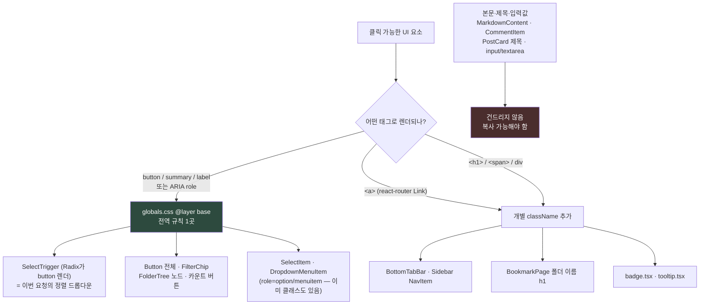

# 클릭 가능한 요소의 텍스트 선택 방지 (`user-select: none`) 전역화

## Context

북마크 페이지의 폴더 이름과 정렬 드롭다운 트리거("최신 북마크순")를 드래그하면 텍스트가
선택되는 게 어색하다는 지적에서 시작됐다. 조사해 보니 문제는 그 두 곳이 아니라 레포 전체
범위였다.

- 정렬 드롭다운의 **옵션 목록**(`SelectItem`)은 shadcn 기본값으로 이미 `select-none`이
  있어 문제가 없다 — `src/shared/ui/atoms/select.tsx:124`.
- 정작 **트리거**(`SelectTrigger`, `select.tsx:26`)에는 없어서 평소 보이는 값 텍스트가
  긁힌다. 폴더 이름은 드롭다운이 아니라 그 옆 `<h1>`(`BookmarkPage.tsx:162`·`:197`)이다.
- 레포 전체 `select-none` 적용은 12곳뿐이고, 그중 8곳은 shadcn이 넣어준 것, 4곳만 사람이
  직접 붙였다(`LikePostButton.tsx:39` 등). `globals.css`에 `user-select` 전역 규칙은 없다.

개별 컴포넌트에 클래스를 붙이는 방식은 새 컴포넌트마다 빠뜨리는 회귀가 반복된다. 같은
문제를 이미 한 번 전역으로 푼 선례가 바로 옆에 있다 — `globals.css:373-402`의
`cursor: pointer` 블록(Tailwind v4 preflight에서 v3의 커서 규칙이 빠진 걸 메꾼 것).
`user-select`도 성격이 같으므로 그 옆에 같은 형태로 모은다.

사용자가 전역 방식과 추가 적용 대상 4종(하단 탭바·사이드바, 폴더 이름 h1, Badge·필터 칩,
툴팁)을 모두 승인했다.

## 적용 경로



## 1. 전역 규칙 추가 — `src/app/globals.css`

기존 커서 블록(`:373-402`)은 **그대로 두고**, 그 바로 아래에 같은 형태의 새 `@layer base`
블록을 추가한다.

```css
/* 클릭 가능한 요소는 드래그해도 텍스트가 선택되지 않게 한다.
   위 커서 규칙과 같은 이유로 컴포넌트마다 `select-none`을 붙여 메꾸지 않고 여기 모은다.
   커서 규칙과 달리 :disabled를 제외하지 않는다 — 비활성 버튼의 라벨도 선택 대상이
   아니기 때문. 본문·제목·입력값(MarkdownContent, PostCard 제목, input/textarea)은
   복사 대상이므로 이 목록에 넣지 않는다. */
@layer base {
  button,
  summary,
  label,
  :is(
    [role='button'],
    [role='link'],
    [role='menuitem'],
    [role='menuitemcheckbox'],
    [role='menuitemradio'],
    [role='option'],
    [role='tab'],
    [role='switch'],
    [role='checkbox'],
    [role='radio']
  ) {
    @apply select-none;
  }
}
```

설계 포인트:

- **`@apply select-none`을 쓴다** — raw `user-select: none`을 쓰면 Safari용
  `-webkit-user-select` 접두사를 직접 관리해야 한다. Tailwind 유틸에 위임하면 그걸
  Tailwind가 처리한다. `globals.css:366`의 `@apply border-border outline-ring/50`가 같은
  형태의 선례다. **구현 중 빌드 산출물에서 접두사가 실제로 출력되는지 확인한다**(아래 검증).
- **커서 블록과 셀렉터가 일부러 다르다** — `select`(native)·`input[type=checkbox|radio|file]`는
  `user-select`가 무의미해서 뺐고, `label`은 추가했다(`FormCheckbox.tsx:38`의 raw
  `<label>`에는 `select-none`이 없고 `FormCheckboxGroup.tsx:42`에는 있는 불일치가 이걸로
  해소된다). `:disabled`/`aria-disabled` 제외도 하지 않는다.
- **`a[href]`는 절대 넣지 않는다** — `MyCommentCard.tsx:18-20`처럼 `<Link>`가 댓글 본문을
  감싸는 구조가 있어서, `a`를 넣으면 본문이 복사 불가가 된다.

## 2. 전역으로 커버 안 되는 곳 개별 적용

| 파일:줄                                                       | 요소                      | 변경                                            |
| ------------------------------------------------------------- | ------------------------- | ----------------------------------------------- |
| `src/widgets/layout/bottom-tab-bar/ui/BottomTabBar.tsx:27-30` | `<Link>` (= `<a>`)        | `cn()` 첫 인자에 `select-none` 추가             |
| `src/widgets/layout/sidebar/ui/Sidebar.tsx:42-46`             | NavItem `<Link>`          | 동일                                            |
| `src/pages/bookmark/BookmarkPage.tsx:162`                     | 모바일 폴더 이름 `<h1>`   | `text-screen-title flex-1 truncate select-none` |
| `src/pages/bookmark/BookmarkPage.tsx:197`                     | 데스크톱 폴더 이름 `<h1>` | `text-screen-title truncate select-none`        |
| `src/shared/ui/atoms/badge.tsx:6`                             | cva base (span)           | base 문자열에 `select-none` 추가                |
| `src/shared/ui/atoms/tooltip.tsx:20`                          | `TooltipContent`          | className에 `select-none` 추가                  |

**수정하지 않는 것**: `FilterChip.tsx:28`은 `Button` 기반이라 전역 규칙으로 자동 커버된다.
`SelectTrigger`도 Radix가 `<button>`을 렌더하므로 마찬가지 — 이번 요청의 출발점이었던
정렬 드롭다운은 `select.tsx`를 건드리지 않고 해결된다.

**스토리 갱신 없음**: `badge.tsx`·`tooltip.tsx`는 `shared/ui/atoms`라 CLAUDE.md의 스토리
동반 규칙 대상이지만, 그 규칙은 "시각적으로 변경"할 때다. `select-none`은 픽셀이 바뀌지
않고 드래그 동작만 바뀌므로 기존 스토리(`badge.stories.tsx`·`tooltip.stories.tsx`, 둘 다
존재)를 그대로 둔다.

## 3. 문서 갱신

기존에 커서 규칙을 서술하는 두 곳에 같은 자리에서 선택 규칙을 덧붙인다 — 새 문서를 만들지
않는다.

- `docs/FE-ARCHITECTURE.md` §20 "클릭 가능한 요소와 커서 규칙"(`:898~`) — 섹션 제목을
  커서 + 텍스트 선택을 함께 다루도록 고치고, "자동으로 pointer가 붙는 대상" 표 아래에
  선택 방지 대상 표와 셀렉터가 다른 이유(위 §1)를 추가. "새 컴포넌트를 만들 때" 목록에도
  한 줄 추가.
- `.claude/skills/design-tokens/SKILL.md` "인터랙션 커서"(`:138-155`) — 같은 내용을 요약해
  추가하고 정본(FE-ARCHITECTURE §20)을 가리킨다.
- `CHANGELOG.md` `[Unreleased]` — `changelog-release` skill을 먼저 읽고 그 포맷으로 항목
  추가. 동작이 바뀌는 변경이라 대상이다.

`docs/DECISIONS.md`는 **쓰지 않는다** — 커서 규칙(2026-09-03 항목)이라는 선례를 그대로
따른 것이고, 되돌리기가 한 줄 삭제라 ADR 기준(되돌리기 어려움 + 실제 대안 비교)에 안 맞는다.

## 4. 작업 순서

```
1. EnterWorktree (fresh)  → verify: 미푸시 커밋 없음 확인 완료(`git log origin/main..main` 비어 있음)
                             진입 후 `cp ../../../.env . && pnpm install`
2. globals.css 전역 규칙  → verify: pnpm build 후 dist CSS에 -webkit-user-select 출력 확인
3. 개별 6곳 적용          → verify: pnpm type-check
4. 문서 3곳 갱신          → verify: pnpm check:docs
5. 브라우저 검증 녹화      → verify: 아래 검증 절차
6. 커밋 (git commit -- <경로>)
```

## 검증

**자동 검사** (CLAUDE.md "작업 후 검증" 순서대로)

```bash
pnpm type-check
pnpm test
pnpm lint
pnpm check:docs
```

**Tailwind 출력 확인** — `@apply select-none`이 Safari 접두사까지 내는지 실측한다.

```bash
pnpm build
grep -o "webkit-user-select[^;]*" dist/assets/*.css | head
```

접두사가 안 나오면 `@apply` 대신 `-webkit-user-select: none; user-select: none;`을 직접
쓰고, 그 사실을 주석에 남긴다.

**브라우저 검증** — `browser-verification` skill을 먼저 읽고 그 절차대로 녹화한다.
`pnpm dev`(다른 워크트리에서 dev 서버가 돌고 있지 않은지 먼저 확인) 후 북마크 페이지에서:

1. 정렬 드롭다운 트리거("최신 북마크순")를 더블클릭 → `window.getSelection().toString()`이
   빈 문자열인지 확인 (수정 전에는 "최신 북마크순"이 나와야 정상 — 전후 비교)
2. 폴더 이름 `<h1>`, 하단 탭바 라벨, 사이드바 메뉴 라벨에 같은 확인
3. **회귀 확인이 더 중요하다** — 게시글 본문(`MarkdownContent`), 댓글 내용, 게시글 제목,
   `input`/`textarea`에서 드래그 선택과 복사가 **여전히 되는지** 확인. 특히
   `MyCommentCard`의 `<Link>` 안 댓글 본문.
4. 모바일 뷰포트(375px)로 줄여 하단 탭바 롱프레스 시 라벨이 선택되지 않는지 확인

## 회귀 위험

순수 CSS 변경이라 CRUD·API·캐시 경로에는 영향이 없다. 실제 위험은 하나뿐이다 — **`<button>`
안에 복사 대상 텍스트가 들어 있는 경우**. 조사 결과 본문·제목·댓글은 전부 `<a>`나 `<p>`로
button 밖에 있어 해당 사례가 없지만, 위 검증 3번에서 직접 확인한다.
