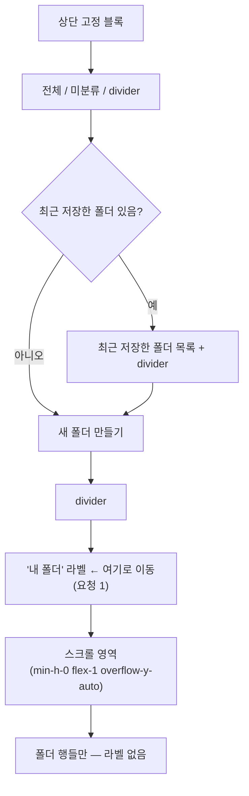

# 북마크 사이드바 — "내 폴더" 라벨 고정 + "새 폴더 만들기" 상단 이동

## Context

지난 PR(#145, `main`에 머지·배포 완료)에서 사이드바 "내 폴더" 목록에 자체 스크롤을
추가했다. 사용자가 실제 화면(스크린샷)을 보고 두 가지를 추가로 요청했다:

1. **"내 폴더" 라벨이 스크롤 영역 안에 있어 스크롤하면 라벨도 같이 밀려 올라간다** —
   섹션 헤더처럼 상단에 고정하고, 스크롤 영역엔 폴더 행만 남기고 싶다.
2. **"새 폴더 만들기"가 하단에 있는데, 상단이 더 나을 수도 있어 보인다** — 근거를
   찾아봐 달라는 요청.

조사 결과 2번은 이미 우리 코드베이스 안에 반대 사례가 있었다: 폴더 선택 **모달**
(`BookmarkFolderSelectModal.tsx`)은 2026-09-11에 같은 고민을 하고 "새 폴더 만들기"를
**헤더 바로 아래(상단)**에 두기로 결정했다(`docs/DECISIONS.md` 2026-09-11 항목,
"생성 발견성 최상" 근거로 채택, 하단 안은 "모바일에서 파괴 액션이 엄지 위치에 노출됨"
때문에 기각). 그런데 사이드바를 만들 때는 모달에서 "목록만 스크롤 + 상시 노출 행은
스크롤 밖 고정"이라는 **구조**만 가져오고, "생성 버튼을 정확히 어디 둘지"는 따로
비교하지 않은 채 하단으로 뒀다 — 모달의 하단 기각 사유(파괴 액션 엄지 노출)는
사이드바엔 애초에 해당하지 않는데도.

외부 근거도 같은 방향이다 — Shopify Polaris 디자인 시스템
(GitHub 소스로 직접 확인: https://github.com/Shopify/polaris-react/pull/11796/files):

> _"Place add actions at the bottom of a list unless the list will likely be long"_
> (목록이 짧으면 하단) / _"Place add actions in the header in long lists of resources"_
> (길거나 스크롤되는 목록이면 헤더=상단)

사용자에게 이 근거를 제시하고 "상단"으로 확인받았다. 두 변경 모두 시각적 변경이라
(`.claude/CLAUDE.md` §9) 구현 전에 실제 클래스를 쓴 미리보기를 보여주고 승인받았다.

## 현재 구조 (origin/main 기준, 확인 완료)

`src/widgets/bookmark/folder-tree/ui/FolderTree.tsx`의 데스크톱 `FolderTree`:

```
<aside overflow-hidden>
  <div shrink-0>                              ← 상단 고정 블록
    전체 / 미분류 / divider
    [최근 저장한 폴더 + divider]               (조건부)
  </div>
  <div min-h-0 flex-1 overflow-y-auto>        ← 스크롤 영역
    <div flex-col gap-1>
      [내 폴더 라벨]                           ← ❌ 스크롤 영역 안에 있음(요청 1)
      폴더 행들
    </div>
  </div>
  <div shrink-0>                              ← 하단 고정 블록
    새 폴더 만들기                             ← ❌ 하단(요청 2)
  </div>
</aside>
```

`MobileFolderList.tsx`는 내부 스크롤 자체가 없는 전체 페이지 그리드라 이 문제가
없다 — 이번 변경은 데스크톱 `FolderTree.tsx` 하나에만 해당한다.

## 변경 후 구조



**변경: `src/widgets/bookmark/folder-tree/ui/FolderTree.tsx`**

상단 고정 블록(`<div className="flex shrink-0 flex-col gap-1">`)의 마지막에
`<CreateFolderInput />`과 divider, 그리고 "내 폴더" 라벨을 추가하고, 스크롤 영역
안쪽 `<div className="flex flex-col gap-1">`에서는 라벨을 제거해 폴더 행(또는
로딩 스피너)만 남긴다. 기존 하단 고정 블록(`<div className="shrink-0"><CreateFolderInput /></div>`)은
통째로 제거 — `<aside>`의 마지막 자식이 스크롤 영역이 된다.

- "내 폴더" 라벨의 기존 조건(`(folderList?.length ?? 0) > 0`)은 그대로 유지, 위치만 이동
- `CreateFolderInput`은 항상 보임(기존과 동일, 조건 없음) — 최근 저장한 폴더 섹션
  유무와 무관하게 그 아래·"내 폴더" 라벨 위에 위치
- 새 위치의 `CreateFolderInput` 위아래에 기존 divider 패턴(`<div className="my-1 border-t" />`)을
  하나씩 둬서 "최근 저장한 폴더"/"새 폴더 만들기"/"내 폴더" 세 구획을 시각적으로 분리
- 코드 주석 갱신: 기존 "폴더 개수와 무관하게 항상 하단에 보인다" → 상단 이동 이유
  (모달 선례 재적용 + Polaris 인용)로 교체

건드리지 않는 파일: `MobileFolderList.tsx`(해당 없음), `useFolderSections.ts`·
`useFolderTree.ts`(데이터/훅 로직 변경 없음, 순수 JSX 재배치).

## 영향 범위 점검

- **기존 테스트**: `FolderTree.tsx`에는 단위 테스트도 스토리도 없다(이전 조사에서 확인).
  깨질 자동 테스트 없음.
- **다른 소비처**: `FolderTree`는 `BookmarkPage.tsx` 데스크톱 분기에서만 쓰인다
  (`useFolderTree` 경유). `BookmarkFolderSelectModal`·`MobileFolderList`는 별도 컴포넌트라
  영향 없음.
- **CRUD 관점**: 폴더 생성/조회 API 호출 방식은 변경 없음(`CreateFolderInput`은
  `useCreateFolderInput` 그대로 재사용, 위치만 이동) — 데이터 흐름 리스크 없음.

## 미리보기 (구현 전 필수, §9)

실제 Tailwind 클래스·`globals.css` 토큰을 그대로 쓴 정적 목업을 Artifact로 만들어
최종 배치(구획 순서·divider 위치·간격)를 사용자에게 보여주고 승인받은 뒤에만
`FolderTree.tsx`를 수정한다.

## 문서

| 문서                                                    | 할 일                                                                                                                                                                                                                                                                    |
| ------------------------------------------------------- | ------------------------------------------------------------------------------------------------------------------------------------------------------------------------------------------------------------------------------------------------------------------------ |
| `docs/BOOKMARK.md` §5                                   | "새 폴더 만들기" 위치를 상단으로 서술 갱신(코드 지도·본문에 하단으로 적힌 부분 있으면 함께)                                                                                                                                                                              |
| `docs/BOOKMARK.md` §10                                  | 새 항목 — "'내 폴더' 라벨이 스크롤에 같이 밀리고 '새 폴더 만들기'가 하단이었던 문제"(모달 선례 재검토 경위, Polaris 인용 포함)                                                                                                                                           |
| `docs/DECISIONS.md`                                     | append-only, 새 `## <날짜>` 항목 — "사이드바 '새 폴더 만들기' 위치: 모달 선례 재검토 + Polaris 근거로 하단→상단 전환". 이전 2026-09-21 "사이드바 스크롤 영역 경계" 항목이 "하단 고정"을 결정한 것과 배치되므로, 왜 재검토했는지(모달 기각 사유가 사이드바엔 미적용) 명시 |
| `CHANGELOG.md`                                          | `### Changed` 1건 — 사이드바 레이아웃(라벨 고정 위치 + 생성 버튼 위치 변경)                                                                                                                                                                                              |
| `docs/plans/<날짜>-bookmark-sidebar-create-position.md` | 이 계획 스냅샷                                                                                                                                                                                                                                                           |

## 검증

```bash
# 워크트리 진입 전 로컬 main이 origin/main보다 뒤처져 있음(#145 이후 커밋 미반영) —
# EnterWorktree(fresh)는 origin/main 기준이라 자동으로 최신 상태에서 시작한다.
pnpm type-check
pnpm lint
pnpm check:docs
pnpm test
```

브라우저 검증(`browser-verification` skill): 폴더 6개 이상 계정에서 ① "내 폴더"
라벨이 스크롤해도 고정돼 있는지 ② 폴더 행만 스크롤되는지 ③ "새 폴더 만들기"가
상단(최근 저장한 폴더 아래·내 폴더 라벨 위)에 고정돼 있는지 ④ Navbar와 안 겹치는지
확인.

## 작업 순서

1. `git log origin/main..main` 확인 후 `EnterWorktree`(fresh) — 로컬 main이 뒤처져
   있으므로 워크트리는 origin/main 기준으로 새로 생성
2. 부트스트랩(`cp ../../../.env . && pnpm install`)
3. Artifact 미리보기 제작 → 사용자 승인
4. `FolderTree.tsx` 수정
5. 검증(위 명령 + 브라우저)
6. 문서 갱신 → `pnpm check:docs`
7. 계획 스냅샷 커밋 + 구현 커밋(`git commit -- <경로...>`)
8. push, PR 생성, CI 확인, 계획 대비 구현 대조(fresh Explore subagent) → PR 본문에 반영
