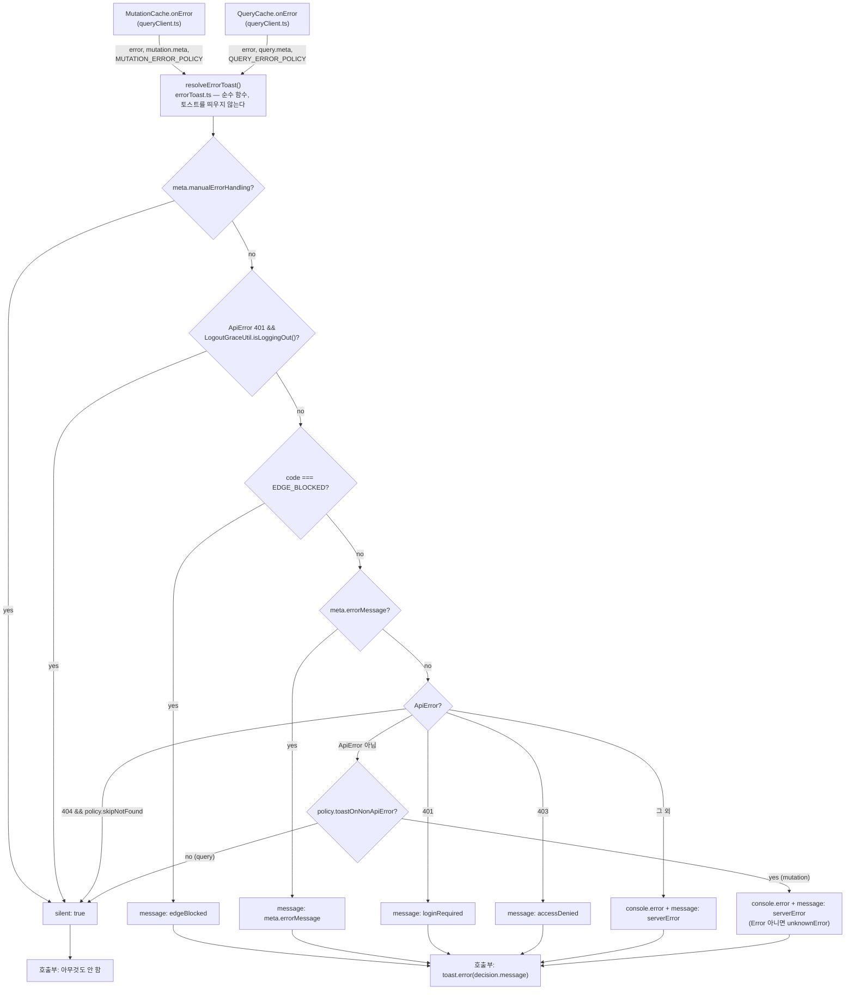

# queryClient.ts 전역 에러 핸들러 중복 제거

## Context

`src/shared/lib/react-query/config/queryClient.ts`(165줄)에 전역 에러 핸들러가 두 벌 있다 —
`mutationErrorHandler`(`:26-81`)와 `QueryCache.onError` 인라인 콜백(`:101-148`). 두 핸들러는
`EDGE_BLOCKED` / `meta.errorMessage` / 401 / 403 / 기타 `ApiError` 5가지 판정을 **같은 로직으로
중복 보유**한다.

문제는 단순 복붙이 아니라 **두 벌이 따로 진화해서 같아야 할 판정이 서로 달라졌다**는 점이다:

| 판정                       | mutation                  | query               | 성격                                                                     |
| -------------------------- | ------------------------- | ------------------- | ------------------------------------------------------------------------ |
| `meta.manualErrorHandling` | `:35` 종료                | **없음**            | ① 버그 — 타입(`Register.queryMeta`, `:19`)은 약속하는데 구현이 없다      |
| 로그아웃 레이스 401 무시   | `:56` (401 분기 **안쪽**) | `:106` (**최상단**) | ② 버그 — mutation은 `meta.errorMessage`가 있으면 가드에 도달조차 못 한다 |
| ApiError 아닌 Error        | `:75` 토스트              | **없음**            | ③ 문서-코드 불일치 (이번엔 코드 유지, 문서를 고침)                       |
| 404                        | 없음                      | `:140` 조용히 종료  | 의도된 차이 — 유지                                                       |

또한 같은 파일이 `EDGE_BLOCKED`만 `SERVER_ERROR_CODE` 상수를 쓰고(`:42`, `:115`) 나머지 셋은
문자열 리터럴(`:54`, `:66`, `:108`, `:125`, `:133`)로 비교한다. `ApiError.code`가 `string`
타입(`src/shared/types/common.type.ts:100`)이라 오타가 타입 에러로 안 잡힌다.
`src/shared/api/client.ts`는 `:157`/`:209`/`:210`에서 전부 상수를 쓴다.

**의도한 결과**: 판정 로직이 한 벌만 남고, mutation/query의 차이가 코드에 명시적으로 드러나며,
현재 0개인 단위 테스트가 생겨 이 파일의 회귀를 자동으로 잡는다.

**사용자 결정 사항** (2026-09-22 확인):

- ①② **통일한다** (동작 변경), ③은 **코드 유지 + 문서를 코드에 맞춘다**
- 판정 로직을 export해 **단위 테스트를 함께 추가**한다
- 참조 0곳 데드 코드 `react-query/utils/hooks.ts`(`useAppMutation`)를 **이번 PR에서 삭제**한다

---

## 반드시 지켜야 할 제약

1. **`EDGE_BLOCKED` 판정은 `meta.errorMessage`보다 먼저** — `docs/DECISIONS.md` 2026-09-06 항목이
   명시한 결정. 순서를 바꾸면 게시글 등록 mutation이 WAF 차단 원인을 "게시글 등록에 실패했어요"로
   덮어써 사용자가 실제 원인을 알 수 없게 된다.
2. **토스트 단일 소유 원칙** — `client.ts`는 토스트를 띄우지 않고 이 파일이 유일 소유자다
   (`client.ts:218` 주석). 이 계약을 깨면 토스트가 두 번 뜬다.
3. **`docs/plans/*.md`는 수정 금지** (append-only, CI가 막는다). `2026-09-14-e2e-tier3-scenarios.md:228`
   등이 옛 줄 번호를 인용하지만 그대로 둔다 — 과거 시점의 기록이라 낡는 게 정상이고,
   `check-docs.js:34-43`이 `docs/` 최상위만 검사해 `docs/plans/`는 애초에 대상이 아니다.

---

## 흐름 (리팩토링 후)



핵심: **판정(`resolveErrorToast`)과 부수 효과(`toast.error`)를 분리**한다. 판정이 순수 함수가
되어야 토스트 모킹 없이 단위 테스트가 가능하다.

---

## 구현

### 1. 신규 `src/shared/lib/react-query/config/errorToast.ts`

`shared/lib/` 선례(`toast.ts`, `textBytes.ts`, `navigation.ts`)를 따라 **바레 함수 모듈**로
만든다 — `*.util.ts` 클래스 패턴(`docs/FE-ARCHITECTURE.md` §23)은 `shared/utils/`·
`entities/*/utils/` 전용이라 여기엔 적용하지 않는다.

`queryClient.ts:9-21`의 `CustomMutationMeta`와 `declare module` 블록을 이 파일로 옮기고
타입을 export한다(현재는 export되지 않아 테스트에서 쓸 수 없다).

```ts
export interface CustomMutationMeta {
  successMessage?: string;
  errorMessage?: string;
  manualErrorHandling?: boolean;
}

declare module '@tanstack/react-query' {
  interface Register {
    mutationMeta: CustomMutationMeta;
    queryMeta: CustomMutationMeta;
  }
}

/** 전역 에러 토스트를 띄울지, 띄운다면 어떤 문구로 띄울지에 대한 판정 결과. */
export type ErrorToastDecision = { silent: true } | { silent: false; message: string };

/** mutation과 query가 의도적으로 다르게 처리하는 지점만 모은 정책. 나머지 판정은 양쪽 동일. */
export interface ErrorToastPolicy {
  /** 404를 조용히 넘길지. query만 true — 삭제·비공개 글 안내는 화면의 ErrorBoundary가 소유한다. */
  skipNotFound: boolean;
  /** ApiError가 아닌 에러(네트워크 단절 등)에 토스트를 띄울지. mutation만 true. */
  toastOnNonApiError: boolean;
  /** console.error 접두사에 들어갈 이름. */
  logLabel: 'Mutation' | 'Query';
}

export const MUTATION_ERROR_POLICY: ErrorToastPolicy = { ... };
export const QUERY_ERROR_POLICY: ErrorToastPolicy = { ... };

export function resolveErrorToast(
  error: unknown,
  meta: CustomMutationMeta | undefined,
  policy: ErrorToastPolicy
): ErrorToastDecision;
```

판정 순서는 위 Mermaid 그대로. 401 코드 판별은 헬퍼 하나로 묶는다
(`error.code === SERVER_ERROR_CODE.NOT_LOGGED_IN || error.code === SERVER_ERROR_CODE.INVALID_TOKEN`).
**문자열 리터럴 5곳을 전부 `SERVER_ERROR_CODE.*`로 교체**한다(`error-code.ts:4-6`에 이미 정의돼 있다).

`console.error` 문구는 기존과 동일하게 유지한다 — `ApiError`는 `[API ${logLabel} Error]`,
그 외는 `[${logLabel} Error]`.

> 스타일: 인라인 `if` 금지(항상 중괄호 블록), 가드절 뒤·제어 블록 앞뒤 빈 줄 1줄
> (`.claude/CLAUDE.md` Critical Rules).

### 2. `src/shared/lib/react-query/config/queryClient.ts` 축소

두 핸들러가 각각 4줄로 줄어든다.

```ts
const mutationErrorHandler = (error, _variables, _context, mutation) => {
  const decision = resolveErrorToast(error, mutation.meta, MUTATION_ERROR_POLICY);

  if (decision.silent) {
    return;
  }

  toast.error(decision.message);
};
```

`QueryCache.onError`도 동일한 형태(`QUERY_ERROR_POLICY`)로 교체한다. `mutationSuccessHandler`
(`:86-97`)와 `defaultOptions`(`:154-163`)는 **건드리지 않는다**.

`:32`/`:92`/`:102`의 `as CustomMutationMeta | undefined` 캐스팅은 `Register` 확장 덕분에
이미 불필요할 수 있다 — `pnpm type-check`로 확인한 뒤 통과하면 제거하고, 안 되면 그대로 둔다.

### 3. 신규 `src/shared/lib/react-query/config/errorToast.test.ts`

`src/shared/lib/image/failedImageCache.test.ts` 형태(한글 `it` 제목, `@/` 절대 경로 import)를
따른다. 토스트를 모킹할 필요가 없다 — 판정 결과 객체만 단언한다.

회귀 가드로 반드시 포함할 케이스:

- `manualErrorHandling` → 양쪽 정책 모두 `silent` (**①이 실제로 적용됐는지**)
- 로그아웃 유예 중 401 → `meta.errorMessage`가 있어도 `silent` (**②의 회귀 가드**)
- `EDGE_BLOCKED` + `meta.errorMessage` 동시 → `edgeBlocked` 우선 (**제약 1의 회귀 가드**)
- 401 → `loginRequired` / 403 → `accessDenied`
- 404: query 정책 `silent`, mutation 정책 `serverError` (의도된 차이)
- 기타 `ApiError` → `serverError`
- 비-`ApiError` `Error`: mutation `serverError`, query `silent` (**③ 현행 유지 확인**)
- `Error`가 아닌 throw 값: mutation `unknownError`

`LogoutGraceUtil`은 실제 구현을 쓰되 `LogoutGraceUtil.reset()`(`logout-grace.util.ts:75`,
테스트 격리용으로 이미 존재)으로 케이스 간 상태를 초기화한다.

### 4. 데드 코드 삭제

`src/shared/lib/react-query/utils/hooks.ts`(`useAppMutation`, `mergeHandlers`)를 삭제한다.
레포 전체 참조 0곳을 확인했다. `utils/` 디렉터리는 이 파일이 유일해서 함께 사라진다.

### 5. 문서 갱신

| 파일                                        | 내용                                                                                                                                                                                                                                                        |
| ------------------------------------------- | ----------------------------------------------------------------------------------------------------------------------------------------------------------------------------------------------------------------------------------------------------------- |
| `docs/AUTH.md:200`                          | queryClient.ts 줄 번호 인용(`:54`,`:125`,`:66`,`:133`,`:42`,`:115`,`:140`)을 `errorToast.ts`의 `resolveErrorToast` **함수명 기준 서술**로 바꾼다 — `check-docs.js:10-13`이 스스로 권하는 방식이다("자주 바뀌는 파일은 줄 번호로 인용하지 않는 쪽이 정공법") |
| `docs/FE-ARCHITECTURE.md` §13 (`:805-813`)  | ①② 반영. ③의 실제 동작("ApiError가 아닌 에러는 mutation만 토스트, query는 화면이 소유")을 명시해 `:813`의 현행 서술과 코드의 불일치를 없앤다                                                                                                                |
| `docs/FE-ARCHITECTURE.md` §15 (`:848-854`)  | `manualErrorHandling`이 query에도 적용됨을 표에 반영                                                                                                                                                                                                        |
| `.claude/CLAUDE.md` "에러 핸들링 전략"      | `queryClient.ts`의 `if (meta?.manualErrorHandling) { return; }` 인용을 `errorToast.ts` 기준으로 갱신                                                                                                                                                        |
| `src/entities/post/api/post.queries.ts:331` | 주석의 `queryClient.ts:86-97` 인용 — `mutationSuccessHandler`는 그대로 남지만 줄 번호가 밀리므로 갱신                                                                                                                                                       |
| `CHANGELOG.md` `[Unreleased] > Changed`     | 동작이 바뀌는 refactor이므로 항목 추가. 스코프는 `shared`(cross-cutting), 요약 줄 72자 이내 + `<details>` 블록 (`changelog-release` skill)                                                                                                                  |
| `docs/plans/2026-09-22-*.md`                | 이 계획 파일을 스냅샷으로 커밋 (`.claude/CLAUDE.md` §11)                                                                                                                                                                                                    |

---

## 회귀 위험 (수정 전 점검 결과)

**동작이 바뀌는 지점 (의도된 것)**

- ② 로그아웃 유예 2초(`LOGOUT_GRACE_MS`) 안에 `meta.errorMessage`를 가진 mutation이 401을 받으면
  이제 토스트가 안 뜬다. 해당 mutation: `post.queries.ts`, `bookmark-folder.queries.ts`,
  `account.queries.ts`. 로그아웃 직후 좁은 창에서만 발생하는 드문 경로다.
- ① query가 `manualErrorHandling`을 존중한다. **현재 이를 쓰는 query는 0개**라 실동작 변화 없음.

**바뀌면 안 되는 지점 (테스트로 고정)**

- `EDGE_BLOCKED` > `meta.errorMessage` 우선순위 (제약 1)
- query의 404 무음 계약 — `e2e/post-detail-not-found.spec.ts:46`이 _"전역 핸들러가 404를 의도적으로
  무시하고 화면(ErrorFallback)에 안내를 위임한다"_ 를 전제로 단언한다. `pnpm test:e2e`로도 확인 가능
- query의 비-`ApiError` 무음 (③ 미채택)
- mutation의 `console.error` 문구 두 종류

**영향받지 않는 것**

- `queryClient` 싱글턴 import처 2곳(`app/providers/QueryProvider.tsx:2`,
  `shared/utils/auth.util.ts:5`) — export 시그니처가 그대로다
- `mutationSuccessHandler`, `defaultOptions`(staleTime/gcTime/retry 등)
- `src/shared/utils/error.util.ts`의 `ErrorUtil` — ErrorBoundary 계열이 쓰는 **별개 표면**이고
  401/403/EDGE_BLOCKED/meta를 다루지 않는다. 합치지 않는다

---

## 검증

```bash
nvm use                 # Node 24 고정 (.nvmrc)
pnpm type-check         # tsc -b --noEmit
pnpm test               # 신규 errorToast.test.ts 포함 전체 단위 테스트
pnpm lint               # 레이어 경계 + custom 룰
pnpm check:docs         # 문서가 가리키는 경로·줄 번호 검증
pnpm test:e2e           # 404 무음 계약(post-detail-not-found.spec.ts)
```

**테스트로 잡히지 않는 것을 브라우저로 확인** (`browser-verification` skill 절차):

1. 로그인 상태에서 게시글 등록 실패 → "게시글 등록에 실패했어요" 토스트 1개만 뜨는지 (중복 없음)
2. 로그아웃 직후 2초 안에 목록 화면이 남아있을 때 → 401 토스트가 뜨지 않는지 (②)
3. 존재하지 않는 게시글 상세 URL 직접 진입 → 토스트 없이 ErrorBoundary 화면만 뜨는지 (404 계약)

**작업 환경**: `EnterWorktree`로 워크트리를 만들고 진입 직후 `cp ../../../.env .` + `pnpm install`.
시작 전 `git log origin/main..main`으로 미푸시 커밋을 확인하고, `git worktree list`로 오래된
워크트리를 먼저 훑는다(현재 `.claude/worktrees/` 아래 4개가 남아있다).

**PR 전**: fresh Explore subagent에게 커밋한 계획 파일과 diff를 대조시켜 PR 본문에
`## 계획 대비 구현` 섹션을 남긴다(`.claude/CLAUDE.md` §11).
