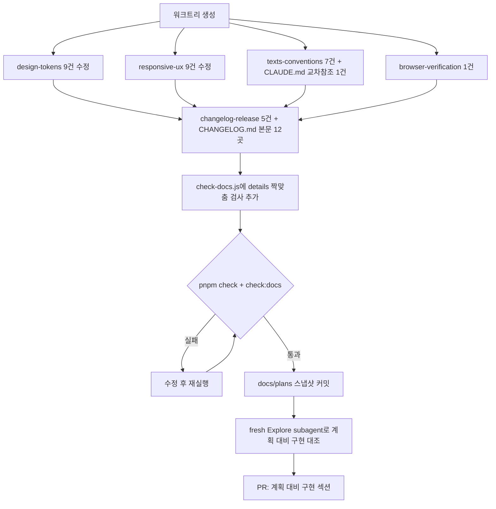

# 기존 5개 skill 문서 SSOT 드리프트 전수 수정 + 외부 스킬 도입

## Context

원래 목적은 외부 프론트엔드 스킬(anthropics/skills 등) 도입 여부 판단이었다. 조사
과정에서 `responsive-ux/SKILL.md:79`가 실제로는 없는 framer-motion을 서술하는
드리프트 1건을 발견했고, 사용자가 "SSOT는 실제 코드에 있으니 문서를 갱신하라"고
명시적으로 요청해 범위가 바뀌었다.

3개 fresh Explore subagent로 `.claude/skills/` 5개 파일(588줄) 전체를 소스코드·
설정과 전수 대조했고, 가장 심각한 항목은 이번 세션이 직접 재검증했다(아래 표
"직접 검증" 열). **드리프트 31건**을 찾았다 — 드리프트가 0건인 스킬은 없었다.

## 발견 요약

| 스킬                 | 줄수 | 드리프트 | 가장 심각한 것                                                                                                                                     | 직접 검증    |
| -------------------- | ---- | -------- | -------------------------------------------------------------------------------------------------------------------------------------------------- | ------------ |
| design-tokens        | 172  | 9건      | 근거로 든 `no-raw-title` ESLint 규칙이 실제로는 역할토큰·t-스케일을 못 잡음                                                                        | O (D1·D2·D6) |
| responsive-ux        | 135  | 9건      | 예시 그대로 쓰면 `no-raw-z-index`가 pre-commit에서 차단(z-50 등)                                                                                   | O (D1·D3)    |
| texts-conventions    | 108  | 7건      | 실행취소 붙은 토스트(`bookmarkRemoved`)를 "불필요"로 오분류                                                                                        | O (A1·A6)    |
| changelog-release    | 70   | 5건      | 규칙 자체는 정확하지만 **CHANGELOG.md가 그 규칙을 12곳에서 위반**(`</details>` 미종결, 9건이 진행중 Unreleased)                                    | O (B1·B2)    |
| browser-verification | 103  | 1건      | `.mcp.json` 실제 인자 6개 중 2개(`--ignore-https-errors`, `--viewport-size=1280x800`) 미서술 → 모바일 UI를 데스크톱 뷰포트로 "검증 완료" 오판 위험 | O (C1)       |

공통 원인: `pnpm check:docs`(`scripts/check-docs.js`)가 `.claude/skills/**`를 이미
검사 대상에 넣고 있지만, 스크립트 자신이 [L10-13](scripts/check-docs.js#L10)에서
밝히듯 "경로가 존재하는가"만 보고 "그 줄에 실제로 그 내용이 있는가"는 검사하지
못한다 — 서술형 드리프트는 구조적으로 자동 검출 밖이다.

## 범위 확정 (사용자 확인 완료)

1. **CHANGELOG.md 본문도 함께 고친다.** `changelog-release`의 B1~B3은 스킬 문서가
   틀린 게 아니라, 스킬이 정확히 서술한 규칙을 `CHANGELOG.md` 본문이 위반하는
   문제다(`<details>` 133개 vs `</details>` 121개 = 12건 미종결, [L135,144](CHANGELOG.md#L135)
   동일 문구 고아 줄 중복, [L111-112](CHANGELOG.md#L111) 문단 중복). 방치하면 GitHub
   렌더링 오류가 계속 남는다.
2. **`check-docs.js`에 `<details>`/`</details>` 개수 대조 검사를 추가한다.** B1의
   근본 원인이 "쌍이 맞는지 검사하는 도구가 없었다"는 것이므로, 고치는 김에 재발을
   CI에서 막는다.
3. **원래 계획(외부 스킬 도입 — frontend-ui-engineering 개인 설치, `motion-ux` 신설
   등)은 이번 PR에서 분리한다.** 별도 세션으로 미룬다 — 이번 PR은 "문서 SSOT
   정합화" 단일 목적을 유지한다("후속 과제" 절 참고).

## 작업 흐름



## A. design-tokens/SKILL.md — 9건

| #   | 줄     | 주장                                                      | 실제                                                                                                                                | 수정                                                                                                      |
| --- | ------ | --------------------------------------------------------- | ----------------------------------------------------------------------------------------------------------------------------------- | --------------------------------------------------------------------------------------------------------- |
| D1  | 171    | "가변 폰트(woff2-variations)"                             | `globals.css`에 `@font-face` 9개, 전부 `woff2-subset`. `woff2-variations` 0건                                                       | "정적 subset 9종(weight 100~900), 가변 폰트 파일은 `public/fonts/web/variable/`에 있지만 미사용"으로 정정 |
| D2  | 96,138 | "역할 토큰 7종"(두 곳)                                    | 실제 8종(`micro` 포함, `--font-weight` 있는 것 7 + 없는 것 1). 문서 자체 83-92줄 표도 8행이라 내부 모순                             | "일곱"→"여덟", "7종"→"8종" (globals.css:139 주석도 같은 값이면 함께)                                      |
| D3  | 153    | "`:disabled`/`aria-disabled`/`[data-disabled]` 일괄 제외" | 태그 셀렉터는 `:disabled`만, ARIA role 셀렉터는 `aria-disabled`/`data-disabled`만 제외(`summary`는 제외 없음) — globals.css:443-458 | 두 문장으로 분리, "native `disabled` 아닌 `aria-disabled` button은 안 빠짐" 명시                          |
| D4  | 151    | "`[role=checkbox]` **바로 뒤**의 label"                   | `~`(일반 형제) 결합자 — 인접 아님, globals.css:464                                                                                  | "뒤따르는 형제 label(`~`, 인접 아님)". `docs/FE-ARCHITECTURE.md:975` 동일 표현도 함께 수정                |
| D5  | 166    | "모든 토큰이 `.dark`에서 자동 override"                   | `--destructive-foreground`는 `.dark`에 재정의 없음(라이트 흰색 그대로 사용) — scrim 2종은 기존에 예외로 이미 명시돼 있었음          | "대부분 자동 override. 예외: `--scrim`/`--scrim-foreground`(의도), `--destructive-foreground`(누락 서술)" |
| D6  | 97-99  | "`no-raw-title`이 텍스트크기+font-bold 조합을 잡는다"     | `TEXT_SIZE_PATTERN`이 Tailwind 기본 스케일만 매칭(`eslint.config.js:348`) — `text-t*`·역할 토큰은 못 잡음                           | "기본 스케일(`text-xs`~`text-9xl`) 조합만 잡는다. 역할 토큰·`t*`는 사람이 지킨다"                         |
| D7  | 20-39  | 색상 표                                                   | `--popover`/`--popover-foreground`, 상태색 `*-foreground` 3쌍, `--info-foreground`(실사용: `PostListSearch.tsx:149`) 누락           | 표에 4행 보강(실사용 우선)                                                                                |
| D8  | 85,91  | 역할 토큰 "대상 예시"                                     | `VersionPage.tsx:50`, `RecentSearchDropdown.tsx:72` 누락                                                                            | 두 행에 파일 추가 또는 "예시(전수 아님)"로 열 제목 변경                                                   |
| D9  | 31     | "scrim 투명도 `/40`~`/80`"                                | `ImageAttachmentField.tsx:81`은 수식자 없이 불투명 사용                                                                             | "불투명하게 쓰는 곳도 있다" 한 줄 추가                                                                    |

## B. responsive-ux/SKILL.md — 9건

| #   | 줄      | 주장                                                       | 실제                                                                                                                                                                                     | 수정                                                                                                           |
| --- | ------- | ---------------------------------------------------------- | ---------------------------------------------------------------------------------------------------------------------------------------------------------------------------------------- | -------------------------------------------------------------------------------------------------------------- |
| D1  | 79      | "framer-motion `AnimatePresence`+`motion.div`"             | CSS transition + `setTimeout`(`ScrollToTop.tsx:8` **주석**을 구현으로 오독한 것으로 보임). `framer-motion`은 `package.json`에 없음(2026-09-21 `2c126c6`에서 제거, 문서는 그 뒤 미반영)   | 실제 구현으로 정정                                                                                             |
| D2  | 29-31   | BottomTabBar 클래스 한 줄 인용                             | `h-16`은 `nav`가 아니라 내부 `div`에, `z-50`은 `z-nav`, `border-t bg-background` 누락                                                                                                    | `nav`/내부 `div` 클래스를 분리해 인용, `z-nav`로 정정                                                          |
| D3  | 88-97   | z-index 표가 raw 숫자(`z-50` 등) 사용을 암시               | `globals.css:85-94`가 이미 8단계 토큰화(`z-raised`~`z-popover`), `custom-tailwind/no-raw-z-index`가 `error`로 raw 숫자 클래스를 pre-commit에서 차단 — **문서 예시대로 쓰면 커밋이 막힘** | 표에 "토큰" 열을 앞세우고 "raw 숫자는 ESLint가 차단한다" 명시                                                  |
| D4  | 36      | "z-index를 55 이상으로"                                    | 55는 `z-scrim` 토큰(`MobileCommentBar.tsx:71` 선례)                                                                                                                                      | "`z-scrim`(55) 이상 토큰을 쓴다"                                                                               |
| D5  | 88-97   | z-index 표 6단계만                                         | `z-raised`(10)·`z-hitbox`(20) 2단계 누락(`DropTargetOverlay.tsx` 등)                                                                                                                     | 표 상단에 2행 추가, "카드 내부 지역 스택용, 화면 고정 사다리와 층이 다르다" 주                                 |
| D6  | 97      | "80층 = tooltip/dropdown/select(atoms)"                    | `RecentSearchDropdown.tsx:67`(widgets, 포털 아님)도 `z-popover` 사용                                                                                                                     | 사용처에 추가 또는 "포털" 한정 표현 완화                                                                       |
| D7  | 77-84   | "데스크톱 플로팅 버튼" 섹션, `fixed bottom-6 right-6 z-50` | `ScrollToTop`은 `bottom-20 md:bottom-6`(모바일에도 표시, 탭바 회피) — 데스크톱 전용 아님. `ScrollToCommentFormButton`만 JS `!isMobile` 게이트로 데스크톱 전용                            | 섹션 제목을 "플로팅 버튼"으로, 공통 자리(`fixed right-6 z-nav`)와 컴포넌트별 세로 위치·게이트 방식을 구분 서술 |
| D8  | 113-114 | "react-remove-scroll은 전이 의존성으로 이미 설치돼 있다"   | `package.json` `dependencies`에 `2.7.2`로 **직접 의존성 고정**(#125에서 승격)                                                                                                            | "직접 의존성으로 버전 핀 돼 있다"로 정정                                                                       |
| D9  | 38      | `pb-28 md:pb-16` 연속 인용                                 | 실제 클래스 문자열은 `py-4 pb-28 md:py-4 md:pb-16`로 `md:py-4`가 중간에 끼어 연속이 아님(의미는 맞음)                                                                                    | 코드 인용을 서술형으로 변경                                                                                    |

## C. texts-conventions/SKILL.md — 7건 + CLAUDE.md 교차참조 1건

| #   | 줄       | 주장                                                                                                           | 실제                                                                                                                                | 수정                                               |
| --- | -------- | -------------------------------------------------------------------------------------------------------------- | ----------------------------------------------------------------------------------------------------------------------------------- | -------------------------------------------------- |
| A1  | 26-27    | 트리에 `version.*` 없음                                                                                        | `texts.ts:120-135`에 14키 존재, `VersionPage.tsx`가 사용                                                                            | `mypage.*`와 `recentSearch.*` 사이에 추가          |
| A2  | 28-32    | `post` 하위 4종만                                                                                              | `post.search.corrected/appliedCount`(함수형 키) 누락, `PostListSearch.tsx` 사용                                                     | 행 추가                                            |
| A3  | 33-34    | `comment` 하위 2종만                                                                                           | `comment.item.*`, `comment.myList.*` 누락(`CommentItem.tsx`, `MyCommentPage.tsx` 사용)                                              | 행 추가                                            |
| A4  | 24       | `auth.login.*`/`auth.signup.*`만                                                                               | `auth.title`/`description`/`guard.title`이 형제로 존재                                                                              | 행 보강                                            |
| A5  | 36       | `errors.*` 4종 모두 title+description                                                                          | `serverError`는 `description`만(`texts.ts:290-292`)                                                                                 | "serverError는 description만" 명시                 |
| A6  | 95       | `bookmarkRemoved`를 "불필요(아이콘으로 이미 보임)"로 분류                                                      | `usePostCardBookmarkFolderModal.ts:150`에서 `undoOptions`(실행취소) 동반 발화 — 문서 자신의 판단축 3("실행취소 붙으면 유지")에 해당 | "필요" 칸으로 이동, 사유 "실행취소 동반(판단축 3)" |
| A7  | 23,25,31 | 완결형으로 서술된 목록에 실제로는 키가 더 있음(`bookmarkSearch`, `bookmark`/`loggingOut`/`toggleMenu`, `back`) | 전수 아님                                                                                                                           | 말줄임표 추가 또는 키 보강                         |

**CLAUDE.md 교차참조**: "예외: 테스트/스토리/`date.util.ts`·`common.util.ts`"가
실제 `eslint.config.js:1209-1217`의 7개 ignore 중 `texts.ts` 자신·`src/test/**`·
`src/mocks/**` 3개를 누락. texts-conventions skill로 예외 목록 전체를 옮기고
CLAUDE.md는 그 skill을 가리키게 한다(TEXTS 서술이 두 파일에 갈라져 있던 게 원인).

## D. changelog-release/SKILL.md — 5건 (+CHANGELOG.md 본문 수정, 질문 1 참고)

| #   | 대상                                                                 | 문제                                                                  | 수정                                                      |
| --- | -------------------------------------------------------------------- | --------------------------------------------------------------------- | --------------------------------------------------------- |
| B1  | CHANGELOG.md 12곳(줄: 47,69,85,109,123,147,161,167,245,392,554,1150) | `<details>` 133 vs `</details>` 121 — 미종결, 9건이 `[Unreleased]` 안 | 각 위치에 빈 줄 + `</details>` 보강                       |
| B2  | CHANGELOG.md:135,144                                                 | 동일 요약 줄("Firebase 설정값이 비었거나...") 상세 블록 없이 중복     | 중복 제거, 남긴 것에 상세 또는 파일 목록 부착             |
| B3  | CHANGELOG.md:108-112                                                 | 거의 동일 문단 2개 중복(400ms/500ms), 파일 목록·`</details>` 없음     | 최종값만 남기고 정리                                      |
| B4  | changelog-release/SKILL.md:37                                        | "72자 이내" — 과거 섹션 7건 위반(Unreleased 31건은 전부 준수)         | "과거 섹션엔 소급 적용 안 함" 한 줄 추가                  |
| B5  | changelog-release/SKILL.md:68-70                                     | package.json 배제가 의도인지 불명확                                   | "`package.json` version은 `0.0.0` 고정, 쓰지 않는다" 명시 |

`scripts/check-docs.js`에 대상 `.md` 파일들의 `<details>`/`</details>` 개수 대조
함수를 추가(기존 `reportError` 패턴 재사용).

## E. browser-verification/SKILL.md — 1건

| #   | 줄  | 주장                                                  | 실제                                                                                                                            | 수정                                                                        |
| --- | --- | ----------------------------------------------------- | ------------------------------------------------------------------------------------------------------------------------------- | --------------------------------------------------------------------------- |
| C1  | 17  | `.mcp.json`이 "`--caps=devtools --headless`로 띄운다" | 실제 6개 인자: 위 2개 + `--ignore-https-errors`(mkcert HTTPS 대응) + `--viewport-size=1280x800`(데스크톱 고정) + `--output-dir` | 인자 전체 서술 + "모바일 UI 검증 시 `browser_resize`로 먼저 전환" 경고 추가 |

## 핵심 파일

| 파일                                           | 변경                                   |
| ---------------------------------------------- | -------------------------------------- |
| `.claude/skills/design-tokens/SKILL.md`        | 9건                                    |
| `.claude/skills/responsive-ux/SKILL.md`        | 9건                                    |
| `.claude/skills/texts-conventions/SKILL.md`    | 7건                                    |
| `.claude/skills/changelog-release/SKILL.md`    | 5건                                    |
| `.claude/skills/browser-verification/SKILL.md` | 1건                                    |
| `.claude/CLAUDE.md`                            | TEXTS 예외 목록 교차참조 정정          |
| `docs/FE-ARCHITECTURE.md`                      | :975 형제결합자 표현 동반 수정         |
| `CHANGELOG.md`                                 | 12곳 `</details>` 보강 + 중복 3곳 정리 |
| `scripts/check-docs.js`                        | details 짝맞춤 검사 함수 추가          |

## 검증

```bash
pnpm check        # type-check + lint + format:check
pnpm check:docs   # 경로·줄번호 정합성 (details 검사 추가 시 그 회귀도 함께 확인)
```

서술형 드리프트는 스크립트가 원리적으로 못 잡으므로, 수정 후 각 표의 "실제" 열
근거(파일:줄)를 다시 한번 열어 대조하는 수작업 재확인을 마지막에 한 번 더 한다.

## 커밋 단위

1. 5개 skill 문서 + CLAUDE.md 교차참조 + FE-ARCHITECTURE.md — "문서 SSOT 드리프트 수정"
2. CHANGELOG.md 본문 정리 — 별도 커밋(문서 규칙 수정과 규칙 위반 수정은 성격이 다름)
3. check-docs.js 검사 추가 — 별도 커밋(기능 추가)

## 후속 과제 (이번 범위 밖, 별도 세션)

- 원래 계획했던 외부 스킬 도입: frontend-ui-engineering 개인 설치(`-g`), `motion-ux`
  skill 신설(duration/easing/`prefers-reduced-motion`/exit 애니메이션 동기화 함정 —
  `TRANSITION_MS` 2중복·`setTimeout(300)` 2중복 실측 있음), CLAUDE.md 스킬 표,
  ESLint 죽은 규칙(`custom-react-hooks/no-hooks-in-regular-functions`, 측정 후
  활성/삭제 결정), `.claude/settings.local.json:63` Firebase 키 노출 정리
