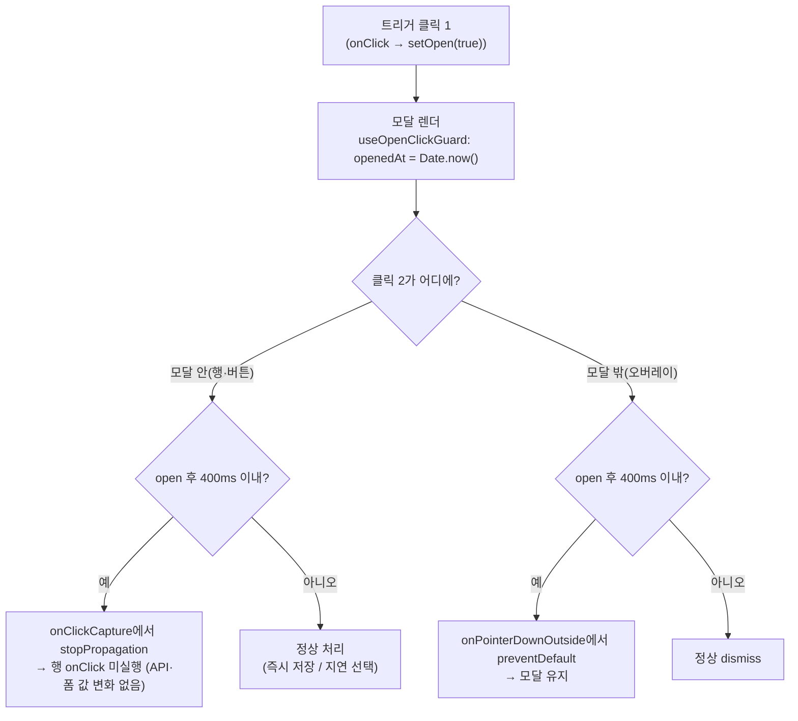
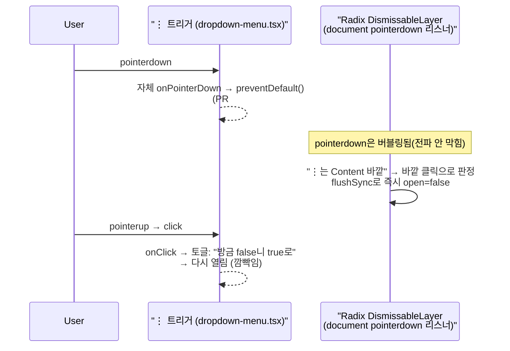

# 북마크 폴더 모달 열림 직후 오탭 방지 + ⋮ 드롭다운 메뉴 재클릭 깜빡임 수정

이 계획은 원인이 다른 두 버그를 함께 다룬다. 사용자가 ⋮ 메뉴 버그도 "동일하게 해결할 수
있는지" 물었으나, 조사 결과 두 번째는 시간 기반 가드만으로는 고쳐지지 않는 별개의 이벤트
경합이라 원인 수정을 더했다(아래 파트 2). 파트 1(모달)과 파트 2(⋮ 메뉴)는 서로 다른 파일을
건드리며 독립적으로 검증 가능하다.

---

# 파트 1. 북마크 폴더 모달 — 열린 직후 400ms 클릭 무시 (더블클릭 관통 방지)

## Context

`/post/submit`에서 북마크 필드 트리거를 누르면 폴더 선택 모달이 뜨는데, 이때 폴더 목록 행이
눌려버리는 현상이 있다. 트리거는 `onClick`(pointerup 이후)으로 열리므로
(`PostCreateBookmarkFolderField.tsx:34`) 한 번 클릭으로는 관통이 불가능하다 — **트리거를
더블클릭/더블탭했을 때 두 번째 클릭이 방금 뜬 모달 위에 떨어지는 것**이 원인이다. 모바일
바텀시트는 화면 하단 70vh를 덮고(`BookmarkFolderSelectModal.tsx:181`), 데스크톱 중앙 모달도 폼
가운데의 트리거와 겹친다. 두 번째 클릭이 모달 바깥(오버레이)에 떨어지면 열리자마자 닫히는
변형 증상도 같은 원인이다.

같은 공용 모달(`BookmarkFolderSelectModal`)을 게시글 카드 북마크(`BookmarkPostButton` →
`PostCardBookmarkFolderModal`, 탭 = 즉시 저장/삭제)도 쓰므로 그쪽은 더 위험하다.

**사용자 확정(2026-09-24)**: 가드 시간 **400ms**(요청 원안 "몇 초" 대신 — 근거 아래), 적용 범위
**공용 모달 전체**.

### 400ms 근거 (§8·§10)

- 레포 선례: `src/shared/hooks/useClickGuard.ts` — "무의식적 더블클릭 vs 의식적 재클릭"을 400ms로
  구분(`docs/DECISIONS.md` 2026-09-21, 500→400 조정). Windows 더블클릭 기본값 500ms 인용은
  그 파일에서 재인용.
- Chromium [`InputEventActivationProtector`](https://chromium.googlesource.com/chromium/src/+/HEAD/ui/views/input_event_activation_protector.h):
  _"prevent potentially unintentional user interaction with a UI element"_, 보호 시간은
  [`GetDoubleClickInterval()`](https://chromium.googlesource.com/chromium/src/+/HEAD/ui/views/input_event_activation_protector.cc)(OS 더블클릭 간격).
- 반례: Firefox 보안 다이얼로그 버튼 지연 2초 → 1초 축소, _"long enough to be annoying"_
  ([Bugzilla 416605](https://bugzilla.mozilla.org/show_bug.cgi?id=416605)) — 클릭재킹 방어
  목적이라 이 케이스와 정확히 같진 않지만, 수 초 단위 지연의 비용을 보여준다.
- 가드 중 클릭은 무음 무시 → 수 초면 즉시 선택("최근 저장한 폴더" 구획)이 고장처럼 읽힌다.
  400ms는 모달 등장 애니메이션(200ms)과 거의 겹쳐 시각 표시가 필요 없다(→ §9 미리보기 불필요).

## 흐름



## 구현

선례: `useClickGuard.ts`(시간 기반 가드 형태·근거·테스트 방식), `BookmarkFolderSelectModal.tsx:81-92`
(다이얼로그 이벤트 핸들러를 `SheetDialogContent`에 인라인으로 배선하는 기존 형태 —
`onEscapeKeyDown`).

1. **`src/shared/config/const.ts`** — `DOUBLE_CLICK_GUARD_MS = 400` 추가(근거 주석 + 링크,
   기존 상수들과 같은 형식). `useClickGuard.ts`의 기본값 `400` 리터럴을 이 상수로 교체
   (동작 변화 없음 — 2026-09-21에 이미 한 번 재조정된 값이라 두 가드가 따로 놀지 않게 SSOT화).
2. **`src/shared/hooks/useOpenClickGuard.ts`** (신규) — `open`이 true가 되는 순간을 ref에 기록하고,
   "지금이 열린 뒤 `DOUBLE_CLICK_GUARD_MS` 이내인가"를 반환하는 함수를 돌려준다. `Date.now()`
   사용(ESLint는 `new Date()`만 금지, `useClickGuard`와 동일). 타이머·리렌더 없음.
3. **`src/features/bookmark/select/ui/BookmarkFolderSelectModal.tsx`** — `useOpenClickGuard(open)`
   호출, `SheetDialogContent`에 두 핸들러를 인라인 배선(기존 `onEscapeKeyDown` 옆):
   - `onClickCapture`: 가드 중이면 `e.stopPropagation()` — 행·새 폴더 만들기·북마크 안 함/제거·
     확인·X 전부 한 곳에서 커버.
   - `onPointerDownOutside`: 가드 중이면 `e.preventDefault()` — 오버레이 dismiss 차단
     (`dialog.tsx`의 마우스 뒤로가기 버튼 처리 후 위임되는 콜백).
   - `useBookmarkFolderSelect`의 시그니처·반환값은 건드리지 않는다.

## 기존 코드 영향 (§5)

**CRUD**

- 생성/수정(행 탭 = 즉시 저장, 지연 선택 토글): 열린 뒤 400ms 이내 탭은 요청·폼 변경 없음. 중복/멱등성 새 위험 없음.
- 삭제(마지막 폴더 탭·미분류 재탭·북마크 제거/안 함): 더블클릭발 파괴적 조작이 차단됨(개선).
- 읽기: `useBookmarkFolderListQuery({ enabled: open })` 무관.
- 새 폴더 만들기: 버튼 클릭만 가드, 입력·Enter 생성은 키보드 이벤트라 무관.

**회귀 위험**

- `PostCreateBookmarkFolderField.test.tsx`, `PostCardBookmarkFolderModal.test.tsx` — 모달을 열자마자
  행을 클릭하는 기존 테스트 다수가 깨진다 → 두 파일에 `vi.hoisted` 플래그로 제어하는
  `vi.mock('@/shared/hooks/useOpenClickGuard')` 추가(기본 비활성, 기존 `useIsMobile` mock과 같은 형태).
- `e2e/bookmark.spec.ts:110` — 모달 표시 직후 행 클릭이 400ms 안이라 무시됨 → 클릭 전
  `DOUBLE_CLICK_GUARD_MS`만큼 대기 + 이유 주석(가드는 관측 가능한 이벤트가 없어
  `waitForResponse` 류 대체 불가 — `account-update.spec.ts:29`의 원칙에 대한 명시적 예외).
  `guest-guard.spec.ts:83-85`는 표시만 확인하므로 무관.
- `useClickGuard` 상수화: `FilterChip`·`Navbar` 동작 불변(400 그대로).
- 키보드: 열린 직후 400ms 안의 Enter/Space 클릭도 무시됨(같은 부류의 실수라 허용). ESC 무관.
- 문서: `docs/BOOKMARK.md` §5 "탭 = 즉시 저장" 서술에 예외(열린 직후 400ms) 추가 필요.

## 테스트

- `src/shared/hooks/useOpenClickGuard.test.ts` (신규, `useClickGuard.test.ts` 형태·fake Date):
  닫힌 상태는 비가드 / 열린 직후·200ms 가드 / 400ms 해제 / 닫았다 다시 열면 창 재시작.
- 배선 통합 테스트(모킹 플래그 on):
  - `PostCreateBookmarkFolderField.test.tsx`: 가드 중 행 탭 → 폼 값 불변, 해제 후 탭 → 반영.
  - `PostCardBookmarkFolderModal.test.tsx`: 가드 중 행 탭 → PUT 요청 없음(즉시 저장 경로).
  - 오버레이 pointerdown은 jsdom에서 Radix dismiss 재현이 불안정하면 브라우저 검증으로 대체.

## 문서

- `docs/BOOKMARK.md`: §5에 "열린 직후 클릭 무시(더블클릭 관통 방지)" 소절(원인·근거 인용 §10 형식),
  §7 운영 파라미터 표에 `DOUBLE_CLICK_GUARD_MS` 행(`파일:줄`), 마지막 검토 날짜 갱신.
- `CHANGELOG.md` `[Unreleased]` Fixed 항목(`changelog-release` skill 먼저 읽기).
- `DECISIONS.md`: 추가 안 함 — 되돌리기 쉽고 기존 400ms 결정을 그대로 따르는 적용이라 기준 미달.

---

# 파트 2. ⋮ 드롭다운 메뉴 — 재클릭 시 닫혔다 바로 재열림하는 깜빡임 수정

## Context

사용자 제보: "점 3개 누르다보면 잘 동작할 때도 많지만 닫혔다 열리는 경우도 있다." 다크모드
토글과 같은 가드로 풀릴지 물었으나, **원인을 추적한 결과 다크모드 버그와 메커니즘 자체가
다르다** — 다크모드는 "한 제스처 안의 두 번째 클릭"이 문제였지만, 이건 **"한 번의 클릭이
서로 다른 두 경로에서 각각 처리되며 충돌"** 하는 문제다. 시간 가드만으로는 근본 원인이
사라지지 않는다(재클릭 간격이 400ms를 넘는 가장 흔한 경우도 그대로 재현된다).

### 원인 (소스 추적, `node_modules/.pnpm` 설치된 실제 버전 기준)

메뉴가 열린 상태에서 트리거(⋮)를 다시 눌러 닫으려 할 때:



- `onPointerDown`에서 `event.preventDefault()`는 같은 리액트 핸들러 체인만 막는다 —
  `stopPropagation()`이 없어 네이티브 pointerdown은 그대로 `document`까지 버블링된다.
- `@radix-ui/react-dismissable-layer@1.1.11`의 `usePointerDownOutside`(document 레벨
  리스너)는 ⋮ 버튼이 `Content`의 DOM 트리 바깥이라는 이유만으로 "바깥 클릭"으로 본다.
  이 판정은 `ReactDOM.flushSync`(`dispatchDiscreteCustomEvent`, `react-primitive` 소스)로
  **즉시** 반영된다 — 그래서 뒤이어 실행되는 `click` 핸들러는 이미 바뀐 최신 `open` 값을 읽는다.
- 트리거의 `onClick`(`dropdown-menu.tsx` 현재 코드)은 `openContext.setOpen(!openContext.open)`로
  단순 토글한다 — 방금 `false`가 된 걸 보고 다시 `true`로 뒤집는다.
- **"잘 될 때도 많은" 이유**: 메뉴 바깥이나 항목을 클릭해 닫을 때는 이 경로를 안 타서
  정상이다. ⋮ 자체를 다시 눌러 닫을 때만 재현된다. 4개 사용처 중 `PostCard.tsx:128`만
  `modal={false}`라 가장 재현이 쉽고, 나머지 3곳(`FolderTree`·`MobileFolderList`·`Navbar`
  계정 메뉴)은 기본값(`modal=true`)이라 열려 있는 동안 `document.body.style.pointerEvents =
"none"`이 걸려(`disableOutsidePointerEvents`) 트리거 자체가 클릭을 못 받을 가능성이 있다 —
  **실측으로 4곳 모두 확인**(아래 검증).

### Radix 공식 저장소의 동일 사례 (Popover)

Radix `packages/react/popover/src/popover.tsx`의 `PopoverContentNonModal`이 정확히 같은
문제를 이미 겪고 고쳤다 — 주석 원문:

> Prevent dismissing when clicking the trigger. As the trigger is already setup to close,
> without doing so would cause it to close and immediately open.

해법은 `onInteractOutside`에서 클릭 대상이 트리거인지 확인해 맞으면 `preventDefault()`로
"바깥 클릭"에서 제외하는 것이다:

```js
const target = event.target;
const targetIsTrigger = context.triggerRef.current?.contains(target);
if (targetIsTrigger) event.preventDefault();
```

`@radix-ui/react-dismissable-layer`의 `usePointerDownOutside` 콜백은
`onPointerDownOutside?.(event); onInteractOutside?.(event); if (!event.defaultPrevented)
onDismiss?.();` 순서로 실행되므로(같은 파일 소스 확인), 우리 `onPointerDownOutside`
핸들러에서 `preventDefault()`를 부르면 `onDismiss()`(=닫기) 자체가 스킵된다 — Popover와
동일한 지점에서 동일하게 막을 수 있음을 직접 확인했다.

### `DismissableLayerBranch`를 쓰지 않는 이유

Radix에는 "바깥 클릭 판정에서 제외되는 영역"을 만드는 공식 도구
(`DismissableLayer.Branch`)도 있지만, 이건 토스트처럼 레이어 트리 바깥의 **동반 UI**를 위한
것이지 트리거 자체를 위한 것이 아니다 — Popover도 이 경우엔 Branch를 쓰지 않고
`targetIsTrigger` 체크를 쓴다. 또한 `@radix-ui/react-dismissable-layer`는 현재 직접
의존성이 아니라(`@radix-ui/react-dropdown-menu`의 전이 의존성) 새로 추가해야 해 §2 "단순함"에
안 맞는다.

## 구현

선례: 위 Popover 소스(`targetIsTrigger` 체크), `dialog.tsx`의 `onPointerDownOutside` 합성
패턴(마우스 뒤로가기 버튼 무시 — 기존 핸들러를 감싸고 조건부로 `preventDefault`), `useClickGuard`
(연타 가드).

**`src/shared/ui/atoms/dropdown-menu.tsx`** 한 파일만 수정 — 이 컴포넌트를 쓰는 4곳
(`PostCard.tsx`, `FolderTree.tsx`, `MobileFolderList.tsx`, `Navbar.tsx`)이 함께 낫는다
(2026-09-21 결정과 동일한 "한 곳 수정 → 4곳 해결" 구조).

1. `DropdownMenuOpenContextValue`에 `triggerRef: React.RefObject<HTMLElement>` 추가. `DropdownMenu`
   루트에서 `useRef<HTMLElement>(null)`로 만들어 context에 내려준다.
2. `DropdownMenuTrigger` — 전달받은 `ref`와 새 `triggerRef`를 함께 DOM 노드에 연결(수동 병합,
   `@radix-ui/react-compose-refs`는 직접 의존성이 아니라 새로 추가하지 않는다).
3. `DropdownMenuTrigger`의 `onClick`에 `useClickGuard()`(인자 없이 — 아래 4번으로 파트 1과
   상수 공유) 가드 추가: `if (!event.defaultPrevented && canClick()) { openContext?.setOpen(...) }`.
   사용자가 요청한 "다크모드와 동일한" 연타 무시 — 빠르게 두 번 누르면 첫 클릭만 반영.
4. `DropdownMenuContent`에 `onPointerDownOutside` 추가(props로 들어오면 합성, `dialog.tsx`
   패턴과 동일): 클릭 대상이 `openContext.triggerRef.current`에 포함되면 `event.preventDefault()`
   — Popover의 `targetIsTrigger` 로직을 그대로 이식, 주석에 위 인용 남김.
5. **파트 1과 상수 공유**: `useClickGuard()`가 파트 1에서 이미 `DOUBLE_CLICK_GUARD_MS`(400)를
   기본값으로 쓰도록 바뀌므로 여기서는 인자 없이 호출만 하면 같은 값을 쓴다 — 파트 1을
   포함하지 않고 파트 2만 단독 적용할 경우 `useClickGuard()`의 기존 기본값(400, 코드상
   이미 그 값)을 그대로 쓰면 되므로 두 파트는 독립적으로도 완결된다.

## 기존 코드 영향 (§5)

**CRUD**: 없음 — 열기/닫기 상태 전이 로직만 바뀐다. 항목 클릭(수정·삭제·비공개 전환 등)은
`DropdownMenuItem`의 별도 `onClick`이라 무관.

**회귀 위험**

- `e2e/bookmark-folder-menu-press-drag.spec.ts` — 트리거를 누른 채 "이름 수정" 항목까지
  이동해 떼는 시퀀스. `onPointerDown`의 `preventDefault()`는 그대로 유지하므로(3번 항목이
  건드리는 건 `onClick`·`Content`뿐) 이 스펙의 전제(Radix 내부 pointerdown 오픈 차단)는
  안 바뀐다 — 회귀 없음, 재검증만.
- `e2e/post-visibility.spec.ts`·`post-update.spec.ts`·`post-delete.spec.ts`·
  `bookmark-folder-delete.spec.ts`의 트리거 클릭들은 네트워크 대기·확인 다이얼로그로
  400ms 이상 떨어져 있어 연타 가드에 안 걸림(실제 간격 확인함, e2e 코드 인용).
- `modal={true}`(기본값) 3곳은 열려 있는 동안 `document.body.style.pointerEvents = "none"`이
  걸려 트리거 자체가 클릭 하이재킹될 수 있다 — 이 경우 재클릭이 아예 트리거에 안 닿을 수
  있어 지금 수정과 무관하게 이미 다른 방식으로 "안 열림"처럼 보일 가능성 → 4곳 모두
  실브라우저로 실측해 시나리오별 실제 동작을 확정한다(추정 아님, 아래 검증 항목).
- `DropdownMenuContent`에 캡슐화된 `onPointerDownOutside`는 `{...props}`로 호출부가 넘기는
  값과 합성되므로 기존 호출부(4곳 다 이 prop 미사용, grep 확인) 영향 없음.

## 테스트

- `src/shared/ui/atoms/dropdown-menu.test.tsx` (신규, 첫 유닛 테스트 — 지금까지 stories만
  있었음):
  - `useClickGuard`와 같은 방식으로 fake `Date` 사용, 연타 가드: 열림 직후 200ms 안 재클릭
    → 토글 안 됨(열린 채 유지) / 400ms 뒤 재클릭 → 토글됨.
  - `triggerRef`가 실제 트리거 DOM에 연결되는지(옵션 — Radix DismissableLayer의 실제
    dismiss 판정 자체는 jsdom 재현이 불안정해 스킵, 아래 e2e로 대체).
- e2e 신규 스펙(`e2e/dropdown-menu-trigger-reclick.spec.ts`, `bookmark-folder-menu-press-drag.spec.ts`와
  같은 실 마우스 이벤트 기법) — **4개 사용처 모두**: 트리거 클릭 → 메뉴 열림 확인 → 트리거
  재클릭 → 메뉴가 닫힌 채 유지(재열림 안 됨, `toHaveCount(0)`를 짧은 폴링 없이 즉시 확인해
  깜빡임 자체를 잡는다) → 바깥 클릭 dismiss는 여전히 정상 동작.

## 문서

- `docs/BOOKMARK.md` §10(시행착오)에 이번 항목 추가 — 2026-09-21 항목("메뉴가 떴다 사라짐")
  바로 아래, 같은 원인 체인의 후속 버그로 연결해 서술.
- `docs/DECISIONS.md`: 신규 항목 — 되돌리기 어렵진 않지만(`dropdown-menu.tsx` 되돌리기 쉬움),
  2026-09-21 결정("click에서만 연다")이 이 부작용을 놓쳤던 경위와 Popover 대안 비교를
  남겨야 다음에 또 같은 함정에 안 빠진다(§6 선례 축적 목적, 2026-09-21 항목 옆에 이어 씀).
- `CHANGELOG.md` `[Unreleased]` Fixed 항목(파트 1과 함께 또는 별도 — 커밋 단위에 맞춰).

---

## 작업 절차 (파트 1·2 공통)

1. `node -v`(v24) → `git log origin/main..main` 확인 → `EnterWorktree` → `cp ../../../.env . && pnpm install`
2. 파트 1 구현·테스트·문서 반영 → 파트 2 구현·테스트·문서 반영(같은 워크트리, 커밋은 분리 —
   원인이 다른 두 수정이라 "논리적으로 완결된 단위"별로 나눈다)
3. `pnpm type-check` → `pnpm test` → `pnpm lint` → `pnpm check:docs` →
   `pnpm test:e2e e2e/bookmark.spec.ts e2e/bookmark-folder-menu-press-drag.spec.ts e2e/dropdown-menu-trigger-reclick.spec.ts e2e/post-visibility.spec.ts`
4. `browser-verification` skill, 한 세션에서 두 파트 모두 녹화:
   - 파트 1: `/post/submit`(데스크톱+모바일) 트리거 실제 `dblclick` → 모달 열림·선택 안 됨,
     단일 클릭 후 500ms 뒤 행 클릭 → 선택됨. 게시글 카드 북마크 dblclick → PUT 요청 없음.
     데스크톱 오버레이 위 두 번째 클릭 → 모달 유지.
   - 파트 2: 게시글 카드 ⋮ 재클릭 → 깜빡임 없이 닫힘. 폴더 트리·모바일 폴더 목록·계정
     메뉴 ⋮도 각각 재클릭 확인(위 "회귀 위험"의 `modal=true` 가설 실측 겸함). 빠른 연타
     → 첫 클릭만 반영.
5. 계획 파일을 `docs/plans/2026-09-24-bookmark-modal-and-dropdown-trigger-click-fixes.md`로
   커밋, 커밋은 `git commit -- <경로...>`, PR 전 fresh Explore subagent로 계획 대비 구현
   대조 → PR 본문 `## 계획 대비 구현`.
