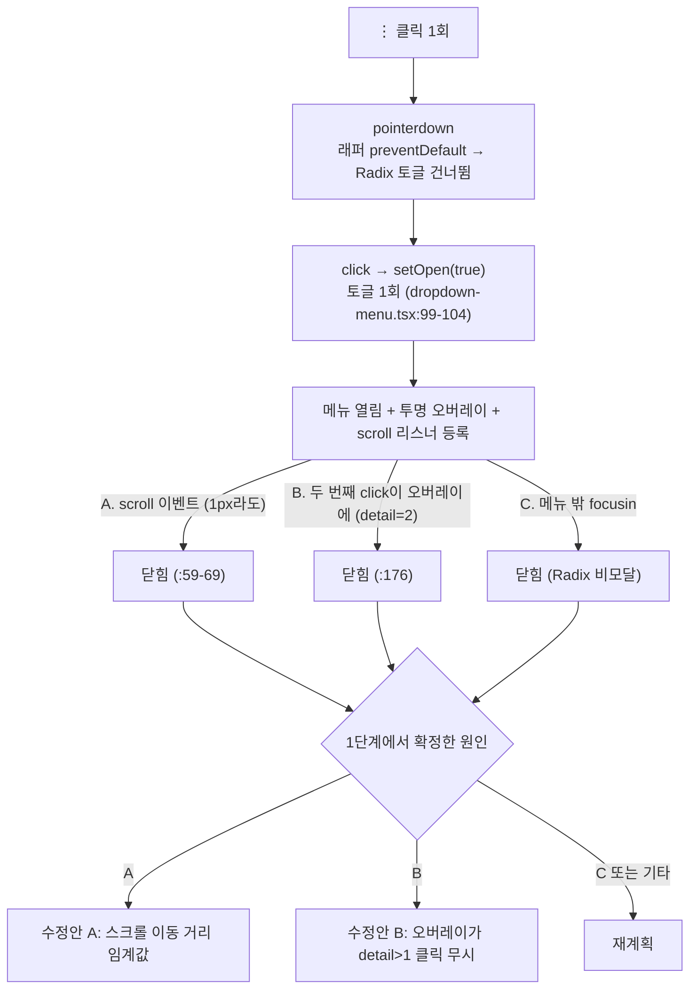

# ⋮ 메뉴가 열렸다 바로 닫히는 문제: 원인 확정 후 수정

## Context

북마크 사이드바 폴더 행의 ⋮ 버튼을 누르면, 가끔 메뉴가 열렸다가 곧바로 닫힌다(사용자 제보, 2026-09-24).

- **사용자 환경:** 휠 마우스를 쓴다. 증상이 나오는 패턴은 모른다. 원인은 계획 1단계에서 재현해 확정하기로 사용자가 정했다.
- **같은 증상이 전에도 있었다.** 2026-09-21 #152에서 원인은 press-drag-release였고, 트리거를 click 시점에 열도록 바꿔 막았다. e2e `bookmark-folder-menu-press-drag.spec.ts`가 이 동작을 고정한다.
- **오늘 13:16에 배포된 #178이 메뉴가 닫히는 경로를 새로 추가했다.** 메뉴를 비모달로 바꾸고, 스크롤하면 닫히게 하고, 바깥 첫 클릭을 투명 오버레이가 받게 했다.

목표는 두 가지다. 먼저 사용자 환경에서 실제로 메뉴를 닫는 경로를 확정한다. 그다음 그 경로만 최소 범위로 고친다.

## 조사 결과 (코드를 직접 추적한 사실)

### "버튼 이벤트 파생" 점검: 클릭 한 번으로는 열림→닫힘이 생기지 않는다

| 단계         | 코드                                                                                                                                                                                                                                                                               | 결과                                                           |
| ------------ | ---------------------------------------------------------------------------------------------------------------------------------------------------------------------------------------------------------------------------------------------------------------------------------- | -------------------------------------------------------------- |
| pointerdown  | 래퍼가 항상 `preventDefault` 한다(`src/shared/ui/atoms/dropdown-menu.tsx:91-97`). `composeEventHandlers`는 `defaultPrevented`이면 뒤 핸들러를 건너뛴다(`@radix-ui/primitive` dist). 그래서 Radix 내부 `onOpenToggle`(`react-dropdown-menu/dist/index.mjs:74-78`)은 실행되지 않는다 | pointerdown에서는 토글되지 않는다                              |
| click        | Radix Trigger에는 자체 onClick이 없다(같은 파일 :56-86). 래퍼의 onClick은 `...triggerProps`를 거쳐 Slot으로 `<Button>`에 그대로 붙는다. Button은 자기 onClick이 없다                                                                                                               | 클릭 1회당 토글은 정확히 1회다                                 |
| 버블링       | ⋮ 버튼과 폴더 선택 버튼은 형제 요소다(`FolderTree.tsx:256-293`). 행 div에는 핸들러가 없다. BookmarkPage에는 모바일 뒤로가기(`:157`) 하나뿐이다. `src` 전체에 전역 click·pointerdown 리스너가 0건이다                                                                               | 클릭이 폴더 선택이나 리마운트로 번지지 않는다                  |
| 열 때 포커스 | Radix가 content에 포커스를 줄 때 `preventScroll: true`를 쓴다(`react-menu/dist/index.mjs:258-260`). 마우스로 열면 첫 항목 포커스는 막히고 `preventScrollOnEntryFocus`도 켜져 있다(:280-286)                                                                                        | 여는 동작이 스크롤을 만들어 #178의 스크롤 닫기에 걸리지 않는다 |

### 남은 후보: 입력이 두 번 들어오거나, 스크롤이 함께 일어나는 경우

| 후보                                                                                                                                     | 닫는 코드                                                                        | #178로 새로 생겼나                                                                                                                      | 판별 신호                          |
| ---------------------------------------------------------------------------------------------------------------------------------------- | -------------------------------------------------------------------------------- | --------------------------------------------------------------------------------------------------------------------------------------- | ---------------------------------- |
| A. 클릭하면서 함께 생긴 작은 스크롤. 휠이 살짝 굴렀거나, 폴더 목록을 휠로 스크롤한 직후 부드러운 스크롤 애니메이션이 아직 돌고 있는 경우 | `dropdown-menu.tsx:59-69`. 1px이라도 scroll 이벤트가 나면 닫힌다                 | 새로 생김                                                                                                                               | 열림과 닫힘 사이에 `scroll` 이벤트 |
| B. 클릭이 두 번 들어옴. 더블클릭이거나, 마우스 스위치 채터링으로 한 번 누른 게 두 번 인식된 경우. 두 번째 클릭은 오버레이에 떨어진다     | 오버레이 onClick, `dropdown-menu.tsx:176`                                        | 기존에도 닫혔다. 모달 시절에는 Radix pointerdown-outside가 닫았다(`react-dismissable-layer` :43-50). 트리거는 branch로 등록돼 있지 않다 | 닫는 click의 `detail=2`            |
| C. 포커스가 메뉴 밖으로 이동                                                                                                             | Radix 비모달의 onFocusOutside(`react-menu` :150-160, 모달은 :140-144에서 막았음) | 새로 생김                                                                                                                               | 메뉴 밖 요소의 `focusin`           |

빨간 점 위치는 ⋮ 버튼(36×36) 안쪽 오른쪽 아래(약 30, 28px)로 추정된다. 그 위치에서만 달라지는 코드 경로는 없다.

## 흐름

## 1단계: 원인 확정 (코드 수정 전)

1. `git worktree list`와 `git log origin/main..main`을 확인한다. `EnterWorktree`로 워크트리를 만든다(fresh는 origin/main 기준이라 #179가 포함된다). 이어서 `cp ../../../.env .`, `pnpm install`을 실행한다.
2. **e2e 포트를 확인한다.** 31119 포트를 다른 워크트리의 dev 서버(`postcard-hover-or-open`, HTTPS 모드)가 쓰고 있다. 이대로면 `reuseExistingServer`가 그 서버를 재사용한다. 실행 전에 `lsof -iTCP:31119`로 확인하고, 이 포트 문제를 해결하는 브랜치 `worktree-e2e-dedicated-port`가 병합됐는지 보고 방법을 정한다.
3. **Playwright로 경로별 재현을 기록한다.** 선례는 `e2e/bookmark-folder-menu-press-drag.spec.ts`의 목 구성이다.
   - (a) 빨간 점 좌표(버튼 박스의 우하단 부근)를 단일 클릭 30회 → 매번 열린 채로 유지되는지 확인한다(단일 클릭 무결성).
   - (b) 클릭 직후 `mouse.wheel(0, 소량)` → 닫히는지 확인한다(후보 A).
   - (c) `clickCount: 2` 클릭 → 닫히는지, 닫는 click의 `detail`이 무엇인지 확인한다(후보 B).
   - (d) 폴더 목록을 휠로 스크롤해 애니메이션이 진행 중일 때 클릭 → 닫히는지 확인한다(후보 A 변형).
4. **사용자의 실제 휠 마우스로 원인을 확정한다.** 래퍼에 임시 close-reason 로그를 넣는다. 로그에는 닫힌 이유(`scroll`이면 대상과 이동량, `overlay-click`이면 `detail`, Radix `onFocusOutside`·`onEscapeKeyDown`)와 wheel `deltaY`를 남긴다. 로컬 dev에서 사용자가 재현한 뒤 콘솔 로그를 공유한다. 이 로그는 커밋하지 않는다.
   - 휠 한 칸의 실제 `deltaY`도 이때 함께 잰다. 수정안 A의 임계값은 이 실측값보다 작아야 의도한 스크롤이 막히지 않는다.
5. **게이트:** 확정한 원인과 실측값을 보고하고, 아래 수정안 중 하나를 사용자에게 승인받는다(§7). 승인 전에는 수정하지 않는다.

## 2단계: 원인별 수정안 (승인받은 것 하나만)

변경은 공용 래퍼 `src/shared/ui/atoms/dropdown-menu.tsx`에서만 한다. 사용처 4곳(계정, 폴더 데스크톱·모바일, 게시글)에 공통으로 적용된다.

- **A. 스크롤 이동 거리 임계값:** 스크롤 대상별로 처음 본 위치를 기억해 두고, 그 위치에서 N px 이상 움직였을 때만 닫는다.
  - N은 1단계에서 잰 휠 한 칸 값과 외부 근거로 정한다(§8·§10 형식으로 인용).
  - Floating UI `useDismiss`의 `ancestorScroll`은 임계값 없이 닫는다. 이 선례와 비교한 내용도 함께 기록한다.
  - UX 영향: N px 미만의 미세 스크롤로는 닫히지 않는다.
- **B. 오버레이가 연속 클릭을 무시:** 오버레이 onClick에서 `event.detail > 1`이면 닫지 않는다. pointerdown은 지금처럼 오버레이가 흡수하므로 아래 요소로 전달되지 않는다.
  - 인레포 선례: `src/shared/hooks/useClickGuard.ts`(무의식적 중복 클릭 무시, 400ms). OS가 판정하는 `detail`을 쓰면 시간값을 따로 정하지 않아도 된다.
  - UX 영향: 연 직후 OS 더블클릭 간격 안에 같은 자리를 다시 눌러도 메뉴가 닫히지 않는다. 한 번 더 눌러야 닫힌다.
- **C 또는 그 밖의 원인:** 재계획한다.

## 영향 범위 (§5)

CRUD 영향은 없다(순수 UI 동작, 데이터 계약 변경 없음).

| 회귀 후보                                | 소유 파일                                                                       | 확인                                                                                                                         |
| ---------------------------------------- | ------------------------------------------------------------------------------- | ---------------------------------------------------------------------------------------------------------------------------- |
| 스크롤하면 닫힘 (데스크톱·모바일)        | `e2e/dropdown-menu-scroll.spec.ts`, `.mobile.spec.ts`                           | A를 적용하면 테스트의 스크롤량(600px)이 N보다 큰지 확인하고, 전체 통과를 확인한다                                            |
| 바깥 첫 클릭 흡수, 다음 클릭은 정상 동작 | 같은 파일의 "바깥 첫 클릭" 테스트                                               | B를 적용해도 `mouse.click` 두 번이 `detail` 1·2로 인식되는지 확인한다. 테스트 안의 두 클릭 간격이 짧으면 영향을 받을 수 있다 |
| press-drag 오발동 방지                   | `e2e/bookmark-folder-menu-press-drag.spec.ts`                                   | 통과 확인                                                                                                                    |
| 열린 동안 hover 스타일 유지              | `e2e/bookmark-folder-hover-menu.spec.ts`, `post-card-hover-menu.spec.ts` (#179) | 통과 확인                                                                                                                    |
| PostCard 제어형 `onOpenChange`           | `PostCard.tsx`                                                                  | 래퍼 `setOpen` 경로가 그대로인지 확인한다                                                                                    |

## 검증

- `pnpm type-check` → `pnpm test` → `pnpm lint` → `pnpm check:docs`(문서를 수정한 경우).
- 확정한 원인에 대한 회귀 e2e를 추가한다. 1단계 (b)·(c) 시나리오를 그대로 테스트로 만들고, 수정 후에는 "안 닫힌다"를 단언한다. 이어서 `pnpm test:e2e`를 전체 실행한다.
- `browser-verification` skill로 폴더 ⋮ 메뉴를 녹화한다. 열기 → 수정한 경로 재현(안 닫힘) → 의도한 스크롤·바깥 클릭으로는 닫힘 순서다.
- 사용자가 실제 휠 마우스로 재확인한다.
- main에 반영한 뒤 `gh run list --branch main --workflow "Frontend Deploy (S3 + CloudFront)"`로 배포 성공을 확인한다.

## 문서·커밋

- `CHANGELOG.md [Unreleased]`에 fix 항목을 추가한다(`changelog-release` skill).
- 수정안 A를 적용하면 `docs/DECISIONS.md`에 새 항목을 추가한다. 임계값·유예 시간·사용자 입력 이벤트 방식을 비교한 결과이고, 같은 날 #178 결정을 보완하는 내용이다. B는 대안 비교가 없는 버그 수정이라 CHANGELOG에만 남긴다.
- 이 계획을 `docs/plans/2026-09-24-dropdown-open-close-flicker.md`로 같은 PR에 커밋한다. PR 전에 fresh Explore 서브에이전트로 계획과 diff를 대조하고(§11), 결과를 `## 계획 대비 구현` 섹션에 넣는다. 머지는 squash로 한다.
