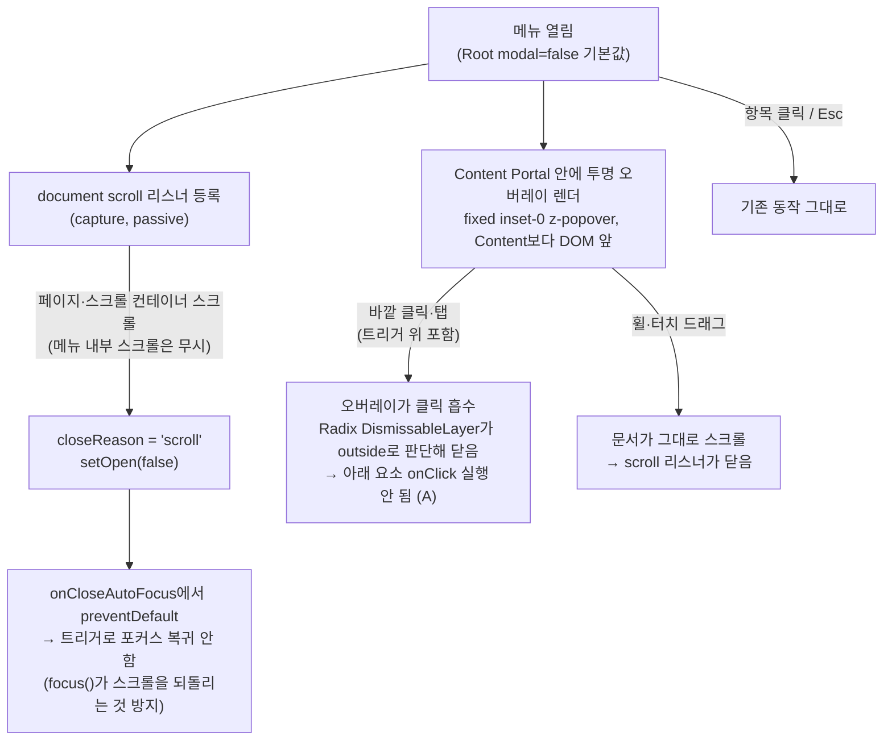

# 드롭다운 메뉴: 스크롤 잠금 해제 + 스크롤 시 닫힘 + 바깥 첫 클릭은 닫기만

## Context

우상단 계정 메뉴(프로필 수정·내 댓글·로그아웃)가 열려 있는 동안 페이지 스크롤이 막힌다(모바일·데스크톱 공통).
원인은 Radix `DropdownMenu`의 기본값 `modal={true}`다. 이 모드에서 `MenuRootContentModal`이
`disableOutsideScroll: true`로 `react-remove-scroll`을 건다
(`node_modules/@radix-ui/react-menu/dist/index.mjs:136-139`). 스크롤 잠금만 따로 끄는 옵션은 없고,
`modal={false}`(`MenuRootContentNonModal`, 같은 파일 :151-160)로 바꿔야 풀린다.

사용자와 합의한 목표 동작(실험 프로젝트라 전체 메뉴에 적용):

1. **메뉴가 열려 있어도 페이지 스크롤이 된다**
2. **스크롤하면 메뉴가 닫힌다** — 게시글 목록에선 바깥에 누를 곳이 전부 게시글 카드라 닫으려고
   누르기 부담스럽다는 사용자 관찰에서 나온 아이디어
3. **바깥 첫 클릭은 메뉴만 닫는다(A 방식)** — 그 클릭이 아래 게시글 카드 등으로 전달되지 않는다.
   근거는 NN/g 휴리스틱 #5 Error Prevention이다. 원문:
   _"the best designs carefully prevent problems from occurring in the first place. Either eliminate
   error-prone conditions..."_ ([NN/g](https://www.nngroup.com/articles/ten-usability-heuristics/)).
   반대쪽(B, 클릭 통과)이 웹 표준 popover의 기본 동작이라는 점도 확인했다:
   _"a popover is non-modal"_, _"Click outside the popover (focus the clicked thing)"_
   ([Open UI Popover Explainer](https://open-ui.org/components/popover.research.explainer/)).
   두 근거를 비교해 사용자가 A를 골랐다.

**적용 대상:** `DropdownMenu` 사용처 4곳 전부다.

- 계정 메뉴 `widgets/layout/navbar/ui/Navbar.tsx:198`
- 폴더 ⋮ 메뉴 데스크톱 `widgets/bookmark/folder-tree/ui/FolderTree.tsx:275`
- 폴더 ⋮ 메뉴 모바일 `widgets/bookmark/folder-tree/ui/MobileFolderList.tsx:166`
- 게시글 ⋮ `widgets/post/post-card/ui/PostCard.tsx:128`. 이미 `modal={false}`라 지금은 B 동작이고, 이번 변경으로 A가 된다.

**범위 제외:**

- 북마크 정렬 `Select`(`pages/bookmark/BookmarkPage.tsx:163,198`). Radix Select는
  `RemoveScroll`을 조건 없이 건다(`react-select/dist/index.mjs:438`). 고치려면 컴포넌트를 교체해야 해서 별도 작업으로 둔다.
- Dialog·Sidebar 드로어·검색 오버레이. 화면 전체를 덮는 오버레이라 의도적으로 잠근다(`docs/DECISIONS.md` 2026-09-17).

## 설계

모든 변경은 공용 래퍼 `src/shared/ui/atoms/dropdown-menu.tsx` 한 파일에 둔다. 사용처 코드는 건드리지 않는다.
예외로 `PostCard.tsx`의 `modal={false}`는 기본값과 같아져 불필요하지만, 남겨도 동작이 같으므로 §3(최소 범위)에 따라 그대로 둔다.
선례는 같은 파일에서 이미 쓰고 있는 패턴이다. `DropdownMenuOpenContext`로 open 상태를 래퍼가 직접 들고
있다(2026-09-21 press-drag 수정, `docs/plans/2026-09-21-dropdown-trigger-click.md`).

### 변경 1 — Root 기본값 `modal = false`

`DropdownMenu`가 `modal` prop을 구조분해해서 기본값 `false`로 `DropdownMenuPrimitive.Root`에 넘긴다.
이렇게 하면 `react-remove-scroll`, 포커스 트랩, `hideOthers`(aria-hidden)가 모두 빠진다.

### 변경 2 — 스크롤하면 닫기

`DropdownMenu`에서 `open`일 때만 `document.addEventListener('scroll', …, { capture: true, passive: true })`를 등록한다.

- capture로 등록하는 이유: FolderTree처럼 요소 스크롤 컨테이너 안에서의 스크롤도 잡기 위해서다.
- `event.target`이 메뉴 Content 안이면 무시한다. Content는 `overflow-y-auto`라 긴 메뉴는 내부에서 스크롤된다.
  이를 위해 Content 노드 ref를 컨텍스트로 공유한다.
- 닫을 때 컨텍스트의 `closeReasonRef`를 `'scroll'`로 표시한다. `DropdownMenuContent`의 `onCloseAutoFocus`에서
  이 값을 보고 `event.preventDefault()`를 호출한다. 호출하지 않으면 Radix가 `triggerRef.focus()`를 실행하고
  (`react-dropdown-menu/dist/index.mjs:113-117`), 이 focus가 트리거가 있는 위치로 스크롤을 되돌릴 수 있다.

### 변경 3 — 바깥 첫 클릭은 닫기만(투명 오버레이)

`DropdownMenuContent`의 Portal 안, Content **앞**에 `
`를 렌더한다.

- z-index는 Content와 같은 `z-popover`를 쓴다. DOM 순서상 Content가 뒤에 오므로 Content가 위에 그려진다.
  토큰 정의는 `app/globals.css:93`에 있다.
- 오버레이는 DismissableLayer 바깥 트리에 있어서 outside 판정을 받는다. 그래서 Radix가 원래 경로대로 닫는다
  (마우스는 pointerdown에서, 터치는 click에서, `react-dismissable-layer/dist/index.mjs:135-170`).
  클릭은 오버레이가 받으므로 아래 요소의 핸들러는 실행되지 않는다.
- 캡처 리스너로 click을 삼키는 방식은 쓰지 않는다. 드래그로 끝나 click이 오지 않으면 "다음 정상 클릭이
  먹히는" 상태가 남을 위험이 있기 때문이다. 오버레이는 이런 무장(armed) 상태를 만들지 않는다.
- 오늘의 modal 모드도 body에 `pointer-events: none`을 걸어 바깥 클릭과 hover를 막는다. 그래서 오버레이가
  hover를 가리는 것은 새로 생기는 퇴행이 아니다.
- **검증이 필요한 가정:** fixed 오버레이 위에서 휠이나 터치 드래그를 하면 문서가 스크롤된다는 가정이다.
  e2e로 검증한다. 가정이 틀리면 구현을 멈추고 사용자에게 보고한다. 대안은 캡처 리스너 방식에 무장 해제
  테스트를 붙이는 것이다.

## 영향 범위 점검 (§5)

CRUD: 데이터 계약 변경 없음(순수 UI 동작).

기존 동작 회귀 후보:
| 영향 | 소유 파일 | 처리 |
|---|---|---|
| 4개 메뉴 전부 바깥 클릭·포커스 동작 변경 | 위 4곳 | 아래 e2e로 확인 |
| PostCard 제어형(`isMenuOpen`) — 스크롤 닫힘 시 `onOpenChange(false)` 호출 | `PostCard.tsx:128` | 래퍼 `setOpen`이 이미 `onOpenChange`를 호출 — 확인만 |
| 포커스 트랩 제거 → Tab으로 메뉴 벗어나면 닫힘(Radix nonmodal `onFocusOutside`) | Radix | APG 메뉴 버튼 패턴과 일치, 수용 |
| 바깥 클릭 후 트리거로 포커스 복귀 안 함(nonmodal의 `hasInteractedOutsideRef`) | Radix | Esc 닫힘 시 복귀는 유지 — e2e/수동 확인 |
| 스크롤바 보정(padding-right) 사라짐 → 데스크톱에서 메뉴 열 때 레이아웃 흔들림 없어짐 | react-remove-scroll | 개선 |
| e2e 주석이 "modal이라 hideOthers로 aria-hidden" 단정 | `e2e/bookmark-folder-menu-press-drag.spec.ts` | 주석 갱신, 테스트 통과 확인 |
| 메뉴 연 뒤 `getByRole`이 aria-hidden 해제로 더 많은 요소를 찾아 strict 위반 가능 | 메뉴 관련 e2e(`logout`, `account-update`, `post-*`, `bookmark-folder-*`) | 전체 e2e 실행 |

## 작업 순서

1. `git log origin/main..main`, `git worktree list`를 확인한다. 이어서 `EnterWorktree`로 워크트리를 만들고 부트스트랩한다(`cp ../../../.env .`, `pnpm install`).
2. `dropdown-menu.tsx`에 변경 1~3을 넣는다. 컨텍스트 확장은 `contentRef`와 `closeReasonRef`다.
3. 새 e2e `e2e/dropdown-menu-scroll.spec.ts`(데스크톱)와 `e2e/dropdown-menu-scroll.mobile.spec.ts`를 작성한다.
   선례는 `mobile-search-scroll-lock.mobile.spec.ts`, `bookmark-folder-menu-press-drag.spec.ts`다.
   - 계정 메뉴를 열고 휠 스크롤 → `scrollY`가 증가하고 메뉴(`role=menu`)가 사라지는지
   - 메뉴를 열고 body에 `data-scroll-locked`/`overflow:hidden`이 없는지
   - 메뉴를 열고 게시글 카드 위를 클릭 → 메뉴만 닫히고 URL이 그대로인지. 다시 클릭하면 이동하는지
   - (모바일) 터치 드래그로 스크롤 → 메뉴가 닫히는지. 탭 → 메뉴만 닫히고 다음 탭은 정상 동작하는지
   - 폴더 ⋮ 메뉴 내부 스크롤로는 닫히지 않는지(항목이 적어 내부 스크롤이 없으면 생략)
4. press-drag e2e의 modal 전제 주석을 갱신한다.
5. 문서를 갱신한다.
   - `docs/DECISIONS.md`: A/B 비교, 오버레이 vs 캡처 리스너, Select 제외 이유. 인용은 §10 형식(원문 인용과 링크)으로 쓴다.
   - `CHANGELOG.md [Unreleased]`: `changelog-release` skill을 읽고 쓴다.
   - `docs/plans/2026-09-24-dropdown-scroll-dismiss.md`: 이 계획의 스냅샷.
6. 검증을 진행한다(아래 절).
7. 커밋은 `.gitmessage` 형식으로 한다(`fix(shared): …`). PR 전에 fresh Explore 서브에이전트로 계획과 diff를 대조하고(§11), 결과를 PR 본문 `## 계획 대비 구현` 섹션에 넣는다. 머지는 squash로 한다.

## 검증

- `pnpm type-check` → `pnpm test` → `pnpm lint`. 문서를 수정했으므로 `pnpm check:docs`도 실행한다.
- `pnpm test:e2e`는 전체를 돌린다(새 스펙과 기존 메뉴 관련 스펙 전부).
- `browser-verification` skill 절차에 따라 Playwright MCP로 녹화한다(데스크톱과 모바일 뷰포트).
  계정 메뉴 열기 → 스크롤(닫힘) → 다시 열기 → 게시글 클릭(메뉴만 닫힘) 순서로 찍고, `SendUserFile`(display: render)로 전달한다.
- `main` 반영 후 `gh run list --branch main --workflow "Frontend Deploy (S3 + CloudFront)"`로 배포 성공을 확인한다.
