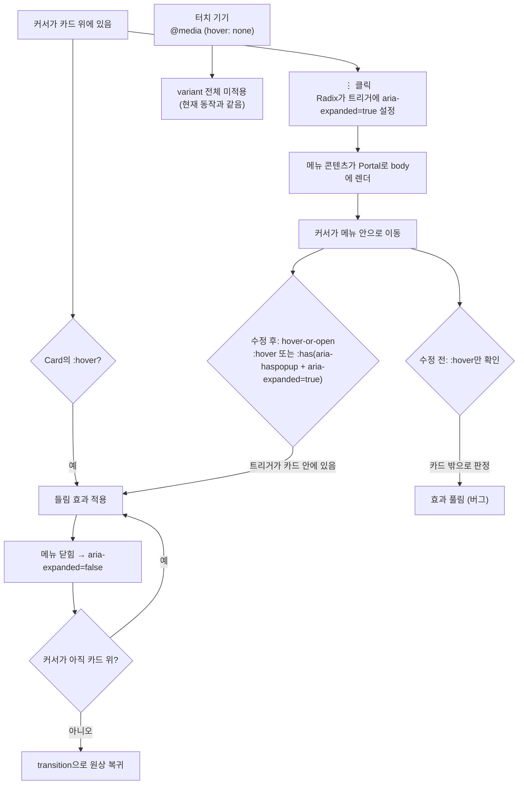

# PostCard·FolderTree: 포털 드롭다운을 연 동안 부모 hover 스타일 유지

## Context

PostCard에 마우스를 올리면 카드가 들리고 그림자가 커진다(`hover:shadow-lg hover:-translate-y-0.5`,
`src/widgets/post/post-card/ui/PostCard.tsx:78`). ⋮ 드롭다운을 열고 커서를 메뉴 안으로 옮기면 이 효과가
풀린다. `DropdownMenuContent`가 `Portal`로 `<body>` 바로 아래에 렌더되기 때문이다
(`src/shared/ui/atoms/dropdown-menu.tsx:125`). DOM상으로 메뉴는 카드 밖에 있어서, 메뉴 위에 있는
커서는 카드의 `:hover`에 잡히지 않는다. 북마크 폴더 행(`src/widgets/bookmark/folder-tree/ui/FolderTree.tsx:258`,
`hover:bg-accent`)에도 같은 버그가 있다.

목표는 두 가지다.

1. 이 컨테이너 안에서 연 팝업이 열려 있는 동안 hover 스타일을 유지한다.
2. 같은 문제가 다시 생기지 않도록 규칙을 skill 문서에 남긴다. 사용자는 ESLint 규칙 없이 문서만
   남기기로 결정했다.

사용자가 결정한 것:

- 범위는 PostCard와 FolderTree 둘 다다.
- 재발 방지는 skill 문서만으로 한다.

## 전체 흐름



## 변경 사항

### 1. `src/app/globals.css`: 재사용 variant 추가

기존 `@custom-variant dark` 바로 아래(L5 다음)에 추가한다. 블록 문법(`@media` 안에 `@slot`)은
Tailwind 공식 문서의 `any-hover` 예제와 같은 형태다
(https://tailwindcss.com/docs/adding-custom-styles, context7로 확인).

```css
/*
 * hover:와 같되, 이 요소 안의 팝업 트리거(드롭다운·셀렉트·팝오버)가 열려 있는 동안에도 유지된다.
 * 팝업 콘텐츠는 Portal로 <body>에 렌더돼 커서가 메뉴로 들어가면 부모의 :hover가 풀리기 때문이다.
 * hover:처럼 @media (hover: hover) 안에서만 적용돼 터치 기기 동작은 바뀌지 않는다.
 */
@custom-variant hover-or-open {
  @media (hover: hover) {
    &:is(:hover, :has([aria-haspopup][aria-expanded='true'])) {
      @slot;
    }
  }
}
```

설계 근거:

- `aria-expanded`만 보지 않고 `aria-haspopup`까지 조건에 넣는다. AI 요약 토글처럼 펼치기(disclosure)
  버튼에 나중에 `aria-expanded`를 붙여도 카드가 들리지 않게 하기 위해서다. Radix DropdownMenu·Select·
  Popover 트리거는 둘 다 붙이지만, 펼치기 버튼은 `aria-haspopup`을 붙이지 않는다.
- PostCard 안의 `BookmarkPostButton`·`UserAvatar`는 Radix 트리거를 쓰지 않는다(grep 결과 0건).
  따라서 드롭다운 말고 다른 팝업이 이 조건에 걸리는 경우는 지금은 없다.
- `@media (hover: hover)`는 Tailwind v4 기본 `hover:`를 그대로 따른 것이다. 모바일에서는 원래
  들림 효과가 없고, 메뉴를 열어도 카드가 들리지 않는다.
- JS 상태(`isMenuOpen`)를 연결하는 방식은 채택하지 않았다. FolderTree의 메뉴는 uncontrolled라
  코드를 고쳐야 하고, 새로 만들 때마다 같은 연결을 반복해야 한다. 잠긴 워크트리
  `dropdown-scroll-dismiss`가 메뉴를 여는 즉시 카드를 덮는 전체 화면 레이어를 추가하고 있어서,
  커서를 추적하는 방식은 이것과 합쳐지면 깨진다. 트리거 상태를 보는 이 방식은 두 경우 모두 동작한다.

### 2. `src/widgets/post/post-card/ui/PostCard.tsx:78`

`hover:shadow-lg hover:-translate-y-0.5`를 `hover-or-open:shadow-lg hover-or-open:-translate-y-0.5`로
바꾼다. `transition-[transform,box-shadow]`는 그대로 둔다.

### 3. `src/widgets/bookmark/folder-tree/ui/FolderTree.tsx:258`

`hover:bg-accent`를 `hover-or-open:bg-accent`로 바꾼다. 트리거의 `data-[state=open]:opacity-100`(L280)은
그대로 둔다(트리거 자체가 보이게 하는 역할).

### 4. 규칙 문서화 (재발 방지, skill 문서만)

- **정본**: `.claude/skills/responsive-ux/SKILL.md`의 `### hover와 밀도`(L71~)에 bullet 하나를 추가한다.
  hover 스타일이 있는 컨테이너 안에 포털 팝업(DropdownMenu·Select·Popover) 트리거를 두면 `hover:`
  대신 `hover-or-open:`을 쓴다. 이유(Portal → `:hover` 풀림)와 선례 파일 두 곳을 함께 적는다.
  `## 점검 항목`에도 한 줄 추가한다.
- **트리거 강화**: `responsive-ux`의 `description`·`when_to_use`에 "hover 스타일 컨테이너 안에
  드롭다운·팝오버를 둘 때"를 추가한다.
- **motion-ux 교차 링크**: `.claude/skills/motion-ux/SKILL.md`에 짧은 절이나 한 줄을 추가한다.
  hover 트랜지션을 붙이는 컨테이너 안에 팝업이 있으면 responsive-ux의 해당 절을 보라는 내용이다.
  본문은 복제하지 않는다(SSOT).
- **`.claude/CLAUDE.md:809`**: 스킬 인덱스 표의 `responsive-ux` 행 "언제 읽는가"에 같은 트리거를
  덧붙인다. CLAUDE.md는 매 세션 로드되므로 skill이 호출되지 않아도 한 번은 보인다.

### 5. 회귀 테스트 (e2e)

- `e2e/post-card-hover-menu.spec.ts`(chromium): 카드에 hover → ⋮ 클릭 → 메뉴 항목에 hover →
  `expect(card).toHaveCSS('transform', 'matrix(1, 0, 0, 1, 0, -2)')`를 단언한다. `toHaveCSS`가 재시도하므로
  transition 도중 값 때문에 불안정해지지 않는다. 메뉴를 닫고 커서를 카드 밖으로 옮기면 `none`으로
  돌아오는지도 확인한다.
  - 선례: `e2e/post-visibility.spec.ts`. 메뉴를 여는 locator `getByRole('button', { name: TEXTS.ariaLabels.postMenu })`와
    `page.route()` 모킹 설정을 그대로 따른다.
- 폴더 행: `e2e/bookmark-folder-delete.spec.ts`의 폴더 메뉴 열기 절차를 본떠, 같은 파일 또는
  `bookmark-folder-*.spec.ts` 형태로 행의 `background-color`가 유지되는지 단언한다.
- 모바일 불변성: 선택 사항이다. `*.mobile.spec.ts`로 메뉴를 열어도 transform이 `none`인지 확인한다.
  구현할 때 기존 mobile 스펙에서 게시글 메뉴 접근이 쉬운지 보고 결정한다.

### 6. CHANGELOG

`CHANGELOG.md`의 `[Unreleased]`에 `### Fixed` 항목을 추가한다. `changelog-release` skill 포맷을 따른다.

## 영향 범위 (CLAUDE.md §5)

- **CRUD**: 해당 없음. 스타일만 바뀌고 데이터 경로는 건드리지 않는다.
- **회귀 가능 지점**:
  - PostCard: 수정 중(`isUpdating`) 오버레이, `dimmedClassName`과는 무관하다. 기존 e2e 3종(`post-delete`,
    `post-update`, `post-visibility`)은 메뉴 클릭 흐름만 보므로 영향이 없다. 들린 카드도 클릭 좌표는 같다.
  - FolderTree: `selected && 'bg-accent'`와 겹쳐도 같은 색이다. `bookmark-folder-menu-press-drag.spec.ts`는
    오발동을 검사하는 스펙이라 배경색과 무관하다.
  - `globals.css`에 variant만 추가하므로 기존 클래스에 영향이 없다.
- **병렬 작업**: 잠긴 워크트리 `dropdown-scroll-dismiss`는 `dropdown-menu.tsx`만 수정하고, 이 작업은
  그 파일을 건드리지 않는다. 파일 충돌은 없고, 위에서 설명했듯 두 변경이 합쳐져도 동작한다.

## 작업 절차

1. `git log origin/main..main` 확인(현재 0건) → `EnterWorktree` → `cp ../../../.env . && pnpm install`
2. 위 1~3 코드 변경 → `pnpm type-check`, `pnpm lint`
3. e2e 스펙 추가 → `pnpm test:e2e -- post-card-hover-menu`와 폴더 스펙 실행
4. skill·CLAUDE.md 문서 변경 → `pnpm check:docs`
5. `browser-verification` skill 절차로 실제 브라우저 녹화(카드 hover → ⋮ → 메뉴로 이동해도 들림
   유지, 폴더 행도 같음)를 사용자에게 보여준다
6. 이 계획을 `docs/plans/2026-09-24-hover-or-open-variant.md`로 복사해 같은 PR에 커밋한다(§11)
   → fresh Explore subagent로 계획과 diff를 대조한다 → PR 본문에 `## 계획 대비 구현` 섹션을 넣는다

## 검증

- `pnpm type-check` / `pnpm lint` / `pnpm test` / `pnpm check:docs` 통과
- 새 e2e 스펙이 **수정 전 코드에서 실패하고 수정 후 통과**하는지 확인한다(재현 테스트 성립 여부).
  작업 브랜치에서 클래스를 잠시 되돌려 한 번 돌려본다.
- 브라우저 녹화에서 확인할 것:
  - 데스크톱: 카드 → ⋮ → 메뉴 항목으로 커서를 옮겨도 들림과 그림자가 유지된다
  - 메뉴를 닫고 카드 밖으로 나가면 원상 복귀한다
  - 폴더 행 배경이 유지된다
  - 모바일 뷰포트: 메뉴를 열어도 카드가 들리지 않는다(현재와 같음)
