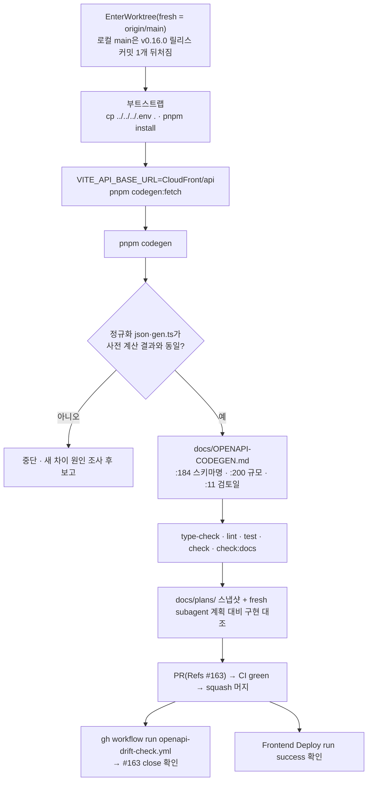

# 이슈 #163 해소 — BE OpenAPI 스펙 스냅샷 갱신

## Context

`openapi-drift-check.yml`(매일 cron, 실제 실행 03:34~03:46 UTC)이 2026-09-21 자동으로 연 이슈 #163.
커밋된 `src/shared/api/generated/openapi.json`이 운영 BE 스펙과 다르다.

**원인(git 이력으로 확인):** FE 스냅샷을 마지막으로 받은 건 FE #139(`66057d2`, 09-20 15:00Z).
그 뒤 BE 변경 2건이 운영에 배포됐다.

- BE #20(`0f0c6df`): 댓글 비작성자 삭제·수정 응답 500 → 403
- BE #21(`9c7d374`): reorder 엔드포인트와 "정렬" 태그 문구 제거

FE #155(reorder 제거)는 generated 파일을 일부러 건드리지 않았다. 커밋 메시지에 "BE 배포 뒤 재실행"이라고 미뤄 둔 채 그대로 남았다.

**실제 차이 3가지.** 운영 스펙을 직접 받아 정규화 diff한 결과로, 이슈 본문보다 많다.

1. `/bookmark/folders/reorder` PATCH와 `ReorderFoldersRequest` 제거 (이슈에 보고됨)
2. 댓글 삭제·수정 operation description의 500 → 403 문구 변경 (이슈에 없음)
3. `북마크 폴더` 태그 description에서 "·정렬" 제거 + tags 배열 순서 이동 (이슈에 없음)
   - 순서가 바뀐 원인: springdoc 2.7.0은 태그를 HashSet으로 모은다. 그런데 `Tag.hashCode`에 description이 포함돼 있어서, description이 바뀌자 해시 위치가 달라졌다(javap로 확인).
   - 재시작할 때마다 순서가 흔들릴 가능성은 낮다(추론).
   - gen.ts에는 tags가 들어가지 않는다.

**고치는 이유:** 이슈가 열려 있는 동안 cron은 `재보고 생략`으로 끝난다(`scripts/check-openapi-drift.js:180-183`). 그래서 새 드리프트가 보고되지 않는다.

**범위(사용자 선택):** 스펙 갱신 + 이 갱신으로 낡게 되는 문서만. `summarizeDrift()` 개선은 범위 밖이다.

## 영향 범위 (§5)

- **런타임:** 없음.
  - reorder·`ReorderFoldersRequest`를 참조하는 비생성 코드는 0건이다.
  - `openapi.gen.ts`를 쓰는 곳은 `*.dto.ts` 6개와 `api.type.ts`뿐이고, `operations[...]`는 `getAllPosts` 하나다.
  - gen.ts는 type-only이고 openapi.json은 import되지 않는다. 그래서 번들은 동일할 것으로 추정한다(빌드 비교는 안 함).
- **댓글 403:** 사용자에게 보이는 변화가 없다.
  - `CommentItem.tsx:34,136`: 작성자에게만 수정·삭제 버튼이 보인다.
  - 에러가 나도 403 FORBIDDEN과 500 모두 `serverError` 토스트로 같다(`error-toast.ts:88-107`).
  - 500을 가정한 테스트·mock·문서는 없다.
- **CI 게이트:** `ci.yml:58-65`는 커밋된 json으로 gen.ts를 재생성해 대조한다.
  - json과 gen.ts는 반드시 같은 커밋에 넣는다.
  - `pnpm check`의 format:check가 두 파일을 검사한다. 그래서 prettier를 포함한 `pnpm codegen:fetch`로만 받는다.
- **배포:** 머지하면 main push로 워크플로 3개가 돈다.
  - `deploy.yml`: 경로 필터 `src/**`
  - `history.yml`: Gemini가 `docs/HISTORY.md`를 자동 커밋한다. 그래서 main에 커밋이 하나 더 쌓인다.
  - `doc-drift-check.yml`
- **check:docs:** 영향 없음. 영향받는 파일을 가리키는 `파일:줄` 참조가 레포에 0건이다.
- **BE 쪽 추가 드리프트 요인:** 없음. BE 열린 PR 0건이고, 이슈 생성 뒤 머지된 #23·#24는 스펙에 영향이 없다.

## 흐름

## 단계

1. **준비**
   - `EnterWorktree`(fresh, origin/main 기준). 미푸시 로컬 커밋이 없는 건 확인했다.
   - `cp ../../../.env .` 후 `pnpm install`. main의 node_modules엔 `openapi-typescript`가 없다. lockfile엔 있어서 설치하면 생긴다.
2. **재생성:** `VITE_API_BASE_URL=https://dbw3brui6htwk.cloudfront.net/api pnpm codegen:fetch && pnpm codegen`
   - CloudFront 주소를 쓰는 이유: cron과 같은 URL로 받아 "머지했는데 안 닫히는" 위험을 없애기 위해서다.
   - `.env`의 Lambda Function URL이 prod alias인지는 확인하지 못했다.
   - dotenv는 이미 설정된 환경변수를 덮어쓰지 않는다.
   - verify:
     - `git diff --stat`이 generated 2파일뿐이다.
     - 정규화한 openapi.json이 스크래치패드 `prod.json`과 같다.
     - gen.ts가 스크래치패드 `prod.gen.ts`와 같다(reorder path·operation·schema 삭제 + 댓글 JSDoc 2곳).
     - 다르면 멈추고 보고한다.
3. **문서:** `docs/OPENAPI-CODEGEN.md`
   - :184 bookmark-folder 행에서 없는 `reorderBookmarkFoldersSchema`를 빼고 `createBookmarkFolderSchema`/`bookmarkFolderSortEnum`(폼)만 남긴다.
   - :200 "스펙 규모(2026-09-20 기준) paths 30 / schemas 54"를 갱신일 기준 29 / 53으로 바꾼다. nullable 24는 그대로다.
   - :11 마지막 검토일을 갱신한다.
4. **검증:** `pnpm type-check` → `pnpm lint` → `pnpm test` → `pnpm check` → `pnpm check:docs`
5. **커밋:** `build(shared): BE 운영 스펙 스냅샷 갱신 — reorder 제거·댓글 403 설명 반영`
   - 선례는 #135 `build(shared)`이고, `.gitmessage`에서 build는 "외부 의존성 변경"으로 정의돼 있다.
   - `git commit -- <경로...>`로 대상을 지정한다.
   - CHANGELOG는 쓰지 않는다. changelog-release skill의 기록 대상은 feat/fix/perf와 동작이 바뀌는 refactor뿐이고, #135/#137/#139/#140도 항목이 없다. reorder 제거는 이미 `[0.16.0]`에 있다.
6. **§11:** 이 계획을 `docs/plans/2026-09-24-openapi-drift-163.md`로 같은 PR에 커밋한다. fresh Explore subagent로 계획 대비 diff를 대조하고, 결과를 PR 본문 `## 계획 대비 구현`에 적는다.
7. **PR·머지**
   - 본문에 `Refs #163`을 쓴다. `Closes`는 쓰지 않는다. 그러면 운영 스펙과 맞는지 확인 없이 닫히고, 드리프트가 남았을 때 다음 cron이 새 이슈를 만든다.
   - CI green을 확인한 뒤 `gh pr merge <번호> --squash`.
8. **사후 확인**
   - `gh workflow run openapi-drift-check.yml --ref main` 후 run success와 #163 closed를 확인한다.
   - `gh run list --branch main --workflow "Frontend Deploy (S3 + CloudFront)"`로 머지 커밋 SHA의 success를 확인한 뒤 보고한다.

## 범위 밖 (최종 보고에 언급만)

- **`summarizeDrift()` 한계**
  - paths/schemas 키 집합만 비교한다. 키 차이가 있으면 내부 필드 차이를 숨긴다.
  - tags/info/security는 보지 않는다. 그래서 tags만 달라도 "paths/schemas 내부 필드가 다름"이라는 틀린 안내가 나간다.
  - scripts엔 테스트도 없다.
  - 고치려면 `ci(infra)`로 별도 PR을 낸다(#144 선례).
- **`scripts/check-doc-drift.js` 검사 범위 버그:** OPENAPI-CODEGEN.md:184의 낡은 참조가 문서 감시에 걸리지 않은 근본 원인이다.
  - 기준 미달로 넘어간 push에서도 `last_checked_sha`를 그 시점 HEAD로 덮어쓴다(:431).
  - 그래서 경량 감사는 마지막 push 1회분만 diff한다(:335-336). #155가 지운 export는 검사된 적이 없다.
  - `MERGE_COMMIT_RE`(:38)는 "Merge pull request #N" 형태 커밋을 세지 못한다.
- **#155 때부터 낡은 지점 (이번 변경과 무관)**
  - `docs/TESTING.md:718`: "뮤테이션·API·엔드포인트는 있으나"라고 적혀 있지만 이제 사실이 아니다.
  - `e2e/bookmark-folder-delete.spec.ts:33`: 주석 근거가 reorder다. 가드 자체는 `PATCH /bookmark/folders/{id}`와 겹쳐서 여전히 필요하다.
- **BE `README.md:225`:** FE 드리프트 체크를 "6시간마다"라고 적었지만 실제는 매일 1회다.
- **`docs/VERSION-COMPATIBILITY.md`:** 현재 배포 버전 표가 FE v0.14.0 / BE v0.10.0에 머물러 있다.
- **CHANGELOG `[0.16.0]`:** `### Changed`·`### Fixed`가 중복돼 있다.
