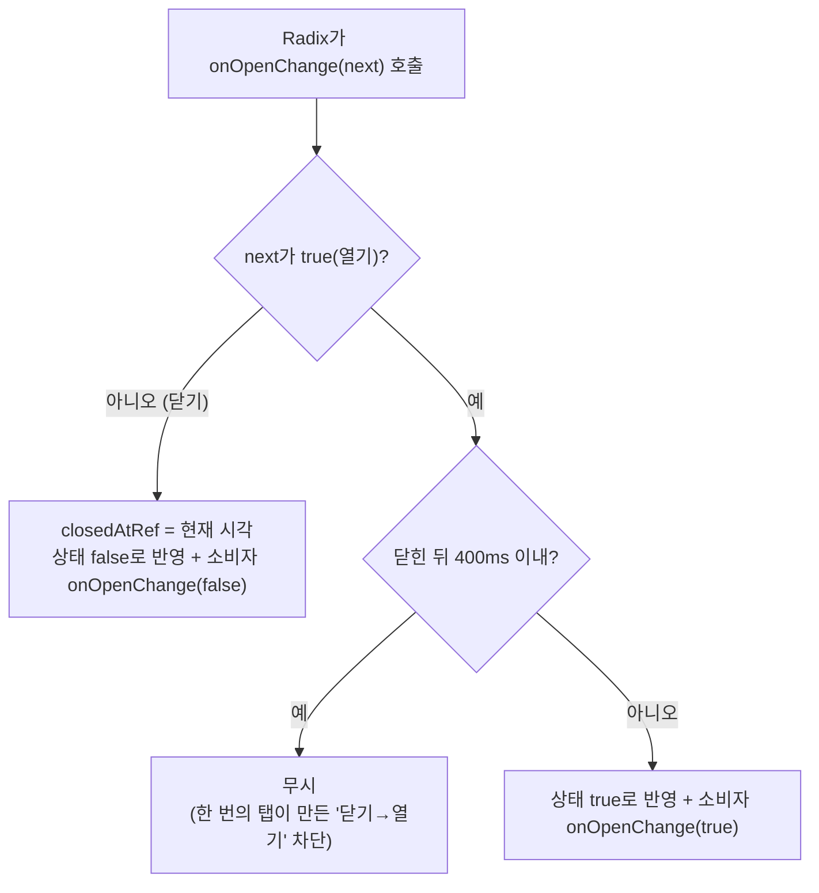

# Select: 닫힌 직후 재오픈 방지 가드

## Context

모바일에서 북마크 정렬 `Select`를 닫으려고 트리거를 다시 탭하면, 닫혔다가 곧바로 다시 열린다(사용자 실기기 제보).
크롬 에뮬레이션(Pixel 5, 누름 시간 0/120/300ms)에서는 재현되지 않았다. 에뮬레이션에서는 열려 있는 동안 Radix가
body에 `pointer-events: none`을 걸어 두 번째 탭이 `HTML`에 떨어지고, 닫기만 일어났다.

유력한 가설은 이렇다(실기기 미확인). Radix Select는 한 번의 탭을 두 리스너가 따로 듣는다.

- 트리거 click 핸들러: 터치일 때 **연다** (`node_modules/@radix-ui/react-select/dist/index.mjs:185-189`)
- DismissableLayer 바깥 감지: 터치일 때 document click에서 **닫는다**

실기기에서 탭이 트리거에 닿아 두 리스너가 "닫기 → 열기" 순서로 실행되면 재오픈이 된다.
DropdownMenu에서 같은 유형의 이슈가 있었다([radix-ui/primitives #1059](https://github.com/radix-ui/primitives/issues/1059),
제목 번역: _"트리거를 누르면 닫혔다가 곧바로 다시 열린다"_, 이미 해결됨).

사용자와 합의한 방향:

- `DropdownMenu`와 `Select`는 **나눠서 관리**한다. 근거는 NN/g의 메뉴/드롭다운 박스 구분과 W3C APG의 Menu Button / Select-Only Combobox 별도 패턴이다. 합치면 결국 다시 나누게 된다는 사용자 판단도 있다.
- 네이티브 `<select>`는 쓰지 않는다. 모바일과 데스크톱의 관리 방식이 갈라지기 때문이다.
- Radix Select는 유지하고 스크롤 잠금도 둔다(PR #180의 C 결정). **재오픈만 `select.tsx` 래퍼 안에서 막는다.**

## 설계

선례는 `src/shared/ui/atoms/dropdown-menu.tsx`의 `DropdownMenu` 래퍼다. `open`/`defaultOpen`/`onOpenChange`를 받아 래퍼가 열림 상태를
직접 들고 Root에 제어형으로 넘기는 구조를 그대로 따른다.

### 변경 1 — `Select` 래퍼 (`src/shared/ui/atoms/select.tsx`)

- `const Select = SelectPrimitive.Root`를 함수 컴포넌트로 바꾼다.
- `DropdownMenu`와 같은 제어형 상태(`openProp ?? uncontrolledOpen`)를 쓴다.
- `onOpenChange`를 가로채 규칙을 적용한다.
  - 닫기 요청은 항상 반영하고 `closedAtRef`에 시각을 기록한다.
  - 열기 요청은 마지막으로 닫힌 뒤 임계값 이내면 무시한다. 소비자의 `onOpenChange(true)`도 호출하지 않는다.
- 닫기는 절대 막지 않는다. 열자마자 항목을 고르는 경우 등은 그대로 닫혀야 한다.
- 시각은 `Date.now()`를 쓴다. `useClickGuard.ts`와 같은 방식이며, dayjs 규칙은 날짜 처리 대상이라 경과 시간 측정에는 해당하지 않는다(lint로 확인한다).

### 변경 2 — 임계값 단일 소스 (`src/shared/hooks/useClickGuard.ts`)

- 400ms와 그 근거(의식적 재클릭과 무의식적 중복의 구분, DECISIONS 2026-09-21)는 이미 `useClickGuard`에 있다.
- 상수 `CLICK_GUARD_MS = 400`을 export하고, 훅 기본값과 Select 래퍼 모두 이 상수를 쓴다. 값이 두 곳에 흩어지지 않게 하기 위해서다.
- `useClickGuard` 훅 자체는 재사용하지 않는다. 이 훅은 "같은 핸들러의 재호출"을 거르는데, 여기서 필요한 건 "닫힌 시점부터의 경과"라 의미가 다르다.
- 훅의 동작과 시그니처는 바꾸지 않는다.

## 영향 범위 (§5)

CRUD: 데이터 계약 변경 없음(UI 동작만).

| 영향                                                 | 소유 파일                                 | 처리                                                       |
| ---------------------------------------------------- | ----------------------------------------- | ---------------------------------------------------------- |
| 정렬 Select 2곳 (모바일·데스크톱)                    | `pages/bookmark/BookmarkPage.tsx:163,198` | 비제어형 사용이라 코드 수정 없음. 동작 확인                |
| 키보드: Esc로 닫고 400ms 안에 Enter로 다시 열기 불가 | 래퍼                                      | 같은 기준(무의식적 중복)으로 수용. PR에 명시               |
| 항목 선택 직후 400ms 안에 다시 열기 불가             | 래퍼                                      | 수용(사람이 결과를 보고 다시 여는 데 걸리는 시간보다 짧음) |
| `useClickGuard` 기본값                               | `shared/hooks/useClickGuard.ts`           | 값은 그대로(400), 상수로만 추출. 기존 테스트 통과 확인     |
| 스토리                                               | `select.stories.tsx`                      | 시각 변경 없음이라 수정 안 함                              |

## 작업 순서

1. 이 워크트리에서 `origin/main` 기준 새 브랜치 `fix/select-reopen-guard`를 만든다. PR #180과는 독립이다.
2. `useClickGuard.ts`에 `CLICK_GUARD_MS`를 export하고 기본값으로 쓴다.
3. `select.tsx`의 `Select`를 제어형 래퍼 + 재오픈 가드로 바꾼다.
4. 새 단위 테스트 `src/shared/ui/atoms/select.test.tsx`를 작성한다. 선례는 `useClickGuard.test.ts`의 `vi.useFakeTimers({ toFake: ['Date'] })`이고, 키보드로 조작한다.
   - Enter로 열린다.
   - Esc로 닫은 직후 Enter를 누르면 열리지 않는다.
   - 400ms가 지난 뒤 Enter를 누르면 열린다.
   - 막힌 열기 요청은 소비자의 `onOpenChange(true)`를 호출하지 않는다.
   - 가드를 빼면 두 번째 케이스가 실패하는지 확인한다(테스트가 실제로 검증하는지).
5. `CHANGELOG.md` `[Unreleased]`의 Fixed에 항목을 추가한다(`shared` 스코프).
6. PR #180 브랜치의 `docs/DECISIONS.md` Select 항목에 재오픈 문제와 "래퍼 가드로 해결, 합치거나 네이티브로 바꾸지 않음"을 보충한다(아직 머지 전이라 수정 가능).
7. 계획 스냅샷 `docs/plans/2026-09-24-select-reopen-guard.md`를 커밋한다. PR 전에 fresh Explore 서브에이전트로 계획과 diff를 대조한다(§11).

## 검증

- `pnpm type-check` → `pnpm test` → `pnpm lint`. 문서를 수정하므로 `pnpm check:docs`, `pnpm format:check`도 실행한다.
- 새 단위 테스트를 추가하고, 가드를 빼면 실패하는지 확인한다.
- 기존 e2e 전체를 돌린다(회귀 확인).
- `.claude/browser-artifacts/debug` 스크립트로 크롬 데스크톱·모바일에서 다음을 확인한다: 열기 → 트리거 재탭으로 닫힘 유지, 500ms 뒤 다시 열림, 항목 선택으로 정렬 변경.
- **실기기 확인은 사용자 몫이다.** 에뮬레이션에서 재현이 안 됐으므로, 배포 후 사용자가 휴대폰으로 "트리거 재탭 시 닫힌 채 유지"를 확인한다. 여전히 재오픈되면 가설이 틀린 것이니 화면 녹화로 원인을 다시 분석한다.
- 머지 후 `gh run list --branch main --workflow "Frontend Deploy (S3 + CloudFront)"`로 배포 성공을 확인한다.
