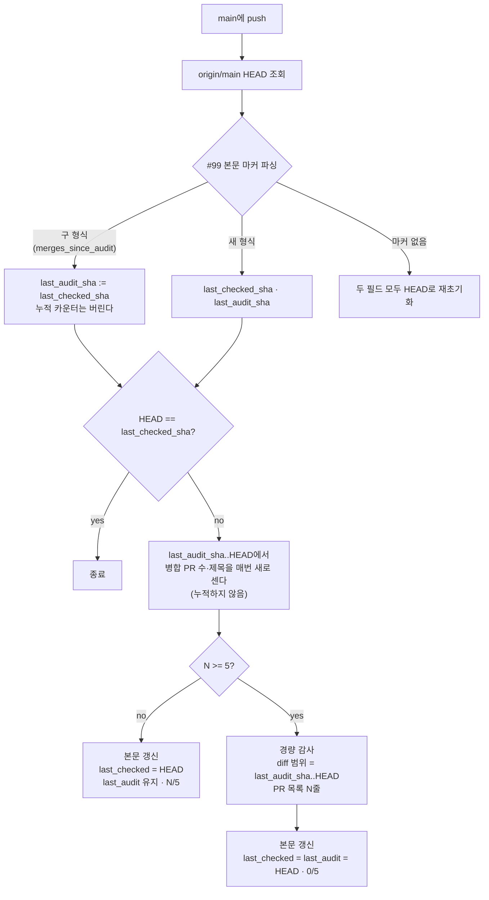

# doc-drift 경량 감사가 마지막 push 1건만 검사하던 문제 수정

## Context

`scripts/check-doc-drift.js`는 병합 PR이 5개(`THRESHOLD`) 쌓일 때마다 "삭제된 export/파일
경로가 문서·코드에 남아있는지" grep으로 검사하고, 상태는 트래킹 이슈
[#99](https://github.com/BAECHAN/link-sphere_FE_NEW/issues/99) 본문의 마커 주석에만 저장한다.
상태 필드 `last_checked_sha` 하나가 "마지막 실행 시점"과 "마지막 감사 시점"을 겸하고 있어서,
기준 미달 push마다 그 값이 HEAD로 덮어써진다. 그래서 5번째 push의 감사가 실제로 diff하는 범위는
**가장 최근 push 1건**뿐이다.

**직접 측정한 증상**(2026-09-25, `gh issue view 99 --json comments`와 `git log`로 확인):

| 증상                                 | 근거                                                                                                                                                         |
| ------------------------------------ | ------------------------------------------------------------------------------------------------------------------------------------------------------------ |
| diff 창이 push 1건분                 | 본문의 마지막 감사 `9bb000a..ed2b1b9 (병합 PR 5개)` → `git log` 결과 실제 PR은 #188 1개                                                                      |
| 리포트의 PR 목록도 1줄               | 과거 리포트 댓글 8개 전부 "병합 PR 5개"라고 쓰고 목록은 1줄. `subjects`가 `countMergedPRs(lastCheckedSha, head)`에서 나오기 때문(브리프에 없던 세 번째 증상) |
| `Merge pull request #N` 형식을 못 셈 | `1a4eee3..ed2b1b9`에서 원래 정규식은 25개, 실제는 43개(병합 커밋 18개 누락)                                                                                  |
| 실제 피해                            | #155는 `Merge pull request #155`(083f2e1)로 병합됐다. 두 버그가 겹쳐 `reorderBookmarkFoldersSchema` 삭제가 어느 감사 창에도 들어가지 못했다                  |

**의도한 결과**: 감사가 보는 git diff 범위, "병합 PR N개"라는 숫자, 리포트의 PR 목록이 **항상 같은
범위**(마지막 실제 감사 시점..HEAD)를 가리키게 한다. 레포에 쓰지 않는다는 원칙과, 상태를 이슈
#99 본문에만 둔다는 원칙은 그대로 유지한다.

## 전체 흐름 (수정 후)



## 설계 결정

**1. 필드를 둘로 나누고, 개수는 누적하지 않고 매번 다시 센다.**

사용자가 예시로 든 안(X)은 `last_audit_sha`를 추가하되 `merges_since_audit` 누적은 유지하는
방식이다. 이렇게 하면 diff 창은 고쳐지지만, 리포트의 PR 목록(`subjects`)은 여전히
`last_checked_sha..HEAD`에서 나와 1줄로 남는다. 목록까지 고치려면 어차피 `last_audit_sha`부터
다시 세야 하고, 그 순간 누적 카운터는 필요가 없어진다.

그래서 채택한 안(Y)은 다음과 같다.

- 마커: `<!-- doc-drift-state: last_checked_sha=X, last_audit_sha=Y -->`
- `merges_since_audit`는 마커에서 뺀다. 파생값이라 저장해두면 실제와 어긋날 여지만 생긴다.
- 매 실행마다 `countMergedPRs(last_audit_sha, HEAD)` 한 번으로 N, 목록, diff 기준점을 함께 얻는다.

Y의 부수 효과는 두 가지다.

- **개수 오차가 누락으로 이어지지 않는다.** 감사 범위가 연속적으로 이어지므로, 병합 수를 잘못
  세더라도 감사 시점이 앞당겨지거나 늦어질 뿐 빠지는 범위는 없다.
- **동시 실행 경쟁이 누락 대신 중복으로 끝난다.** 늦게 쓴 실행이 `last_audit_sha`를 되돌려도 다음
  감사 범위가 겹칠 뿐이다.

**2. 구 형식 마커는 `LEGACY_STATE_RE`로 읽어 `last_audit_sha = last_checked_sha`로 승계한다.**

사용자가 제안한 방식 그대로다. Y에서는 개수를 매번 새로 세기 때문에, 이렇게 해도 "5개"를
거짓으로 주장하는 일이 생기지 않는다.

- 대가: #99에 저장된 누적값 4는 버려지고, 화면은 4/5에서 1/5(이 수정 PR 1건)로 바뀐다.
- 자동 감사에서 빠지는 구간은 `ed2b1b9`(마지막 실제 감사)부터 병합 직전 HEAD까지다.
- `ed2b1b9..3f6d2c9`에는 감시 경로의 export 삭제가 0건, `src/` 파일 삭제가 0건임을 확인했다.
  병합 후 남는 구간은 아래 "검증 4"에서 수동으로 한 번 더 확인한다.
- 대안 비교:
  - 기존 재초기화 경로(:416-419)에 태우면 코드는 0줄이다. 하지만 복구용 경로를 계획된
    마이그레이션에 쓰는 셈이라 의도가 드러나지 않는다.
  - 감사 표의 `확인 범위` 끝 sha를 파싱해 정확히 복원하는 방법도 있다. 한 번만 쓰일 코드가 더
    길어지고, 사람이 읽는 표를 파싱해야 한다는 부담이 있다.

**3. `MERGE_COMMIT_RE`에 `^Merge pull request #\d+ `를 추가한다.**

- 지금 저장소 설정(`allow_merge_commit=false`)이 병합 커밋을 막고 있지만, 불과 3일 전에 켜져
  있었다.
- `1a4eee3..ed2b1b9`에서 머지된 브랜치 안쪽 커밋 중 `(#N)`으로 끝나는 커밋은 0개였다. 그래서
  `--first-parent` 없이도 이중으로 세지 않는다.

**4. 대시보드에 `다음 감사 시작점` 행 1줄을 추가한다.**

마커는 HTML 주석이라 보이지 않는다. 이번 사고는 보이는 숫자와 실제 범위가 어긋난 것이었으므로,
기준점을 표에 드러내 `git log <시작점>..HEAD`로 누구나 N을 대조할 수 있게 한다.

## 변경 1 — `scripts/check-doc-drift.js`

- `STATE_RE`: 새 형식만 매칭한다. `LEGACY_STATE_RE`에는 현재 정규식을 그대로 옮기고
  "2026-09-25 이전 형식" 주석을 단다.
- `parseState`: 새 형식이면 `{ lastCheckedSha, lastAuditSha }`를 반환한다. 구 형식이면
  `{ lastCheckedSha: m[1], lastAuditSha: m[1] }`, 둘 다 없으면 `null`이다.
- `buildBody(lastCheckedSha, lastAuditSha, mergesSinceAudit, auditSection)`: 마커 줄과
  `다음 감사 시작점` 행을 바꾼다. 나머지 표·안내문은 그대로 둔다.
  - 호출부 4곳:
    - 이슈 신규 생성: `(head, head, 0, '')`
    - 재초기화: `(head, head, 0, …)`
    - 기준 미달: `(head, state.lastAuditSha, N, …)`
    - 감사 후: `(head, head, 0, auditSection)`
- `main()`: `newMerges`와 누적 두 줄을 `const { count: totalMerges, subjects } = countMergedPRs(state.lastAuditSha, headSha);` 한 줄로 바꾼다.
- `runLightweightAudit`·`buildDrifReportBody`: 시그니처는 그대로 둔다. 안에서 `state.lastCheckedSha`를
  참조하는 4곳을 `state.lastAuditSha`로 바꾼다(`findDeletedIdentifiers`·`findDeletedFiles`·
  `rangeFrom`·리포트의 `확인 범위`).
- `MERGE_COMMIT_RE`: 설계 결정 3.
- 상단 주석: 8~10행의 "상태(마지막 확인 커밋·누적 병합 수)"를 "마지막 확인 커밋·마지막 감사
  커밋"으로 바꾼다. 이 파일의 관례대로 날짜를 단 문단을 하나 추가한다(두 필드로 나눈 이유,
  #155 사례).

**결과 본문 스케치**:

```markdown
<!-- doc-drift-state: last_checked_sha=<HEAD>, last_audit_sha=<기준점> -->

## 현재 상태

| 항목               | 값                   |
| ------------------ | -------------------- |
| 다음 경량 감사까지 | 2/5 병합             |
| 다음 감사 시작점   | `abc1234`            |
| 마지막 확인 커밋   | `def5678`            |
| 마지막 갱신        | 2026-09-25 09:00 UTC |
```

## 변경 2 — 문서

- `.claude/CLAUDE.md`의 "PR 머지는 항상 squash" 문단 이유 (2)는 지금 카운터가 `\(#\d+\)$`만
  센다고 현재형으로 서술한다. 이를 과거형으로 바꾸고 "2026-09-25부터 병합 커밋 형식도 센다 —
  지금 squash를 강제하는 이유는 (1)"을 덧붙인다. `pnpm check:docs`는 경로와 줄 번호만 보기 때문에
  이런 어긋남은 자동으로 걸리지 않는다.
- `CHANGELOG.md` `[Unreleased]`의 `### Fixed`에 `infra` 항목을 추가한다.
  - 같은 스크립트·같은 트래커를 다룬 #144가 기록을 남겼다. #192는 다른 스크립트라 남기지 않았다.
  - PR 생성 뒤 PR 링크를 넣는 후속 커밋을 올린다(`changelog-release` skill).
- `docs/plans/2026-09-25-doc-drift-audit-range.md`: 이 계획의 스냅샷(§11).
- 워크플로 yml 헤더 주석에는 필드 이름이 없으므로 수정하지 않는다.
- `docs/plans/2026-09-21-*.md`의 구 마커 서술은 append-only라 그대로 둔다.

## 영향 범위 점검 (§5)

**이슈 #99 본문(유일한 저장소) — 실패 지점**

- **create**: 이슈를 새로 만들면 두 필드 모두 HEAD로 채워지므로 빈 구간이 없다.
- **read**:
  - 구 형식이면 레거시 경로로, 마커가 없으면 기존 재초기화 경로로 간다.
  - 사람이 마커를 망가뜨린 경우도 재초기화 경로가 처리한다(기존 동작).
- **update**:
  - 감사가 실제로 돈 뒤에만 `last_audit_sha`가 전진한다.
  - `commentOn` 성공 후 `editBody`가 실패하면 상태가 전진하지 않아 다음 push에서 같은 댓글이 한 번
    더 달린다. 기존 코드와 같은 성질이고, 누락은 생기지 않는다.
- **동시 실행**:
  - 워크플로에 `concurrency`가 없다. 다만 Y에서는 개수를 매번 다시 세기 때문에, 늦게 쓴 실행이
    값을 되돌려도 결과는 누락이 아니라 중복 감사다.
  - 기존 누적 방식에서는 같은 병합을 두 번 셀 수 있었다.
- **배포 순서(데이터 계약 변경)**:
  - 병합 push에서 도는 실행은 새 코드로 구 마커를 읽는다(레거시 경로).
  - 그 직전 push의 옛 코드 실행이 나중에 끝나 구 형식으로 덮어쓰면, 다음 새 코드 실행이 레거시
    경로를 한 번 더 탄다. 누락은 없다.
  - 반대로 옛 코드가 새 형식 마커를 만나면 재초기화한다. 옛 run을 재실행한 경우에만 생긴다.

**기존 동작의 회귀**

- grep 휴리스틱(`EXPORT_RE`, `WATCHED_PATHS`, `grepRepoWide`)과 "문제 있을 때만 댓글" 규칙은
  건드리지 않는다.
- 마커를 읽는 다른 코드·워크플로는 없다(repo 전체를 grep해서 확인).
- `deploy.yml`의 경로 필터(`src/**`, `public/**` 등)에는 이번 변경 파일이 하나도 없으므로 배포가
  트리거되지 않는다.

## 사용자가 체감하는 변화 (§7)

1. #99의 "다음 경량 감사까지"가 병합 직후 4/5에서 1/5로 바뀐다(설계 결정 2).
2. 감사가 이제 PR 5개분의 diff를 보므로 **리포트 댓글이 더 자주 달리고, 그 안에 오탐이
   섞인다.**
   - 측정 방법(직접 측정): 댓글이 남은 감사 시점들을 이어 붙여 만든 9개 창에서, 각 창 끝의 트리로
     같은 휴리스틱을 재현했다.
   - 결과: 9개 창 중 3개에서 걸렸다. 지금 코드로는 8회 중 1회였다.
   - 걸린 30건의 구성:
     - 옮겨졌거나 형태만 바뀐 export(아직 `src`에 정의가 있음) 13건
     - append-only 문서(`docs/plans/`·`DECISIONS.md`)에만 남은 것 10건
     - 수정 가능한 위치의 후보 7건
   - 한계: #146 이후 깨끗한 감사는 댓글을 남기지 않아서, 마지막 창에는 실제로 여러 번의 감사가
     합쳐져 있다.
   - **사용자 확인(2026-09-25)**: 이번 PR에서는 정확성만 고친다. 오탐 필터는 후속 PR로 넘긴다
     (아래 "범위 밖").
3. 리포트 댓글의 PR 목록이 1줄에서 N줄로 늘어난다.

## 검증

**1. 버그 재현 → 수정 확인 (scratchpad E2E, 테스트 러너 없음)**

사용자가 제시한 "임시 export + 동적 import" 대신 **수정본 파일을 그대로** 합성 환경에서 실행한다.
이유는 세 가지다.

- 버그는 여러 번의 실행에 걸친 `main()`의 상태 전이에 있다.
- 이 파일은 불러오는 즉시 `main()`을 실행하고, 내부에서 `git`/`gh`를 직접 부른다. 그래서 동적
  import로는 가짜 git 출력을 주입할 수 없다.
- 합성 환경에서는 가짜 마커와 가짜 git 이력을 실제 인터페이스로 흘려 넣을 수 있다. 원복할 임시
  수정도 없다.

합성 환경 구성:

- 위치: `scratchpad/doc-drift-e2e/`
  - `origin.git`(bare): `git fetch origin main` 대상
  - `work/`(cwd): `src/entities/x.ts`에 `export const alphaSchema`·`betaSchema`를 둔다
  - `work/docs/NOTE.md`: `alphaSchema`를 언급한다
  - `work/scripts/check-docs.js`: 스텁
  - `work/.claude/.keep`: `grepRepoWide`는 이 디렉터리가 없으면 grep이 exit 2로 끝나 throw한다
- `bin/gh`(node 실행 파일, `PATH` 맨 앞에 둔다)
  - `issue list`: `state/body.md`를 `[{number:99, body}]`로 반환한다(파일이 없으면 `[]`)
  - `issue create`/`edit --body-file`: `state/body.md`에 저장한다
  - `issue comment`: `state/comments.md`에 덧붙이고 가짜 URL을 출력한다
  - `label list`/`create`: 빈 응답을 돌려준다
- 실행: `GITHUB_REPOSITORY=fake/repo PATH=bin:$PATH node <스크립트>`
- 매 단계마다 커밋한 뒤 origin에 push하고 실행한다. 작업 트리와 origin/main이 같은 커밋이어야 한다.
- OLD 스크립트는 `git show origin/main:scripts/check-doc-drift.js`로 꺼내 `.mjs`로 저장한다.

| 단계  | 조작                                                                     | OLD(버그 재현 기대)                                                   | NEW(기대)                                                                                                           |
| ----- | ------------------------------------------------------------------------ | --------------------------------------------------------------------- | ------------------------------------------------------------------------------------------------------------------- |
| S0    | `chore: init (#1)`                                                       | 이슈 생성                                                             | 이슈 생성, 두 필드 = H0                                                                                             |
| S1    | 커밋 없이 재실행                                                         | "새 커밋 없음"                                                        | 같음                                                                                                                |
| S2    | `(#2)` `alphaSchema` export 삭제                                         | 1/5                                                                   | 1/5, `last_audit`=H0                                                                                                |
| S3~S5 | `(#3)`~`(#5)`                                                            | 2~4/5                                                                 | 2~4/5, `last_audit`=H0 유지                                                                                         |
| S6    | `(#6)`                                                                   | 감사 범위 H5..H6, "5개", 목록 1줄, **dangling 없음(놓침)**, 댓글 없음 | 감사 범위 **H0..H6**, "5개", 목록 **5줄**, **`alphaSchema` → `docs/NOTE.md` dangling**, 댓글 1개, 두 필드 = H6, 0/5 |
| S7    | 브랜치 커밋 후 `--no-ff -m "Merge pull request #7 from fake/b"`          | 0/5(못 셈)                                                            | **1/5**                                                                                                             |
| S8    | 본문을 구 마커(`last_checked=H7, merges_since_audit=4`)로 교체 후 `(#8)` | —                                                                     | 레거시 경로: 1/5, 새 형식 마커 `last_checked=H8, last_audit=H7`, "마지막 경량 감사" 섹션 보존                       |

각 단계에서 마커 줄, "다음 경량 감사까지", "다음 감사 시작점", 확인 범위, 댓글 내용을 출력해 PR
본문의 `## 임시 검증`에 붙인다(#192 형식).

**2. 게이트**: `pnpm type-check` → `pnpm lint` → `pnpm test` → `pnpm run format:check` →
`pnpm check:docs`. 각 게이트가 이번 변경 파일에 실제로 적용되는지는 다음과 같다.

- lint(tseslint recommended)와 format: `scripts/*.js`에 적용된다
- type-check와 test: `scripts/`에 적용되지 않는다(include 밖)

**3. PR·병합**

- 본문에 `## 계획 대비 구현` 섹션을 넣는다(§11). fresh Explore subagent에게 계획 파일과 diff를
  대조시킨다.
- `gh pr checks --watch`로 green을 확인한 뒤 `gh pr merge <n> --squash`로 병합한다.

**4. 병합 후 확인**

- **Doc Drift Check run**: 병합 SHA의 run이 success이고, 로그에 `기준 미달(1/5)`이 찍혔는지
  확인한다(레거시 경로).
- **이슈 #99**:
  - 마커가 새 형식이고, `last_audit_sha`가 병합 직전 HEAD다.
  - `다음 감사 시작점` 행이 있다.
  - "마지막 경량 감사" 섹션이 보존됐다.
- **빈 구간 수동 확인(읽기 전용)**: `ed2b1b9..<last_audit_sha>`의 삭제 export·파일을 grep한다.
  기대값은 0건이다(`3f6d2c9`까지는 이미 0건).
- **배포**: `gh run list --workflow "Frontend Deploy (S3 + CloudFront)"`에 병합 SHA의 run이
  없어야 정상이다.
- **워크트리**: 사용자가 요청할 때까지 유지한다(memory 규칙).

## 작업 절차

1. `EnterWorktree`로 `doc-drift-audit-range` 워크트리를 만든다.
   - `git log origin/main..main`으로 미푸시 커밋이 없음을 확인했다.
   - 이어서 `cp ../../../.env .`와 `pnpm install`을 실행한다.
2. 변경 1·2를 구현하고, 계획 파일을 `docs/plans/`에 복사한다.
3. 검증 1(OLD로 버그 재현 → NEW로 수정 확인)과 검증 2를 실행한다.
4. 커밋 1개를 만든다: `ci(infra): doc-drift 경량 감사가 마지막 push 1건만 검사하던 문제 수정`
   - `.gitmessage` 형식을 따른다.
   - 대상은 `scripts/check-doc-drift.js`, `.claude/CLAUDE.md`, `CHANGELOG.md`, `docs/plans/…`다.
   - 신규 파일은 워크트리 전용 인덱스에 `git add -N`(intent-to-add, 내용은 스테이징하지 않음)으로
     추적만 등록한다. 그다음 `git commit -- <경로…>`로 커밋한다.
5. push → PR 생성 → CHANGELOG에 PR 링크를 넣는 후속 커밋 → 검증 3·4 순서로 진행한다.

## 범위 밖 (PR 본문과 최종 보고에 언급만)

- **오탐 줄이기**(사용자가 2026-09-25 이번 PR 범위 밖으로 결정, 후속 PR 권장): 방법은 세 가지다.
  - `docs/plans/`·`DECISIONS.md`(append-only)를 grep 대상에서 뺀다.
  - HEAD에 아직 export 정의가 있는 식별자는 건너뛴다.
  - 부분 문자열 대신 단어 경계로 grep한다(`Post` 1,503건 같은 폭주 방지).
- **버그 기간(`e29834e..origin/main`) 백필 결과**: 수정 가능한 위치에 남은 후보는 6개 식별자,
  12줄이다. 사람이 검토해야 하고, 이 PR에서는 고치지 않는다.
  - `MIN_BOOKMARK_FOLDER_COUNT_TO_SHOW_RECENT`: `docs/BOOKMARK.md` 3줄
  - `accountSchema`·`useFetchPostListQuery`: `docs/TESTING.md`
  - `postSchema`: `docs/FE-ARCHITECTURE.md`·`docs/TESTING.md`
  - `useComments`: `docs/FE-ARCHITECTURE.md`
  - `bookmarkFolderSchema`: `docs/OPENAPI-CODEGEN.md:308`과
    `src/entities/bookmark/folder/utils/bookmark-folder.util.ts:7`의 주석. 이미 삭제된 스키마를
    근거로 설명하고 있다.
- **워크플로 `concurrency` 그룹**: Y에서는 경쟁 상태의 피해가 중복 댓글뿐이다. 자매 워크플로
  `openapi-drift-check.yml`에도 없다.
- **`last_audit_sha` 조상 확인**:
  - main은 보호 브랜치가 아니라서 force-push로 기준점이 사라지면 `git log A..H`가 매번 throw한다.
  - 기존 `last_checked_sha`에도 있던 성질이다.
