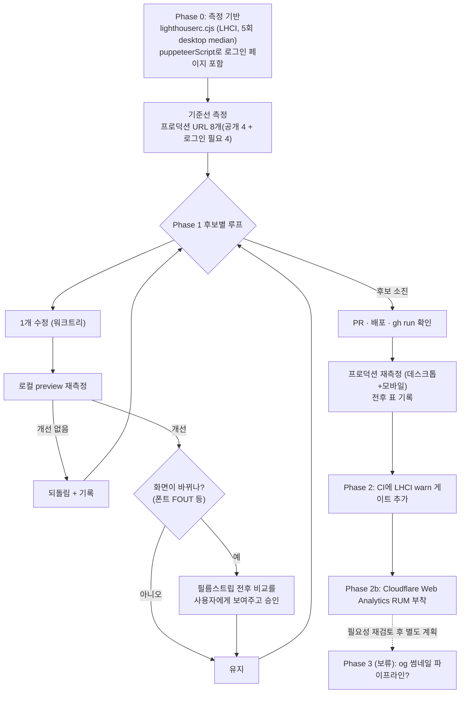

# Lighthouse 측정 자동화 + /post 성능 개선 계획

## Context

사용자가 프로덕션 `/post`의 Lighthouse 13.4.1 리포트를 공유했다(2026-09-25, 데스크톱 프리셋으로
추정: FCP 0.9s, LCP 2.3s, Speed Index 2.9s). 이어서 두 가지를 요청했다: (1) Claude가 직접 페이지를
돌며 측정하고 문제를 해소할 것, (2) 업계에서는 Lighthouse를 어떻게 지속 관리하는지 확인할 것.

그래서 한 번 고치고 끝내지 않는다. 같은 측정 설정을 로컬 개선 루프와 CI에 함께 쓰고, 업계에서
검증된 관행(랩 vs 필드 데이터 구분, 결론이 아닌 사실에 단언 걸기)을 그대로 따른다.

## 실측 결과 (2026-09-25)

**데스크톱(원 리포트) vs 모바일(PageSpeed Insights, 느린 4G) 격차가 크다.**

| 지표        | 데스크톱(원본 리포트) | 모바일(PSI 느린 4G) |
| ----------- | --------------------- | ------------------- |
| Performance | —                     | 65                  |
| FCP         | 0.9s                  | 2.6s                |
| LCP         | 2.3s                  | **9.4s**            |
| Speed Index | 2.9s                  | 6.2s                |
| TBT         | —                     | 0ms                 |
| CLS         | —                     | 0.062               |

**LCP 요소는 항상 외부 og 썸네일이다.** Playwright로 프로덕션을 직접 열어 확인한 워터폴이다.

```
0ms    HTML
137ms  ├─ JS/CSS + Pretendard 4종 preload(≈1.07MB) + Inter Google Fonts CSS(렌더 차단)
341ms  ├─ /post 라우트 청크(lazy)
379ms  ├─ GET /api/post?page=0 ──────────── 717ms
768ms  └─ 외부 og 썸네일(loading="lazy", 우선순위 힌트 없음) ──── 2,569ms
                                                   ↑ LCP 2,576ms (데스크톱, 캐시 있음)
```

- PSI(모바일) 진단: `static.toss.im` 썸네일이 1600×899 PNG(372KB)인데 화면 표시는 620×418다.
  리사이즈만으로 305KB, WebP 전환까지 하면 138KB를 추가로 줄일 수 있다고 추정한다.
  이미지가 캐시된 CDN이 있다면 8시간짜리 TTFB=0ms 안 걸린다.
- 렌더 차단 요청: 자체 CSS 150ms + Google Fonts CSS 750ms(PSI 추정).
- 사용하지 않는 JS: `vendor` 청크(Firebase 등)에서 54KB 절감 추정.
- CLS 0.062의 원인 요소는 `div.bg-card`(카드 진입 애니메이션으로 추정, 구현 시 재확인).
- **이 사이트는 CrUX 필드 데이터가 없다** — PSI에 "실제 사용자 데이터: 없음"으로 표시된다(트래픽 부족, [CrUX methodology](https://developer.chrome.com/docs/crux/methodology) 자격 요건 미달로 추정).

## 업계는 이렇게 관리한다 (조사 결과)

**핵심 결론: 총점을 목표로 삼지 않고, 결정적(deterministic) 지표부터 CI에서 단언을 건다.**

- **필드 데이터가 랩보다 우선이다.** web.dev: _"같은 페이지에 필드 데이터와 랩 데이터가 둘 다 있다면, 우선순위는 필드 데이터로 정해야 한다"_(번역, [출처](https://web.dev/articles/lab-and-field-data-differences)). 이 사이트는 필드 데이터가 없으므로 직접 RUM을 붙이지 않는 한 랩 측정에 의존할 수밖에 없다.
- **점수는 흔들린다는 것을 전제로 설계한다.** Lighthouse 공식 variability 문서: _"5회 실행의 중앙값 점수가 1회보다 2배 안정적이다"_(번역, [출처](https://github.com/GoogleChrome/lighthouse/blob/main/docs/variability.md)). _"같은 머신에서 동시에 여러 측정을 돌리지 말라"_(번역)고도 명시한다.
- **실제 공개 사례(Civitai, [lighthouserc.json](https://github.com/civitai/civitai/blob/main/lighthouserc.json)):** 5회 실행 중앙값, 데스크톱 프리셋, **모든 assertion이 `warn`**이라 점수 하락으로 빌드가 막히지 않는다. 이 레포의 계획도 다음 문장을 그대로 인용한다: _"결정적이고 변동이 적은 지표(CLS, 총 바이트/리소스 예산)를 먼저 `error`로 승격하고, 변동이 큰 타이밍 지표(LCP, TBT)는 5회 측정의 노이즈 폭보다 확실히 여유 있는 임계값으로만, 가장 나중에 승격한다"_(번역, 원문 코멘트).
- **LHCI 공식 troubleshooting 문서도 같은 방향이다.** _"결론보다 사실을 단언하라 — TTI 값 대신 JS 요청의 개수·크기에 단언부터 걸어라"_(번역, [출처](https://github.com/GoogleChrome/lighthouse-ci/blob/main/docs/troubleshooting.md)).
- **PR에는 번들 크기 diff만 코멘트하는 쪽이 더 흔하다.** Preact/`compressed-size-action`, Vue, React가 이 방식이다 — 실패시키지 않고 리뷰어가 보게만 한다.
- **작은 팀/개인 프로젝트를 위한 공식 권고는 못 찾았다.** web.dev의 일반 권고(_"실제 환경과 랩 환경 데이터를 함께 수집하는 것이 이상적이다"_, 번역, [출처](https://web.dev/articles/vitals-measurement-getting-started))만 확인했다.
- **무료 RUM 옵션이 있다.** [Cloudflare Web Analytics](https://developers.cloudflare.com/web-analytics/about/)는 무료이고, DNS를 Cloudflare로 옮기지 않고 **JS 스니펫만으로** 동작하며(_"DNS를 바꾸거나 Cloudflare 프록시를 쓰지 않고도"_, 번역), LCP·INP·CLS를 리포트한다. CloudFront로 서빙되는 이 사이트에도 그대로 붙일 수 있다. GA4+`web-vitals` 조합도 대안이다.
- 한국 회사 사례(토스·카카오·당근·우아한형제들·네이버)는 검색했지만 본문을 읽을 수 있는 1차 출처를 찾지 못했다(카카오엔터 글 존재는 확인, 본문 접근 실패).

## og 썸네일: 프록시/파이프라인 조사

**현재 구조 (BE 확인됨):** 게시글 작성 시 BE가 `UrlMetadataExtractor.kt`(Jsoup)로 대상 페이지의
`og:image` **URL 문자열만** 긁어 DB에 저장한다. 이미지 바이트 자체는 절대 서버를 거치지 않고,
브라우저가 매번 원본 도메인에서 직접 받는다. 리사이즈·프록시·재호스팅이 전혀 없다.

**이미 2026-09-20에 검토하고 범위 밖으로 미룬 적이 있다**
(`docs/plans/2026-09-20-thumbnail-failure-session-cache.md:59`): BE 프록시를 두면 "각 사용자
IP별로 걸리던 제3자 rate limit(예: GitHub og 이미지 서버 IP당 100회)이 우리 서버 IP 하나로
집중돼 전체 사용자가 공유하는 단일 한도가 된다"는 이유였다. 이번 조사로 확인한 선례들과 겹친다.

**업계 패턴은 두 가지다.**

- **(A) 작성 시점에 받아서 저장** — Mastodon이 이 방식이다. `PreviewCard`가 og 이미지를 최대
  8MB까지 받아 640×360으로 리사이즈해 자기 도메인에 저장한다([출처](https://raw.githubusercontent.com/mastodon/mastodon/main/app/services/fetch_link_card_service.rb)). 이후 조회는 전부 자체 도메인이라 원본 rate limit·장애에서 자유롭다.
- **(B) 조회 시점 캐싱 프록시** — GitHub camo, Slack, Misskey가 이 방식이다. HMAC 서명·크기 상한·content-type 허용 목록으로 SSRF를 막는다([OWASP SSRF 치트시트](https://cheatsheetseries.owasp.org/cheatsheets/Server_Side_Request_Forgery_Prevention_Cheat_Sheet.html)). 캐시 미스마다 원본 속도에 묶이고, rate limit이 공유되는 문제는 (A)와 마찬가지로 남는다.

**이 스택에는 (A)를 확장하는 쪽이 가장 잘 맞는다.** BE가 이미 comment 이미지·아바타를 Supabase
Storage(`SupabaseStorageService.kt`)에 signed-upload로 올리고, FE의 `supabaseImage.ts`가
`/storage/v1/render/image/public/...?width=&height=&resize=`로 리사이즈해 쓰는 파이프라인이
**지금도 프로덕션에서 동작 중**이다(확인 완료 — curl로 Cache-Control·정상 응답 확인). og:image도
작성 시점에 이 파이프라인에 태우면 새 인프라 없이 재사용할 수 있다.

- 필요한 새 작업: BE에 이미지 바이트 fetch(현재 페이지 메타 fetch에 쓰는 `safeConnect`와 같은
  SSRF 방어를 이미지 fetch에도 적용해야 한다 — 지금은 이 검증이 없다), Supabase 업로드, 실패 시
  기존 URL 폴백, 기존 게시글 백필(`OgImageBackfillRunner.kt` 확장).
- Supabase Image Transformation 자체가 Pro 플랜 이상 기능이라는 공식 문서를 확인했다. 이미
  프로덕션에서 동작하므로 이미 해당 플랜인 것으로 보이지만, 원본 이미지 수 기준 과금(100개 무료,
  이후 1,000개당 $5)이라 og:image까지 얹으면 청구 규모가 커질 수 있다 — 구현 전 확인 필요.
- **이 작업은 BE 레포(`link-sphere_BE_NEW`)에 걸쳐 있고 새 SSRF 방어·백필·과금 확인이 필요해
  범위가 크다.** 이번 PR에는 넣지 않고, 조사 결과를 `docs/DECISIONS.md`에 남기고 별도 계획으로
  분리하는 것을 제안한다. Phase 3으로 아래에 남겨둔다.

## 흐름



## Phase 0 — 측정 기반

- **도구: `@lhci/cli`.** 로컬 측정 설정이 그대로 CI 설정이 된다.
  - `lighthouserc.cjs`: `numberOfRuns: 5`, `aggregationMethod: 'median-run'`, 데스크톱 프리셋(Civitai 선례를 따름 — 공유 러너에서 변동이 더 적다고 설명한다).
  - `package.json` 스크립트: `perf:lh`(공개 URL), `perf:lh:auth`(로그인 URL, puppeteerScript 사용).
- **측정 URL 8개** (로그인 필요 페이지 포함, 사용자 확정):
  - 공개: `/post`, `/post/:id`(대표 1개), `/auth/login`, `/auth/sign-up`
  - 로그인 필요: `/post/submit`, `/post/edit/:id`, `/bookmark`, `/my/comments`
- **로그인 스크립트 (puppeteerScript).** 실제 폼 구조를 확인했다:
  - `input#email[name=email]`, `input#password[name=password]`, `button[type=submit]`(텍스트 "Sign In")
  - 로그인 성공 후 `GuestGuard`가 `/post`로 리다이렉트한다 — URL이 `/post`로 바뀔 때까지 대기.
  - **테스트 계정은 `tester_new_999@example.com`을 쓴다.** README의 계정은 실사용자 데이터(폴더·북마크)가 쌓인 수동 QA용이라 2026-09-11 사고 이후 자동화에서 배제됐다(`docs/TESTING.md:1192-1197`). 비밀번호는 GitHub Actions secret(`LHCI_TEST_PASSWORD` 등)으로 별도 등록한다 — 대화나 파일에 남기지 않는다(기존 세션 재사용 규칙과 같은 원칙).
  - BE에 로그인 rate limit/lockout이 없음을 확인했다(코드 전수 확인) — CI가 반복 로그인해도 잠기지 않는다. WAF에 별도 rate-based rule이 콘솔에만 있을 가능성은 남아 있어(레포에 IaC 없음), 실행 전 한 번은 실패 없이 도는지 확인한다.
- **assertion은 전부 `warn`으로 시작한다.** Civitai 선례를 그대로 따른다 — 총점이 아니라 개별 지표(LCP/TBT/CLS 상한)와 리소스 크기에 건다. `error` 승격은 몇 주 실측해 노이즈 폭을 확인한 뒤 결정한다(이번 계획 범위 밖).
- **기준선은 두 곳에서 잰다:** 프로덕션(최종 판정용), 로컬 `pnpm build && pnpm preview`(전후 A/B용, 압축·CDN 조건이 달라 절대값 대신 변화량만 비교).

## Phase 1 — /post 개선 후보

후보마다 따로 측정하고, 효과가 없으면 되돌린다.

1. **LCP 이미지 우선순위 (최우선 — 실측 근거 가장 강함)**
   - `link-thumbnail.tsx`에 `priority` prop을 추가한다. `true`면 `loading="eager"`+`fetchpriority="high"`.
   - `PostCard`에서 첫 행(최대 3장)에만 전달한다.
   - shared atom 변경이므로 같은 커밋에 `link-thumbnail.stories.tsx`를 갱신한다.
2. **폰트 — 당근마켓·마켓컬리 실측으로 방향을 확정했다(2026-09-26)**
   - `index.html`의 Inter Google Fonts `<link>`·preconnect 2개를 제거한다. `globals.css:25` fallback에서 라틴 글리프는 Pretendard 자체 커버리지로 대체되는지 Pretendard README로 먼저 확인한다.
   - **지금 방식(정적 서브셋 4종, 총 1.07MB preload)을 Pretendard 공식 "dynamic subset"(가변 폰트 + unicode-range 분할)으로 교체한다.**
     - **실측(Playwright로 두 회사 프로덕션 사이트를 직접 열어 확인, 2026-09-26):**
       - **당근마켓**(`daangn.com`): `@font-face`가 92개, 전부 `format("woff2-variations")` + `font-weight:45 920`(가변 폰트 전체 굵기를 파일 1개가 커버) + 서로 다른 `unicode-range`. 자체 CDN(`/_remix/PretendardVariable.subset.N.woff2`)에 호스팅하며 파일당 20~37KB. 폰트 `preload`는 쓰지 않는다.
       - **마켓컬리**(`kurly.com`): 자체 도메인(`res.kurly.com/fonts/pretendard-variable/1.3.9/pretendardvariable-dynamic-subset.min.css`)에 호스팅. `@font-face` 92개, 당근과 완전히 동일한 구조(`unicode-range` 분할 + `font-weight:45 920` + `format('woff2-variations')`). 역시 폰트 `preload` 없음.
       - 두 회사가 독립적으로 정확히 같은 "92분할" 구조에 도달한 이유를 Pretendard 공식 GitHub README에서 확인했다: _"페이지에 포함된 글자만 선택적으로 다운로드해 보다 빠르게 Pretendard를 사용하려면"_(원문) 쓰라고 권장하는 **공식 배포판**(`pretendard-dynamic-subset.min.css`, jsDelivr/npm 패키지로 제공)이었다 — 각자 만든 게 아니라 같은 공식 기능을 쓴 것이다. README는 이 방식이 *"Google Fonts의 한글 글꼴 방식을 동일하게 적용한 것"*이라고 설명한다.
     - **결정:** 자체 커스텀 서브셋 대신 Pretendard 공식 dynamic-subset(npm 패키지 `pretendard` 또는 jsDelivr)을 그대로 채택한다. 방금 화면에 쓰인 글자만큼만 조금씩(파일당 20~40KB) 받아오므로, 지금처럼 안 쓰는 굵기·문자 범위까지 1.07MB를 통째로 preload할 필요가 없어진다 — **preload 자체를 없앤다**(두 회사 모두 preload 안 함).
     - `font-family` 순서는 안 바꾼다: Pretendard README는 두 방식을 구분한다 — "시스템에 가능한 맞추고자 한다면" `-apple-system`을 앞에(당근 방식), "어디서든 동일한 환경을 가지고자 한다면" `Pretendard`를 앞에(컬리 방식). 이 레포의 `globals.css:25`는 이미 `'Pretendard', 'Inter', sans-serif` 순으로 컬리와 같은 방식이라 그대로 둔다.
     - **출처 정리:** 두 회사의 웹폰트 기술 블로그 글은 검색해도 찾지 못했다(미검증, 없다고 단정하진 않음) — 위 결정은 블로그 주장이 아니라 2026-09-26 Playwright로 두 회사 프로덕션 사이트를 직접 열어 실측한 결과와 Pretendard 공식 README에만 근거한다.
   - 폰트 교체 시 화면이 바뀔 수 있으므로(FOUT), 필름스트립 전후 비교를 사용자에게 보여주고 승인받는다(CLAUDE.md §9).
3. **초기 JS**
   - `RootLayout.tsx`의 `LoginModal` 정적 import를 `React.lazy`로 바꿔 `form-vendor`를 초기 그래프에서 뺀다.
   - `useFcmForegroundMessage`(Firebase)를 로그인 상태에서만 동적 import한다.
   - 부수효과: 로그인 사용자가 페이지를 새로고침한 직후 아주 짧은 구간에 도착한 foreground 푸시를 놓칠 수 있다 — 확인받는다.
4. **(측정 후 판단)** `/api/post` page 0·1·2가 마운트 직후 연쇄 호출된다(`usePostList.ts:133-144`, 끝에서 5행 이내면 prefetch). 이미지 대역폭과 경쟁하는지 확인 후 필요하면 prefetch 임계값을 조정한다.

**범위 밖(이유와 함께 명시):**

- `DelayedFallback` 500ms — 2026-09-14 의도적 UX 결정, 건드리지 않는다.
- `has-session` 스피너, `dist/stats.html` 공개 업로드, 미사용 폰트 11MB 업로드 — 이번 성능 개선과 무관한 기존 이슈로 언급만 한다.
- CloudFront 압축 — 이미 brotli로 정상 동작 중(curl로 확인), 개선 대상 아님.

## Phase 2 — CI 게이트 + RUM

- `ci.yml`에 LHCI job을 `warn` 단계로 추가한다. 리포트는 artifact로 업로드(temporary-public-storage는 7일 후 삭제되므로 이력이 필요하면 artifact를 쓴다).
- **Cloudflare Web Analytics를 붙인다.** 무료이고 DNS 이전이나 프록시 전환 없이 `index.html`에 스니펫 한 줄만 추가하면 된다. LCP/INP/CLS 필드 데이터가 쌓이기 시작하면 이후 랩 측정과 대조할 수 있다.

## Phase 3 — og 썸네일 파이프라인: **보류, 필요성부터 재검토** (2026-09-26 사용자 결정)

이번 계획·PR의 실행 범위에서 뺀다. "어떻게 만들지"가 아니라 "**애초에 필요한지**"부터 다시 봐야
한다는 게 사용자 판단이다. 위 "og 썸네일: 프록시/파이프라인 조사" 절의 조사 결과(Mastodon/camo
선례, Supabase 확장안, SSRF·rate-limit 고려사항)는 버리지 않고 `docs/DECISIONS.md`에 남겨서,
나중에 필요성을 재검토할 때 다시 조사하지 않아도 되게 한다.

**필요성을 재검토할 때 먼저 확인할 것 (다음 대화용 메모):**

- Phase 1의 `fetchpriority="high"` 하나만으로 LCP가 얼마나 줄어드는지부터 실측한다. 지금 LCP가 느린
  이유가 "이미지가 커서"인지 "우선순위 힌트가 없어서"인지 구분이 안 된 상태다 — 후자만 문제였다면
  프록시 없이 Phase 1로 끝난다.
- 그래도 남는 느림이 있다면, 그게 특정 원본(예: toss처럼 과사이즈 이미지를 내려주는 곳)에 국한된
  문제인지, 아니면 광범위한지 확인한다. 국한된 문제라면 BE 파이프라인 전체보다 더 작은 대응(예:
  특정 도메인만 예외 처리)으로 충분할 수 있다.
- Supabase 과금 체계(원본 이미지 수 기준)에서 게시글 수 증가 추세(하루 평균 3.7개, 2026-09-18 기준
  195개 실측 — `CHANGELOG.md` 0.15.0 항목)를 감안한 예상 비용을 계산해본다.
- BE 작업 규모(SSRF 방어 확장 + 백필 + 실패 폴백)가 체감 개선 대비 정말 필요한 수준인지 판단한다.

## 문서

- `docs/PERFORMANCE.md`(절차 문서, 신규): 측정 방법, 재현 명령, 기준선·개선 후 표, 인용 원문 대조 후 게재.
- `README.md`의 `## 문서`에 등록.
- `CHANGELOG.md` `[Unreleased]`에 perf 항목 추가.
- `docs/DECISIONS.md`: LHCI assertion 단계(warn 우선)와 og 이미지 파이프라인 대안 비교 두 건을 남긴다(둘 다 실제로 대안을 비교해 선택했으므로 기준에 부합).
- 이 계획을 `docs/plans/2026-09-25-lighthouse-perf.md`로 커밋, PR 본문에 `## 계획 대비 구현` 작성.

## 핵심 파일

`index.html`, `src/app/globals.css`, `src/shared/ui/atoms/link-thumbnail.tsx`(+stories),
`src/widgets/post/post-card/ui/PostCard.tsx`, `src/app/routes/layouts/RootLayout.tsx`,
`src/shared/lib/firebase/useFcmForegroundMessage.ts`, `vite.config.ts`, `lighthouserc.cjs`(신규),
`package.json`, `.github/workflows/ci.yml`(Phase 2)

## 검증

- URL·프리셋별 5회 중앙값 전후 표(LCP, FCP, SI, TBT, CLS, 전송 바이트).
- 폰트 변경은 필름스트립 캡처로 사용자 승인.
- `pnpm type-check`, `pnpm test`, `pnpm lint`, `e2e/post-list-virtualization.spec.ts` 등 e2e 통과.
- 화면 확인은 `browser-verification` skill로.
- 배포 후 `gh run list --workflow "Frontend Deploy (S3 + CloudFront)"`로 성공 확인 → 프로덕션 재측정(데스크톱+모바일).
