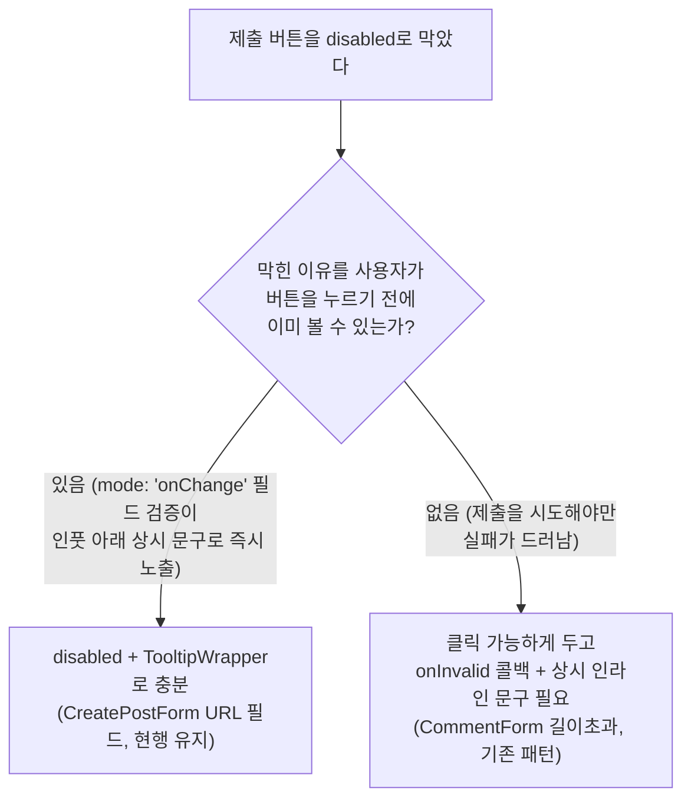

# post URL 검증 후속 정리 (규칙 문서 예외 명시 + 메시지 키 통합)

## Context

직전 작업(PR #202)에서 `postUrlSchema`에 http/https 스킴 검증을 추가하며 `TEXTS.validation.urlScheme`을
새로 만들었다. 그런데 `CreatePostForm.tsx`의 제출 버튼 disabled 상태는 `.claude/CLAUDE.md`의 기존 규칙
("폼 검증 실패를 버튼 disabled만으로 처리하지 않는다")과 형식적으로는 어긋난 상태였고, 툴팁도 애초에
`urlScheme`을 참조하지 않고 항상 `urlFormat`만 하드코딩해서 보여주고 있었다(스킴 오류든 형식 오류든 같은
문구).

두 가지를 정리한다:

1. **문서**: 코드는 그대로 두고, 왜 이 경우엔 disabled+툴팁이 그 규칙의 취지를 어기지 않는지 `.claude/CLAUDE.md`에
   예외 조건을 덧붙인다.
2. **메시지 통합**: `urlFormat`과 `urlScheme` 두 키가 사실상 툴팁에서 구분 없이 쓰이고 있었으니, 하나로 합친다.

## 문제의 핵심 조건 (규칙 문서에 반영할 판단 기준)



2026-09-06 댓글 폼 사고(`e251ff2`)의 실제 원인은 "호버 전용이라서"가 아니라 **그 시점엔 인라인 상시 문구 자체가
없었다**는 것이었다(그 커밋에서 처음 추가됨, `git show e251ff2 -- CommentForm.tsx`로 확인). `TooltipWrapper`의
탭→토스트 지원(`TooltipWrapper.tsx:66-71`, 커밋 `9087929`, 2026-08-10)은 그 규칙보다 먼저 있었다. `CreatePostForm`은
`FormField.tsx:44-46`이 호버 없이 상시 렌더하는 인라인 에러가 이미 있어 이 조건(B=있음)에 해당한다 — 그래서
disabled+툴팁을 유지해도 규칙의 실제 목적(이유를 알 방법이 아예 없는 상태 방지)은 지켜진다.

## 결정 사항

| 항목                      | 결정                                                            | 이유                                                                                                                                                                                                         |
| ------------------------- | --------------------------------------------------------------- | ------------------------------------------------------------------------------------------------------------------------------------------------------------------------------------------------------------ |
| `CreatePostForm.tsx` 코드 | 변경 없음                                                       | 사용자 지시 — 위 조건(B=있음)에 해당해 규칙 위반이 아님                                                                                                                                                      |
| CLAUDE.md 규칙 문서       | 기존 문단 끝에 예외 조건 1문단 추가(재작성 아님)                | §3 "최소 범위만 수정" — 기존 서술은 그대로 두고 누락된 조건만 보충                                                                                                                                           |
| `urlFormat`/`urlScheme`   | `urlScheme` 삭제, `urlFormat` 값을 현재 `urlScheme` 문구로 교체 | 툴팁이 실질적으로 구분 안 하고 있었으니 실제 쓰임에 맞춘다. 문구 자체는 이미 §10 톤 규칙 통과된 것 재사용(신규 문구 작성 없음)                                                                               |
| `postUrlSchema` 구조      | `.url().refine()` 2단계 유지, 메시지 인자만 동일 키로 교체      | 스킴 대소문자 구분(`HTTPS://` 거부)은 `new URL().protocol`로 바꾸면 스킴이 소문자로 정규화되어 깨진다 — 기존 regex refine 로직은 건드리지 않는다(§2, §3: 요청은 "메시지 통합"이지 "검증 로직 재작성"이 아님) |
| CHANGELOG.md              | 변경 없음                                                       | 기존 Unreleased 항목("구체적 안내가 뜨도록 했다")은 문구 통합 후에도 여전히 사실과 일치 — 내부 키 구조는 사용자 노출 문서화 대상이 아님                                                                      |
| 커밋 단위                 | 같은 PR, 2개 커밋(문서 / 코드+테스트)                           | 논리적으로 다른 변경(문서 vs 동작) — 사용자가 "나눠서"라고 표현한 것과 일치                                                                                                                                  |

## 구현 단계

0. `EnterWorktree` → `.env` 복사 → `pnpm install`
1. **CLAUDE.md 예외 조건 추가** — `.claude/CLAUDE.md`의 기존 "Never 폼 검증 실패를 버튼 disabled만으로
   처리하지 않는다" 문단 끝에 이어 붙임:
   > 이 규칙의 핵심 조건은 "사용자가 이유를 알 방법이 아예 없는가"다 — 이미 다른 경로로 이유가 상시(호버 없이)
   > 노출되고 있다면(예: `mode: 'onChange'` 필드 검증이 타이핑 즉시 인풋 아래에 이유를 띄우는 경우) `disabled` +
   > `TooltipWrapper`만으로도 이 조건을 충족한다. `CreatePostForm.tsx`의 URL 필드가 이 경우다 —
   > `post.schema.ts`의 검증 실패 메시지가 `FormField`를 통해 인풋 아래 항상 노출되므로 버튼을 누르기 전에 이미
   > 이유가 보인다. 이 조건이 성립하지 않는 경우(제출을 시도해야만 실패가 드러나는 경우, 위 댓글 사례)엔 여전히
   > 클릭 가능 + `onInvalid` 콜백이 필요하다.
   > → verify: `pnpm check:docs` (경로·줄 인용 없어 영향 없을 것으로 예상되나 규칙상 실행)
2. **테스트 갱신(먼저)** — `src/entities/post/model/post.schema.test.ts`: it.each 블록(28-47행)과
   `updatePostSchema` file:// 테스트(125-136행 부근)의 `expect(...).toBe(TEXTS.validation.urlScheme)`를
   `TEXTS.validation.urlFormat`로 변경, 테스트 설명 문자열에서 "urlScheme 메시지를 반환한다" 문구 제거(삭제될
   키 이름을 테스트 설명에 남기지 않음) → verify: 이 시점엔 아직 urlScheme이 살아있어 fail(red) 확인
3. **TEXTS** — `src/shared/config/texts.ts:306-307`
   ```ts
   urlFormat: 'http:// 또는 https://로 시작하는 웹 주소만 등록할 수 있어요.',
   // urlScheme 줄 삭제
   ```
4. **스키마** — `src/entities/post/model/post.schema.ts:9-12`의 `.refine(...)` 두 번째 인자를
   `TEXTS.validation.urlScheme` → `TEXTS.validation.urlFormat`로 교체. 정규식·`.url()` 체인 구조는 그대로.
   주석의 "urlScheme" 언급이 있다면 함께 정리. → verify: 2번 테스트 green
5. **전체 검증** (아래) → 커밋 2개(문서 / 코드) → push → PR

## 영향 범위 (§5)

- `urlFormat`/`urlScheme`는 `post.schema.ts`, `CreatePostForm.tsx`, 두 테스트 파일 외 다른 곳에서 쓰이지 않음
  (전수 grep 확인) — 다른 엔티티·폼에 영향 없음.
- Create/Update 모두 같은 스키마 공유 — 동작 변화 없음(메시지 텍스트만 통합, 검증 통과/실패 여부는 동일).
- `.claude/CLAUDE.md` 변경은 향후 세션의 판단 기준에만 영향 — 런타임 동작과 무관.
- 회귀 후보: `HTTPS://` 대소문자 거부(2번 커밋에서 로직 안 건드림 — 변화 없음 재확인용 테스트 유지),
  `not-a-url`(형식 오류) 케이스가 여전히 실패하는지(테스트 24행, 메시지 값만 자동 반영).

## 검증

1. `pnpm type-check`
2. `pnpm test src/entities/post src/shared/config/texts.test.ts` (+ 전체 `pnpm test`)
3. `pnpm lint`
4. `pnpm check:docs` (CLAUDE.md 수정)
5. `pnpm format:check`

## 남은 것

- `CreatePostForm.tsx`의 툴팁이 여전히 `!isDirty`/`!isValid` 이분법이라, 폼에 URL 외 다른 필수 필드가 생기면
  같은 재점검이 필요할 수 있다 — 현재는 URL이 사실상 유일한 사용자 입력 실패 지점이라 범위 밖으로 둔다.
