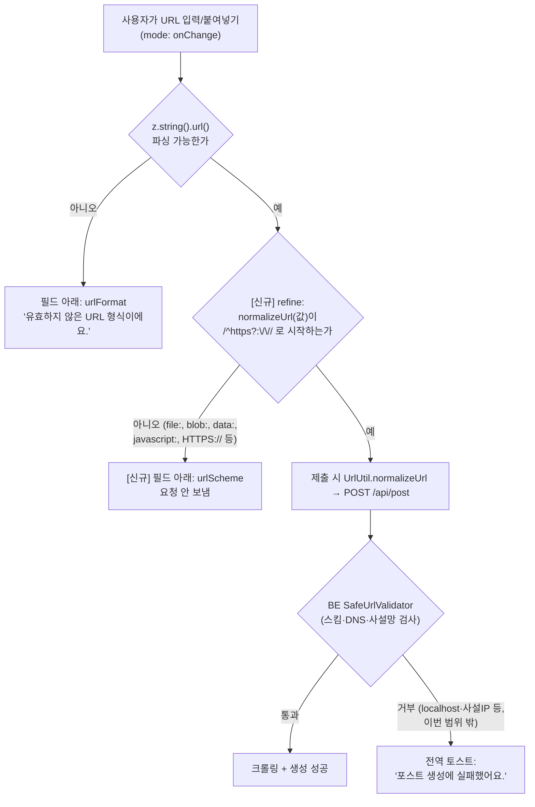

# post URL 스킴 검증 추가 (file:// 등 크롤링 불가 URL을 입력 단계에서 차단)

## Context

사용자가 포스트 등록 폼에 `file:///private/tmp/.../journey.html#view=create-path`를 넣었더니
클라이언트 검증은 통과해 `POST /api/post`까지 갔고, BE에서 거부돼 "포스트 생성에 실패했어요."라는
일반 토스트만 떴다. 왜 실패했는지 알 수 없다는 게 문제다.

원인(조사로 확인):

- FE `postUrlSchema = z.string().url(...)` (`src/entities/post/model/post.schema.ts:6`)는 "파싱 가능한 URL인가"만
  보고 스킴을 제한하지 않는다 → `file://`, `blob:`, `data:`, `javascript:` 모두 통과.
- BE `SafeUrlValidator.kt:29`는 `uri.scheme !in listOf("http", "https")`면 `400 INVALID_INPUT`. 서버가 URL을
  크롤링해야 하므로 원천적으로 http/https만 가능하다.
- 400 응답은 `useCreatePostMutation`의 `meta.errorMessage`(정적 문구)로 덮여(`error-toast.ts:85-87`) 사유가
  사라진다 — 이건 문서화된 전역 정책(`docs/FE-ARCHITECTURE.md` §13, "서버 에러 메시지 비노출")이라 건드리지 않는다.

목표: BE가 거부할 스킴을 FE가 입력 단계에서 먼저 걸러, 요청을 보내기 전에 필드 아래에 구체적 안내를 띄운다.
선례: 같은 부류(FE zod 통과 → BE 400) 문제를 고친 공백 정규화 수정(`src/shared/utils/url.util.ts`, CHANGELOG
"URL 앞뒤·중간 공백이 있으면 등록·수정이 항상 실패하던 문제").

## 흐름 (변경 전 → 후)



변경 전에는 `file://`이 C 단계 없이 D→F→H로 흘러 일반 토스트만 떴다.

## 결정 사항 (승인 시 확정)

| 항목                          | 결정                                                                                                  | 이유                                                                                                                                                                                        |
| ----------------------------- | ----------------------------------------------------------------------------------------------------- | ------------------------------------------------------------------------------------------------------------------------------------------------------------------------------------------- |
| 허용 스킴                     | `http`, `https`만                                                                                     | BE `SafeUrlValidator.kt:29`와 동일. 이 필드는 크롤링 대상 외부 링크 전용이고, `blob:` 등은 댓글 이미지 미리보기에서만 쓰이며 zod url 스키마를 거치지 않음(`File[]` 전송)                    |
| 검사 기준값                   | `UrlUtil.normalizeUrl(value)` 후 검사                                                                 | 제출값과 같은 기준. 원시값에 바로 정규식을 걸면 앞뒤 공백 붙은 정상 URL(`url.util.test.ts:7`의 계약)이 막힘                                                                                 |
| 대소문자                      | 구분(`HTTPS://`도 거부)                                                                               | BE `java.net.URI.getScheme()`는 대소문자를 보존해 `HTTPS`를 거부함. FE가 통과시키면 지금과 같은 일반 토스트가 재현됨. 극히 드문 입력이라 스킴 소문자화(=`normalizeUrl` 동작 변경)는 범위 밖 |
| 메시지                        | 새 키 `TEXTS.validation.urlScheme` = `'http:// 또는 https://로 시작하는 웹 주소만 등록할 수 있어요.'` | 해요체, 기존 `urlFormat`과 나란히. 구현 전 `texts-conventions` skill 확인                                                                                                                   |
| 스킴 없는 입력(`example.com`) | 현행 유지(`urlFormat`)                                                                                | `.url()` 단계에서 이미 걸림. zod 3는 앞 체크가 실패해도 refine을 실행해 이슈가 2개 쌓이지만, zodResolver 기본값(firstError)이 첫 이슈(`urlFormat`)만 표시                                   |
| 서버 거부 토스트              | 변경 없음                                                                                             | §13 전역 정책. 별도 논의 대상                                                                                                                                                               |

## 구현 단계

0. 워크트리 부트스트랩 (이미 생성: `.claude/worktrees/post-url-scheme-validation`)
   `cp ../../../.env .` → `nvm use`(v24 확인) → `pnpm install`
1. **테스트 먼저** — `src/entities/post/model/post.schema.test.ts`에 추가 → verify: 새 케이스가 실패(red)
   - `createPostSchema`: 보고된 URL `file:///private/tmp/journey.html#view=create-path` 거부 + 첫 이슈 메시지가 `urlScheme`
   - `blob:`, `data:`, `javascript:`, `ftp://` 거부(`it.each`)
   - `http://example.com` 허용, `'  https://example.com  '` 허용(공백 계약 회귀 방지)
   - `HTTPS://example.com` 거부(BE 동작과 일치)
   - `'not-a-url'`의 첫 이슈 메시지가 여전히 `urlFormat`
   - `updatePostSchema`: `file://` 거부 1건(같은 스키마 공유 확인)
2. **TEXTS** — `src/shared/config/texts.ts:306` `urlFormat` 바로 아래에 `urlScheme` 추가
3. **스키마** — `post.schema.ts:6`
   ```ts
   const postUrlSchema = z
     .string()
     .url(TEXTS.validation.urlFormat)
     .refine(
       (value) => /^https?:\/\//.test(UrlUtil.normalizeUrl(value)),
       TEXTS.validation.urlScheme
     );
   ```
   `UrlUtil` import 추가(entities → shared, 레이어 방향 OK). 주석은 한 줄(BE `SafeUrlValidator`와 맞춘다는 이유만).
   → verify: 1번 테스트 green
4. **CHANGELOG** — `changelog-release` skill 확인 후 `[Unreleased] ### Fixed`(`CHANGELOG.md:32`)에
   `post` 항목 + `<details>` 배경·구현(공백 수정 항목을 선례로 링크)
5. **계획 스냅샷** — 이 파일을 `docs/plans/2026-09-26-post-url-scheme-validation.md`로 복사(§11)
6. **검증** (아래) → `.gitmessage` 확인 후 `git commit -- <경로들>`로 커밋
   (`fix(post): ...`, 코드·테스트·TEXTS·CHANGELOG·계획 파일 한 커밋)
7. **계획 대비 구현 대조** — fresh Explore subagent에 이 계획 파일 + `git diff main...HEAD` 전달,
   항목별 "구현됨(파일:줄)/이탈(이유)/미구현" → PR 본문 `## 계획 대비 구현`
8. push + PR 생성까지. **머지·배포는 사용자 확인 후**

## 수정 파일

- `src/entities/post/model/post.schema.ts` — refine 추가
- `src/entities/post/model/post.schema.test.ts` — 케이스 추가
- `src/shared/config/texts.ts` — `validation.urlScheme`
- `CHANGELOG.md` — `[Unreleased] ### Fixed`
- `docs/plans/2026-09-26-post-url-scheme-validation.md` — 신규(계획 스냅샷)

재사용: `UrlUtil.normalizeUrl` (`src/shared/utils/url.util.ts:8`) — 새 유틸 만들지 않음.

## 영향 범위 (§5)

- **Create**: http(s)가 아닌 URL은 요청 자체가 안 나감. BE가 어차피 거부하던 입력이라 기존에 성공하던 등록은 없음.
- **Update**: 같은 스키마 공유. 기존 게시글 URL이 http(s)가 아니면 수정 폼이 제출 불가해지지만,
  BE 검증기가 등록 시 이미 http(s)만 받으므로 그런 데이터는 없다고 가정(BE 검증기 도입 이전 데이터가 있을 경우만 해당).
- **Read/Delete**: 무관.
- **회귀 후보**: 앞뒤 공백 URL(정규화 후 검사로 대응, 테스트로 고정), `'not-a-url'` 기존 테스트(첫 메시지 불변),
  e2e/MSW 픽스처(전수 grep 결과 http(s) 아닌 값은 `'not-a-url'` 2건뿐), 이 스키마를 쓰는 다른 곳 없음(`.url(` 사용처 1곳).
- 데이터 계약(DTO/API) 변경 없음 → 배포 순서 이슈 없음.

## 검증

1. `pnpm type-check`
2. `pnpm test src/entities/post src/shared/utils/url.util.test.ts src/features/post` (+ 전체 `pnpm test`)
3. `pnpm lint`
4. `browser-verification` skill 절차대로 Playwright 녹화: 등록 폼에 `file:///...` 붙여넣기 → 필드 아래 `urlScheme`
   문구가 즉시 뜨고 네트워크에 `POST /api/post`가 없음 확인 / `https://...` 정상 입력은 에러 없음 / 앞에 공백 붙인
   `https://` 도 에러 없음

## 남은 것 (이번 범위 밖)

- `http://localhost:3000`, `http://192.168.x.x` 같은 사설망 URL은 FE를 통과하고 BE(`SafeUrlValidator.kt:43-51`,
  DNS 해석 후 거부)에서 일반 토스트로 떨어지는 문제는 그대로 남는다. FE는 DNS 해석을 못 하므로 리터럴
  `localhost`/사설 IP만 부분적으로 막을 수 있다 — 필요하면 별도 작업.
- 서버 거부 사유를 토스트에 구분해 보여주는 것(전역 핸들러 §13 정책 변경)은 별도 논의.
