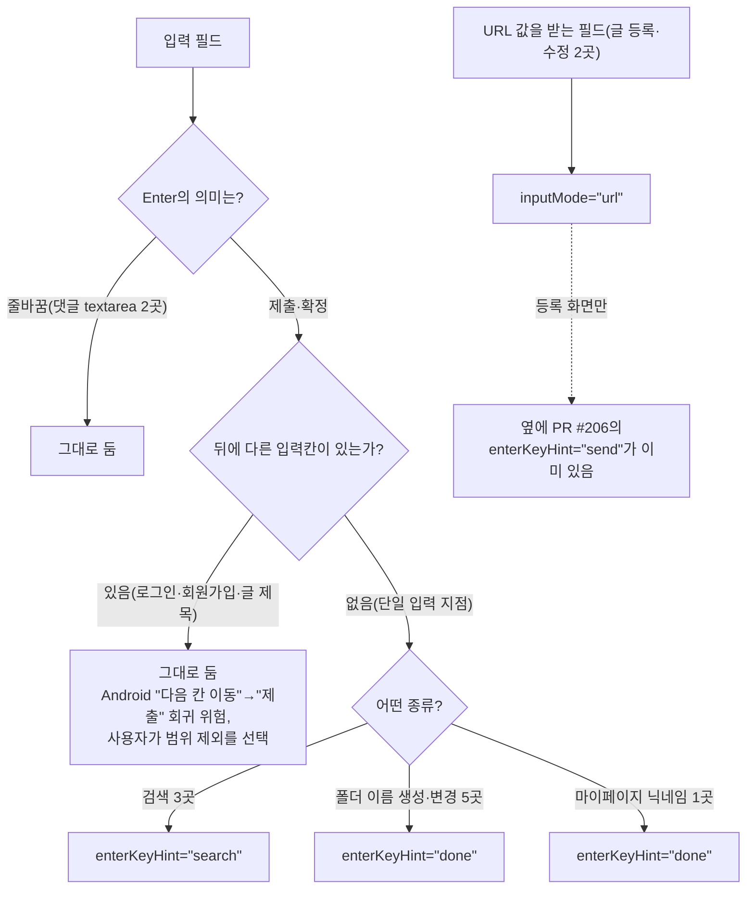

# 모바일 키보드 힌트(`enterKeyHint`·`inputMode`) 도입

## Context

레포 전체에 `enterKeyHint`·`inputMode` 사용처가 0건이었다(예외: 이 계획 착수 시점에
이미 열려 있던 [PR #206](https://github.com/BAECHAN/link-sphere_FE_NEW/pull/206)이
`CreatePostForm`의 URL 필드에 `enterKeyHint="send"`를 추가 — 별도 승인을 거친 결정이라
이 계획은 그대로 두고 옆에 `inputMode="url"`만 보탠다). 사용자가 두 속성을 프로젝트에
도입하면 어떨지 계획을 요청해 조사·설계 후 구현까지 진행했다.

## 확인한 사실

**속성 자체는 라벨/키보드 모양만 바꾼다.**

- `enterkeyhint`는 "Enter 키에 어떤 라벨(또는 아이콘)을 보여줄지"만 정한다 — [MDN
  enterkeyhint](https://developer.mozilla.org/en-US/docs/Web/HTML/Reference/Global_attributes/enterkeyhint).
- `inputmode`는 _"입력 유효성 검증에는 관여하지 않는다"_(번역) — [MDN
  inputmode](https://developer.mozilla.org/en-US/docs/Web/HTML/Reference/Global_attributes/inputmode).
  URL 검증이 필요하면 `type="url"`을 쓰라고 권장하지만, 이 레포 URL 필드 2곳은 이미
  `noValidate` + zod로 검증하므로 그 이점이 없다 — `inputMode="url"`만으로 키보드
  모양만 바꾸는 쪽을 택했다.
- 브라우저 지원은 두 속성 모두 Baseline "Widely available"(2021년 11~12월부터,
  [caniuse: enterkeyhint](https://caniuse.com/mdn-html_global_attributes_enterkeyhint),
  [caniuse: inputmode](https://caniuse.com/input-inputmode)). 설치된 `@types/react`
  18.3.27이 두 prop 타입을 이미 갖고 있어 타입 추가 작업이 필요 없다.

**단, Android에서는 `enterkeyhint`가 동작도 바꿀 수 있다.** Chromium 구현팀의 공지:

> Android는 원래 Enter 키를 Blink에 보내기 전에 가로채서 다음 필드로 포커스를 옮긴다.
> (…) `enterkeyhint`가 있으면 이제 keydown·keypress·keyup 이벤트를 그대로 페이지에
> 보내게 된다. 그래서 페이지가 입력창에 `enterkeyhint`를 달아놓고 Enter 핸들러도 없고
> 필수 필드 표시도 안 했다면 폼이 제출돼 버릴 수 있다. (번역)
>
> — Chromium blink-dev, "Intent to Implement and Ship: Enter Key Hint",
> https://groups.google.com/a/chromium.org/g/blink-dev/c/Hfe5xktjSV8/m/Re-SMF3wAwAJ

이 레포의 로그인·회원가입·글 등록/수정 폼은 여러 필드가 한 `<form>` 안에 있고 Enter는
지금 "다음 필드로 이동"(브라우저 기본 동작)에 의존한다. 그런 필드에 `enterKeyHint`를
달면 Android에서 "다음 필드 이동"이 "제출"로 바뀌는 회귀가 생길 수 있다 — 다만 이
공지는 2020년 자료라 지금 Android/Chrome 버전(caniuse 기준 Chrome for Android 152)에서도
그대로인지는 실기기 확인이 필요하다(재검증 필요, 출처 미상 아님 — 위 인용이 원 출처지만
"지금도 유효한지"는 미검증).

**Baymard의 터치 키보드 조사** — 참고용, 이 레포와 정확히 같은 상황(이커머스 결제
폼)은 아니다:

[Baymard #1148](https://baymard.com/blog/mobile-touch-keyboards)의 2015년 조사(48개
모바일 이커머스 사이트, 2013년 대비 재측정)는 대상 사이트의 _"60%"_ 가 터치 키보드
최적화 5가지 중 2가지 이상을 놓친다고 집계했다.

## 결정 (사용자 확인, 2026-09-27)



## 변경 파일

모든 컴포넌트가 `{...props}`로 네이티브 엘리먼트까지 속성을 그대로 전달해(`Input`,
`FormInput`, `SearchInput`) `shared/ui`는 건드리지 않고 호출부에 한 줄씩만 추가했다 —
선례: `docs/plans/2026-09-09-post-url-autocomplete-off.md`(같은 방식으로
`autoComplete="off"`를 추가한 계획).

| 파일                                                                | 필드                    | 추가한 속성             |
| ------------------------------------------------------------------- | ----------------------- | ----------------------- |
| `src/features/post/create/ui/CreatePostForm.tsx:99`                 | URL(등록)               | `inputMode="url"`       |
| `src/features/post/update/ui/UpdatePostForm.tsx:50`                 | URL(수정)               | `inputMode="url"`       |
| `src/widgets/layout/navbar/ui/NavbarSearch.tsx:280`                 | 데스크톱 헤더 검색      | `enterKeyHint="search"` |
| `src/widgets/layout/navbar/ui/MobileNavbarSearch.tsx:49`            | 모바일 헤더 검색        | `enterKeyHint="search"` |
| `src/widgets/bookmark/bookmark-search/ui/BookmarkSearch.tsx:20`     | 북마크 검색             | `enterKeyHint="search"` |
| `src/features/account/update/ui/UpdateAccountForm.tsx:91`           | 마이페이지 닉네임       | `enterKeyHint="done"`   |
| `src/features/bookmark/select/ui/BookmarkFolderSelectModal.tsx:145` | 새 폴더 이름(모달)      | `enterKeyHint="done"`   |
| `src/widgets/bookmark/folder-tree/ui/FolderTree.tsx:238`            | 폴더 이름변경(데스크톱) | `enterKeyHint="done"`   |
| `src/widgets/bookmark/folder-tree/ui/FolderTree.tsx:331`            | 새 폴더 생성(데스크톱)  | `enterKeyHint="done"`   |
| `src/widgets/bookmark/folder-tree/ui/MobileFolderList.tsx:143`      | 폴더 이름변경(모바일)   | `enterKeyHint="done"`   |
| `src/widgets/bookmark/folder-tree/ui/MobileFolderList.tsx:208`      | 새 폴더 생성(모바일)    | `enterKeyHint="done"`   |

## 테스트

기존 UI 테스트 파일이 있는 3개 검색 컴포넌트에 `toHaveAttribute('enterkeyhint', ...)`
단언을 추가했다(패턴 선례: `link-thumbnail.test.tsx`의 `toHaveAttribute('loading',
'lazy')`):

- `NavbarSearch.test.tsx`, `MobileNavbarSearch.test.tsx`, `BookmarkSearch.test.tsx`

폴더 이름 필드(5곳)·닉네임(1곳)·URL 필드(2곳)는 UI 테스트 파일 자체가 이 계획 이전에
없었다(`useFolderActions.test.ts` 등은 훅 테스트라 JSX를 렌더하지 않는다) — 속성 추가만을
위해 새 UI 테스트 스캐폴딩을 만드는 것은 이번 변경 범위를 벗어난다고 판단해 만들지
않았다. 대신 위 grep 결과(속성이 정확한 위치에 붙었는지)와 `pnpm type-check`로 정적
검증했다.

**실기기 검증 필요, 이번엔 못함** — 가상 키보드 라벨·Android의 keydown 전달 동작
변화는 DOM 레벨 테스트나 Playwright(헤드리스 데스크톱 Chromium)로 재현되지 않는다.
`browser-verification` skill의 녹화 대상은 "화면에 보이는 UI 동작"인데, 이 변경은
실제 렌더링된 화면이 데스크톱 브라우저에서 전혀 달라지지 않는다(가상 키보드는 OS가
그린다) — 그래서 이번엔 녹화를 생략했다.

## 검증

```bash
pnpm type-check   # 통과 (에러 없음)
pnpm test         # 507/507 통과 (신규 단언 3건 포함)
pnpm lint         # 통과
```

## 범위 밖 (건드리지 않음)

- 로그인·회원가입·글 등록/수정의 제목 필드처럼 뒤에 다른 필드가 있는 다중 필드 폼 —
  Android 회귀 위험 때문에 사용자가 명시적으로 제외를 선택했다.
- 댓글 작성/수정 textarea — Enter가 실제로 줄바꿈이라 기본 힌트가 맞다.
- `enterKeyHint="next"` + 포커스 이동 핸들러 도입(대안으로 제시했으나 미채택) — 데스크톱·iOS의
  기존 Enter=제출 동작을 "다음 칸 이동"으로 바꾸는 것이라 체감 변화가 커서 범위에서 뺐다.
