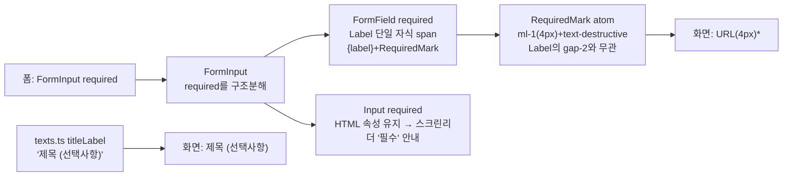

# 폼 필수 항목 `*` + 선택 항목 "(선택사항)" 표시

## Context

폼에 필수 표시가 전혀 없다. 유일한 표시는 선택 항목 쪽 `texts.ts:21`
`categoryLabel: '관심 분야 (선택사항)'` 하나뿐이다. 그래서 링크 등록 폼에서는 "URL"(필수)과
"제목"(선택, `post.schema.ts` `.optional()`)이 똑같이 표시 없이 보인다. 관심 분야에만
"(선택사항)"이 붙어 있으니 제목까지 필수로 읽힌다.

`required`는 LoginForm·SignUpForm·Create/UpdatePostForm의 URL에 이미 넘기고 있다. 하지만
`FormInput`의 `...props`를 타고 `<input>`에 HTML 속성으로만 붙고, 폼이 전부 `noValidate`라
화면에는 아무 변화가 없다. 라벨은 `FormField.tsx:45`가 텍스트만 그린다.

**사용자 결정 (2026-09-27, AskUserQuestion + Artifact 미리보기)**

- 방식 A: 필수는 `*`, 선택은 "(선택사항)" — NN/g + Baymard 근거
- 범위: 전체 — 로그인·회원가입·링크 등록/수정 URL, 닉네임 변경
- 마커 색: `text-destructive`(빨강) — 미리보기 A·C안 확정
- 마커 간격: **4px** — "업계 관례로 진행" 요청에 따라 Ant Design 테마 토큰 `marginXXS`
  실측값(4px)을 채택. Ant Design 소스(`components/form/style/index.ts`)의 `&::before`
  필수 마커 규칙이 `marginInlineEnd: token.marginXXS`를 쓰는 것을 확인했다(라벨 **앞**에
  붙는 배치라 우리와 위치는 다르지만 간격 크기 자체는 그대로 참고할 수 있다). MUI는
  별도 margin 토큰 없이 `{label} *`처럼 스페이스 한 칸만 두는데, 14px 폰트 기준 이 스페이스
  폭이 대략 3~4px라 Ant Design 값과 같은 범위로 모인다. "4px가 업계 표준"이라고 명시한
  디자인 시스템 문서는 못 찾았다 — 위 두 실측치 위에서 내린 판단이다(출처 미상 부분은
  §10 원칙대로 명시)
- 소스 구조: `required` 마커를 재사용 가능한 atom(`RequiredMark`)으로 뽑아 확장성을
  확보한다(아래 "단계" 2번)

근거(원문 확인, §10):

- [NN/g (Budiu 2019)](https://www.nngroup.com/articles/required-fields/): 필수 항목은 전부
  표시하라. 로그인 폼은 빼도 되지만 붙여도 손해는 없다고 한다
- [Baymard (2018)](https://baymard.com/blog/required-optional-form-fields): 필수와 선택를
  둘 다 명시하라
- 채택하지 않은 쪽: [GOV.UK](https://design-system.service.gov.uk/patterns/question-pages/)
  (별표 금지, 선택 항목만 표시)
- 간격 4px: [Ant Design 테마 토큰](https://ant.design/docs/react/customize-theme)
  `marginXXS` 기본값

### `Label`의 기본 `gap-2`(8px)는 이 프로젝트가 정한 값이 아니다 (§1 실제 코드 추적)

사용자 질문("우리 앱 Label이 왜 기본 gap-2를 지정했는지 근거") — git 이력을 추적한 결과다,
추측이 아니다:

- 최초 커밋(`2aac989`, 2026-01-18)의 `label.tsx`는 `gap-2`는커녕 `flex`도 없었다 — 순수
  shadcn/ui **구버전** 기본 템플릿(`text-sm font-medium leading-none ...`) 그대로였다
- 같은 날 두 시간 뒤 커밋(`7ce4c30`, "design: atoms mvp to restart")이 지금 클래스 문자열
  (`flex items-center gap-2 text-sm leading-none font-medium select-none
group-data-[disabled=true]:...`)로 통째로 교체했다 — 커밋 메시지는 근거를 남기지 않은
  일괄 교체다
- 이 문자열은 shadcn/ui 공식 레지스트리의 현재 `label.tsx`
  (`apps/v4/registry/new-york-v4/ui/label.tsx`)와 **글자 하나까지 동일**하다(직접 대조
  확인). shadcn 저장소 커밋 이력상 `flex items-center gap-2`는 `575c021`
  ("feat(v4): minor component updates", 2025-02-26)에서 추가됐다 — 이전엔 우리 최초
  커밋과 같은 구버전 템플릿이었다
- 즉 우리 repo의 `gap-2`는 **이 프로젝트의 의도적 결정이 아니라 shadcn/ui 템플릿을
  그대로 가져온 부산물**이다. shadcn 쪽이 왜 추가했는지는 커밋 메시지에 구체적 설명이
  없어 확정할 수 없다 — 아이콘+텍스트나 체크박스+설명처럼 `Label`이 자식 2개 이상을
  감싸는 레이아웃(shadcn의 최근 `Field`/`FieldLabel` 계열 컴포넌트에서 흔한 패턴)을
  지원하려는 것으로 보이지만, 이건 정황상의 추정이지 확인된 근거는 아니다
- **우리 repo에서 이 `gap-2`가 실제로 쓰인 적은 없다** — `<Label>` 사용처는
  `FormField.tsx:45`(`{label}` 문자열 하나)와 `FormCheckbox.tsx:36-41`(문자열 하나) 둘뿐이고
  둘 다 자식이 하나라 flex gap이 적용될 자리가 없었다(grep으로 전수 확인)
- **그래서 이번 마커는 `gap-2`에 얹지 않는다.** 우연히 남아 있던 8px 스타일에 기대면
  나중에 `Label`을 다자식 용도로 실제로 쓸 때(아이콘+텍스트 등) 이 4px 요구사항과
  충돌한다. 대신 라벨 텍스트와 마커를 하나의 `<span>`으로 묶어 `Label`의 flex 자식 수를
  1개로 유지하고, 마커 자체에 `ml-1`(Tailwind spacing 토큰 1 = 4px)을 직접 준다 — `Label`의
  `gap-2`를 건드리지 않아 다른 용도로 확장될 때도 안전하다

## 흐름



작업 순서: 워크트리 → **미리보기 승인** → 컴포넌트 → 텍스트 → 스토리·테스트 → e2e 셀렉터 →
문서 → 검증 → 커밋·PR

## 단계

0. **워크트리**
   - `git log origin/main..main`으로 푸시 안 된 커밋이 있는지 확인한다
   - `EnterWorktree` 후 `cp ../../../.env . && pnpm install`

1. **시각 미리보기 (§9, 완료)**
   - Artifact 두 라운드: 1차는 색(빨강/회색) × 간격(기본/붙여쓰기) 4안, 2차는 사용자가
     고른 빨강 계열을 0/2/4/6/8px 5단계로 좁혀 비교. 라이트·다크 모두 실제 토큰으로 렌더
   - 결과: 빨강 + 4px(Ant Design `marginXXS` 실측치) 확정 — 위 Context 절 참고

2. **`RequiredMark` atom (신규, 확장성)** — `src/shared/ui/atoms/required-mark.tsx`
   - 선례: `link-thumbnail.tsx`(kebab-case 파일명, PascalCase export)를 본떠 만든다
   - `<span aria-hidden="true" className={cn('ml-1 text-destructive', className)}>*</span>`
     하나만 렌더하는 최소 컴포넌트 — 지금은 `FormField`에서만 쓰지만, 나중에
     `FormCheckbox`·`FormCheckboxGroup`에 `required`가 필요해져도 같은 마커를 재사용하도록
     시각적 정의를 한 곳에 둔다(§2 "반복되는 UI는 공통 컴포넌트로")
   - `ml-1`(Tailwind spacing 토큰 1 = 4px)을 직접 준다 — `Label`의 `gap-2`(8px, 위 Context의
     "gap-2는 부산물" 절 참고)에 얹지 않는다
   - `<Component>.stories.tsx`를 같은 커밋에 추가한다(atoms 신규 컴포넌트 규칙)

3. **`FormField`** — `src/shared/ui/elements/form/_base/FormField.tsx`
   - `required?: boolean` prop을 추가한다(선택적 prop이라 기존 호출부에는 영향 없음)
   - `required`이면 라벨 텍스트와 마커를 **하나의 `<span>`으로 묶어** `Label`에 단일 자식으로
     전달한다(`Label`의 `gap-2`가 끼어들지 않도록):
     ```tsx
     <Label htmlFor={name}>
       <span>
         {label}
         {required && <RequiredMark />}
       </span>
     </Label>
     ```
   - `aria-hidden`을 붙이는 이유: 스크린리더가 "별표"라고 읽지 않게 하고, "필수" 안내는
     input의 `required` 속성에 맡긴다(W3C WAI: required 속성이 필수임을 프로그래밍적으로
     알린다). 마커와 라벨 텍스트 사이에 공백 텍스트 노드가 없어 접근 가능한 이름은 그대로
     "URL"이다(공백 없이 `ml-1`로만 시각적 간격을 주므로)

4. **`FormInput.tsx` / `FormInputPassword.tsx`**
   - `required`를 구조분해해서 `FormField`에는 `required={required}`로, `Input`/`PasswordInput`에도
     `required={required}`로 넘긴다. 지금 `...props`로 넘어가던 동작은 그대로 유지된다
   - `FormCheckbox`·`FormCheckboxGroup`은 `required`를 쓰는 곳이 없어서 건드리지 않는다(§2)

5. **텍스트와 호출부**
   - `src/shared/config/texts.ts` `POST_FORM_COMMON.titleLabel`: `'제목'` → `'제목 (선택사항)'`
     (create/update 공용이라 두 폼에 함께 반영된다)
   - `src/features/account/update/ui/UpdateAccountForm.tsx`의 닉네임 `FormInput`에 `required`를
     추가한다(스키마상 필수인데 빠져 있었다)
   - Login·SignUp·Create/UpdatePost는 이미 `required`가 있어서 자동으로 `*`가 붙는다. 수정할
     필요 없다

6. **스토리** (atoms·elements를 시각적으로 바꾸면 같은 커밋에 넣어야 하는 규칙)
   - `required-mark.stories.tsx`(2단계에서 이미 생성), `FormField.stories.tsx`,
     `FormInput.stories.tsx`, `FormInputPassword.stories.tsx`에 `Required` 스토리를 추가한다

7. **단위 테스트** — `src/shared/ui/elements/form/FormInput.test.tsx`를 새로 만든다
   - 선례: `src/shared/ui/elements/TooltipWrapper.test.tsx`의 `renderWithProviders` 패턴
     (+ `FormProvider` 래퍼)
   - 검증할 것:
     - `required`이면 `*`가 `aria-hidden`으로 렌더되고 input에 `required` 속성이 있다
     - `getByRole('textbox', { name: 'URL' })`로 접근 가능한 이름이 `*` 없이 "URL"로 유지된다
     - `required`가 없으면 `*`도 없다

8. **e2e 셀렉터** — Playwright 1.57의 `getByLabel(..., { exact: true })`는 `aria-hidden`을
   무시하지 않고 label 전체 텍스트를 비교한다(`injectedScriptSource.js`의 `getElementLabels`
   → `elementText`에서 확인). 그래서 `"URL*"`는 매칭에 실패한다
   - `exact: true` 셀렉터를 앞부분만 맞추는 정규식(`/^URL/`, `/^Email/`, `/^Password/`,
     `/^Nickname/`)으로 바꾼다. `exact`를 걸었던 이유가 'Save Email' 같은 부분 일치 충돌이므로,
     앞부분 고정 정규식이면 같은 효과가 난다
   - 대상: `e2e/post-create.spec.ts`, `login.spec.ts`, `signup.spec.ts`, `protected-nav.spec.ts`,
     `guest-guard.spec.ts`
   - `post-update.spec.ts`·`account-update.spec.ts`는 부분 일치 셀렉터라 그대로 통과할
     것으로 예상한다. 실행해서 확인한다

9. **문서**
   - `docs/FE-ARCHITECTURE.md` §16 "Form 컴포넌트 구조"에 "필수/선택 표시 규칙" 짧은 절을
     추가한다:
     - `required` → `RequiredMark` atom(`ml-1 text-destructive`, 4px), 선택 항목 → 라벨
       텍스트에 "(선택사항)"
     - `aria-hidden` 이유
     - `RequiredMark`가 `Label`의 기본 `gap-2`에 얹지 않고 독립적으로 4px을 주는 이유(위
       Context "`Label`의 기본 `gap-2`는 이 프로젝트가 정한 값이 아니다" 절 요약 + 링크)
     - 위 근거(NN/g·Baymard·Ant Design)를 번역 인용으로 싣는다(§8·§10)
   - DECISIONS.md에는 넣지 않는다 — 되돌리기 쉬운 결정이다(DECISIONS 적합성 기준)
   - `CHANGELOG.md` `[Unreleased]`에 feat 항목을 추가한다(`changelog-release` skill)

## 영향 범위 (§5)

- **CRUD·데이터 계약:** 변경 없음. Zod 스키마·DTO·API는 그대로다
- **자동으로 `*`가 붙는 화면:**
  - LoginForm(Email, Password)
  - SignUpForm(Nickname, Email, Password)
  - Create/UpdatePostForm(URL)
  - 닉네임 변경 모달
- **회귀 위험:**
  - e2e `exact` 셀렉터 → 8단계에서 처리
  - 제목 라벨 텍스트를 하드코딩으로 비교하는 테스트는 없다(`titleLabel` 참조는
    `post-update.spec.ts` 부분 일치 2곳뿐)
- **접근 가능한 이름:** `aria-hidden` 덕분에 "URL"로 유지된다. role 기반 쿼리는 영향 없다
- **발견만 하고 고치지 않는 것:** `post.schema.ts:16` JSDoc "url과 categories만 필수값"은
  낡았다(categoryIds는 `.optional()`). 요청 범위 밖이라 보고만 한다(§3)

## 검증

1. `pnpm type-check` → `pnpm test` → `pnpm lint` → `pnpm check:docs`
2. `pnpm test:e2e`로 8단계의 대상 스펙과 post-update·account-update 스펙을 실행한다
3. Storybook `Required` 스토리를 육안으로 확인한다
4. `browser-verification` skill로 녹화한다: 링크 등록, 링크 수정, 로그인, 회원가입, 닉네임 변경
   화면(라이트·다크)
5. 계획 스냅샷을 `docs/plans/2026-09-27-form-required-marker.md`로 커밋한다. fresh Explore
   subagent에게 계획 대비 diff 대조를 맡기고, 결과를 PR 본문 `## 계획 대비 구현`에 적는다(§11)
