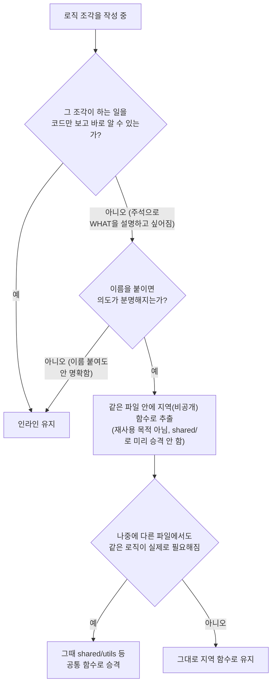

# 단일 사용 코드의 지역 함수 추출 — 규칙 정리 + TooltipWrapper 적용

## Context

`TooltipWrapper.tsx`의 하이브리드 입력 억제 로직을 만들며 `Date.now() < suppressHoverUntilRef.current`라는
조건을 `handleOpenChange` 안에 인라인으로 남겼다. 사용자가 "함수로 빼면 의도가 더 분명해지지 않냐"고
물었을 때, 나는 CLAUDE.md §2 "한 번만 쓰이는 코드에 추상화를 두지 않는다"를 근거로 인라인 유지를
권했다. 사용자는 "재사용 목적이 아니어도 한 줄만 읽어도 무슨 작업인지 아는 게 좋다. 같은 파일 안에서
지역 함수로 관리하다가 다른 곳에서도 필요해지면 그때 공통 함수로 분리하면 된다"고 반론했고, 웹 검색으로
근거를 확인해달라고 요청했다.

**웹 검색으로 확인한 근거**:

- Martin Fowler의 Extract Function 리팩터링의 핵심 동기는 재사용이 아니라 **명명(naming)**이라는 설명이
  여러 출처에서 일관되게 확인됐다. _"코드 조각을 보고 무엇을 하는지 파악하는 데 노력이 든다면, 그 조각을
  함수로 추출하고 '무엇을 하는지'로 이름을 붙여라 — 그러면 다음에 읽을 때 그 함수의 목적이 바로 눈에
  들어온다."_ (번역, Fowler _Refactoring_,
  [Goodreads 인용](https://www.goodreads.com/quotes/10219244-if-oy-have-to-spend-effort-looking-at-a-fragment))
- 같은 취지로 "함수 추출 이유는 재사용·가독성 등 다양하며, 재사용과 무관하게 명확한 이름을 붙이는 것만으로도
  코드는 더 이해하기 쉬워진다"는 설명도 확인됨
  ([Engineering for Data Science 북노트](https://engineeringfordatascience.com/book-notes/refactoring/)).
- 다만 실제 리팩터링 동기를 조사한 체계적 문헌 연구는 실무에서 가장 흔한 동기가 재사용·중복 제거였다고
  보고해([arXiv:2312.12600](https://arxiv.org/abs/2312.12600)), "가독성만을 위한 추출"이 유일한 정답은
  아니고 여러 타당한 동기 중 하나임을 함께 확인했다 — 균형 잡힌 근거로 제시한다.
- **이 레포 안의 기존 선례**: `docs/FE-ARCHITECTURE.md` §23 "Util Class" 패턴이 이미 "함수 하나뿐이어도
  클래스로 감싼다 — `shared/utils/`의 8/9 파일이 이 형태"라고 명시한다. 즉 이 코드베이스는 **shared 레벨에서
  이미 "단일 함수도 이름 붙여 감싼다"는 관례를 갖고 있다** — 이번 결정은 그 관례를 **파일-로컬 스코프까지
  확장**하는 것뿐이다.

## 결론(입장 정리)

CLAUDE.md §2 "한 번만 쓰이는 코드에 추상화를 두지 않는다"의 취지는 **재사용을 노린 일반화·설정
가능성**(옵션 객체, 플래그 분기, "나중에 필요할까봐" 만드는 범용 유틸)을 미리 만들지 말라는 것이지,
**이름을 붙여 의도를 드러내는 지역 함수 추출**을 금지하는 게 아니다. 이 둘은 다른 축이다:

|           | 재사용을 노린 일반화 (기존 규칙이 막는 것) | 의도를 드러내는 지역 추출 (이번에 허용 명시) |
| --------- | ------------------------------------------ | -------------------------------------------- |
| 목적      | 아직 안 쓰이는 유연성 확보                 | 지금 이 파일을 읽는 사람의 이해 비용 절감    |
| 범위      | 보통 `shared/` 등 공통 위치                | 같은 파일 안 비공개 함수                     |
| 판단 시점 | "나중에 필요할 수도" (추측)                | "지금 이 조각이 한눈에 안 읽힌다" (사실)     |
| 승격 시점 | 애초에 미리 만듦 → 문제                    | 실제 재사용 필요해질 때 → 그때 공통화        |

**판단 기준(실무 규칙)**: 어떤 코드 조각 위에 "이게 무슨 뜻인지" 설명하는 주석을 달고 싶어진다면, 주석
대신 그 설명을 이름으로 삼아 함수로 추출한다. (Claude Code 자체 지침 "주석은 WHY만, WHAT은 코드가
드러내야 한다"와도 일치.) 공통 유틸로의 승격은 재사용이 실제로 필요해지는 시점에 한다(YAGNI는 "이름
붙이기"가 아니라 "미리 범용화하기"에 적용되는 것).

## 판단 흐름 (앞으로 코드 작성 시 적용)



## 결정 사항

| 항목                   | 결정                                                                                               | 이유                                                                                                                                                                                                                     |
| ---------------------- | -------------------------------------------------------------------------------------------------- | ------------------------------------------------------------------------------------------------------------------------------------------------------------------------------------------------------------------------ |
| `docs/DECISIONS.md`    | 새 항목 추가(2026-09-27)                                                                           | 실제 대안 비교(인라인 유지 vs 지역 추출)를 외부 근거(Fowler)로 검토했고, 앞으로의 코드 스타일에 계속 영향을 미치는 결정이라 §11 적합 기준(대안 비교 + 지속 영향)을 충족                                                  |
| `.claude/CLAUDE.md` §2 | 기존 "한 번만 쓰이는 코드에 추상화를 두지 않는다" 불릿은 그대로 두고, 바로 아래 새 불릿 1개만 추가 | §3 "최소 범위만 수정" — 기존 문장은 원래 취지(일반화 금지) 그대로 맞으므로 재작성하지 않고, 빠져 있던 구분(지역 추출은 다른 얘기)만 보충. 상세 근거는 DECISIONS.md로 링크(CLAUDE.md 비대화 방지, 기존 §9 등과 같은 패턴) |
| `TooltipWrapper.tsx`   | `Date.now() < suppressHoverUntilRef.current` 조건을 `isHoverSuppressed()`로 추출                   | 이번 논의의 실제 사례를 그대로 적용 — CLAUDE.md 새 불릿이 가리킬 구체적 선례가 됨(기존 규칙들도 대부분 "이 파일 참고" 식으로 실제 코드를 근거로 삼음)                                                                    |
| 주석                   | `isHoverSuppressed`엔 주석 없음                                                                    | 이름 자체가 "무엇을 하는지" 답이라 WHAT 주석이 불필요해짐(추출의 목적 그 자체) — 기존 WHY 설명 주석은 `handlePointerDown`에 그대로 유지                                                                                  |
| 커밋 단위              | 1개 커밋(문서 2개 + 코드 1곳)                                                                      | 세 변경이 "같은 결정의 서술 + 그 결정의 실제 적용 사례"로 하나의 논리적 단위 — DECISIONS.md 항목이 TooltipWrapper 예시를 직접 인용하므로 분리하면 오히려 어색함                                                          |

## 구현 단계

1. `EnterWorktree`
2. `docs/DECISIONS.md` 최상단(가장 최근 항목 위)에 새 항목 추가 — 위 "웹 검색으로 확인한 근거" +
   "결론(입장 정리)" 내용을 이 파일 기존 포맷(`**배경**`/`**검토한 근거**`/`**결정**`/`**상태**`)에 맞춰
   정리
3. `.claude/CLAUDE.md:30` 바로 아래에 새 불릿 추가:
   > - 다만 이는 **재사용을 노린 일반화·설정 가능성**을 뜻한다 — 조건식이 한눈에 안 들어와 이름을 붙이면
   >   의도가 분명해지는 경우, 재사용 목적이 아니어도 같은 파일 안에서 지역 함수로 추출하는 건 이 규칙
   >   위반이 아니다. 공통 유틸로의 승격은 실제로 다른 곳에서도 필요해질 때 한다(근거·기존 선례:
   >   `docs/DECISIONS.md` 2026-09-27 항목, `TooltipWrapper.tsx`의 `isHoverSuppressed()` 참고)
   >   → verify: `pnpm check:docs`
4. `src/shared/ui/elements/TooltipWrapper.tsx` — `handleOpenChange` 윗줄에 다음 함수 추출:

   ```ts
   const isHoverSuppressed = () => Date.now() < suppressHoverUntilRef.current;

   const handleOpenChange = (open: boolean) => {
     if (open && isHoverSuppressed()) {
       return;
     }
     setVisible(open);
   };
   ```

   순수 리팩터링(동작 불변) → verify: 기존 `TooltipWrapper.test.tsx` 5개 테스트 그대로 green(새 테스트
   불필요 — 동작 변화 없음)

5. 계획 스냅샷을 `docs/plans/2026-09-27-local-extract-for-readability.md`로 커밋
6. 전체 검증 → 커밋 1개 → push → PR

## 영향 범위 (§5)

- `TooltipWrapper.tsx`: 순수 리팩터링, 동작 변화 없음(런타임 로직 1:1 동일) — Create/Update/Delete 등
  어떤 흐름에도 영향 없음. 기존 5개 테스트로 회귀 확인.
- `.claude/CLAUDE.md`/`docs/DECISIONS.md`: 문서 변경만, 런타임 영향 없음. 향후 세션의 코드 작성 판단
  기준에만 영향.

## 검증

1. `pnpm type-check`
2. `pnpm test src/shared/ui/elements/TooltipWrapper.test.tsx` (+ 전체 `pnpm test`)
3. `pnpm lint`
4. `pnpm check:docs` (CLAUDE.md 수정)
5. `pnpm format:check`

## 남은 것

- 이 판단 기준을 어겼는지는 코드 리뷰(`/code-review`) 시점에 사람/세션의 판단에 의존한다 — ESLint 규칙
  등으로 자동 강제하지는 않는다(주관적 판단이 필요한 영역이라 자동화 대상으로 적합하지 않다고 봄).
