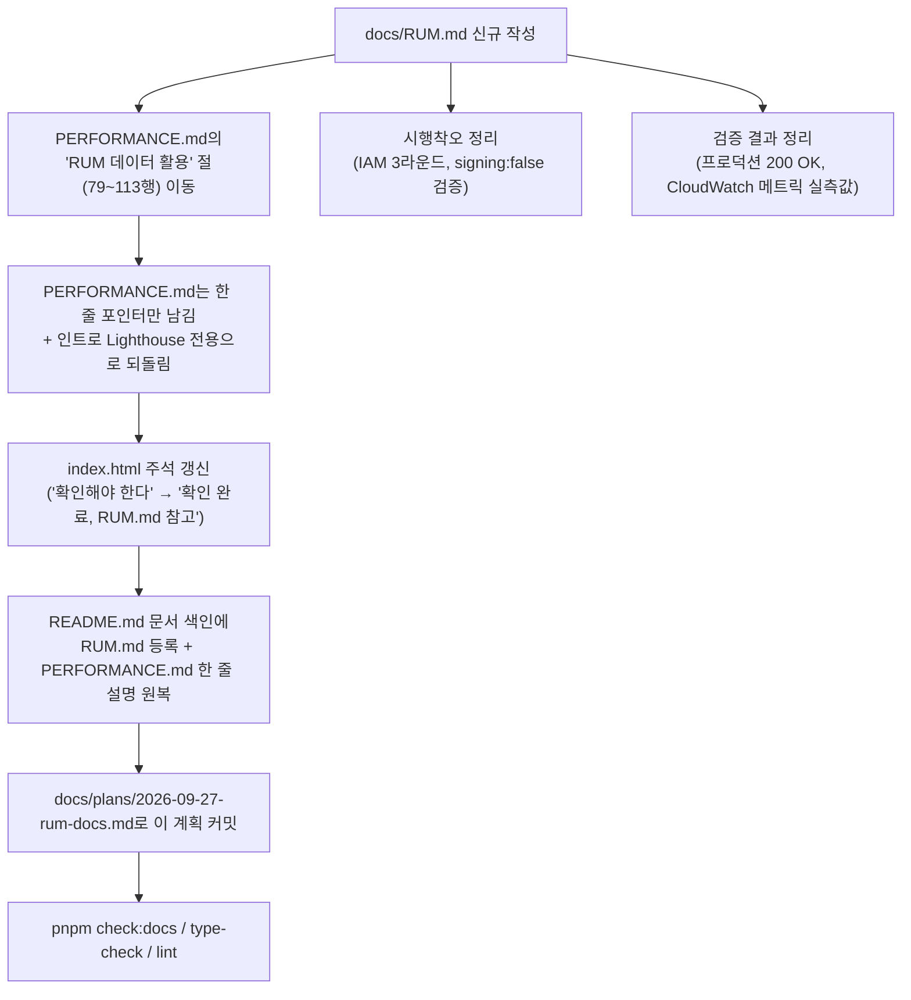

# RUM 문서 정리 — docs/RUM.md 신설

## Context

이번 세션(2026-09-26)에 AWS CloudWatch RUM을 새로 도입했다(PR #200, #201). 그런데
지금 RUM 관련 내용은 세 곳에 흩어져 있다:

- `docs/DECISIONS.md`(9~59행) — Cloudflare 대신 CloudWatch RUM을 택한 이유(ADR)
- `docs/PERFORMANCE.md`(79~113행) — "RUM 데이터 활용" 절(수집→분석→개선 루프)
- `index.html`(8~15행) — 스니펫 위의 주석, 그중 한 문장("배포 후 CloudWatch RUM
  콘솔에서 실제 이벤트 수신을 직접 확인해야 한다")은 이미 검증을 마쳤는데도 아직
  "확인해야 한다"는 미완료 톤으로 남아 낡았다

사용자가 "RUM은 새로 도입하는 기능이니 정리해두는 게 좋겠다"고 요청했다. 이 레포는
정확히 이런 경우를 위한 문서 종류를 이미 갖고 있다 — **독립 기능 문서**(서사형,
`docs/<기능명>.md`). `README.md` 163~183행의 목록에 있는 `BOOKMARK.md`,
`FCM-PUSH-NOTIFICATION.md`, `UNSAVED-CHANGES-GUARD.md`가 선례다: "지금 어떻게
동작하는가"를 한곳에서 보여주고, 겪은 시행착오(이번 경우 IAM 권한 3라운드,
`signing:false` 문서 간 불일치와 그 해소)도 같은 문서에 남긴다. `docs/PERFORMANCE.md`는
이미 "Lighthouse 측정을 재현하는 절차 문서(how-to)"라고 스스로 범위를 선언하고 있어
(1~7행), RUM의 전체 서사(무엇/왜/어떻게/시행착오)를 거기에 얹으면 "한 문서 = 한
목적" 원칙(CLAUDE.md "docs/ 내부 분류")과 부딪힌다. `docs/UNSAVED-CHANGES-GUARD.md`
(235줄, FE 상태모델 없이 링크로만 "왜"를 가리키는 가벼운 구조)가 RUM 문서의 크기·구조
참고로 가장 가깝다 — RUM도 FE 상태(Zustand/React Query)가 없고 정적 스니펫 하나 +
AWS 콘솔 설정이 전부이기 때문이다.

## 흐름

`docs/DECISIONS.md`는 건드리지 않는다 — 이미 정확한 위치("왜 이 대안을 골랐나")이고,
`RUM.md`는 그 항목을 링크만 한다(SSOT, 복제 금지).

## 계획

1. **`docs/RUM.md`(신규)** — `docs/UNSAVED-CHANGES-GUARD.md`의 구조·분량을 본떠
   CLAUDE.md "독립 기능 문서 내부 순서"의 13절을 채운다:
   - 인용구 블록(문서 성격/대상 독자/읽고 나면/**마지막 검토: 2026-09-27**)
   - **1. 쉬운 설명** + Mermaid: 브라우저 방문 → `cwr.js` 로더 → `dataplane` 이벤트
     전송 → CloudWatch 메트릭/RUM 콘솔, 그리고 PERFORMANCE.md에서 옮겨온
     "수집→콘솔 확인→전달→우선순위 판단→수정→재검증" 활용 루프
   - **2. 전제 지식** — `docs/DECISIONS.md` 2026-09-26 "RUM" 항목 링크(왜 Cloudflare
     대신 CloudWatch RUM인지는 여기서 다시 쓰지 않는다)
   - **3. 사용한 도구·기술** — `aws-rum-web` CDN 스니펫, AWS CLI(`aws rum`,
     `aws cloudwatch get-metric-statistics`)
   - **4. 왜 만들었나** — 필드 데이터 부재, DECISIONS.md로 링크
   - **5. 구조** — 리소스 기반 정책(`Principal: "*"`, `rum:PutRumEvents`)으로 Cognito
     없이 익명 수집하는 아키텍처
   - **6. 상태 모델** — "해당 없음"을 명시(FE 상태 저장 없음, 정적 스니펫 호출뿐)
   - **7. 운영 파라미터** — App Monitor ID `81cbaae5-b6f2-48d9-9c05-f6f6f5f648cc`,
     이름 `link-sphere-post`, 리전 `ap-northeast-1`, `sessionSampleRate: 1`,
     `signing: false`, 엔드포인트, `index.html:파일:줄` 명시
   - **8. 코드 지도** — `index.html`의 스니펫 위치가 유일한 코드 지점임을 명시
   - **9. 검증 결과** — 로컬(도메인 불일치 `400`), 프로덕션(`200 OK`),
     `aws cloudwatch get-metric-statistics` 실측값(SessionCount 3, PageViewCount 15,
     WebVitalsLargestContentfulPaint 평균 1504ms/1812ms, 2026-09-26 직접 측정)
   - **10. 시행착오** — IAM 권한 3라운드(인라인 정책 2048자 한도 → 관리형 정책
     전환 → `iam:CreateServiceLinkedRole` 추가 필요), `signing:false`를 둘러싼
     aws-rum-web 문서 간 불일치와 로컬/프로덕션 실측으로 해소한 과정,
     `rum:GetAppMonitorData` 권한이 없어 원본 이벤트는 CLI로 못 보고 콘솔에서만
     본다는 한계
   - **11. 남은 것** — 실사용자 트래픽 누적 대기 중(현재 데이터는 테스트 트래픽뿐)
   - **12. 용어 사전** — App Monitor, 리소스 기반 정책(resource-based policy) 등
     처음 등장하는 용어 정의
   - **13. 관련 문서** — `docs/DECISIONS.md`, `docs/PERFORMANCE.md`
2. **`docs/PERFORMANCE.md` 축소**:
   - 79~113행 "RUM 데이터 활용" 절 삭제, 그 자리에 "실사용자(필드) 데이터는
     CloudWatch RUM으로 수집한다 — 전체 내용·활용 루프는 `docs/RUM.md` 참고" 한 줄
     포인터만 남긴다.
   - 1~7행 인트로를 "Lighthouse 전용" 서술로 되돌린다(이 문서의 선언된 범위를
     RUM 도입 전 상태로 복원 — RUM 관련 소개는 RUM.md의 역할).
3. **`index.html`(8~15행)** — RUM 스니펫 위 주석 중 "배포 후 CloudWatch RUM 콘솔에서
   실제 이벤트 수신을 직접 확인해야 한다"를 "확인 완료(2026-09-26, 프로덕션에서
   200 OK + CloudWatch 메트릭 실측 확인) — 상세는 `docs/RUM.md` 참고"로 갱신한다.
   `signing:false` 관련 배경 설명 자체는 그대로 두되(코드 옆에서 바로 읽혀야 하는
   맥락이므로), 미해결 톤만 정리한다.
4. **`README.md`(163~194행)** — "독립 기능 문서" 목록에 `docs/RUM.md` 항목을
   추가하고, "절차" 목록의 `docs/PERFORMANCE.md` 한 줄 설명(187행)을 RUM 언급 없이
   원래(Lighthouse 전용) 문구로 되돌린다.
5. **`docs/plans/2026-09-27-rum-docs.md`(신규)** — 이 계획 파일을 구현 커밋과 같은
   PR에 커밋한다(append-only). PR을 열기 전에 fresh Explore subagent에게 이 계획
   파일과 실제 diff를 대조시켜 PR 본문에 "계획 대비 구현" 섹션을 남긴다(CLAUDE.md §11).

## 핵심 파일

`docs/RUM.md`(신규), `docs/PERFORMANCE.md`(79~113행 삭제, 1~7행 복원),
`index.html`(8~15행 주석만), `README.md`(163~194행), `docs/plans/2026-09-27-rum-docs.md`(신규)

`docs/DECISIONS.md`는 읽기만 하고 수정하지 않는다.

## 검증

- `pnpm check:docs` — README·PERFORMANCE.md·RUM.md의 상호 링크·경로가 실제와
  맞는지 확인
- `pnpm type-check` / `pnpm lint` (문서만 바뀌어도 CLAUDE.md 규칙상 항상 실행)
- `docs/RUM.md` 자체 검증(CLAUDE.md "독립 기능 문서 내부 순서" 체크리스트): 정의 없이
  쓰인 고유 용어가 있는지, 이 문서만 보고 값을 바꿀 수 있는지, DECISIONS.md와 중복
  서술이 없는지, 코드 스니펫이 실제 `index.html`과 일치하는지
- fresh Explore subagent로 계획 대비 구현 대조 → PR 본문 `## 계획 대비 구현` 섹션
