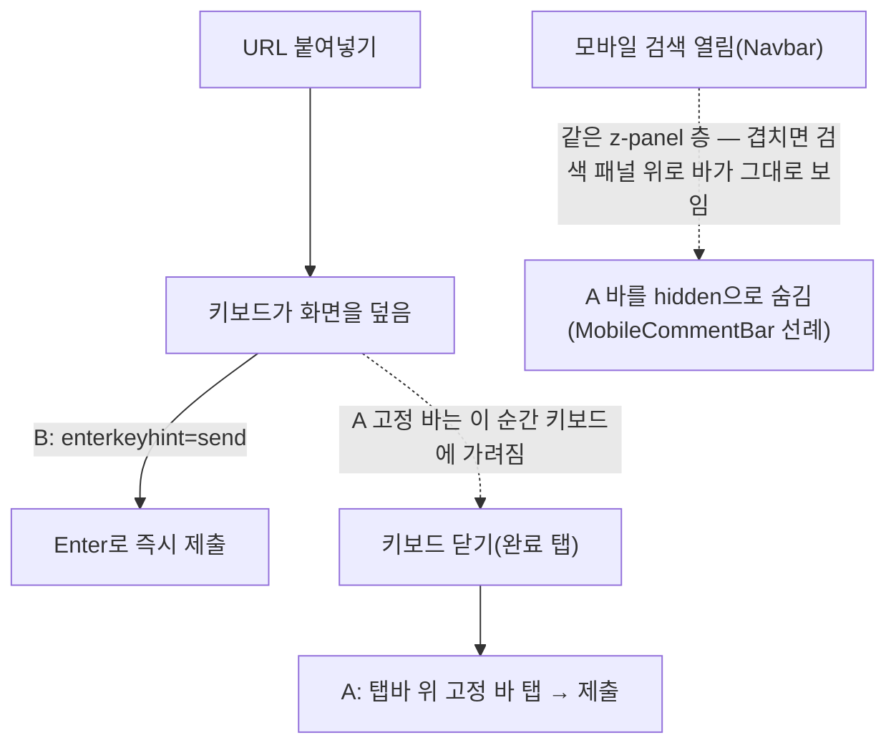

# /submit 모바일 등록 버튼 — 탭바 위 고정 바(A) + Enter 제출 라벨(B)

## Context

`/post/submit`(`CreatePostForm.tsx`)에서 등록 버튼은 폼의 마지막 필드(비공개
체크박스) 뒤에 있다. 375×667 dev 서버 실측 기준 버튼은 677~721px 지점에 있어
667px 뷰포트에서는 처음부터 화면 밖이고, `BottomTabBar`가 하단 64px+safe-area를
항상 덮는다. URL만 붙여넣고 바로 등록하는 사용자가 스크롤을 거쳐야 하는 문제를
해결한다.

Artifact 시안(지금/A/C 3가지 실측 스크린샷, `docs/DECISIONS.md` 2026-09-06·
2026-09-14 선례에 따라 반영 전 승인받음)에서 사용자가 **A(탭바 위 고정 등록
바) + B(URL 입력창 `enterkeyhint="send"`)** 조합을 승인했다. 근거: NN/g "4 iOS
Rules to Break"(2015, 원문 확인·`docs`에 재인용 안 함 — 이 계획 문서 자체가
근거 기록)는 스크립트 실행 화면 하단 고정 Submit을 권장하지만 iOS 네이티브
앱 대상이라 정확히 같은 상황은 아니고, Chrome 개발자 블로그(2022)는 `position:
fixed` 요소가 키보드에 가려질 수 있다고 명시해 A만으로는 "URL 입력 중"인
바로 그 순간에 구멍이 생긴다 — B가 그 구멍을 메운다. 범위는 `CreatePostForm.tsx`
(생성 화면)만이고 `UpdatePostForm.tsx`(수정 화면)는 포함하지 않는다.

## 흐름

## 구현

**대상 파일**: `src/features/post/create/ui/CreatePostForm.tsx` 한 곳만 수정한다.
버튼 엘리먼트를 복제하지 않고, 기존 `TooltipWrapper`+`Button`을 새 `
` 하나로
감싸 반응형 클래스만 바꾼다(모바일 `fixed`, `md:`에서 `static`으로 리셋 — 데스크톱은
`position:static`이 되는 순간 `top/right/bottom/left`·`z-index`가 전부 무효화되므로
별도 리셋 없이 지금과 동일하게 렌더된다).

1. **B — URL 입력창에 `enterKeyHint="send"` 추가.** 폼 안 submit 타입 버튼이
   이미 하나뿐이라(나머지는 전부 `type="button"`) URL이 유효하면 지금도 Enter로
   제출된다 — 키보드 키 라벨만 "보내기"로 바뀌는 순수 속성 추가다.
2. **A — 등록 버튼을 감싸는 새 `
`.** 선례: `MobileCommentBar.tsx`의 collapsed
   상태 클래스(`fixed inset-x-0 bottom-[calc(4rem+env(safe-area-inset-bottom))]
z-panel border-t bg-background px-4 py-2`)를 그대로 쓰고, `md:static
md:border-0 md:bg-transparent md:p-0`으로 데스크톱을 원래 모습으로 되돌린다.
3. **모바일 검색과의 z-panel 충돌.** `RecentSearchPanel`도 `z-panel`이고 DOM상
   `main`(우리 바를 포함)이 `Navbar`보다 뒤에 있어, 그대로 두면 검색 패널이 열려도
   등록 바가 그 위에 남는다. `useHistoryOverlay('mobileSearchOpen')`으로 열림
   상태를 읽어 `isMobileSearchOpen && 'hidden'`을 더한다(`MobileCommentBar.tsx`와
   동일 패턴).
4. **토스트 오프셋.** 이 바는 탭바보다 위쪽으로 더 높은 고정 UI라, 기본
   `--toast-offset-bottom`(탭바 높이만 반영)로는 에러 토스트가 바에 가려진다 —
   실제로 URL 크롤링 실패 시 에러 토스트가 이 화면에 뜬다(최근 커밋 #202).
   `MobileCommentBar.tsx`의 `reserveToastSpaceAboveBar`(ResizeObserver로 실측
   높이만큼 반영, 언마운트 시 `removeProperty`)를 그대로 따르되, **한 가지 다르게
   간다**: `MobileCommentBar`는 이 effect를 뷰포트와 무관하게 항상 돌려서 desktop에서도
   `--toast-offset-bottom`을 미세하게 건드리는 것으로 보인다(`md:hidden`인 요소의
   `offsetHeight`는 0이지만 `TAB_BAR_RESERVE` 자체는 무조건 더해짐) — 기존 컴포넌트라
   손대지 않지만, 새로 만드는 이 effect는 `AppLayout.tsx`의 `blockBackgroundDuringMobileSearch`와
   같은 `window.matchMedia('(min-width: 768px)')` 체크로 데스크톱에서는 아예 실행하지
   않게 가드한다.

## 검증

- `pnpm type-check` / `pnpm lint`.
- `e2e/post-create.spec.ts`(데스크톱 프로젝트)는 버튼을 복제하지 않으므로
  `getByRole('button', { name: ... })` 선택자·흐름 그대로 통과해야 한다.
- 새 `e2e/post-create.mobile.spec.ts`(mobile-chrome 프로젝트) 추가: URL을 채운
  뒤 (1) 스크롤 없이 등록 버튼이 뷰포트 안에 보이는지, (2) `Enter` 키로 제출되는지
  확인한다(가상 키보드 라벨 자체는 Playwright로 렌더·검증 불가 — Artifact에서
  사용자에게 이미 설명한 제약과 동일).
- Playwright MCP로 375×667에서 실제 화면을 다시 캡처해 Artifact 시안(A안)과
  일치하는지, 모바일 검색을 열었을 때 바가 사라지는지 확인한다
  (`browser-verification` skill 절차).
