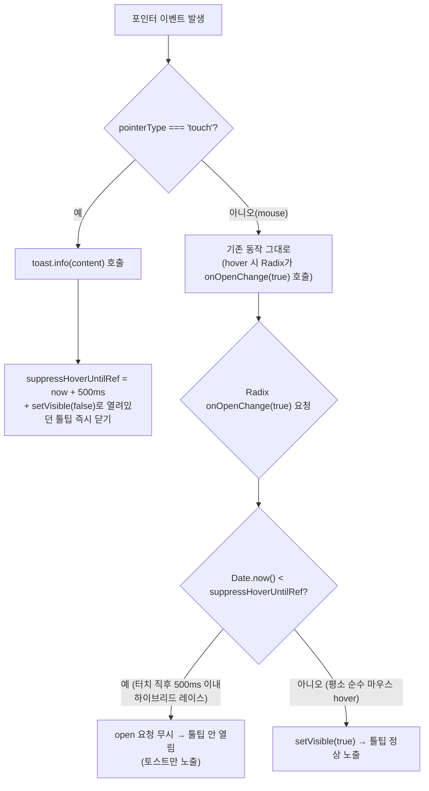

# TooltipWrapper 하이브리드 입력 방어 (터치 시 hover 툴팁 강제 억제)

## Context

PR #203에서 `CreatePostForm`의 disabled+`TooltipWrapper` 패턴이 CLAUDE.md 규칙과 어긋나지 않는다고
판단한 근거 중 하나로 "TooltipWrapper가 탭에서도 토스트로 이유를 보여준다"는 점을 들었다. 사용자가 Chrome
DevTools 기기 툴바로 직접 테스트해보니 **툴팁과 토스트가 동시에 떴다**며 "확인했냐"고 물었고, 나는 실제
브라우저로 검증하지 않고 소스 코드만 읽고 판단했었다는 걸 인정했다.

이번 세션에서 직접 검증한 결과:

- **진짜 터치**(Playwright `hasTouch` 컨텍스트, 실제 폰이 쓰는 것과 동일한 CDP `Input.dispatchTouchEvent`):
  토스트만 뜨고 툴팁은 안 뜸(`tooltipCount: 0`)
- **마우스로 좁은 뷰포트 hover+클릭**(화면만 줄인 경우): 호버 시 툴팁만 뜨고, 클릭해도 토스트는 안 뜸
- **DevTools 기기 툴바와 동일한 메커니즘**(CDP `Emulation.setEmitTouchEventsForMouse` — 마우스 입력을
  터치로 "번역"하는 하이브리드 방식) 재현 시도 중 예상치 못한 페이지 이탈(beforeunload)까지 발생 — 순수
  터치 주입과는 다른, 마우스 이벤트가 함께 새어나가는 방식임을 보여줌

사용자가 이후 기억을 확인해줬다: "데스크톱에서 모바일 화면으로 볼 때는 disabled여도 hover를 인식해서
툴팁이 보였고, 실제 모바일은 hover 개념이 없어서 토스트를 추가했었다." 이 기억은 커밋 `9087929`
(2026-08-10, `feat(ui): 비활성 버튼에 이유를 툴팁·토스트로 표시`)의 커밋 메시지와 정확히 일치한다:

> "모바일에서는 Radix 툴팁이 터치를 무시해 데스크톱에서만 동작하는 한계도 있었고... 탭 시 같은 이유를
> 토스트로 보여주는 fallback 추가"

즉 설계 의도 자체가 "실제 터치에서는 Radix 툴팁이 절대 안 열린다(hover 경로 자체가 없다)"였고, 오늘
검증한 두 시나리오(진짜 터치 / 순수 마우스) 모두 이 의도와 정확히 일치했다. "둘 다 뜨는" 현상은 DevTools
기기 툴바 특유의 마우스→터치 하이브리드 에뮬레이션에서만 나타나는 아티팩트다.

다만 이 하이브리드 입력 자체는 DevTools만의 문제가 아니다 — 터치스크린 Windows 노트북·Surface처럼
마우스와 터치를 동시에 지원하는 실제 기기에서도, 트랙패드로 hover한 채로 화면을 직접 탭하면 같은 레이스가
실제로 재현될 수 있다. `TooltipProvider`가 앱 전체에서 `delayDuration={0}`(App.tsx:25, 호버 즉시 오픈)으로
설정돼 있어 이 레이스가 발생하기 쉬운 조건이다. 사용자 요청에 따라 "왜 이런 현상이 나는지 설명"에서 한
단계 더 나아가, 터치가 감지되면 hover로 열리려는 툴팁을 코드 차원에서 강제로 억제하는 방어 로직을
추가한다.

## 수정 후 동작 흐름



## 결정 사항

| 항목                | 결정                                                                                             | 이유                                                                                                                                                                                                                                                                                                                                    |
| ------------------- | ------------------------------------------------------------------------------------------------ | --------------------------------------------------------------------------------------------------------------------------------------------------------------------------------------------------------------------------------------------------------------------------------------------------------------------------------------- |
| 억제 방식           | 터치 pointerdown 시점부터 500ms 동안 `onOpenChange(true)` 요청을 무시하는 시간창 방식 (ref 기반) | 이벤트 발생 **순서**에 의존하면(예: pointerdown에서 그 즉시 1회만 `setVisible(false)`) Radix의 hover-open이 나중에 도착하는 경우 못 막는다. `TooltipProvider`가 `delayDuration={0}`(App.tsx:25)이라 hover는 즉시 열리므로, 순서 보장이 안 되는 하이브리드 입력에서는 "일정 시간 동안 open 요청 자체를 거부"하는 게 유일하게 견고한 방법 |
| 억제 시간 500ms     | 브라우저의 터치→마우스 호환 이벤트 지연(스펙상 약 300ms)을 여유 있게 덮는 값                     | 임의값이지만 기존 파일의 다른 타이밍 처리(`hasPointerMoveOpenedRef` 관련 주석)와 같은 수준의 실용적 여유값                                                                                                                                                                                                                              |
| 적용 범위           | `TooltipWrapper.tsx` 공통 컴포넌트 1곳 수정                                                      | 앱 전체 disabled 버튼이 이 컴포넌트를 공유하므로, 여기서 고치면 `CreatePostForm`뿐 아니라 `UpdatePostForm`·`UpdateProfileForm`·`CommentEditForm` 등 기존 사용처 전체에 방어가 적용된다(선례: 커밋 `9087929`도 이 컴포넌트 하나를 고쳐 여러 폼에 동시 적용됨)                                                                            |
| `docs/DECISIONS.md` | 항목 추가 안 함                                                                                  | 대안 비교형 설계 결정이 아니라 버그 방어 로직 추가 — 이 문서의 적합 기준(실제 대안 비교 + 되돌리기 어려움)에 해당하지 않음                                                                                                                                                                                                              |
| PR #203 소급 수정   | 안 함                                                                                            | 그 PR의 CLAUDE.md 예외 조건 문단은 "인라인 필드 에러가 상시 노출된다"는 점에 근거했고 TooltipWrapper의 탭 동작을 근거로 삼지 않았음(재확인 완료) — 정정할 내용 없음                                                                                                                                                                     |

## 구현 단계

1. `EnterWorktree`
2. **테스트 먼저** — `TooltipWrapper.test.tsx`에 케이스 추가: 터치 `pointerDown` 직후(수백 ms 이내) 마우스
   `pointerMove`(hover)를 흉내 내도 툴팁 텍스트가 `queryByText`로 나타나지 않는지 확인(기존 "마우스가
   트리거 위에 있는 채로..." 테스트가 쓰는 `fireEvent.pointerMove(trigger, { pointerType: 'mouse' })` 패턴
   재사용) → verify: 이 시점엔 로직이 없어 fail(red)
3. **`TooltipWrapper.tsx` 수정**:

   ```ts
   const suppressHoverUntilRef = useRef(0);

   const handlePointerDown = (e: React.PointerEvent) => {
     if (e.pointerType !== 'touch' || !content) {
       return;
     }

     // 터치스크린 노트북·Chrome DevTools 기기 툴바 같은 하이브리드 입력은 터치와 함께 마우스
     // hover 이벤트도 동반 발생시켜 Radix 툴팁이 뒤늦게 열릴 수 있다(TooltipProvider가
     // delayDuration={0}이라 hover는 즉시 열림, App.tsx:25). 터치 시점 기준 짧은 시간 동안
     // hover로 인한 open 요청을 무시해 토스트와 중복 노출되지 않게 한다.
     suppressHoverUntilRef.current = Date.now() + 500;
     setVisible(false);
     toast.info(content, { id: REASON_TOAST_ID });
   };

   const handleOpenChange = (open: boolean) => {
     if (open && Date.now() < suppressHoverUntilRef.current) {
       return;
     }
     setVisible(open);
   };
   ```

   `<Tooltip open={visible} onOpenChange={setVisible}>`를 `onOpenChange={handleOpenChange}`로 교체.
   → verify: 2번 테스트 green, 기존 4개 테스트(터치/마우스/무이유/hover-sibling-input) 그대로 green

4. `pnpm type-check && pnpm test src/shared/ui/elements/TooltipWrapper.test.tsx && pnpm lint`
5. 계획 스냅샷을 `docs/plans/2026-09-27-tooltip-wrapper-hybrid-input-guard.md`로 커밋
6. 커밋 1개 → push → PR

## 영향 범위 (§5)

- `TooltipWrapper.tsx`는 앱 전체 disabled 버튼이 공유하는 컴포넌트 — `CreatePostForm`, `UpdatePostForm`,
  `UpdateProfileForm`, `CommentEditForm` 등 기존 사용처 전체가 영향을 받는다(전부 같은 방향으로 개선되는
  것이라 회귀는 아님).
- **순수 마우스 전용 데스크톱 사용자**: 영향 없음 — `suppressHoverUntilRef`는 터치 pointerdown이 한 번도
  없으면 0으로 유지돼 `Date.now() < 0`은 항상 false, 기존 hover 동작 그대로.
- **순수 터치(실제 폰) 사용자**: 영향 없음 — 애초에 Radix가 터치의 hover-open 자체를 무시하므로
  `suppressHoverUntilRef`가 개입할 상황 자체가 안 생긴다.
- **하이브리드 기기(터치스크린 노트북 등) 사용자**: 터치 직후 500ms 동안 hover로 툴팁이 안 열림 — 의도된
  동작(토스트가 이미 이유를 보여줬으므로 중복 노출 방지).
- 회귀 후보: 기존 "마우스가 트리거 위에 있는 채로 다른 입력창에 타이핑" 테스트(폼 input 리스너로 인한
  `setVisible(false)`) — 이건 `handleOpenChange`를 거치지 않고 `handleInput`에서 직접 `setVisible(false)`를
  호출하는 별도 경로라 이번 변경과 충돌 없음(코드 확인 완료).

## 검증

1. `pnpm type-check`
2. `pnpm test src/shared/ui/elements/TooltipWrapper.test.tsx` (+ 전체 `pnpm test`)
3. `pnpm lint`
4. `pnpm format:check`
5. Playwright로 이번에 썼던 재현 스크립트(진짜 터치 탭 + 직후 마우스 hover 흉내)를 다시 돌려 툴팁이 억제
   기간 동안 안 열리는지 실제 브라우저에서도 확인 — `browser-verification` skill 절차 참고

   **실제로 실행한 결과** (Storybook `WithDisabledButton` 상당의 `delayDuration={0}` 임시 story로 검증,
   실행 후 삭제): 터치 pointerdown 직후 즉시 마우스 hover를 흉내 내도 `tooltipCount: 0`(억제됨), 억제
   시간(500ms) 경과 후 다시 hover하면 `tooltipCount: 1`(정상 노출) — 계획한 동작과 정확히 일치.

## 남은 것

- 실제 iOS/Android 기기에서의 최종 확인은 못 했다 — 특히 iOS Safari는 hover 리스너가 있는 요소에 첫 탭을
  "hover 진입"으로 처리하는 별도 플랫폼 특성이 있어(이론상 가능성으로만 언급, 검증은 안 함) 이 억제 로직이
  그 경우까지 완전히 커버하는지는 실기기 확인이 필요하다.
- 500ms는 실측 기반이 아니라 스펙상 알려진 지연(약 300ms)에 여유를 더한 추정값이다 — 출처 미상, 실제
  브라우저별 편차가 있다면 재조정이 필요할 수 있다.
