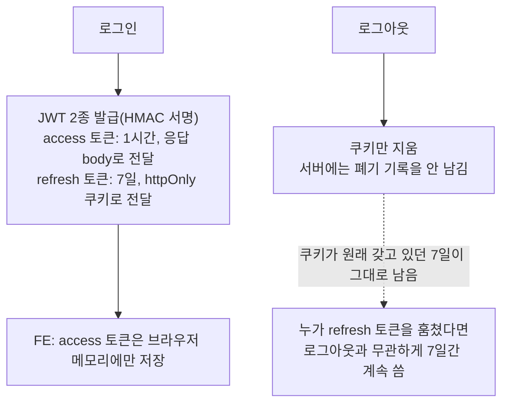
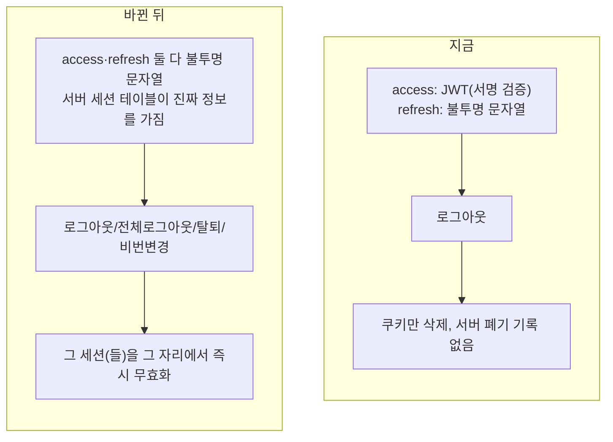
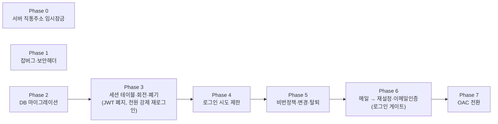
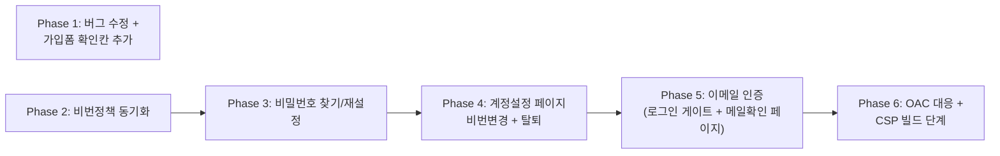

# 인증 시스템 전면 강화 (비밀번호 찾기·변경·회원탈퇴·이메일인증·세션폐기·인프라 잠금)

> **도메인 관련 확인 필요**: AWS **Route 53**으로 구매 진행하기로 확정. 실제 도메인 이름을
> 정하고 구매를 실행하는 시점에 **다시 확인받는다**(아직 어떤 이름을 살지는 안 정함).

---

## 0. 현재 상황

개인·지인용으로 만든 사이트라 이메일 인증·비밀번호 변경 같은 계정 기능을 의도적으로 빼놨다.
이제 포트폴리오 가치와 보안, 두 이유로 인증을 다시 잡으려 한다.

### 지금 인증이 동작하는 방식

### 사전 조사 점수: 47/100 (OWASP ASVS 5.0 기준)

| 영역                                    | 점수     | 요약                                                    |
| --------------------------------------- | -------- | ------------------------------------------------------- |
| 인가(다른 사람 글 수정 못 하게 막는 것) | 12/15    | 양호. 작은 구멍 2곳만 있음                              |
| 브라우저 공격(XSS) 방어                 | 5/10     | 양호                                                    |
| 세션 구조                               | 12/15    | 기본기는 있음                                           |
| **세션 종료**                           | **3/15** | 로그아웃해도 훔친 토큰이 7일간 계속 유효                |
| **인프라(서버 직통 주소 노출)**         | **2/15** | 서버 주소를 직접 알면 방화벽을 통째로 건너뛸 수 있음    |
| 비밀번호 정책                           | 4/10     | 최소 길이는 있지만 프론트·백엔드 규칙이 서로 다름(버그) |
| **계정 관리 기능**                      | **1/10** | 비밀번호 변경·찾기·탈퇴·이메일인증 전부 없음            |

### 없는 기능 (이번에 추가)

비밀번호 찾기, 이메일 인증(로그인 게이팅 포함), 비밀번호 변경, 회원 탈퇴, 로그인 시도 제한,
세션 강제 종료, 서버 직통 주소 완전 차단.

---

## 1. 전체 계획 (기존과 어떻게 달라지는가)

### 목표 구조

**access 토큰을 body로, refresh 토큰을 httpOnly 쿠키로 주는 지금 방식(누가 보낸 요청인지
확인하는 두 창구 구조)은 그대로 유지한다** — 다만 그 값 자체를 "서명해서 자체 검증 가능한
JWT"에서 **"의미 없는 무작위 문자열 + 서버 DB의 진짜 정보"로 바꾼다.** 이 변화는 프론트엔드
에서는 전혀 안 보인다(프론트는 원래도 "서버가 준 문자열을 그대로 돌려보낸다"만 알았다).

> **왜 바꾸나(4번 요청, 조사 근거)**: JWT를 쓰는 이유는 "서명만 확인하면 되니 매 요청마다
> DB를 안 봐도 된다"는 성능 이점인데, 로그아웃을 실제로 만들려면(§세션 종료 3/15 문제 해결)
> 결국 매 요청마다 "이 세션이 아직 살아있나" DB로 확인해야 한다. 그 순간 JWT를 쓰는 이유
> 자체가 사라진다 — _"서버 측 상태를 유지해서 토큰을 검증해야 하는 순간 이미 JWT의 핵심
> 이점을 잃은 것이다"_([Stop Defaulting to JWTs, 2026](https://reptile.haus/journal/stop-defaulting-to-jwts-choosing-the-right-session-architecture-in-2026/),
> 번역). 그래서 아예 JWT 서명·검증 로직을 걷어내고 둘 다 서버가 관리하는 불투명 토큰으로
> 통일한다 — 코드가 더 단순해지고(서명 라이브러리·알고리즘 고정·만료시각 정밀도 맞추기
> 전부 불필요), 폐기도 더 확실해진다.

**이번 작업으로 새 서버(Next.js 등)를 만들지 않는다 — 지금처럼 순수 SPA(브라우저가 API
서버에 직접 요청)를 그대로 유지한다.** "BFF 준비"는 지금 뭔가를 짓는다는 뜻이 아니라, 백엔드
로그인 API를 "누가 호출하는지(브라우저 자바스크립트든, 훗날의 Next 서버든)"와 무관하게 그대로
재사용 가능한 형태로 설계해둔다는 뜻이다 — 나중에 실제로 Next.js·BFF로 옮기기로 결정하면 그때
프론트엔드(필요하면 Next 서버) 쪽만 바뀌고 백엔드는 다시 뜯어고치지 않아도 된다는 것이 이
설계의 유일한 목표다.

### 조사하며 뒤집힌 전제

| 발견                                                                                                                                                                                                                        | 그래서 바뀐 것                                                                                                                                                                                         |
| --------------------------------------------------------------------------------------------------------------------------------------------------------------------------------------------------------------------------- | ------------------------------------------------------------------------------------------------------------------------------------------------------------------------------------------------------ |
| refresh 토큰을 서버 기억 없이 "회전"만 시키면 무의미                                                                                                                                                                        | 서버가 각 세션을 테이블에 직접 기록                                                                                                                                                                    |
| 비밀번호 찾기·이메일 인증도 어차피 "한 번만 쓰는 임시 토큰"이 필요함                                                                                                                                                        | 세션 테이블과 별도로, 같은 성격의 테이블을 이 둘이 공유                                                                                                                                                |
| **정정**: AWS의 "서버 직통 주소 잠그기"(OAC)를 걸면 로그인 토큰 전달 방식과 충돌 — 1차 초안은 이걸 이유로 이번 라운드에서 뺐었으나, 이번 요청으로 **프론트도 같이 고쳐서 이번에 포함**하기로 함(§2-1 Phase 7, §2-2 Phase 6) |                                                                                                                                                                                                        |
| 회원을 그냥 하드삭제하면 그 사람 글이 섞인 목록을 불러올 때 서버가 에러를 냄(직접 코드로 확인)                                                                                                                              | 탈퇴 = 그 사람 **계정 행만 익명화**(닉네임·이메일·비밀번호·이미지 제거), 글·댓글은 그대로 둠 — 작성자 표시 로직이 자동으로 "탈퇴한 사용자"를 보여주게 됨. 별도 처리 코드가 필요했던 문제 자체가 사라짐 |

### 확정된 결정들

| 항목                              | 결정                                                                                                                                                                                                                                                                                                                                                                                                                                                                                                                                                                                                                                                                                                                                                                                                                                                                                                            |
| --------------------------------- | --------------------------------------------------------------------------------------------------------------------------------------------------------------------------------------------------------------------------------------------------------------------------------------------------------------------------------------------------------------------------------------------------------------------------------------------------------------------------------------------------------------------------------------------------------------------------------------------------------------------------------------------------------------------------------------------------------------------------------------------------------------------------------------------------------------------------------------------------------------------------------------------------------------- |
| 비밀번호 확인 칸                  | 회원가입·비밀번호 재설정·비밀번호 변경 세 곳 모두 추가                                                                                                                                                                                                                                                                                                                                                                                                                                                                                                                                                                                                                                                                                                                                                                                                                                                          |
| 비밀번호 정책                     | 조합 규칙(영문+숫자+특수문자 각 1개 이상) 유지, 길이 8~64자, **출력 가능 ASCII만 허용, 유니코드는 비밀번호에서 차단**(Microsoft Entra ID와 동일한 방식)                                                                                                                                                                                                                                                                                                                                                                                                                                                                                                                                                                                                                                                                                                                                                         |
| **이메일 인증**                   | **정정(초안 3회차)**: 1차안은 "로그인 자체를 막는다"였으나, 조사 결과([GitHub 사례](https://github.com/kamp-us/phoenix/issues/7485) — _"쓰기 권한(게시글·댓글)은 인증된 이메일에 게이팅되고, 마찰은 도착이 아니라 첫 '쓰기' 시점에 발생한다"_, 번역) + 사용자 재확인을 거쳐 **로그인·읽기는 막지 않고, 글쓰기·댓글쓰기만 막는 쪽으로 확정**. 좋아요·북마크는 안 막음(남에게 보이는 콘텐츠가 아님). 흐름: 가입 → 계정 생성 + 인증메일 발송 → "가입 완료, 메일을 확인해주세요" **안내 페이지**(토스트 아님) → 로그인 페이지로 이동(자동로그인 없음, 기존과 동일) → 로그인은 인증 여부와 무관하게 성공 → 미인증이면 화면에 지속적인 "이메일 인증이 필요해요" 안내 표시(**네비바+마이페이지 배지 필요**, 1차안의 "배지 불필요" 결론은 철회) → 글쓰기·댓글쓰기 시도 시에만 차단(disabled 버튼이 아니라 클릭 가능 + 안내 문구 방식 — 이 레포에 이미 있는 "disabled만으로 이유를 안 알려주지 않는다" 규칙과 동일 패턴) |
| 기존 가입자                       | 전부 "인증완료"로 그랜드파더링(가짜 이메일로 가입한 계정도 영구히 글쓰기 가능)                                                                                                                                                                                                                                                                                                                                                                                                                                                                                                                                                                                                                                                                                                                                                                                                                                  |
| 아이디 찾기                       | **만들지 않음** — 이 앱은 이메일이 곧 로그인 ID라 별도 조회 대상이 없고, 전화번호 등 다른 식별자도 없어 만들려면 닉네임 기반 이메일 힌트(개인정보 노출 위험) 같은 새 인프라가 필요함. 비밀번호 찾기로 충분히 커버된다고 판단                                                                                                                                                                                                                                                                                                                                                                                                                                                                                                                                                                                                                                                                                    |
| 회원 탈퇴                         | **하드삭제 안 함.** 계정 행만 익명화. 글은 그대로 공개 유지, 작성자만 "탈퇴한 사용자"로 표시(사용자 확인 완료). 댓글은 기존 "답글 있으면 흔적만 남기고 익명화" 로직 재사용. 북마크·좋아요·조회기록·FCM토큰처럼 남에게 안 보이는 개인 데이터는 실제로 지움(비가역이어도 문제없는 범위)                                                                                                                                                                                                                                                                                                                                                                                                                                                                                                                                                                                                                           |
| 토큰 구조                         | JWT 폐지, **access·refresh 둘 다 서버 DB가 관리하는 불투명 토큰**으로 통일(위 "전체 계획" 근거 참고)                                                                                                                                                                                                                                                                                                                                                                                                                                                                                                                                                                                                                                                                                                                                                                                                            |
| **서버 직통 주소 완전 차단(OAC)** | **이번에 포함.** 프론트가 인증 헤더 이름을 바꾸고 요청 바디 해시를 추가해야 함(§2-2 Phase 6)                                                                                                                                                                                                                                                                                                                                                                                                                                                                                                                                                                                                                                                                                                                                                                                                                    |
| **CloudFront 응답 헤더**          | **강제 CSP까지 이번에 포함.** `index.html`의 인라인 스크립트는 삭제/이동 대신 내용의 해시값을 계산해 CSP에 등록하는 방식으로 처리(빌드 시 자동 계산)                                                                                                                                                                                                                                                                                                                                                                                                                                                                                                                                                                                                                                                                                                                                                            |
| 도메인                            | AWS Route 53(연 12달러). 실제 이름 정할 때 재확인                                                                                                                                                                                                                                                                                                                                                                                                                                                                                                                                                                                                                                                                                                                                                                                                                                                               |
| 작업 규모에 대한 안전장치         | 아래 "위험 관리" 절 참고                                                                                                                                                                                                                                                                                                                                                                                                                                                                                                                                                                                                                                                                                                                                                                                                                                                                                        |

### 위험 관리 (3번 요청)

이 작업은 두 레포에 걸쳐 12개 Phase, 새 DB 테이블 2개, 인증 방식 자체를 바꾸는 큰 작업이라
실수가 나오기 쉽다. 아래 원칙으로 진행한다:

1. **위험이 낮은 것부터 순서대로**: 버그 수정(프론트 Phase 1) → 세션 구조 변경(가장 큰 변경,
   백엔드 Phase 3) 순으로, 작은 것부터 쌓아 올린다.
2. **Phase 하나 = PR 하나**(이미 계획에 있던 원칙, 유지).
3. **세션 구조를 바꾸는 백엔드 Phase 3와 OAC(Phase 7)는 병합 전 한 번 더 검토 단계를 거친다**
   — 이 레포의 `/code-review` 또는 `pr-review-toolkit`을 그 두 PR에는 반드시 돌린다.
4. **각 Phase 배포 후 바로 다음 Phase로 넘어가지 않고, 그 Phase가 실제로 문제없이 동작하는지
   확인(§검증 방법)한 뒤 다음 Phase를 시작한다.**
5. `docs/plans/<날짜>-auth-hardening.md` 커밋 + 각 PR "계획 대비 구현" 대조(레포 기존 규칙).

---

## 2. 세부 계획

### 2-1. 백엔드에서 할 일 (link-sphere_BE_NEW)

**Phase 0 — 서버 직통 주소 임시 잠금**

| 위치                  | 변경 내용                                                                      |
| --------------------- | ------------------------------------------------------------------------------ |
| `LambdaHandler.kt`    | CloudFront를 거치지 않고 직접 들어온 요청은 비밀 헤더 값이 없으면 403으로 거절 |
| CloudFront 콘솔(수동) | 오리진에 커스텀 헤더 `X-Origin-Verify: <secret>` 추가                          |

**Phase 1 — 감사에서 나온 잡버그 + 보안 헤더**

| 위치                                                  | 변경 내용                                     |
| ----------------------------------------------------- | --------------------------------------------- |
| `domain/interaction/BookmarkFolderService.kt:128-135` | 배치 북마크의 비공개 글 소유권 체크 누락 수정 |
| `domain/auth/AuthDTO.kt` (`UpdateAccountRequest`)     | 닉네임 형식 검증 추가                         |
| `global/exception/GlobalExceptionHandler.kt:132`      | 토큰 오류 시 내부 메시지 노출되던 것 일반화   |
| `domain/auth/AuthController.kt`                       | 이메일·닉네임 조회 파라미터 길이 제한         |
| `global/config/SecurityConfig.kt`                     | 보안 헤더(HSTS, Referrer-Policy) 추가         |
| `LambdaHandler.kt`                                    | HSTS가 실제로 응답에 실리게 설정 보정         |

> JWT 알고리즘 고정 항목은 **삭제** — Phase 3에서 JWT 자체를 없애므로 불필요해짐.

**Phase 2 — DB 변경 (Phase 3 코드 배포 전 수동 실행)**

| 위치                                                                 | 변경 내용                                                                                                                                                                                 |
| -------------------------------------------------------------------- | ----------------------------------------------------------------------------------------------------------------------------------------------------------------------------------------- |
| `sql/add_member_auth_columns.sql` (신규)                             | `members`에 `deleted_at` 추가(세션 관련 컬럼은 불필요해짐 — 세션 테이블 자체가 상태를 가짐). `email_verified`는 **기존 가입자 전부 `true`로 시작**, 앞으로 가입하는 사람만 `false`로 시작 |
| `sql/create_member_sessions.sql` (신규, 기존 `member_tokens`를 대체) | 로그인 세션 테이블. 한 로그인 = 한 행. access/refresh 두 값을 한 행에 같이 가짐(아래 상세)                                                                                                |
| `sql/create_member_action_tokens.sql` (신규)                         | 비밀번호재설정·이메일인증용 단발성 토큰                                                                                                                                                   |
| `sql/create_auth_rate_limits.sql` (신규)                             | 로그인 실패 등 횟수 제한용                                                                                                                                                                |

**Phase 3 — 세션을 실제로 끊을 수 있게 만들기 (JWT 폐지)**

| 위치                                                                                   | 변경 내용                                                                                                                                                                                                                                                                           |
| -------------------------------------------------------------------------------------- | ----------------------------------------------------------------------------------------------------------------------------------------------------------------------------------------------------------------------------------------------------------------------------------- |
| `build.gradle.kts`                                                                     | `jjwt` 관련 의존성 3종 제거                                                                                                                                                                                                                                                         |
| `domain/auth/jwt/` 디렉터리 전체 (`JwtTokenProvider.kt`, `JwtAuthenticationFilter.kt`) | **삭제**                                                                                                                                                                                                                                                                            |
| `domain/auth/TableMemberSession.kt`+Repository+Service (신규)                          | 세션 발급/조회/회전/폐기. 스키마: `id, member_id, access_token_hash, refresh_token_hash, access_expires_at, refresh_expires_at, revoked_at, family_id, created_at` — 로그인 시 한 행 생성, access는 원문을 응답 body로, refresh는 원문을 쿠키로 전달하고 각각의 해시(sha256)만 저장 |
| `domain/auth/SessionAuthenticationFilter.kt` (신규, `JwtAuthenticationFilter` 대체)    | `Authorization` 헤더 값을 해시해서 `access_token_hash`로 조회 → `revoked_at IS NULL AND access_expires_at > now()` 확인 → `member_id` 획득. 매 요청 DB 조회 1회(성능상 문제없는 규모)                                                                                               |
| `domain/auth/AuthService.kt`                                                           | `refresh()`를 회전 로직으로 교체(재사용 탐지 포함, 옛 refresh가 다시 쓰이면 그 계열 전체 폐기), `logout()`이 실제로 세션 폐기, `logoutAll()` 신규                                                                                                                                   |
| `domain/auth/AuthController.kt`                                                        | refresh 쿠키명 `__Host-refreshToken`으로 교체, `POST /auth/logout-all` 신규                                                                                                                                                                                                         |
| `domain/member/TableMember.kt`                                                         | 비밀번호·이메일 수정 가능하게 변경, `deletedAt` 필드 추가                                                                                                                                                                                                                           |

> 이 배포 시점에 **전 사용자가 한 번 강제 재로그인**됩니다(기존 refresh 쿠키가 새 세션
> 테이블에 없는 값이 되므로). **프론트엔드는 이 Phase로 인한 변경이 전혀 없습니다** — access
> 토큰이 JWT든 불투명 문자열이든 프론트가 다루는 방식은 동일합니다.

**Phase 4 — 로그인 시도 제한**

| 위치                                                 | 변경 내용                                                      |
| ---------------------------------------------------- | -------------------------------------------------------------- |
| `global/common/RateLimitService.kt`+관련 파일 (신규) | 로그인 실패·가입·비밀번호재설정요청·이메일인증재발송 횟수 제한 |
| `global/common/ClientIpResolver.kt` (신규)           | 실제 요청자 IP 추출(`CloudFront-Viewer-Address` 헤더)          |
| `domain/auth/AuthService.kt`, `AuthController.kt`    | 위 제한 적용                                                   |

**Phase 5 — 비밀번호 정책·변경·회원탈퇴**

| 위치                                           | 변경 내용                                                                                                                                                                                                                                                                                                                                                                                                |
| ---------------------------------------------- | -------------------------------------------------------------------------------------------------------------------------------------------------------------------------------------------------------------------------------------------------------------------------------------------------------------------------------------------------------------------------------------------------------- |
| `domain/auth/AuthDTO.kt`                       | 비밀번호 규칙: 8~64자, 조합규칙 유지, ASCII 전용                                                                                                                                                                                                                                                                                                                                                         |
| `domain/auth/AuthService.kt`                   | `changePassword()` 신규 — 현재 비밀번호 확인 후 변경, 다른 세션 전부 폐기, 현재 기기는 새 세션 발급                                                                                                                                                                                                                                                                                                      |
| `domain/auth/AuthController.kt`                | `PATCH /auth/account/password`, `DELETE /auth/account` 신규                                                                                                                                                                                                                                                                                                                                              |
| `domain/auth/AccountDeletionService.kt` (신규) | **탈퇴 처리(단순화됨)**: ①비밀번호 재확인 ②회원 행 익명화(이메일→`deleted-<id>@deleted.invalid`, 비밀번호→매칭 불가능한 값, 닉네임·이미지→null, `deletedAt` 설정) ③해당 회원의 모든 세션 폐기 ④북마크·북마크폴더·좋아요·조회기록·FCM토큰만 실제 삭제(개인 전용 데이터라 비가역이어도 무방). **글·댓글은 손대지 않음** — 익명화된 회원 행을 그대로 참조하므로 작성자 표시가 자동으로 "탈퇴한 사용자"가 됨 |
| `domain/comment/CommentService.kt`             | 삭제된 작성자 표시를 "Unknown" → "탈퇴한 사용자"로                                                                                                                                                                                                                                                                                                                                                       |

**Phase 6 — 메일 발송, 비밀번호 찾기, 이메일 인증(로그인 게이트)**

| 위치                                                                   | 변경 내용                                                                                                                                                                                                  |
| ---------------------------------------------------------------------- | ---------------------------------------------------------------------------------------------------------------------------------------------------------------------------------------------------------- |
| `build.gradle.kts`                                                     | AWS SES(이메일 발송 서비스) 라이브러리 추가                                                                                                                                                                |
| `infra/mail/MailService.kt` (신규)                                     | 메일 발송(실패해도 로그만 남기고 넘어감)                                                                                                                                                                   |
| `domain/auth/PasswordResetService.kt` (신규)                           | 비밀번호 찾기 요청/확인                                                                                                                                                                                    |
| `domain/auth/AuthService.kt` (`signup`)                                | 가입 성공 시 인증메일 발송(발송 실패해도 가입 자체는 성공). **로그인은 그대로 두고 손대지 않음**                                                                                                           |
| `domain/auth/AuthController.kt`                                        | `POST /auth/email-verification/request`(**공개 API** — 로그인 여부와 무관하게 이메일만으로 재발송 가능, 비밀번호찾기 요청과 같은 성격으로 항상 동일한 응답), `POST /auth/email-verification/confirm`(공개) |
| `domain/auth/AuthDTO.kt`                                               | 계정 조회 응답에 `emailVerified` 추가 — 이제 **로그인된 사람도 false일 수 있어** 이 값을 프론트가 실제로 씀(배지·글쓰기 차단 판단용)                                                                       |
| `domain/post/PostService.kt` (`createPost`)                            | `member.emailVerified`가 false면 403 `EMAIL_NOT_VERIFIED`로 거절                                                                                                                                           |
| `domain/comment/CommentService.kt` (`createComment`, `replyToComment`) | 위와 동일하게 미인증 시 거절                                                                                                                                                                               |
| `docs/DEPLOY.md`                                                       | SES 도메인 인증 절차 추가(Route 53 도메인 확정 후)                                                                                                                                                         |

**Phase 7 — 서버 직통 주소 완전 차단 (OAC)**

| 위치                                         | 변경 내용                                                                                                                                                                         |
| -------------------------------------------- | --------------------------------------------------------------------------------------------------------------------------------------------------------------------------------- |
| `domain/auth/SessionAuthenticationFilter.kt` | `X-Access-Token` 커스텀 헤더를 먼저 읽고, 없으면 `Authorization`으로 폴백(로컬 개발·Swagger 호환용)                                                                               |
| AWS CLI(수동)                                | CloudFront에 Lambda Function URL 호출 권한 부여 → OAC 생성(서명 항상 적용) → CloudFront 오리진에 OAC 연결 → Function URL 인증방식을 `AWS_IAM`으로 전환 → 기존 공개 호출 권한 제거 |
| 검증                                         | Function URL 직접 호출 시 403, CloudFront 경유 시 GET/POST/DELETE 모두 정상 동작 확인                                                                                             |

**새로 생기는 API 목록**

| 메서드/경로                                                         | 인증 필요               | 용도                                                        |
| ------------------------------------------------------------------- | ----------------------- | ----------------------------------------------------------- |
| POST `/auth/password-reset/request`                                 | 없음                    | 비밀번호 찾기 요청(항상 200)                                |
| POST `/auth/password-reset/confirm`                                 | 없음                    | 새 비밀번호 설정                                            |
| PATCH `/auth/account/password`                                      | 필요                    | 비밀번호 변경                                               |
| DELETE `/auth/account`                                              | 필요                    | 회원 탈퇴                                                   |
| POST `/auth/email-verification/request`                             | **없음**(이메일만 받음) | 인증메일 발송/재발송                                        |
| POST `/auth/email-verification/confirm`                             | 없음                    | 이메일 인증 확인                                            |
| POST `/auth/logout-all`                                             | 필요                    | 다른 기기 전부 로그아웃                                     |
| POST `/post`, `POST /post/{id}/comment`, `POST /comment/{id}/reply` | 필요                    | **기존과 동일하되 미인증 시 403 `EMAIL_NOT_VERIFIED`** 추가 |

---

### 2-2. 프론트엔드에서 할 일 (link-sphere_FE_NEW)

**Phase 1 — 버그 수정 + 확인 칸 재도입 (독립, 언제든 착수 가능)**

| 위치                                                         | 변경 내용                                                |
| ------------------------------------------------------------ | -------------------------------------------------------- |
| `entities/auth/api/auth.queries.ts`                          | 로그인 실패 시 401 아닌 에러에도 안내 메시지 추가        |
| `entities/auth/model/auth.schema.ts` (`loginSchema`)         | 로그인은 "비어있지 않음"만 확인하도록 분리               |
| `entities/auth/model/auth.schema.ts` (`createAccountSchema`) | 비밀번호 확인 칸 + 일치 검사 추가                        |
| `features/auth/signup/ui/SignUpForm.tsx`                     | 비밀번호 확인 입력칸 추가                                |
| `shared/api/client.ts`                                       | DELETE 요청에 데이터를 안전하게 담을 수 있도록 함수 보강 |
| `shared/config/texts.ts`                                     | 새 문구 추가                                             |

> 가입 성공 후 로그인 화면 자동이동/이메일 프리필 항목은 **삭제** — Phase 5에서 가입 직후
> 흐름 자체가 "메일함 확인 페이지"로 바뀌므로 이 항목은 그쪽에서 다시 다룬다.

**Phase 2 — 비밀번호 정책 동기화 (백엔드 Phase 5 배포 후)**

| 위치                                 | 변경 내용                                  |
| ------------------------------------ | ------------------------------------------ |
| `entities/auth/model/auth.schema.ts` | 8~64자, 조합규칙 유지, ASCII 전용으로 교체 |
| `shared/config/texts.ts`             | 비밀번호 안내 문구 갱신                    |

**Phase 3 — 비밀번호 찾기 / 재설정**

| 위치                                                                | 변경 내용                                         |
| ------------------------------------------------------------------- | ------------------------------------------------- |
| `shared/config/api.ts`, `route-paths.ts`                            | 새 엔드포인트·라우트 추가                         |
| `entities/auth/model/auth.schema.ts`                                | 요청/재설정 폼 검증 스키마(재설정은 확인 칸 포함) |
| `entities/auth/api/auth.api.ts`, `auth.queries.ts`                  | 관련 API·mutation                                 |
| `features/auth/password-reset/` (신규)                              | 요청 폼, 재설정 폼                                |
| `pages/auth/ForgotPasswordPage.tsx`, `ResetPasswordPage.tsx` (신규) | 각 화면                                           |
| `features/auth/login/ui/LoginForm.tsx`                              | "비밀번호를 잊으셨나요?" 링크                     |
| `src/app/routes/index.tsx`                                          | 라우트 등록                                       |

**Phase 4 — 계정 설정 페이지(비밀번호 변경 + 회원 탈퇴)**

| 위치                                                                                   | 변경 내용                          |
| -------------------------------------------------------------------------------------- | ---------------------------------- |
| `route-paths.ts`, `src/app/routes/index.tsx`                                           | `/my/account` 보호 라우트          |
| `pages/myaccount/MyAccountPage.tsx` (신규)                                             | 비밀번호 변경 + 회원탈퇴 폼        |
| `widgets/layout/navbar/ui/Navbar.tsx`                                                  | "계정 설정" 메뉴 추가              |
| `entities/auth/model/auth.schema.ts`                                                   | 비밀번호 변경 스키마(확인 칸 포함) |
| `entities/auth/api/auth.api.ts`, `auth.queries.ts`                                     | 비밀번호 변경 API·mutation         |
| `entities/account/model/account.schema.ts`, `api/account.api.ts`, `account.queries.ts` | 탈퇴 API·mutation                  |
| `features/auth/password-change/`, `features/account/delete/` (신규)                    | 각 폼과 훅                         |

**Phase 5 — 이메일 인증(글쓰기·댓글쓰기 게이트, 로그인은 막지 않음)**

> **정정(초안 3회차)**: 로그인 자체를 막는 설계에서 **글쓰기·댓글쓰기만 막는 설계로 전환**
> (근거는 §1 "확정된 결정들" 참고). 그 결과 네비바·마이페이지 배지가 다시 필요해졌다.

| 위치                                                                                               | 변경 내용                                                                                                                                                                                                                                                       |
| -------------------------------------------------------------------------------------------------- | --------------------------------------------------------------------------------------------------------------------------------------------------------------------------------------------------------------------------------------------------------------- |
| `shared/config/api.ts`, `route-paths.ts`                                                           | 인증 관련 엔드포인트·라우트 추가                                                                                                                                                                                                                                |
| `entities/auth/model/auth.schema.ts`                                                               | `checkEmailSchema`류(재발송용 이메일 입력, 비로그인 상태로도 호출)                                                                                                                                                                                              |
| `entities/auth/api/auth.api.ts`, `auth.queries.ts`                                                 | `requestEmailVerification(email)`, `confirmEmailVerification(token)`                                                                                                                                                                                            |
| `features/auth/signup/hooks/useSignUp.ts`                                                          | 가입 성공 시 `navigate`가 아니라 "메일함을 확인해주세요" **상태로 먼저 전환**(토스트 아님), 그 화면에서 "로그인하러 가기" 버튼으로 로그인 페이지 이동                                                                                                           |
| `features/auth/signup/ui/SignUpForm.tsx` (또는 신규 `CheckEmailNotice.tsx`)                        | 가입 직후 보여줄 안내 화면                                                                                                                                                                                                                                      |
| `entities/account/api/account.queries.ts`                                                          | 계정 조회 결과의 `emailVerified`를 다른 화면에서 쓸 수 있게 노출(이미 있는 훅이면 필드 추가만)                                                                                                                                                                  |
| `widgets/layout/navbar/ui/Navbar.tsx`                                                              | `emailVerified === false`면 아바타 옆에 지속적인 인증 필요 표시                                                                                                                                                                                                 |
| `pages/myaccount/MyAccountPage.tsx`                                                                | 미인증 시 안내 + 재발송 버튼                                                                                                                                                                                                                                    |
| `features/post/create/hooks/useCreatePost.ts`, `features/comment/create/hooks/useCreateComment.ts` | 제출 전 `emailVerified` 확인 — false면 서버에 보내지 않고 "이메일 인증이 필요해요" 안내(disabled 버튼이 아니라 클릭 가능 + 안내 문구, `CommentForm.tsx`의 기존 길이제한 처리와 같은 패턴), 서버도 동일 케이스를 403 `EMAIL_NOT_VERIFIED`로 거절(방어 계층 중복) |
| `features/auth/email-verification/` (신규)                                                         | 확인 처리 훅(StrictMode 이중 호출 방지), 재발송 훅                                                                                                                                                                                                              |
| `pages/auth/VerifyEmailPage.tsx` (신규)                                                            | 이메일 링크 클릭 시 처리 → 로그인 상태면 인증 완료만 안내(계정 캐시 갱신), 비로그인이면 로그인 페이지로                                                                                                                                                         |

**Phase 6 — OAC 대응 + CSP**

| 위치                           | 변경 내용                                                                                                                                                             |
| ------------------------------ | --------------------------------------------------------------------------------------------------------------------------------------------------------------------- |
| `shared/api/client.ts`         | 인증 헤더를 `Authorization` 대신 `X-Access-Token`으로 전송, 바디가 있는 모든 요청에 `crypto.subtle.digest`로 계산한 SHA-256 해시를 `x-amz-content-sha256` 헤더로 추가 |
| 빌드 파이프라인(신규 스크립트) | `index.html`의 인라인 `<script>` 블록 내용을 빌드 시점에 해시(SHA-256)해서 CSP `script-src` 값에 자동으로 넣는 단계 추가                                              |
| `docs/DEPLOY.md`               | CloudFront 응답 헤더 정책(HSTS, Referrer-Policy, X-Content-Type-Options, 강제 CSP) 콘솔 설정 절차 추가                                                                |

---

## 실행 전략

- **Phase 하나 = PR 하나** (백엔드 8개, 프론트 6개).
- **배포 순서**: 백엔드 DB 변경(Phase 2)은 코드 배포 전 수동 실행. 프론트 비번정책 동기화는
  백엔드 Phase 5 배포 후. 백엔드 Phase 3(세션 구조 변경)는 프론트 변경이 필요 없어 독립적으로
  배포 가능. 백엔드 Phase 7(OAC)은 프론트 Phase 6과 **동시에** 배포해야 함(하나만 배포하면
  API 전체가 끊김).
- 위험 관리 원칙은 §1 "위험 관리" 참고.

## 검증 방법

- 백엔드: 세션 회전/재사용탐지 테스트, 탈퇴 처리 테스트(익명화 후에도 그 사람 글이 섞인 목록이
  정상 반환되는지), 로그아웃이 실제로 세션을 지우는지, 미인증 계정이 로그인은 되지만 글쓰기·
  댓글쓰기 시 403을 반환하는지.
- 프론트: 로그인·가입 폼 검증 테스트, "메일함 확인" 화면 렌더 테스트, 미인증 상태에서 글쓰기·
  댓글쓰기 시도 시 안내가 뜨고 요청이 안 나가는지, 비밀번호 찾기 링크가 로그인 모달 기존 동작을
  안 깨는지.
- 수동: `pnpm type-check && pnpm test && pnpm lint`(프론트), `./gradlew test`(백엔드),
  실제 브라우저로 가입 → 메일 확인 → 인증 → 로그인 전체 흐름과 OAC 적용 후 API 정상 동작
  확인.

## 남은 것 (이번 범위 밖)

- 도메인 이름 확정·구매(Route 53) — 실행 시점에 재확인
- SES 프로덕션 전환(샌드박스 해제) — 도메인 준비 후 진행
