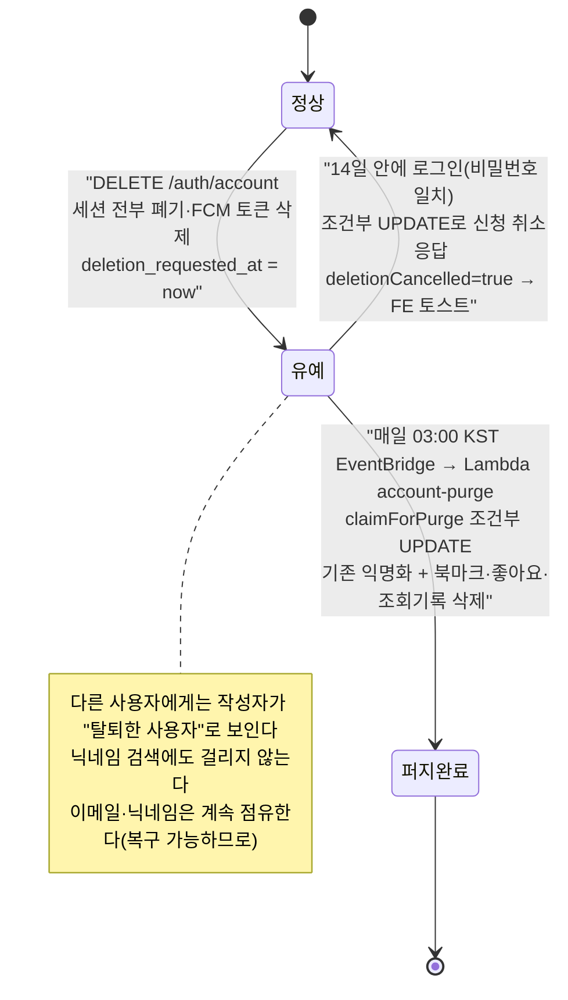
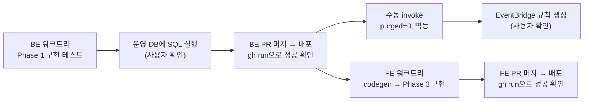

# 회원탈퇴 14일 유예기간 + 로그인 시 자동 복구 (2단계 탈퇴)

> 탈퇴 신청 즉시 익명화하던 것을 "즉시 동결 → 14일 유예 → 매일 예약 작업이 익명화"로 바꾸고,
> 유예 중 로그인하면 자동으로 탈퇴가 취소되게 한다. FE·BE·AWS 인프라 세 곳을 건드린다.

## Context

**지금 상태** — BE `domain/auth/AccountDeletionService.kt`(origin/main, PR #44)가 탈퇴 요청을 받는 즉시
한 트랜잭션에서 다음을 처리한다. 복구 경로는 코드·운영 도구·문서 어디에도 없다.

- 이메일은 `deleted-<id>@deleted.invalid`로, 비밀번호는 매칭 불가능한 난수로 덮어쓴다.
- 닉네임·이미지를 null로, `deletedAt`을 now로 설정한다.
- 세션을 전부 폐기하고, 북마크·좋아요·조회기록·FCM 토큰을 하드삭제한다.

설계 문서(`docs/plans/2026-09-28-auth-hardening.md:99`)에도 유예기간을 검토한 흔적이 없다.

**왜 바꾸나** — 조사한 대형 서비스들은 모두 "정방향(탈퇴 신청) + 역방향(유예 중 복구)" 구조였다.

| 서비스    | 유예기간    | 복구 방법                                         |
| --------- | ----------- | ------------------------------------------------- |
| Discord   | 14일        | 로그인해서 Restore Account                        |
| Instagram | 30일        | 재로그인                                          |
| X         | 30일        | 재로그인                                          |
| GitHub    | 문서상 즉시 | 약 30일 안에 지원팀에 요청하면 복구된 사례가 있음 |

업계에서는 이를 "2단계 삭제"로 부른다. 1단계에서 즉시 세션을 폐기하고 로그인을 막은 뒤, 유예가 끝나면
2단계 예약 작업이 개인정보를 지운다(johal.in "Soft Deletes Without the Rot"). 출처 링크는 대화
답변에 있다.

**의도한 결과** — 다른 사용자에게 보이는 모습은 지금과 똑같다(작성자는 즉시 "탈퇴한 사용자"로 표시).
달라지는 것은 본인이 14일 안에 로그인해 되돌릴 수 있다는 점 하나다.

## 판단이 필요했던 항목

| 항목                  | 결정                                                                                                             | 근거·기각한 대안                                                                                                                                                                                                       |
| --------------------- | ---------------------------------------------------------------------------------------------------------------- | ---------------------------------------------------------------------------------------------------------------------------------------------------------------------------------------------------------------------- |
| 유예기간              | **14일** (사용자 확정)                                                                                           | Discord 선례. 한국 개인정보보호법의 "지체 없이 파기" 원칙과 부딪히는 정도가 가장 작다. 30일(Instagram·X)은 기각.                                                                                                       |
| 복구 방식             | **로그인하면 자동 복구 + 안내 토스트** (사용자 확정)                                                             | Instagram 방식. FE는 토스트만 추가하면 되고, BE를 먼저 배포해도 이전 FE가 깨지지 않는다. Discord식 확인 단계는 기각: 새 에러코드·엔드포인트가 필요하고, FE를 먼저 배포하지 않으면 유예 중 사용자가 로그인 실패만 본다. |
| 유예 중 작성자 표시   | **즉시 "탈퇴한 사용자"로 숨김** (사용자 확정)                                                                    | 외부 동작이 바뀌지 않는다. Instagram·X도 비활성화 기간엔 프로필을 숨긴다. 닉네임 유지는 기각.                                                                                                                          |
| Anonymous 불일치      | **이번에 같이 통일** (사용자 확정)                                                                               | 게시글 카드는 "Anonymous"(`PostCard.tsx:107`), 댓글은 "탈퇴한 사용자"로 서로 다르다. 위 결정으로 바로 이 표시 경로를 건드리게 된다.                                                                                    |
| 개인 데이터 삭제 시점 | 북마크·좋아요·조회기록은 **2단계**, FCM 토큰은 **1단계**                                                         | 복구하면 데이터가 돌아와야 하므로 삭제를 미룬다. FCM 토큰은 유예 중 푸시를 막기 위해 바로 지운다. 로그인에 성공하면 FE가 다시 등록한다(`auth.queries.ts:51-52`).                                                       |
| 상태를 나타내는 방식  | 새 컬럼 `deletion_requested_at` 추가. `deleted_at`은 "퍼지 완료" 의미로 유지                                     | 이미 탈퇴한 기존 계정(`deleted_at`만 있고 `requested`는 null)이 퍼지 대상에 절대 걸리지 않는다. status 컬럼 도입은 기각: 쓰는 곳 전체를 바꿔야 한다.                                                                   |
| 경합 처리             | 조건부 UPDATE 두 개: `cancelDeletionRequest`(로그인), `claimForPurge`(퍼지)                                      | 레포 선례를 따른다(`MemberSessionRepository.kt:27-35`, `MemberActionTokenRepository.consumeIfActive`). 비관적 락은 기각: 레포에 선례가 없다.                                                                           |
| 14일 경계             | **관대하게 처리** — 퍼지 작업이 돌기 전이면(최대 약 24시간) 로그인 복구를 허용한다                               | "14일 안에 로그인하면 복구"라는 약속을 어기는 쪽으로는 절대 틀리지 않는다. 실제 유예는 14~15일이 된다.                                                                                                                 |
| 비밀번호 재설정       | 유예 중에도 허용하고, 퍼지된 계정만 `confirmReset`에서 막는다                                                    | 비밀번호를 잊은 사용자도 "재설정 → 로그인"으로 복구할 수 있다. 막으면 복구할 길이 없어진다.                                                                                                                            |
| 예약 작업             | EventBridge 매일 `cron(0 18 * * ? *)`(03:00 KST) → `:prod` 별칭 Lambda, 입력 `{"linksphereJob":"account-purge"}` | 기존 feed-crawl과 같은 형태(`LambdaHandler.kt:127-144`, BE `docs/DEPLOY.md` 8장). 레포에 IaC가 없다.                                                                                                                   |
| FE 토스트 위치        | `useLoginMutation`의 `useMutation({ onSuccess })` 한 곳                                                          | 로그인 페이지(`useLogin.ts:35`)와 인라인 모달(`useAuth.ts:49`)이 모두 이 훅을 쓴다. 로그인 페이지는 성공 후 navigate하므로 mutation 레벨에 둬야 한다(CLAUDE.md "React Query 라이프사이클").                            |

### 뒤집힌 전제

| 발견                                                                                                                                                          | 그래서 바뀐 것                                                            |
| ------------------------------------------------------------------------------------------------------------------------------------------------------------- | ------------------------------------------------------------------------- |
| auth-hardening 계획 99행은 "비가역이어도 문제없는 범위"로 결정했다                                                                                            | 이 계획이 그 결정을 대체한다. 그 파일은 append-only(§11)라 고치지 않는다. |
| FE `post.dto.ts:13`이 `author.nickname`을 `string`으로 좁히고 "실제로는 null이 안 온다"는 주석을 달았다. 이미 틀린 설명이고, 탈퇴한 작성자는 지금도 null이다. | 좁히기를 없애고 주석을 정정한다.                                          |
| BE `confirmReset`이 퍼지된 계정을 막지 않는다. 퍼지 전에 발급된 재설정 토큰으로 익명화된 행에 알려진 비밀번호를 설정할 수 있다(기존에 있던 구멍).             | 퍼지 경로를 새로 쓰는 김에 가드 한 줄을 넣는다.                           |

### 위험 관리

- **SQL을 먼저 실행해야 한다.** 컬럼이 매핑돼 있어서, SQL 없이 BE를 배포하면 로그인을 포함한 모든 회원 SELECT가 실패한다(`add_member_auth_columns.sql:3-4`의 경고와 같은 상황).
- **EventBridge 규칙은 BE 배포 후 14일 안에 만들어야 한다.** 늦어지면 유예 계정이 숨겨진 채로 남고, 퍼지만 미뤄진다(데이터 손상은 없다).
- **경합 R4는 수용한다**(아래 영향 범위 표).

## 세부 계획

줄 번호는 조사 시점(BE origin/main `e2de1d7`, FE origin/main) 기준이다. 구현할 때 다시 확인한다.
경로는 BE `src/main/kotlin/com/example/linksphere/`, FE `src/` 기준이다.

### Phase 1 — BE (PR 1, BE 레포)

| 위치                                                                     | 변경 내용                                                                                                                                                                                                                                                                                                                                       |
| ------------------------------------------------------------------------ | ----------------------------------------------------------------------------------------------------------------------------------------------------------------------------------------------------------------------------------------------------------------------------------------------------------------------------------------------- |
| `src/main/resources/sql/add_member_deletion_requested_at.sql` (신규)     | `deletion_requested_at TIMESTAMPTZ NULL` 컬럼과 부분 인덱스 `idx_members_deletion_pending (deletion_requested_at) WHERE deletion_requested_at IS NOT NULL AND deleted_at IS NULL`을 추가한다. 헤더에 "배포 전 수동 실행" 경고를 단다.                                                                                                           |
| `domain/member/TableMember.kt:33-36`                                     | `deletionRequestedAt` 필드를 추가한다. 파생 getter `isWithdrawn`, `publicNickname`, `publicImage`를 둔다(공개 표시의 단일 기준). 33-35행의 "로그인 불가" 주석을 정정한다.                                                                                                                                                                       |
| `domain/member/MemberRepository.kt`                                      | 세 메서드를 추가한다. 형태는 `MemberSessionRepository.kt:27-35`를 따르고, nullable 파라미터로 받는다. `findIdsPendingPurge(cutoff, pageable)`, `@Modifying cancelDeletionRequest(id)`, `@Modifying claimForPurge(id, cutoff, now)`.                                                                                                             |
| `domain/member/MemberService.kt`                                         | `cancelPendingDeletion(id): Boolean`을 추가한다. AuthService가 TableMember 필드를 직접 건드리지 않는다는 규칙(90-92행)을 지킨다.                                                                                                                                                                                                                |
| `domain/auth/AccountDeletionService.kt`                                  | `GRACE_PERIOD = 14일` 상수를 둔다. 기존 `deleteAccount`를 `requestDeletion`으로 바꾼다(1단계: 비밀번호 확인, 이미 신청돼 있으면 타임스탬프 유지, 세션 폐기, FCM 삭제). `purge(id, cutoff)`를 새로 만든다(2단계: claim 결과가 0이면 false 반환, 아니면 기존 57-74행의 익명화와 deleteByUserId 연쇄를 실행). KDoc을 다시 쓴다.                    |
| `domain/auth/AccountPurgeService.kt` (신규)                              | `purgeExpired(now)`: cutoff는 now에서 14일을 뺀 값이다. 최대 200건을 가져와 회원별로 `runCatching { purge }`를 돈다. 90초 데드라인을 두고, 요약 로그 한 줄을 남긴다(`FeedCrawlService.kt:32,38` 형태).                                                                                                                                          |
| `domain/auth/AuthService.kt:149-155`                                     | 비밀번호가 일치한 뒤 `cancelPendingDeletion`을 부른다. 취소에 실패했는데 `deletionRequestedAt`이 있으면(퍼지가 먼저 이긴 경우) 실패 기록 없이 `InvalidCredentialsException`을 던진다. 결과는 `AuthResult.deletionCancelled`로 넘긴다.                                                                                                           |
| `domain/auth/AuthDTO.kt:94,96`                                           | `TokenResponse`와 `AuthResult`에 `deletionCancelled: Boolean = false`를 추가한다. refresh와 changePassword는 기본값을 그대로 쓴다.                                                                                                                                                                                                              |
| `domain/auth/AuthController.kt:58-60,68,171-192`                         | 로그인 응답에 필드를 전달한다. 로그인·탈퇴 Swagger 설명에 유예·복구 내용을 넣는다. `requestDeletion`을 호출하고, 응답 메시지를 "Account deletion requested"로 바꾼다.                                                                                                                                                                           |
| `domain/comment/CommentService.kt:84-85,445`                             | `publicNickname ?: DELETED_MEMBER_NICKNAME`과 `publicImage`로 바꾼다.                                                                                                                                                                                                                                                                           |
| `domain/post/PostResponseAssembler.kt:50,117-118`                        | `UserSummary(id, publicNickname, publicImage)`로 바꾼다(피드·검색·북마크가 모두 이 경로를 지난다).                                                                                                                                                                                                                                              |
| `domain/comment/CommentPostProcessService.kt:64`                         | 푸시 문구에 `publicNickname ?: "누군가"`를 쓴다.                                                                                                                                                                                                                                                                                                |
| `domain/post/PostRepositoryImpl.kt:168-173`                              | 닉네임 검색 서브쿼리에 `deletionRequestedAt IS NULL` 조건을 추가한다.                                                                                                                                                                                                                                                                           |
| `domain/auth/PasswordResetService.kt:86-89`                              | `member.deletedAt != null`이면 `InvalidActionTokenException`을 던진다.                                                                                                                                                                                                                                                                          |
| `LambdaHandler.kt:143, 291-297`                                          | `"account-purge"` case와 `handleAccountPurgeJob`을 추가한다(`handleFeedCrawlJob`을 복제한다).                                                                                                                                                                                                                                                   |
| 테스트                                                                   | `AccountDeletionServiceTest`는 request와 purge로 나눈다. `AccountPurgeServiceTest`를 새로 만든다. `AuthServiceTest`에 복구, 일반 로그인, 경합 R1 케이스를 추가한다. 이 밖에 `AuthControllerTest`, `CommentServiceTest`, `PostResponseAssemblerTest`, `CommentPostProcessServiceTest`, `PasswordResetServiceTest`를 갱신한다(JUnit 5 + Mockito). |
| `docs/DEPLOY.md` "### 10. 탈퇴 유예 만료 계정 정리 (EventBridge)" (신규) | 8장(333-399행) 형태를 따른다. SQL 실행, 수동 invoke 검증, put-rule, add-permission, put-targets 순서로 적는다.                                                                                                                                                                                                                                  |
| `CHANGELOG.md` `[Unreleased]`, `README.md:41,161`                        | Changed(유예·복구), Added(account-purge), Fixed(reset 가드), Migration 절을 추가한다. README의 탈퇴 설명을 갱신한다.                                                                                                                                                                                                                            |

### Phase 2 — 인프라 (수동, BE 배포 전후)

1. **BE 배포 전**: 운영 DB에서 SQL을 실행한다. 실행 전에 사용자 확인을 받는다.
2. **BE 배포 후**: `{"linksphereJob":"account-purge"}`로 수동 invoke한다. 요약 로그가 purged=0이고, 두 번 실행해도 결과가 같아야 한다.
3. **EventBridge 규칙 생성**: DEPLOY.md 10장 명령을 그대로 실행한다. 공유 인프라라 실행 직전에 사용자 확인을 받는다.

### Phase 3 — FE (PR 2, FE 레포, BE 운영 배포 후)

| 위치                                                                      | 변경 내용                                                                                                                                       |
| ------------------------------------------------------------------------- | ----------------------------------------------------------------------------------------------------------------------------------------------- |
| `shared/api/generated/openapi.json`, `openapi.gen.ts`                     | `pnpm codegen:fetch && pnpm codegen`으로 `TokenResponse.deletionCancelled`를 반영한다. 운영 스펙에서 가져오므로 BE 배포가 끝난 뒤에만 가능하다. |
| `entities/auth/api/auth.queries.ts:34-56`                                 | `onSuccess`에서 `data.deletionCancelled`가 true면 `toast.success(TEXTS.messages.success.accountDeletionCancelled)`를 띄운다.                    |
| `entities/post/model/post.dto.ts:9-13`                                    | `author.nickname` 좁히기를 없애고(null 허용) 주석을 정정한다.                                                                                   |
| `widgets/post/post-card/ui/PostCard.tsx:102,107`                          | 대체 문구를 `TEXTS.post.card.withdrawnAuthor`로 바꾼다. null이 들어갈 수 있는 곳(Avatar prop)은 `?? undefined`로 맞춘다.                        |
| `entities/account/api/account.api.ts:41-47`, `account.queries.ts:125-128` | "익명화", "탈퇴됨"이라고 적힌 주석을 "탈퇴 신청(14일 유예)"으로 정정한다.                                                                       |
| `mocks/fixtures/auth.fixtures.ts`, `mocks/handlers/auth.handlers.ts`      | 로그인 응답 fixture에 `deletionCancelled: false`를 넣는다.                                                                                      |
| `entities/auth/api/auth.queries.test.ts`                                  | 두 케이스를 추가한다: `deletionCancelled: true`면 성공 토스트가 뜨고, false면 뜨지 않는다.                                                      |
| `CHANGELOG.md` `[Unreleased]`, `docs/AUTH.md` §8-E                        | 로그인 성공 시 복구 토스트를 한 줄로 설명하고, 마지막 검토 날짜를 갱신한다.                                                                     |

`texts.ts` 문구 변경은 해요체이고, 14는 상수 하나로 보간하며 BE `GRACE_PERIOD`와 짝이라는 주석을 단다:

| 키                                                 | 변경 전                                                                                                                         | 변경 후                                                                                                                                                                                         |
| -------------------------------------------------- | ------------------------------------------------------------------------------------------------------------------------------- | ----------------------------------------------------------------------------------------------------------------------------------------------------------------------------------------------- |
| `mypage…deleteSectionDescription` (181)            | 탈퇴하면 북마크·좋아요·조회 기록이 삭제되고, 작성한 글과 댓글은 "탈퇴한 사용자"로 표시된 채 남아요. 이 작업은 되돌릴 수 없어요. | 탈퇴를 신청하면 바로 로그아웃되고, 작성한 글과 댓글은 "탈퇴한 사용자"로 표시돼요. 14일 안에 다시 로그인하면 탈퇴가 취소돼요. 14일이 지나면 북마크·좋아요·조회 기록이 삭제되고 되돌릴 수 없어요. |
| `…deleteConfirmMessage` (184)                      | 정말 탈퇴하시겠어요? 이 작업은 되돌릴 수 없어요.                                                                                | 정말 탈퇴하시겠어요? 14일 안에 다시 로그인하면 취소할 수 있어요.                                                                                                                                |
| `messages.success.accountDeleted` (429)            | 계정을 삭제했어요.                                                                                                              | 탈퇴를 신청했어요. 14일 안에 다시 로그인하면 취소돼요.                                                                                                                                          |
| `messages.success.accountDeletionCancelled` (신규) | —                                                                                                                               | 탈퇴 신청이 취소됐어요. 다시 오신 걸 환영해요.                                                                                                                                                  |
| `post.card.anonymous` → `withdrawnAuthor` (244)    | Anonymous                                                                                                                       | 탈퇴한 사용자                                                                                                                                                                                   |

### 실행 순서

**BE 배포와 FE 배포 사이의 공백** — 이전 FE는 새 필드를 무시하므로 깨지는 것은 없다. 두 가지만 임시로 어긋난다.

- 탈퇴 문구가 여전히 "되돌릴 수 없어요"라고 말한다(실제보다 과하게 경고하는 쪽이라 해롭지 않다).
- 로그인으로 복구돼도 토스트가 뜨지 않는다.

**워크트리** — FE는 `EnterWorktree`로 만든다. BE는 `git -C ../link-sphere_BE_NEW worktree add`로 origin/main을 기준으로 만든다(로컬 main은 뒤처져 있다). 이 계획 파일은 두 레포 각각의 `docs/plans/2026-09-29-account-deletion-grace-period.md`로 각 PR에 커밋한다(§11).

## 영향 범위 (§5)

**CRUD 실패 지점**

| 단계                  | 무엇이 깨질 수 있나                                                         | 대응                                                                                                                          |
| --------------------- | --------------------------------------------------------------------------- | ----------------------------------------------------------------------------------------------------------------------------- |
| Create (탈퇴 신청)    | 다시 신청하면 유예가 연장될 수 있다                                         | 이미 신청돼 있으면 타임스탬프를 유지한다. 세션이 폐기되므로 사실상 다시 호출할 수도 없다.                                     |
| Read (남이 보는 화면) | 작성자 노출, 닉네임 검색, 푸시 문구                                         | Phase 1의 `publicNickname`·`publicImage` 적용 지점과 검색 조건. 유예 회원의 **좋아요 수는 퍼지 전까지 남는다**(남은 것 참고). |
| Read (본인)           | `GET /auth/account`                                                         | 유예 중엔 세션이 없어서 해당 사항이 없다.                                                                                     |
| Update (복구)         | 퍼지와 동시에 실행될 때                                                     | 아래 경합 표 참고.                                                                                                            |
| Delete (퍼지)         | 한 명이 실패하면 전체가 멈출 수 있다 / 기존 탈퇴 계정을 다시 처리할 수 있다 | 회원별로 트랜잭션을 나누고 `runCatching`으로 감싼다. `deleted_at IS NULL` 조건으로 기존 탈퇴 계정은 제외한다.                 |
| 가입                  | 유예 중 같은 이메일·닉네임으로 가입                                         | 409 또는 "사용 중"이 나온다(의도한 동작: 로그인하면 복구된다).                                                                |

**경합**

| #   | 순서                                                      | 결과                                                                                                 |
| --- | --------------------------------------------------------- | ---------------------------------------------------------------------------------------------------- |
| R1  | 퍼지가 claim한 뒤 로그인                                  | 로그인의 cancel UPDATE가 0건이다. 실패 기록 없이 `InvalidCredentials`를 던지고 세션은 만들지 않는다. |
| R2  | 로그인이 cancel한 뒤 퍼지 claim                           | claim이 0건이라 그 회원은 건너뛴다.                                                                  |
| R3  | 퍼지 목록을 뽑은 뒤 그 회원이 복구됨                      | claim의 WHERE를 다시 평가하므로 건너뛴다.                                                            |
| R4  | 기기 A의 탈퇴 신청과 기기 B의 로그인이 밀리초 단위로 겹침 | B에 세션이 남을 수 있다. **수용한다**: 확률이 극히 낮고, 퍼지할 때 세션을 다시 폐기한다.             |
| R5  | 퍼지 후, 그 전에 발급된 재설정 토큰으로 `confirmReset`    | 새 가드가 막는다.                                                                                    |

**기존 기능 회귀**

- **BE 테스트**: `AccountDeletionServiceTest`(70, 85-110행)가 즉시 익명화를 단정한다. `AuthControllerTest`(276, 293행)는 `deleteAccount`를 호출하는 것을 기준으로 한다.
- **FE**: 탈퇴 관련 테스트(`useDeleteAccount.test.tsx`)는 요청 body만 확인하므로 영향이 없다.
- **FE `openapi-drift-check.yml`**: BE 배포 후 FE가 코드를 재생성하기 전까지 이슈가 열릴 수 있다. 예상된 동작이다.
- **문서**: CHANGELOG의 과거 탈퇴 항목(BE 61-84행, FE 25-28행)은 기록이라 그대로 둔다.

## 검증 방법

**BE**

- `./gradlew test`와 ktlint 전체를 통과시킨다.
- 추가 테스트로 경합 R1·R2를 검증한다: repository mock이 0을 반환할 때 분기가 맞는지 본다.
- 운영 수동 invoke 결과가 purged=0이고 멱등이어야 한다.

**FE**

- `pnpm type-check` → `pnpm test` → `pnpm lint` → `pnpm check:docs` 순서로 실행한다.

**운영 e2e** (사용자 확인 후 테스트 계정으로 진행)

1. 가입하고 글·댓글을 하나씩 쓴다.
2. 탈퇴를 신청한다. 새 문구와 토스트, 강제 로그아웃을 확인한다.
3. 다른 브라우저에서 작성자가 "탈퇴한 사용자"로 보이는지, 닉네임 검색에 걸리지 않는지 확인한다.
4. 다시 로그인한다. "탈퇴 신청이 취소됐어요" 토스트가 뜨고, 원래 닉네임이 돌아와야 한다.
5. (선택) DB에서 그 계정의 `deletion_requested_at`을 15일 전으로 바꾸고 invoke한다. 익명화되고 로그인이 불가능해지는지 확인한다.

- 이 과정을 `browser-verification` skill로 녹화한다.

**계획 대비 구현** — PR을 열기 전에 fresh Explore 서브에이전트에게 커밋한 계획 파일과 diff를 대조시킨다. 결과는 PR 본문 `## 계획 대비 구현`에 남긴다(§11).

## 남은 것

- **법무 판단**: 유예기간 동안 개인정보를 보관한다는 사실을 알리는 곳이 탈퇴 화면 문구와 확인 창뿐이다(개인정보처리방침 페이지가 없다). 이 고지로 충분한지는 사용자가 판단해야 한다.
- **유예 중 좋아요 수**: 유예 회원의 좋아요가 퍼지 전까지 다른 글의 좋아요 수에 남는다. 필요하면 후속 작업으로 뺀다.
- **14 값의 중복**: 이 값이 FE 문구와 BE `GRACE_PERIOD` 양쪽에 따로 있다. 주석으로 짝을 표시하는 것 외에 자동으로 동기화하는 장치는 없다.
- **경합 R4**: 수용했다.
