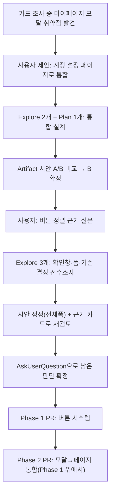
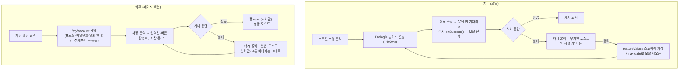

# 사이트 전체 버튼 규칙 재정립 + "프로필 수정" 모달을 "계정 설정" 페이지로 통합

> 요약: 모달 열린 직후 클릭 가드 조사 중 "마이페이지 모달"이 비동기로 열려 가드가 사실상
> 무력화된다는 걸 발견했다. 사용자가 이 모달을 이미 있는 `/my/account`(계정 설정) 페이지로
> 합치자고 제안했고, 그 레이아웃을 Artifact로 검토하는 과정에서 버튼 정렬·문구·강조 스타일을
> 사이트 전체 차원에서 재정립하자는 요청으로 범위가 넓어졌다. 두 작업을 한 계획으로 묶되
> **PR/커밋은 분리**한다 — 버튼 시스템(Phase 1)이 먼저 머지되고, 그 위에 모달 통합(Phase 2)이
> 올라간다.

## 0. 현재 상황

1. [dialog-open-click-guard 계획](2026-09-29-dialog-open-click-guard.md)을 구현·머지한 뒤,
   같은 가드를 마이페이지 모달에 적용해보니 `useHistoryOverlay`(비동기 `navigate()`) 때문에
   가드의 400ms 창이 모달이 실제로 클릭 가능해지는 시점과 거의 동시에 소진된다는 걸
   실측으로 확인했다. 파괴적 동작은 없어 위험도는 낮음.
2. 사용자가 "계정 설정 페이지도 새로 만들어졌는데 여기서 다 관리하는 게 어떨까"라고 제안 →
   조사 결과 이 제안이 근본적으로 더 낫다는 걸 확인(§1). Plan agent로 설계 검증까지 마침.
3. Artifact로 레이아웃 시안을 만들어 검토받는 과정에서 사용자가 버튼 정렬 근거를 물었고,
   실제로 "왼쪽 정렬"은 근거 있는 선택이 아니라 우연(감싸는 div가 없어서 생긴 기본값)이었음을
   확인. 이 계기로 사용자가 **사이트 전체 버튼 정렬·문구·강조 규칙 재정립**을 요청.
4. Explore 에이전트 3개로 전수조사: ① 모든 확인창(Alert/Confirm) 버튼, ② 모든 페이지 폼
   제출 버튼, ③ 기존에 이미 문서화된 버튼 관련 결정. 결과를 Artifact에 반영해 사용자와
   함께 확인·확정함(시안: [계정 설정 시안 v2](https://claude.ai/artifact/3mTbdiqcaYtyBKrfZ4Qp4w)).



## 1. 전체 계획

**Phase 1(버튼 시스템)이 Phase 2(모달 통합)보다 먼저 머지된다** — Phase 2에서 새로 만드는
프로필 섹션 버튼을 처음부터 Phase 1의 규칙대로 만들기 위해서다(순서를 바꾸면 프로필 섹션을
두 번 고쳐야 한다). Phase 1은 다시 4개 커밋으로 나눈다(단일 PR, 커밋만 분리 — 서로 파일이
겹치지 않아 순서 안 지켜도 되지만 리뷰 편의상 이 순서를 권장).

| Phase | 커밋                                                         | 내용                                                                                                               |
| ----- | ------------------------------------------------------------ | ------------------------------------------------------------------------------------------------------------------ |
| 1-a   | `fix(shared): 단일 버튼 폼 정렬·높이를 전체폭 채움으로 통일` | `ChangePasswordForm`·`DeleteAccountSection` 버튼을 다수 패턴(전체폭·h-11)에 맞춤 + 저장 중 라벨 스왑 누락 3곳 보완 |
| 1-b   | `fix(post): 공개 설정 확인창 버튼 문구를 결과가 보이게 변경` | "나만 보기" 확인창의 "확인"을 "나만 보기로 전환"/"전체 공개로 전환"으로                                            |
| 1-c   | `fix(auth): 탈퇴 관련 문구를 "회원 탈퇴"로 통일`             | `TEXTS.accountSettings.deleteSubmit` "계정 탈퇴" → "회원 탈퇴"                                                     |
| 1-d   | `docs(shared): 버튼 배치·정렬 컨벤션 문서화`                 | 코드 변경 없음. `FE-ARCHITECTURE.md`에 컨벤션 절 추가, `UNSAVED-CHANGES-GUARD.md`의 낡은 서술 정정                 |
| 2     | (별도 PR)                                                    | "프로필 수정" 모달 → `/my/account` 페이지 섹션 통합(§3 Phase 2)                                                    |

## 2. 판단이 필요했던 항목

**이미 문서로 정해져 있어 이번에 안 건드리는 것** — 확인창(Alert/Confirm)의 강조 버튼이
채움+오른쪽+초기 포커스를 받는 규칙은 `emphasis` prop으로 호출부마다 정하도록 2026-09-29에
세 커밋에 걸쳐 이미 확정됐다(`docs/FE-ARCHITECTURE.md` §10 표 참고). 삭제 확인창에도 빨간색을
일부러 안 쓴다(Apple HIG — "사용자가 메뉴에서 직접 고른 위험한 행동엔 destructive 스타일을
주지 않는다"). 이번 작업은 이 두 규칙 **밖의 빈틈**만 채운다.

| #   | 항목                                           | 결정                                                                                     | 근거·기각한 대안                                                                                                                                                                                                                                                                                        |
| --- | ---------------------------------------------- | ---------------------------------------------------------------------------------------- | ------------------------------------------------------------------------------------------------------------------------------------------------------------------------------------------------------------------------------------------------------------------------------------------------------- |
| 1   | 단일 버튼 폼의 정렬·폭                         | **전체폭 채움**(h-11) — **사용자 확인, 2026-09-29**                                      | 실측: 단일 제출 버튼 9곳 중 7곳(로그인·회원가입·비밀번호 찾기/재설정·게시글 작성/수정·프로필 수정)이 이미 전체폭. `ChangePasswordForm`·`DeleteAccountSection`의 왼쪽 정렬은 감싸는 div가 없어 생긴 사고였지 선례가 아니었음(정정 전엔 이 사고를 "왼쪽 정렬이 근거 있다"고 잘못 추천했었음)              |
| 2   | 버튼 2개(취소+확정)짜리 인라인 폼의 정렬       | 기존 패턴 유지(ghost 취소 왼쪽, 채움 확정 오른쪽, `justify-end`) — 문서화만              | 댓글 작성/수정, 새 폴더 만들기(데스크톱/모바일) 4곳 모두 예외 없이 이미 이 패턴. 바꿀 이유 없음, 안 적혀 있던 걸 적기만 함                                                                                                                                                                              |
| 3   | "나만 보기" 확인창 버튼 문구                   | "확인" → **"나만 보기로 전환"/"전체 공개로 전환"**(메시지의 `action` 변수 재사용)        | 버튼만 보고도 결과를 알 수 있어야 한다는 원칙(NN/g 등). 삭제류는 이미 "삭제"라 안 건드림                                                                                                                                                                                                                |
| 4   | 탈퇴 용어                                      | **"회원 탈퇴"로 통일**                                                                   | 외부 표준은 없음(네이버 "회원탈퇴" vs 카카오 "계정 탈퇴" — 실측 확인, 업계가 안 갈렸다는 주장은 틀렸었음). 대신 **내부 일관성**으로 판단: "회원 탈퇴"가 섹션 제목·CHANGELOG·AUTH.md·코드 주석·스키마 등 15곳 이상에 이미 쓰이고, "계정 탈퇴"는 버튼 문구(`TEXTS.accountSettings.deleteSubmit`) 단 1곳뿐 |
| 5   | 저장 중 버튼 라벨                              | 항상 "OO 중..."으로 스왑                                                                 | 로그인·회원가입·비밀번호·댓글 폼은 이미 이렇게 하는데 프로필 수정·게시글 작성/수정만 라벨이 안 바뀌고 비활성화만 됨(피드백 부족). 통일                                                                                                                                                                  |
| 6   | 버튼 높이(h-9 vs h-11)                         | **h-11로 통일**(로그인·게시글 폼과 동일) — **사용자 확인, 2026-09-29**                   | 사이트 전체에서 "설정 폼만 더 조밀하게" 둘 근거가 딱히 없었음 — 일관성 우선                                                                                                                                                                                                                             |
| 7   | 아바타 옆 닉네임 표시 줄(프로필 섹션, Phase 2) | **유지** — **사용자 확인, 2026-09-29**                                                   | 입력칸과 중복 표시지만, "지금 누구로 로그인했는지" 한눈에 보이는 장점이 더 크다고 판단                                                                                                                                                                                                                  |
| 8   | 프로필 저장 시 UX(Phase 2)                     | 응답 대기 → 성공 시 폼 정리, 실패해도 입력값 유지 — **사용자 확인(이전 턴), 2026-09-29** | §3 Phase 2 세부 참고. "다시 열기" 장치 전체 제거                                                                                                                                                                                                                                                        |

## 3. 세부 계획

### Phase 1 — 버튼 시스템

#### 코드

| 위치                                                                                               | 변경 내용                                                                                                                                                                                                                                                                                 |
| -------------------------------------------------------------------------------------------------- | ----------------------------------------------------------------------------------------------------------------------------------------------------------------------------------------------------------------------------------------------------------------------------------------- |
| `src/features/auth/password-change/ui/ChangePasswordForm.tsx`                                      | 제출 `Button`에 `className="w-full h-11"` 추가(현재 클래스 없음 → 왼쪽·기본높이였던 것)                                                                                                                                                                                                   |
| `src/features/account/delete/ui/DeleteAccountSection.tsx`                                          | 제출 `Button`(`variant="destructive"` 유지)에 `className="w-full h-11"` 추가                                                                                                                                                                                                              |
| `src/widgets/post/post-card/hooks/usePostCard.ts`                                                  | 공개 설정 `openConfirm` 호출의 `confirmText`를 메시지의 `action` 변수를 재사용한 짧은 동적 문구로 교체(예: `` `${actionShort} 전환` ``). `action`(메시지용, "전체 공개로"/"나만 보기(비공개)로")과 별개로 버튼용 짧은 변수(괄호 설명 없이 "전체 공개로 전환"/"나만 보기로 전환")를 만든다 |
| `src/shared/config/texts.ts`                                                                       | `accountSettings.deleteSubmit`: "계정 탈퇴" → "회원 탈퇴". `post.card.*`에 나만보기 전환 버튼 문구 키 추가. 게시글 작성/수정·프로필 수정의 "저장 중..." 계열 키 추가(없으면 신설)                                                                                                         |
| `src/features/post/create/ui/CreatePostForm.tsx`, `src/features/post/update/ui/UpdatePostForm.tsx` | 제출 버튼에 `isPending`일 때 라벨을 "공유 중..."/"수정 중..."으로 스왑(현재는 비활성화만 됨)                                                                                                                                                                                              |
| `src/features/account/update/ui/UpdateAccountForm.tsx`                                             | (Phase 2에서 새로 손보는 파일이지만) 저장 버튼에 `h-11` 적용 + 저장 중 라벨 스왑을 여기서 함께 넣어도 되고, Phase 2로 미뤄도 된다 — Phase 2 구현 시점에 실제 파일 상태 보고 합치는 커밋 판단                                                                                              |

#### 테스트

| 위치                                                             | 변경 내용                                                                                                      |
| ---------------------------------------------------------------- | -------------------------------------------------------------------------------------------------------------- |
| `e2e/post-visibility.spec.ts`                                    | `TEXTS.buttons.confirm`("확인") 대신 새 동적 문구로 버튼을 찾도록 셀렉터 갱신                                  |
| `e2e/account-update.spec.ts`(구 모달용, Phase 2에서 재작성 예정) | "계정 탈퇴" 문자열을 참조하는 곳이 있으면 "회원 탈퇴"로 갱신(Phase 2 작업에 포함해도 됨)                       |
| 관련 컴포넌트 테스트                                             | `ChangePasswordForm`/`DeleteAccountSection`/`CreatePostForm`/`UpdatePostForm` 스냅샷·텍스트 단언이 있다면 갱신 |

#### 문서

| 위치                                    | 변경 내용                                                                                                                                                                                                                                                                                                                          |
| --------------------------------------- | ---------------------------------------------------------------------------------------------------------------------------------------------------------------------------------------------------------------------------------------------------------------------------------------------------------------------------------- |
| `docs/FE-ARCHITECTURE.md`               | §10 "Delete with Confirm 패턴" 근처에 새 절 "버튼 배치·정렬 컨벤션" 추가: (a) 단일 제출 버튼 = 전체폭 채움 h-11, (b) 2버튼(취소+확정) 인라인 폼 = ghost 취소 왼쪽·채움 확정 오른쪽·`justify-end`, (c) 저장 중엔 라벨을 "OO 중..."으로 스왑. 기존 §10 표(확인창 emphasis 규칙)는 그대로 두고 "이 절과 범위가 다르다"고 한 줄로 구분 |
| `docs/UNSAVED-CHANGES-GUARD.md:135-140` | "모든 confirm 공통 규칙(취소=채움·오른쪽…)"이라는 낡은 서술을 "확인창은 호출부마다 `emphasis`로 정한다(FE-ARCHITECTURE.md §10 참고), 이 가드는 기본값(`'cancel'`)을 쓴다"로 정정                                                                                                                                                   |
| `docs/DECISIONS.md`                     | 새 항목 추가(append-only, 2026-09-29 날짜): 배경(버튼 정렬·폭·문구가 사이트 전체에서 안 맞았음, 실측 결과) → 결정(전체폭 h-11 통일, 탈퇴 용어 통일, 나만보기 문구 동적화) → 근거(§2 표 요약)                                                                                                                                       |
| `CHANGELOG.md`                          | `[Unreleased]` → `### Changed`에 `shared` 스코프로 한 줄 요약 + 상세 블록                                                                                                                                                                                                                                                          |

### Phase 2 — "프로필 수정" 모달을 "계정 설정" 페이지로 통합

(Phase 1이 머지된 뒤 그 위에서 진행. 버튼 스타일은 Phase 1에서 이미 정해진 규칙(전체폭·h-11·저장중 라벨)을 그대로 따른다.)

**핵심 변경**: 모달을 전제로 했던 "즉시 닫힘(낙관적) + 실패 시 재오픈" 장치를 전부 제거한다.
이 장치(`useMyPageModalStore.restoreValues`, "다시 열기" 토스트 액션)는 오직 "모달이 응답
전에 이미 닫혀버린다"는 문제 때문에 존재했다. 페이지 섹션이 되면 화면을 안 떠나므로
"재오픈"이라는 개념 자체가 없어진다. 저장은 응답을 기다렸다가 반영하는 방식으로 바뀐다
(**사용자 확인 완료**) — 실패해도 입력했던 닉네임·고른 이미지가 화면에 그대로 남아 바로
재시도 가능.



#### 코드

| 위치                                                    | 변경 내용                                                                                                                                                                                                                                                                             |
| ------------------------------------------------------- | ------------------------------------------------------------------------------------------------------------------------------------------------------------------------------------------------------------------------------------------------------------------------------------- |
| `src/widgets/layout/navbar/ui/Navbar.tsx`               | `MyPageModal` import(`:24`)·`useMyPageModalStore` import(`:27`)·`setMyPageRestoreValues`+`useHistoryOverlay('myPageOpen')`(`:39-44`)·"프로필 수정" `DropdownMenuItem`(`:186-193`)·모달 마운트(`:230-233`) 제거. `useHistoryOverlay` import 자체는 sidebar·로그인모달이 계속 써서 유지 |
| `src/widgets/layout/mypage/`                            | 디렉터리 전체 삭제(`MyPageModal.tsx`)                                                                                                                                                                                                                                                 |
| `src/shared/store/mypage.store.ts`                      | 삭제                                                                                                                                                                                                                                                                                  |
| `src/pages/myaccount/MyAccountPage.tsx`                 | 배너와 비밀번호 섹션 사이에 프로필 섹션 추가: `<h2 className="text-subsection-title">{TEXTS.mypage.title}</h2>` + 설명 문구 + `<UpdateAccountForm />` + `<Divider/>`                                                                                                                  |
| `src/features/account/update/ui/UpdateAccountForm.tsx`  | `onSuccess` prop 제거. `FormInput`에 `disabled={isPending}` 추가. 아바타 클릭 핸들러에 pending 가드. 버튼을 Phase 1 규칙대로 `w-full h-11` + 저장 중 라벨 스왑. 아바타 옆에 닉네임 표시 줄 추가(판단표 #7, 시안 그대로)                                                               |
| `src/features/account/update/hooks/useUpdateAccount.ts` | `onSuccess` 파라미터·`useMyPageModalStore` import 제거. "매 `account` 변경마다 reset"하던 effect를 ref 가드 1회 하이드레이션으로 교체. `onSubmit`을 아래 스케치대로 재작성                                                                                                            |
| `src/entities/account/api/account.queries.ts`           | `useMyPageModalStore` import 제거. `onError`를 롤백 + `toast.error(message)`(기존 `resolveAccountUpdateErrorMessage` 그대로, `id: 'profile-update-error'` dedupe만 유지)로 축소. `NavigationService` import는 다른 사용처 없으면 같이 제거                                            |
| `src/shared/config/texts.ts`                            | `mypage.reopen`, `buttons.profileEdit`(및 이미 죽어있는 `ariaLabels.profileEdit`) 제거. `:96` 주석의 "마이페이지" 표현 정정                                                                                                                                                           |

**`useUpdateAccount.ts`의 `onSubmit` 재작성 스케치**:

```ts
const hydratedRef = useRef(account !== undefined);
useEffect(
  function hydrateFormOnce() {
    if (account && !hydratedRef.current) {
      hydratedRef.current = true;
      reset({ nickname: account.nickname ?? '', image: account.image });
    }
  },
  [account, reset]
);

const onSubmit = form.handleSubmit((formData) => {
  const previewUrl = pendingFile ? (objectUrlRef.current ?? undefined) : undefined;
  updateAccount(
    {
      nickname: formData.nickname,
      image: formData.image ?? undefined,
      file: pendingFile ?? undefined,
      previewUrl,
    },
    {
      onSuccess: (data) => {
        submittedObjectUrlRef.current = previewUrl ?? null; // mutation onSuccess가 revoke
        setPendingFile(null);
        reset({ nickname: data.nickname ?? '', image: data.image });
      },
      onError: () => {
        // 아무것도 안 건드린다 — 닉네임·pendingFile·avatarPreview 그대로 유지돼 바로 재시도 가능
      },
    }
  );
});
```

`pendingFile`은 **제출 직후가 아니라 성공 콜백에서만** 클리어한다 — 실패 시 고른 이미지가
사라지지 않게 하기 위함(예전 "다시 열기"가 File 객체까지 복원해주던 것의 대체).

#### 테스트

| 위치                                                          | 변경 내용                                                                                                                                                                                                                                                                                                        |
| ------------------------------------------------------------- | ---------------------------------------------------------------------------------------------------------------------------------------------------------------------------------------------------------------------------------------------------------------------------------------------------------------- |
| `src/features/account/update/hooks/useUpdateAccount.test.tsx` | 스토어 import·`beforeEach`의 `restoreValues` 리셋 제거. "onSuccess가 즉시 호출된다" 단언 제거. 새 케이스: (a) pending 중 입력값 유지 (b) 성공 시 dirty 해제+서버값 반영 (c) **409 + 이미지 선택 상태에서 롤백 후에도 닉네임·`avatarPreview` 그대로**(핵심 회귀 테스트) (d) 계정 늦게 도착해도 하이드레이션 1회만 |
| `e2e/account-update.spec.ts`                                  | 헬퍼를 "계정 설정" 메뉴 클릭 → `/my/account` 진입으로 변경. 테스트1(409 롤백)은 "모달이 숨겨진다" 대신 "입력칸·버튼이 비활성화됐다가 롤백 후 값 유지"로. 테스트2("다시 열기")는 "롤백 후 같은 화면에서 재시도 → 성공"으로 교체                                                                                   |

#### 문서

| 위치                                                                                 | 변경 내용                                                                                                                                                                                                                                                                       |
| ------------------------------------------------------------------------------------ | ------------------------------------------------------------------------------------------------------------------------------------------------------------------------------------------------------------------------------------------------------------------------------- |
| `docs/MYPAGE.md`                                                                     | 제목을 "프로필 수정(계정 설정 화면 섹션)"으로, 마지막 검토일 갱신. §1 다이어그램에서 "모달 닫힘·무기한 토스트·재오픈" 제거하고 "입력값 유지→바로 재시도"로. §3에서 Zustand 항목 제거. §5 코드 지도 갱신. §6 용어 사전에서 `restoreValues` 제거. §12(이탈 가드 미적용 이유) 정정 |
| `docs/FE-ARCHITECTURE.md`                                                            | `:171` 트리 항목, `:173-174` LoginModal 주석의 "MyPageModal" 언급, `:266` 스토어 목록의 `mypage`, `:311` 위젯 표 행 제거                                                                                                                                                        |
| `docs/DECISIONS.md`                                                                  | 새 항목(append-only): 배경(진입점 2개, 모달이라 재오픈 장치 필요) → 결정(페이지 섹션화, 응답 대기 방식) → 이유. 기존 `:3556`·`:3561-3563` 항목은 "superseded"로만 표시                                                                                                          |
| `docs/TESTING.md:679`, `README.md:177`, `docs/SEARCH.md:353`, `docs/BOOKMARK.md:178` | 마이페이지 모달 관련 서술 갱신/제거                                                                                                                                                                                                                                             |
| `CHANGELOG.md`                                                                       | `[Unreleased]` → `### Changed`에 `account` 스코프로 항목 추가                                                                                                                                                                                                                   |

## 4. 영향 범위

**CRUD**: 데이터 계약 변경 없음. Phase 1은 UI 표면(문구·정렬·크기)만 바꾼다. Phase 2도 같은
`GET/PATCH /auth/account` 엔티티 그대로, 네비바 낙관적 반영도 동일.

**기존 기능 회귀 후보**

- Phase 1: `e2e/post-visibility.spec.ts`가 "확인" 버튼 텍스트로 셀렉터를 잡고 있다면 깨짐 →
  갱신 필요. `ChangePasswordForm`/`DeleteAccountSection`의 버튼이 커지면서 페이지 레이아웃
  높이가 미세하게 바뀜(스크롤 위치 등에 영향 없는 수준으로 예상, browser-verification으로 확인).
- Phase 2: `Navbar.test.tsx`엔 프로필 수정 관련 단언 없음(확인됨) — 영향 없음.
  `guest-guard.spec.ts`/`protected-nav.spec.ts`/`unsaved-changes.spec.ts` 등 `useHistoryOverlay`를
  쓰는 다른 오버레이(로그인 모달, 사이드바 드로어)는 `myPageOpen` 키 제거와 독립적이라
  영향 없어야 하지만 `pnpm test:e2e` 전체로 확인.
- 아바타 이미지 피커의 키보드 접근성 부재(`role="button"`에 `tabIndex` 없음)는 기존부터 있던
  문제 — 페이지로 옮기며 더 눈에 띄게 되므로 같은 김에 실제 `<button type="button">`으로 고친다.
- 실패 후 페이지를 떠나면 blob URL이 revoke 안 되는 leak — 기존에도 "다시 열기"를 무시하면
  같은 leak이 있었으므로 새로 생기는 문제 아님(수용).

## 5. 검증 방법

**Phase 1**

1. `pnpm type-check` → `pnpm test` → `pnpm lint` → `pnpm check:docs`
2. `pnpm test:e2e` 전체 — 특히 `post-visibility.spec.ts`
3. `browser-verification`: 계정 설정 페이지 버튼 3개가 전체폭·같은 높이로 보이는지, "나만 보기"
   확인창 버튼 문구가 바뀌었는지, 게시글 작성/수정 중 라벨이 "OO 중..."으로 바뀌는지

**Phase 2**

1. `pnpm type-check` → `pnpm test`(신규 케이스 포함) → `pnpm lint` → `pnpm check:docs`
2. `git grep -nE "myPageOpen|useMyPageModalStore|MyPageModal|mypage\.store|mypage\.reopen|buttons\.profileEdit" -- src e2e README.md docs/*.md`가
   (append-only `docs/DECISIONS.md` 과거 항목 제외) 아무것도 안 나와야 함
3. `pnpm test:e2e` 전체 — 특히 `account-update.spec.ts`(재작성분)와 회귀 확인
4. `browser-verification`: 드롭다운에 "프로필 수정" 없이 "내 댓글/계정 설정/로그아웃"만 있는지 →
   "계정 설정" 클릭 → 프로필 섹션이 비밀번호 위에 있고 Phase 1 버튼 규칙(전체폭·h-11)을
   따르는지 → Slow 3G에서 저장 → 실패 강제 → 입력값·이미지 미리보기 유지 확인
5. §11: PR 전에 fresh Explore subagent로 이 계획과 실제 diff 대조 → PR 본문에 `## 계획 대비 구현`

## 6. 남은 것

- `TEXTS.mypage.*` → `TEXTS.accountSettings.profile*` 네임스페이스 정리는 범위 밖(선택적 후속)
- 409 인라인 에러(토스트와 별개로 닉네임 필드 아래 표시)는 e2e strict-mode 충돌 때문에 보류
- Storybook의 `Alert.stories.tsx:132` 예시가 옛 "~습니다" 톤을 아직 쓰고 있음 — 이번 범위 밖,
  발견만 해둠
- `docs/plans/2026-09-29-confirm-dialog-emphasis.md`는 초기 스냅샷이라 최종 설계와 다른 부분이
  있음(append-only라 안 고침) — 최신 규칙은 이 문서와 `FE-ARCHITECTURE.md` §10을 따를 것
