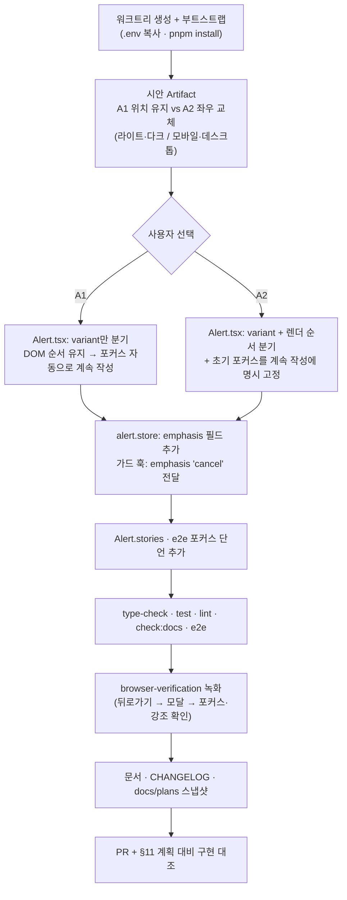

# 이탈 확인창 — "계속 작성"에 primary 강조 옮기기

> 저장하지 않은 내용이 있을 때 뜨는 이탈 확인창에서, 채움 강조(검정 primary)를
> "나가기"에서 "계속 작성/계속 가입하기"로 옮긴다. 다른 confirm 5곳은 그대로 둔다.

## Context

**왜**: 지금 가드 모달은 "나가기"가 검정 채움(primary)이고 "계속 작성"이 outline이다.
이 가드가 주로 막는 건 실수로 한 뒤로가기(모바일 엣지 스와이프, 마우스 뒤로 버튼)다.
그런데 그 상황에서 반사적으로 눌리는 강조 버튼이 데이터가 사라지는 쪽에 있다.

**현재 코드 (확인한 사실)**

- [Alert.tsx:95-108](src/shared/ui/elements/modal/alert/Alert.tsx#L95-L108): cancel은
  `variant="outline"`(왼쪽), confirm은 기본 variant(오른쪽)로 하드코딩돼 있다. 모든
  `openConfirm` 호출이 같은 모양이다.
- [alert.store.ts:5-21](src/shared/ui/elements/modal/alert/alert.store.ts#L5-L21):
  `AlertData`와 `OpenConfirmOptions`에는 강조나 variant를 지정할 필드가 없다.
- [useUnsavedChangesGuard.ts:57-86](src/shared/hooks/useUnsavedChangesGuard.ts#L57-L86):
  가드는 `openConfirm({ confirmText: '나가기', cancelText: '계속 작성' | '계속 가입하기', ... })`로 부른다.
- 색 토큰 ([globals.css](src/app/globals.css)):
  - `--primary`는 라이트 모드 `oklch(0.205 0 0)`(검정, :219), 다크 모드 `oklch(0.922 0 0)`(:303)이다.
  - 빨강은 `--destructive`(:233)로 별도 토큰이다.
  - 사용자 요청대로 빨강은 쓰지 않고 기존 검정 primary만 쓴다.
- 포커스(추정, 브라우저 미확인):
  - [dialog.tsx](src/shared/ui/atoms/dialog.tsx)의 X 닫기 버튼은 children 뒤에 렌더된다.
  - 그래서 Radix가 여는 순간 첫 포커스를 "계속 작성"에 준다고 본다.
  - 이게 맞다면 지금은 Enter가 가리키는 버튼(머무르기)과 시각 강조(나가기)가 엇갈린 상태다.

## 판단이 필요했던 항목

| 항목      | 결정                                                                               | 근거·기각한 대안                                                                                                                                                                                                                                                                                                                                                                                                                                                                                                                                                                                                                                                                                |
| --------- | ---------------------------------------------------------------------------------- | ----------------------------------------------------------------------------------------------------------------------------------------------------------------------------------------------------------------------------------------------------------------------------------------------------------------------------------------------------------------------------------------------------------------------------------------------------------------------------------------------------------------------------------------------------------------------------------------------------------------------------------------------------------------------------------------------- |
| 강조 방향 | **머무르기(계속 작성) = primary 채움, 나가기 = outline** (사용자 승인, 2026-09-29) | NN/g에는 이탈 확인창을 직접 다룬 글이 없어 아래 일반 원칙을 적용했다. [Nielsen 2008](https://www.nngroup.com/articles/ok-cancel-or-cancel-ok/): _"가장 자주 선택되는 버튼을 기본값으로 두고 강조하라(그 동작이 특히 위험하면 예외)"_ (번역). [NN/g 확인창](https://www.nngroup.com/articles/confirmation-dialog/): _"확인창에 기본 '예' 답을 주지 말라"_ (번역). 기각: B안(나가기를 빨강 destructive로, [Apple HIG](https://developer.apple.com/design/human-interface-guidelines/alerts)·Atlassian 방식) — 빨강 채움이 여전히 가장 눈에 띄고, 사용자가 빨강을 원치 않았다. C안(현행 유지, [Cloudscape](https://cloudscape.design/patterns/general/unsaved-changes/) 선례) — NN/g 원칙과 반대다 |
| 적용 범위 | 가드 모달만                                                                        | 삭제·탈퇴·공개설정 confirm 5곳은 사용자가 스스로 고른 동작이라 성격이 다르다. 사용자가 요청하지 않았으므로 건드리지 않는다                                                                                                                                                                                                                                                                                                                                                                                                                                                                                                                                                                      |
| API 형태  | `AlertData`에 선택 필드 `emphasis?: 'confirm' \| 'cancel'`(기본값 `'confirm'`)     | 기존 호출부 시그니처는 그대로다. variant 이름을 직접 받는 방식은 기각 — 호출부가 버튼 스타일 세부를 알게 되고, 요청하지 않은 유연성이다(§2)                                                                                                                                                                                                                                                                                                                                                                                                                                                                                                                                                     |

### 시안 후보 (§9 — 반영 전 승인)

코드를 고치기 전에 Artifact 한 페이지에 나란히 배치한다. `button.tsx`의 실제
variant 클래스와 `globals.css` 토큰 값을 그대로 쓰고, 라이트·다크, 모바일(flex-1)·
데스크톱(min-w-80px) 폭을 모두 보여준다.

- **A1 위치 유지**: `[■ 계속 작성 ■] [ 나가기 ]`
  - DOM 순서가 그대로라 포커스 로직을 바꿀 필요가 없다.
  - 대신 이 모달만 "오른쪽이 채움"이라는 사이트 관례에서 벗어난다.
- **A2 좌우 교체**: `[ 나가기 ] [■ 계속 작성 ■]`
  - "오른쪽이 채움" 관례는 유지된다.
  - 대신 DOM 첫 버튼이 "나가기"가 되므로 초기 포커스를 "계속 작성"에 명시적으로 고정해야 한다.
  - 기존 사용자의 근육 기억(오른쪽 = 나가기)이 뒤집힌다.

사용자가 하나를 고른 뒤에만 아래 세부 계획을 그 안으로 반영한다.

## 세부 계획

| 위치                                                                    | 변경 내용                                                                                                                                                                                            |
| ----------------------------------------------------------------------- | ---------------------------------------------------------------------------------------------------------------------------------------------------------------------------------------------------- |
| `src/shared/ui/elements/modal/alert/alert.store.ts`                     | `AlertData`에 `emphasis?: 'confirm' \| 'cancel'`를 추가하고 `OpenConfirmOptions` Pick에 포함한다. 한 줄 주석을 단다                                                                                  |
| `src/shared/ui/elements/modal/alert/Alert.tsx:95-108`                   | `emphasis === 'cancel'`이면 cancel을 `default`, confirm을 `outline` variant로 바꾼다. A2를 고르면 렌더 순서 분기와 초기 포커스 고정(`DialogContent`의 `onOpenAutoFocus` 또는 `autoFocus`)을 추가한다 |
| `src/shared/hooks/useUnsavedChangesGuard.ts:74` 부근 `openConfirm` 호출 | `emphasis: 'cancel'`을 전달한다(일반 문구와 회원가입 문구 모두)                                                                                                                                      |
| `src/shared/ui/elements/modal/alert/Alert.stories.tsx`                  | 가드 모달 형태의 `CancelEmphasized` 스토리를 추가한다(shared/ui/elements 시각 변경 규칙)                                                                                                             |
| `e2e/unsaved-changes.spec.ts`, `e2e/signup-unsaved-changes.spec.ts`     | 모달이 열린 직후 "계속 작성/계속 가입하기"가 `toBeFocused()`인지 단언을 추가한다                                                                                                                     |
| `docs/UNSAVED-CHANGES-GUARD.md`                                         | 버튼 강조 결정과 근거(NN/g·Apple·Cloudscape 인용은 번역·링크, 기각한 B/C안)를 추가하고 "마지막 검토"를 갱신한다. 되돌리기 쉬운 결정이라 `DECISIONS.md`에는 넣지 않는다                               |
| `CHANGELOG.md` `[Unreleased]`                                           | `changelog-release` skill 형식으로 항목을 추가한다                                                                                                                                                   |
| `docs/plans/2026-09-29-guard-dialog-stay-emphasis.md` (신규)            | 이 계획의 스냅샷(§11)                                                                                                                                                                                |

## 영향 범위 (§5)

- **CRUD**: 데이터 변경이 없다. 폼 값이나 blocker 동작(`proceed`/`reset`)은 그대로다.
- **기존 기능 회귀**
  - 다른 `openConfirm` 5곳(`usePostDelete`, `useDeleteComment`, `useDeleteAccount`, `useFolderActions`, `usePostCard`)은 `emphasis`를 지정하지 않아 기본값 `'confirm'`이 된다. 모양이 그대로여야 한다.
  - `useDeleteAccount.test.tsx`: `openConfirm` 인자를 검사하는 테스트다. 새 필드는 선택이라 영향이 없을 것으로 보지만 실행해서 확인한다.
  - e2e 3개(`unsaved-changes`, `signup-unsaved-changes`, `post-create`)는 버튼을 role과 이름으로 찾아서 variant 변경에 영향이 없을 것으로 보지만 실행해서 확인한다.
  - A2를 고르면 포커스 고정이 빠질 경우 Enter가 "나가기"로 가는 회귀가 생긴다. e2e 포커스 단언이 이를 막는다.
  - 다크 모드에서 primary는 밝은 회색 채움이다. 시안에서 대비를 함께 확인한다.
- **문서**
  - `docs/UNSAVED-CHANGES-GUARD.md:124-129`의 버튼 표는 라벨만 서술하므로 강조 설명을 보강한다.
  - BE 레포에는 이 UI를 서술한 문서가 없을 것으로 보지만 grep으로 확인한다.

## 검증 방법

1. `pnpm type-check` → `pnpm test` → `pnpm lint` → `pnpm check:docs`
2. `pnpm test:e2e e2e/unsaved-changes.spec.ts e2e/signup-unsaved-changes.spec.ts e2e/post-create.spec.ts`
   (포커스 단언 포함)
3. Storybook에서 `Confirm` 스토리와 새 `CancelEmphasized` 스토리를 비교한다. 기존 스토리는 모양이 그대로여야 한다.
4. `browser-verification` skill로 Playwright 녹화를 한다.
   - 대상: 글 작성 페이지에서 입력 → 뒤로가기 → 모달, 회원가입 페이지 이탈 모달, 삭제 confirm(변화 없음 확인).
   - 모바일·데스크톱 폭에서 모두 녹화한다.
5. PR 본문에 §11 "계획 대비 구현" 섹션을 넣는다. fresh Explore 서브에이전트가 이 계획과 diff를 대조한다.

## 남은 것

- A1과 A2 중 하나 선택(시안을 본 뒤)
- 삭제 확인창도 빨강 destructive로 바꿀지는 이번 범위 밖이다(요청하면 별도 작업)
