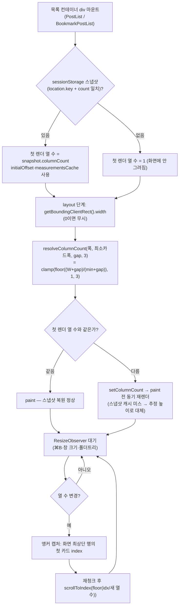

# 카드 그리드 열 수를 "실제 폭" 기준으로 전환

> 피드·북마크 목록은 이미 3→2→1 그리드지만 열 수를 **뷰포트** 폭으로 정해서, 사이드바·폴더트리가
> 폭을 먹는 구간에서 카드가 ~116~232px로 찌그러지고 PostCard 푸터 아이콘이 줄바꿈된다. 열 수를
> **목록 컨테이너의 실측 폭**과 "최소 카드 폭" 상수 하나로 정하도록 바꾼다.

## Context

### 지금 상황 (조사로 확인한 사실)

- 열 수 정의: `src/widgets/post/post-list/config/post-grid.const.ts:7`
  `grid-cols-1 md:grid-cols-2 lg:grid-cols-3`, 북마크는 `bookmark-grid.const.ts:8`에서 `xl:grid-cols-3`
  (사이드바 때문에 lg→xl로 한 번 늦춘 전례 — CHANGELOG b596492, 2026-08-01).
- JS도 같은 값을 들고 있다: `useWindowGridVirtualizer.ts:62-94`가 `window.matchMedia`로 열 수를 정하고
  `chunkIntoRows`(l.39)로 카드를 행으로 묶는다. 클래스↔상수 일치는 `*-grid.const.test.ts`가 지킨다.
- 폭을 먹는 것: 앱 사이드바 `w-60`/`w-20`(`Sidebar.tsx:113-115`, ≥768px 기본 펼침, ⌘B 토글, transition 없음),
  북마크 폴더트리 `w-60` + `gap-6`(`BookmarkPage.tsx:187-195`), main `max-w-6xl` + `lg:px-8`(`AppLayout.tsx:61`).
- 푸터 `PostCard.tsx:319` `flex gap-2 flex-wrap` — md 이상에서 한 줄에 약 280~300px 필요(클래스 기준 계산, 실측 전).

| 화면(사이드바 펼침)   | 현재 열 | 카드 폭(계산) | 제안 후 열(최소 300px 가정) |
| --------------------- | ------- | ------------- | --------------------------- |
| 피드 768px            | 2       | ~232 ✗        | 1                           |
| 피드 1024px           | 3       | ~229 ✗        | 2                           |
| 피드 1100px → ⌘B 접힘 | 3 → 3   | ~255 ✗        | 2 → 3                       |
| 피드 1280px           | 3       | ~315 ✓        | 3                           |
| 북마크 800px          | 2       | ~116 ✗        | 1                           |
| 북마크 1280px         | 3       | ~226 ✗        | 2                           |

### 전체 흐름

## 판단이 필요했던 항목

| 항목                              | 결정                                                                            | 근거·기각한 대안                                                                                                                                                                                                                 |
| --------------------------------- | ------------------------------------------------------------------------------- | -------------------------------------------------------------------------------------------------------------------------------------------------------------------------------------------------------------------------------- |
| 열 수 기준                        | **목록 컨테이너 실측 폭** (사용자 선택)                                         | 사이드바 펼침/접힘(160px 차)·폴더트리(264px)를 자동 반영. 기각: 뷰포트 브레이크포인트 조정(토글 차이를 못 따라감, 북마크 769~1180px 전부 1열), 푸터만 nowrap(116px 카드 찌그러짐 그대로)                                         |
| 최소 카드 폭                      | **푸터 그대로, ~300px (Step 0 실측으로 확정)** (사용자 선택)                    | PostCard 무변경. 대가: 북마크 최대 2열(폴더트리 제외 최대 824px). 기각: 좁을 때 푸터 축소(~250px) — `md:`→`@container` 전환 추가 작업                                                                                            |
| 열 수 계산 위치                   | JS가 단일 출처, 행 div에 인라인 `gridTemplateColumns: repeat(n, minmax(0,1fr))` | 가상화가 JS에서 행을 묶어 JS가 열 수를 알아야 함. Tailwind `@container` 변형은 CSS·JS 두 출처가 생김(기각). 규칙 자체는 web.dev _"RAM (Repeat, Auto, MinMax)"_ 패턴과 동일([web.dev](https://web.dev/articles/one-line-layouts)) |
| 스켈레톤                          | CSS `repeat(auto-fill, minmax(min(<상수>px, 100%), 1fr))`                       | 가상화 없음 → 같은 상수로 같은 공식(`floor((W+gap)/(min+gap))`), 폭 측정 훅 불필요. 상한 3은 `max-w-6xl`이 이미 보장                                                                                                             |
| gap                               | 기존 뷰포트 기준 `gap-3 md:gap-4` 유지                                          | 문제 원인이 아님, 최소 변경                                                                                                                                                                                                      |
| ⌘B로 열 수가 바뀔 때              | 스크롤 앵커 포함(~15줄)                                                         | 기존엔 ⌘B가 열 수를 안 바꿨음 → 새로 생기는 "보던 위치 튐" 회귀 방지                                                                                                                                                             |
| 상세에서 열 수가 바뀐 뒤 뒤로가기 | 수용 — 추정 높이로 복원(현재 창 크기 변경 시와 동일 수준)                       | ScrollRestoration 이후 재앵커는 타이밍 취약                                                                                                                                                                                      |
| 시안(§9)                          | 커밋 전 before/after 스크린샷 비교 Artifact로 승인                              | 방향·최소 폭은 사용자가 이미 선택 → 남은 건 실측값 결과 확인                                                                                                                                                                     |
| DECISIONS.md                      | 추가 안 함                                                                      | PR 하나 revert로 되돌릴 수 있음(적합성 기준 미충족). 근거는 이 계획 파일·CHANGELOG details·const 주석에                                                                                                                          |

### 위험 관리

- **최소 폭 > ~314px로 실측되면** 1280px 피드가 2열이 돼 e2e 전제("3열 × 20행", `post-list-scroll-restore.spec.ts:9`)가 깨진다 → Step 0에서 멈추고 보고.
- 첫 렌더 순서: "스냅샷 로드 → 초기 열 수" 순서를 반드시 유지(virtual-core 3.17이 `initialOffset`·`initialMeasurementsCache`를 첫 `getVirtualItems()`에서 소비).
- 폭 0 가드 누락 시 Suspense가 목록을 숨길 때 1열로 재청크됨.

## 세부 계획

### Step 0 — 푸터 최소 폭 실측 (구현 전)

| 위치                              | 변경 내용                                                                                                                       |
| --------------------------------- | ------------------------------------------------------------------------------------------------------------------------------- |
| dev 서버 + Playwright MCP, 1280px | 좋아요 999·댓글 999·조회 99,999 수준 카드에서 푸터 세 그룹 폭 합 + gap 16 + 패딩 24 + 보더 2 측정, 올림 → `minColumnWidth` 확정 |

### Step 1 — 공용 훅·스냅샷

| 위치                                                | 변경 내용                                                                                                                                                                                                                                                                                                                                                                                                                                                                                                                                                |
| --------------------------------------------------- | -------------------------------------------------------------------------------------------------------------------------------------------------------------------------------------------------------------------------------------------------------------------------------------------------------------------------------------------------------------------------------------------------------------------------------------------------------------------------------------------------------------------------------------------------------- |
| `src/shared/hooks/useWindowGridVirtualizer.ts`      | 옵션 `columnBreakpoints` → `minColumnWidth`·`maxColumns`, `ColumnBreakpoint` 타입 삭제. `resolveColumnCount(width, minColumnWidth, gap, maxColumns)` export. 스냅샷 먼저 로드 후 `useState(() => snapshot?.columnCount ?? 1)`. container 노드를 state로 두고 `useLayoutEffect`에서 동기 측정 + `ResizeObserver`(폭 0 무시, 측정 시 `remeasureScrollMargin`도 호출). `getItemKey`에 `${columnCount}:` 접두사. 열 수 변경 시 앵커 캡처(`getVirtualItemForOffset`) → `useLayoutEffect([columnCount])`에서 `scrollToIndex(floor(idx/n), { align: 'start' })` |
| `src/shared/lib/virtual/virtual-snapshot.ts`        | `loadVirtualSnapshot`에서 `columnCount` 인자·비교 제거(`count`만 비교), 저장 payload는 그대로                                                                                                                                                                                                                                                                                                                                                                                                                                                            |
| `src/shared/lib/virtual/virtual-snapshot.test.ts`   | "columnCount 다르면 null" 케이스 → "저장된 columnCount 반환"으로 교체                                                                                                                                                                                                                                                                                                                                                                                                                                                                                    |
| `src/shared/hooks/useWindowGridVirtualizer.test.ts` | `resolveColumnCount` 경계값(3·min+2·gap → 3, 1px 적으면 2), 상한 clamp, `W<min`→1, `W=0`→1                                                                                                                                                                                                                                                                                                                                                                                                                                                               |

### Step 2 — 소비처

| 위치                                                                                                                      | 변경 내용                                                                                                                                                                                      |
| ------------------------------------------------------------------------------------------------------------------------- | ---------------------------------------------------------------------------------------------------------------------------------------------------------------------------------------------- |
| `src/widgets/post/post-list/config/post-grid.const.ts`                                                                    | `POST_GRID_CLASS = 'grid gap-3 md:gap-4'`, `POST_GRID_COLUMNS` 삭제, `POST_GRID_MIN_COLUMN_WIDTH`(실측값)·`POST_GRID_MAX_COLUMNS = 3` 추가, 행 높이 추정치 주석에 "구 레이아웃 기준 실측" 명시 |
| `src/widgets/bookmark/bookmark-post-list/config/bookmark-grid.const.ts`                                                   | 클래스 동일화, `BOOKMARK_GRID_COLUMNS`·xl 주석 삭제, 최소 폭은 post-grid.const에서 import                                                                                                      |
| `*-grid.const.test.ts` (2개)                                                                                              | 열 파서·단언 삭제, gap 일치 테스트만 유지                                                                                                                                                      |
| `src/widgets/post/post-list/hooks/usePostList.ts`, `src/widgets/bookmark/bookmark-post-list/hooks/useBookmarkPostList.ts` | `minColumnWidth`·`maxColumns` 전달                                                                                                                                                             |
| `src/widgets/post/post-list/ui/PostList.tsx:109`, `src/widgets/bookmark/bookmark-post-list/ui/BookmarkPostList.tsx:77`    | 행 div에 `style={{ gridTemplateColumns: \`repeat(${columnCount}, minmax(0, 1fr))\` }}`                                                                                                         |
| `src/widgets/post/post-list/ui/PostCardSkeleton.tsx:58`                                                                   | 하드코딩 문자열 → `POST_GRID_CLASS` + auto-fill 인라인 스타일                                                                                                                                  |

### Step 3 — e2e·문서

| 위치                                                   | 변경 내용                                                                                                                                                                                |
| ------------------------------------------------------ | ---------------------------------------------------------------------------------------------------------------------------------------------------------------------------------------- |
| `e2e/post-card-footer-layout.spec.ts` (신규)           | 큰 카운트 목킹. 피드 1024·800·1100(⌘B 전/후, 첫 행 카드 수 2→3)·북마크 1280·1100에서 보이는 모든 카드 푸터 자식의 `offsetTop` 차 ≤1px. ⌘B 후 스크롤해 둔 카드가 뷰포트 안에 남는지(앵커) |
| `CHANGELOG.md` `[Unreleased]`                          | fix 항목 + `
`에 근거(changelog-release skill 형식)                                                                                                                              |
| `docs/TESTING.md` e2e 표                               | 신규 스펙 행 추가                                                                                                                                                                        |
| `docs/POST-DETAIL-BACK-NAVIGATION.md` 남은 것          | "상세에 있는 동안 열 수가 바뀌면(⌘B·창 크기) 추정 높이로 복원" 한 줄                                                                                                                     |
| `.claude/skills/responsive-ux/SKILL.md`                | "카드 그리드 열 수는 뷰포트 `md:/lg:`가 아니라 `useWindowGridVirtualizer`의 `minColumnWidth`로" 한 줄                                                                                    |
| `docs/plans/2026-09-29-container-width-grid.md` (신규) | 이 계획 스냅샷                                                                                                                                                                           |

## 영향 범위 (§5)

**데이터 CRUD**: 서버 데이터 변경 없음. sessionStorage 스냅샷 payload 형태 동일 → 배포 전 저장된 스냅샷도 그대로 읽힘.

**기존 기능 회귀 후보**

| 동작                                                        | 소유 파일                                            | 확인                                                         |
| ----------------------------------------------------------- | ---------------------------------------------------- | ------------------------------------------------------------ |
| 뒤로가기 스크롤 복원                                        | `useWindowGridVirtualizer.ts`, `virtual-snapshot.ts` | `post-list-scroll-restore(.mobile).spec.ts`                  |
| 가상화 DOM 상한                                             | 동일                                                 | `post-list-virtualization.spec.ts`                           |
| 무한 스크롤 선행 로드(행 기준 5행)                          | `usePostList.ts:138-151`                             | 열 수 줄면 행 수 증가 → 같은 픽셀 거리, 무변경               |
| 첫 행 썸네일 우선 로딩                                      | `PostList.tsx:117`                                   | 행 0 기준 유지, 무변경                                       |
| 북마크 scrollMargin(로딩 후 마운트 시 0으로 남던 기존 문제) | `useScrollMargin`                                    | 노드 state화로 함께 해소 — 의도치 않은 변화 아님을 PR에 명시 |
| 상세 페이지 PostCard                                        | `PostDetailPage.tsx:91`                              | 그리드 밖, 무변경                                            |
| 데스크톱 레이아웃 "md 이상 기존과 동일" 체크리스트          | responsive-ux skill                                  | 의도적 변경 → skill에 한 줄 반영                             |

## 검증 방법

1. `pnpm type-check` → `pnpm test`(resolveColumnCount·snapshot·gap 테스트) → `pnpm lint` → `pnpm check:docs`
2. `pnpm test:e2e` — 신규 푸터 스펙 + `post-list-*`, `bookmark*`, `like`, `post-card-hover-menu` 기존 스펙 전부 통과
3. browser-verification skill: 피드 768/1024/1100(⌘B 전후)/1280, 북마크 1024/1280 before/after 스크린샷을
   한 장의 Artifact로 나란히 보여주고 **사용자 승인 후 커밋**
4. §11: fresh Explore 에이전트로 계획 대비 diff 대조 → PR 본문 `## 계획 대비 구현`

## 남은 것

- 행 높이 추정치(`{3:654, 2:635, 1:582}`)는 구 레이아웃 실측값 — 필요해지면 재측정(첫 렌더 근사값일 뿐이라 이번엔 유지).
- 푸터 "절대 줄바꿈 없음"은 Step 0에서 잰 자릿수까지만 보장. 그 이상은 `flex-wrap`이 안전망으로 남음.
- ResizeObserver 상태 갱신은 다음 프레임에 반영돼 ⌘B 직후 1프레임 동안 이전 열 수가 보일 수 있음 — 눈에 띄면 `flushSync` 검토.
